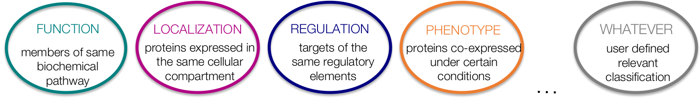
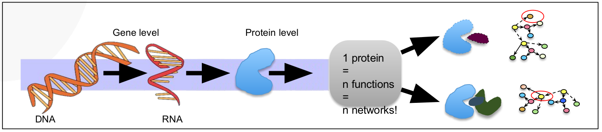
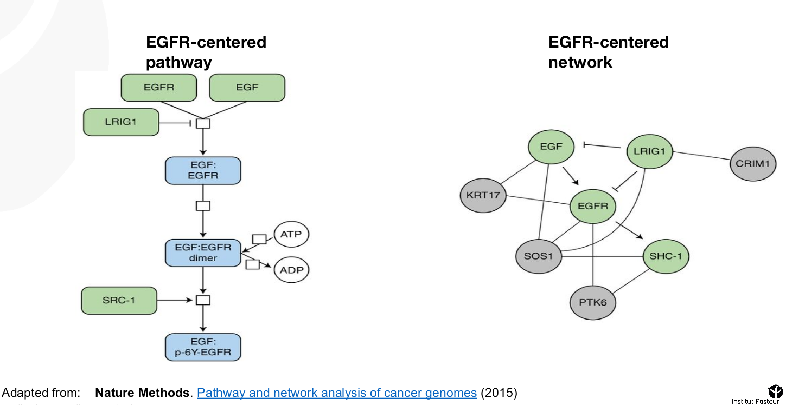
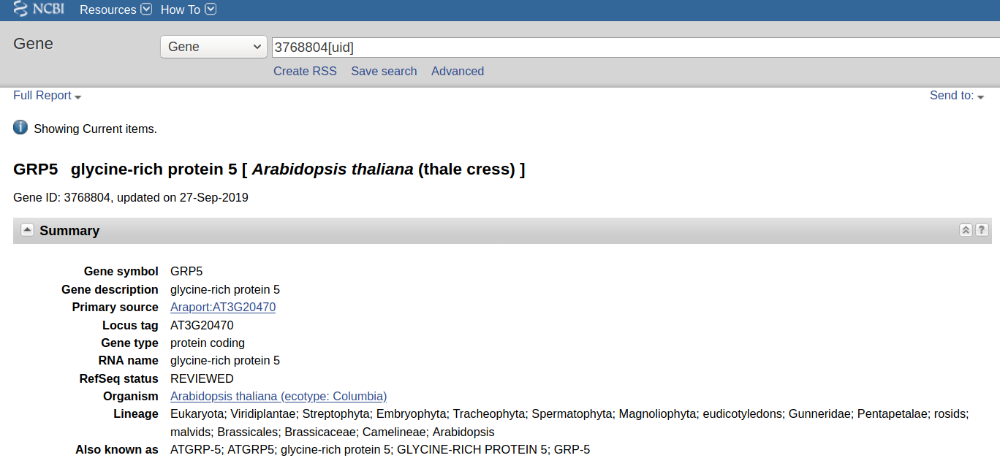
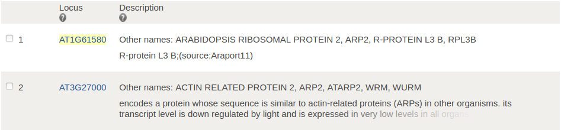
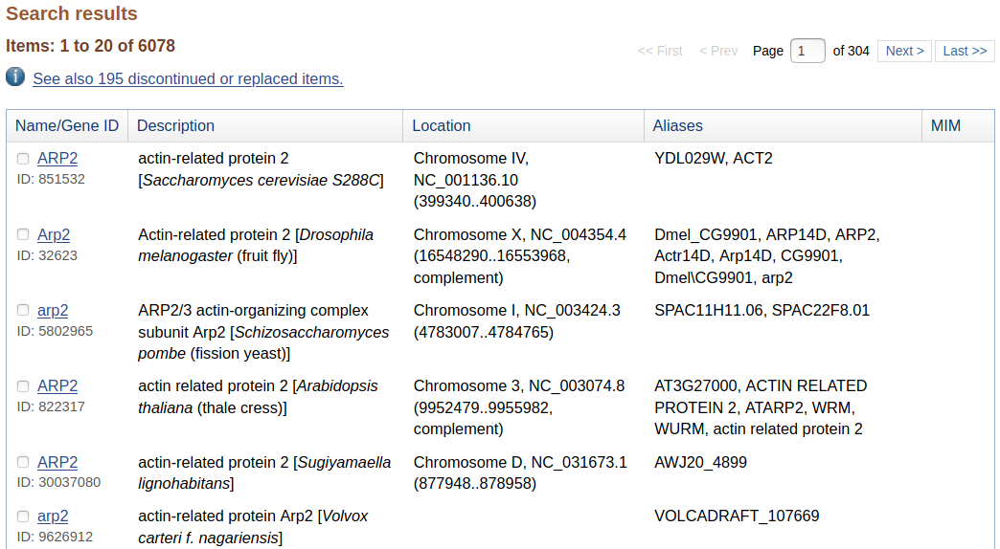
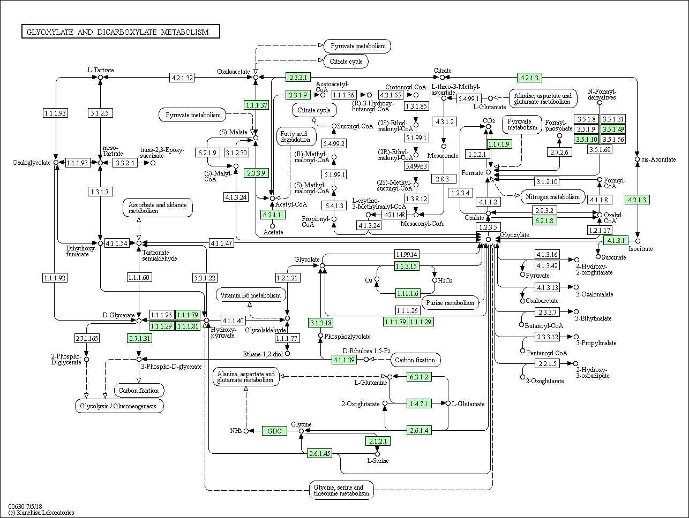

```{r setup, include=FALSE}
knitr::opts_chunk$set(
  echo = TRUE,        # Print the code
  message = FALSE,    # Print messages
  prompt = FALSE,     # Do not display prompt
  comment = NA,       # No comments on this section
  warning = TRUE#,    # Display warnings
  # width = 100       # Number of characters per line
);
```

## Purpose of this session

At the end of this session, you will be able to:

1.  understand what is gene set analysis
1.  identify standard databases
1.  tell the differences between GeneID and GeneName

## Bonus

You will also:

*   know limitations of gene sets analyses
*   question confidence intervals on pathways enrichments

## Take-home methods

You will have protocols to:

*   question standard databases such as GO, or KEGG
*   perform comparison with gene sets from custom sources


# Definitions

## Gene Set Analysis (GSA)

Unlike differential gene analysis, we do not want to produce results about *single genes*, but rather about **gene sets**.

These networks can be multiple:



## Gene Set Analysis (GSA)

> " we want to identify pathways (i.e. gene-sets) that are significantly enriched in differentially expressed genes with respect to the background set of genes."

Example:

In our previous experiment on *A. Thaliana*, we saw that, once treated, the plants did not grow as much as wild type.

Our questions could be: *"Is plant organ morphogenesis involved in the plant growth? What other pathways are impacted by the treatment?"*

# Databases

## Genes annotations: database expectations (1/2)

-   **Gene Ontology (GO)**: which hosts a controlled vocabulary (fixed terms) for annotating genes
    -   *Molecular Functions*: Molecular-level activities performed by gene products
    -   *Cellular Components*: Locations relative to cell compartments and structures
    -   *Biological Process*: Larger processes accomplished by multiple molecular activities


> `http://geneontology.org/`    

## Genes annotations: database expectations (2/2)

-   **KEGG**: Kyoto Encyclopedia of Genes and Genomes
    -   *Pathways*: Larger processes accomplished by multiple molecular activities
    -   ...


> `https://www.genome.jp/`

-   **MSigDB**: Molecular Signatures Database
    -   Multiple collections of genes sets (human centered)


> `http://software.broadinstitute.org/gsea/msigdb/index.jsp`

## Protein - Protein Interactions (PPIs)

PPIs are useful for understanding functional relationships between proteins and the biology of the cell



## Pathways vs Network




# Preparation

## Load libraries

To load libraries, we use the function `"library"`, from the package `"base"`. This function takes only one argument: the name of the package.

```{r, message=FALSE, warning=FALSE}
library("clusterProfiler");
library("limma");
library("DOSE");
library("enrichplot");
library("pathview");
library("org.At.tair.db");
```

It is a good practice to keep package names in order to avoid name-space collision. However, during this presentation, for the sake of readability, we shall omit them.


## Load SARTools results (1/2)

First, we need to set a working directory: `setwd()`

We use the function `"file.path"`, from the `"base"` package. It takes a variable number of arguments, and joins them as a path to a file.

```{r}
# Path to SARTools results
results_path <- file.path(
  "tables",
  "KOvsWT.complete.txt"
);

```

## Load SARTools results (2/2)

We use the function `"read.table"` from the package `"utils"`. This is installed by default in your R environments.

```{r, eval=TRUE, echo=FALSE}
de_res <- read.table(
  file   = results_path,   # Path to results
  header = TRUE,           # There are column names
  sep    = "\t",           # This is a tabulation
  stringsAsFactors = FALSE # Colnames are not factors
);
```

```{r, echo=TRUE, eval=FALSE}
de_res <- read.table(
  file   = "KOvsWT.complete.txt",   # Path to results
  header = TRUE,           # There are column names
  sep    = "\t",           # This is a tabulation
  stringsAsFactors = FALSE # Colnames are not factors
);
```


## Visualize SARTools' results

Our table is pretty large, and we do not need all of it. With the generic function `"head"`, we can see the first lines of our table.

```{r, eval=FALSE}
head(de_res);
```

With the generic function `"colnames"`, we can have ... The column names!

```{r, eval=FALSE}
colnames(de_res);
```

## Select columns from SARTools' results

We want to keep the following columns **only**: `"Id", "padj"`, `"log2FoldChange"`, and `"stat"`.

```{r}
# Keep selected columns
reduced <- de_res[ ,c("Id", "padj", "log2FoldChange", "stat")];

# Check dimensions
dim(reduced);
```

## Filter SARTools' results

And now, we want to filter out the values with a `padj` above 0.001.

```{r}
# List all values that are to be kept
threshold <- reduced[, "padj"] <= 0.001;
no_na <- !is.na(reduced$log2FoldChange);

# Keep only non-null and significant values
filtered <- reduced[which(threshold), ];

# Check dimensions
dim(filtered);
```

## Sort SARTools results

The order of the genes within a list of genes is **very** important. We need to sort our genes. Here, we sort our differentially expressed genes by their `log2FoldChange` value:

```{r}
ordered_lines_number <- order(
  filtered$log2FoldChange,     # Select the column
  decreasing = TRUE            # Decreasing sort
);

sorted <- filtered[ordered_lines_number, ];
```

# Genes identifiers

## Fix gene identifiers

In our table, the genes identifiers begin with "gene:". This going to break further analysis! For a computer: "`gene:AT1G01010`" is not "`AT1G01010`"

We need a raw gene identifier:

```{r}
# Replace the names in the ID column
sorted[, "Id"] <- sub("gene:", "", sorted[, "Id"]);
```

And we can check our genes identifiers with the function `"head"`:

```{r, eval=FALSE}
head(sorted);
```

## From gene identifiers to gene names

TAIR identifiers come from the official TAIR project. Entrez ID are only composed of numbers, they are not designed to be used by humans, however, they are unique. Genes symbols are the human-readable names, they are not unique and contains many aliases.

In order to get theses identifiers, we use the function `"bitr"` from the package `"clusterProfiler"`:

```{r, message=FALSE, warning=FALSE}
annotation <- bitr(
  geneID   = sorted$Id,            # Our gene list
  fromType = "TAIR",               # We have TAIR ID
  toType   = c("ENTREZID", "SYMBOL"),# Other ID list
  OrgDb    = org.At.tair.db        # Our annotation
);
```

## ENTREZ Identifiers

One single ID refers to one single genomic location in one single organism. It is unique, but not human readable.

```{r, eval=TRUE}
entrez <- data.frame(table(annotation$ENTREZID));
head(entrez[entrez$Freq > 1, ]);
```

## ENTREZ Identifiers



## Genes' SYMBOLS

They are repeated, and still not human readable, because you might confuse them, use versatile aliases, etc.

```{r, eval=TRUE}
symbol <- data.frame(table(annotation$SYMBOL));
head(symbol[symbol$Freq > 1, ]);
```

## Gene's SYMBOLS

To whom does ARP2 refer? Both genes down here does not belong to the same genomic location: Chr1:3A22720431-22723281 or Chr3:3A9952305-9956158



## Gene's SYMBOLS

ARP2 is not even related to A. Thaliana!



## We also lost some genes in the process

Read the warnings:

```
In bitr(geneID = sorted$Id, fromType = "TAIR"...  :
  1.44% of input gene IDs are fail to map...
```

## Have a look at our result

We finally have our annotated ranked list of genes! Yet, some of them do not have human readable names.

```{r, eval = FALSE}
head(annotation);
```

```{r, echo = FALSE}
knitr::kable(head(annotation));
```


## Conclusion on Gene names and identifiers

1.  One gene has multiple names from multiple sources. They also have unique identifiers used by computers to refer to them as precisely as possible.
1.  Do not use human readable gene names, they do not always refer to what you think.
1.  Use ENTREZ identifiers when you can, then translate back to human readable names for your graphs.

# ORA Analysis

## Contingency table (1/3)
```{r, echo = FALSE}
x <- org.At.tairENTREZID
# Get the tair identifiers that are mapped to pathways
mapped_tairs <- mappedkeys(x)
# Convert to a list
xx <- as.list(x[mapped_tairs])
```

Under confidence interval, we are in the following case:

*   We have 1807 differentially expressed genes with padj < 0.05
*   We have a total of 26 698 not differentially expressed genes

ORA stands for Over-representation analysis. With ORA, we can know whether a pathway is enriched in differentially expressed genes or not.


## Contingency table (2/3)

We are interested in the "Root morphogenesis". There are 45 genes in this pathway. 7 of them are differentially expressed.

**Our question**: Is the pathway "Root morphogenesis" significantly enriched in differentially expressed genes?

## Contingency table (3/3)

We can build the following associative table:

```{r, echo = FALSE}
contingency <- matrix(
  c(7, 38, 1800, 28483),
  nrow = 2,
  ncol = 2
);
```


|                | Differentially Expressed | Not differentially Expressed |
|:--------------:|:------------------------:|:----------------------------:|
| In pathway     | 7                        | 38                           |
| not in pathway | 1 800                    | 28 483                       |


## Fisher test

**Our question**: Is the pathway "Root morphogenesis" significantly enriched in differentially expressed genes?

Let's use a fisher tests for example:

```{r}
fisher.test(contingency)
```

## Anatomy of a Statistical test

1.  Have a `null hypothesis` (also called `H0` (H-zero))
2.  Compute events that are very unlikely to happen **under H0**
3.  Compare your observations with 2.
4.  If your observations matches with 2., reject H0
5.  If your observations does not mach 2., do not reject H0

## The null hypothesis (1/3)

**Our question**: Is the pathway "Root morphogenesis" significantly enriched in differentially expressed genes?

How many genes does it take to make the pathway "Root morphogenesis" *enriched in differentially expressed genes* ?

*   1 gene?
*   10 genes?
*   10% of the overall genes?
*   20% of the genes in the pathway?

## The null hypothesis (2/3)

**Our question**: Is the pathway "Root morphogenesis" significantly enriched in differentially expressed genes?

On the other side:

> 1.  We know the number of differentially expressed genes in pathways in general.
> 2.  We can guess an interval of likely and unlikely values
> 3.  We can compare this number of differentially expressed genes with the one in "Root morphogenesis".
> 4.  Then, we can say weather the number of higher or lesser.
> 5.  We can tell if this number if equal.


## The null hypothesis (3/3)

**Our question**: Is the pathway "Root morphogenesis" significantly enriched in differentially expressed genes?

> 1.  Our `null hypothesis` is: The pathway "Root morphogenesis" has the same number of differentially expressed genes as any other pathway.
> 2.  We compute a confidence interval around the distribution of the number of differentially expressed genes in a pathway
> 3.  We compare the observed number of differentially expressed genes in "Root morphogenesis" and the confidence interval in 2.
> 4.  If our observation is very unlikely, then we reject the null hypothesis
> 5.  If our observations are within the confidence interval, we do not reject the null hypothesis


## Fisher test

**Our question**: Is the pathway "Root morphogenesis" significantly enriched in differentially expressed genes?

Let's use a fisher tests for example:

```{r}
fisher.test(contingency)
```

## Odds ratio

We have an `odds ratio` of 2.914753.

This mean that a gene, within the pathway "Root morphogenesis" is 2.914753% more likely to be differentially expressed than any other random gene.


## Fisher test

**Our question**: Is the pathway "Root morphogenesis" significantly enriched in differentially expressed genes?

Let's use a fisher tests for example:

```{r}
fisher.test(contingency)
```


## Conclusion on ORA (1/2)

> With ORA, you do not test if a pathway is affected or not by your experience.

If I want to know if "root morphogenesis" is changed during the experience, I grow *A. Thaliana* fields, cut their roots, compare their roots (weight, length, diameter, density ...). I do not need any RNA-Seq nor ORA.

If your favorite pathway does not *"show up"* in ORA, it does not mean that pathway is not affected.


## Conclusions on ORA (2/2)


> With ORA, the ultimate p-value measure weather a pathway is enriched in differentially expressed genes.

A single gene can be a staple of your pathway. A single gene can block a whole pathway. For ORA, all genes are equals among a pathway.

If you *know* a gene is important, whatever the ORA p-value, then this gene matters.

## Cluster Profiler Enrichment on GO: Cellular Components

We would like to perform Gene Set Enrichment analysis against the Gene Ontology's Cellular Components:

```{r}
ego <- enrichGO(
  gene    = annotation$ENTREZID,# Ranked gene list
  OrgDb   = org.At.tair.db,     # Annotation
  keyType = "ENTREZID",         # The genes ID
  ont     = "CC",               # Cellular Components
  pvalueCutoff = 0.001,         # Significance Threshold
  pAdjustMethod = "BH"          # Adjustment method
);
```

## Cluster Profiler: Plots (1/3)

We want to visualize these results. To do so, let's use the function `"barplot"` and the function `"dotplot"` from the `"enrichplot"` package:

```{r, eval=FALSE}
barplot(ego, showCategory=20);
dotplot(object = ego, showCategory=20);
```

## Cluster Profiler: Plots (2/3)

```{r, echo=FALSE}
barplot(ego, showCategory=20);
```

## Cluster Profiler: Plots (3/3)

```{r, echo=FALSE}
dotplot(object = ego, showCategory=20);
```

# GSEA

## Prepare Data (1/2)

To perform a Gene Set Enrichment Analysis (GSEA), we need to give a list of weighted ranked genes in order to compute the enrichment score for our table called "`sorted`". We also need the ENTREZ identifiers, from our table called "`annotation`". We need to merge them according the the TAIR identifiers:

```{r}
# Rename the columns
colnames(sorted) <- c("TAIR", "padj", "log2FoldChange");

# Merge the frames
geneFrame <- merge(sorted, annotation, by="TAIR");
geneFrame <- unique(geneFrame); # Drop duplicates
```

## Prepare Data (2/2)

GSEA expects a list of decreasing numeric values. Let's build this structure:

```{r}
# Build a numeric vector
geneList <- as.numeric(geneFrame$log2FoldChange);

# Get the genes identifiers
names(geneList) <- geneFrame$ENTREZID;

# Sort this list
geneList <- sort(geneList, decreasing = TRUE);
```

## Run analysis

Dear statisticians, please look aside for a minute.

```{r, warning=FALSE}
gsea <- gseGO(
  geneList = geneList,       # Ranked gene list
  ont      = "BP",           # Biological Process
  OrgDb    = org.At.tair.db, # Annotation
  keyType  = "ENTREZID",     # Identifiers
  pAdjustMethod = "BH",      # Pvalue Adjustment
  pvalueCutoff = 1           # Significance Threshold
);
```

## GSEA plot (1/4)

Let's see the top 8 of the over-represented genes sets:

```{r, eval = FALSE}
columns_of_interest <- c(
  "Description",
  "enrichmentScore",
  "p.adjust"
);
head(
  x = gsea[, columns_of_interest], # Pathway ID
  8                                # lines to display
);
```

## GSEA plot (2/4)

Let's see the top 8 of the over-represented genes sets:

```{r, echo = FALSE}
columns_of_interest <- c(
  "Description",
  "enrichmentScore",
  "p.adjust"
);
knitr::kable(head(
  x = gsea[, columns_of_interest], # Name of the pathways
  8                                # the # of lines
), row.names = FALSE);
```

## GSEA plot (3/4)

Finally, building the GSEA plot is being done with the function `"gseaplot2"` from `"clusterProfiler"`:

```{r, eval = FALSE}
# We need the number of the line
# Containing our pathway of interest
gsea_line <- match(
  "plant organ morphogenesis",
  gsea$Description
);
gseaplot2(
  x         = gsea,               # Our analysis
  geneSetID = gsea$ID[gea_line],  # Pathway ID
  title     = "plant organ morphogenesis" # Its name
);
```

## GSEA plot (4/4)

```{r, echo=FALSE}
gseaplot2(
  # Out analysis
  x         = gsea,            
  # The # of the pathway
  geneSetID = gsea$ID[match("plant organ morphogenesis", gsea$Description)],
  # Its name
  title     = "plant organ morphogenesis"
);
```

## Multiple GSEA on the same graph (1/2)

... because we can!

```{r, eval = FALSE}
gseaplot2(
  x = gsea,
  geneSetID = 1:3,
  title = "Most enriched terms"
);
```

## Multiple GSEA on the same graph (2/2)

```{r, echo = FALSE}
gseaplot2(
  x = gsea,
  geneSetID = 1:3,
  title = "Most enriched terms"
);
```

## Conclusion on GSEA

> With GSEA, you dot not test if a pathway is up or down regulated.

A pathway contains both enhancers and suppressors genes. An up-regulation of enhancer genes and a down-regulation of suppressor genes will lead to a "bad" enrichment score. However, this will lead to a strong change in your pathway activity!

If your favorite pathway does not have a *"goog enrichment score"*, it does not mean that pathway is not affected.

# Set comparison

## Heatmap (1/2)

Very common in publications

```{r, eval=FALSE}
heatplot(
  x =  ego,             # Our enrichment
  showCategory = 15,    # Nb of terms to display
  foldChange = geneList # Our fold changes
);
```

## Heatmap (2/2)

```{r, echo=FALSE}
heatplot(x =  ego, showCategory = 14, foldChange = geneList);
```

## UpSet plot

```{r}
upsetplot(x = ego); # From our enrichment analysis
```

# Networks

## Enrichment map

```{r}
emapplot(ego); # From our enrichment analysis
```

## GO plot

Relate enriched terms with each others:

```{r}
goplot(ego); # From our enrichment analysis
```

## Kegg (1/2)

The Kegg analysis is done with the `"pathview"` package and this eponymous function:

```{r, eval=FALSE}
names(geneList) <- geneFrame$TAIR;  # Use TAIR id

pv.out <- pathview(
  gene.data = geneList,     # Our gene list
  pathway.id = "ath00630",  # Our pathway
  species = "ath",          # Our organism
  # The color limits
  limit = list(gene=max(abs(geneList))),
  gene.idtype = "TAIR"      # The genes identifiers
);
```

## KEGG (2/2)

There is the representation of our pathway, with differentially expressed genes colored!



## Thanks

Special thanks to Rachel Legendre and Natalia Pietrosemoli, this session was highly based on their work.

Thanks to the rest of the team for their reviews and advises.
