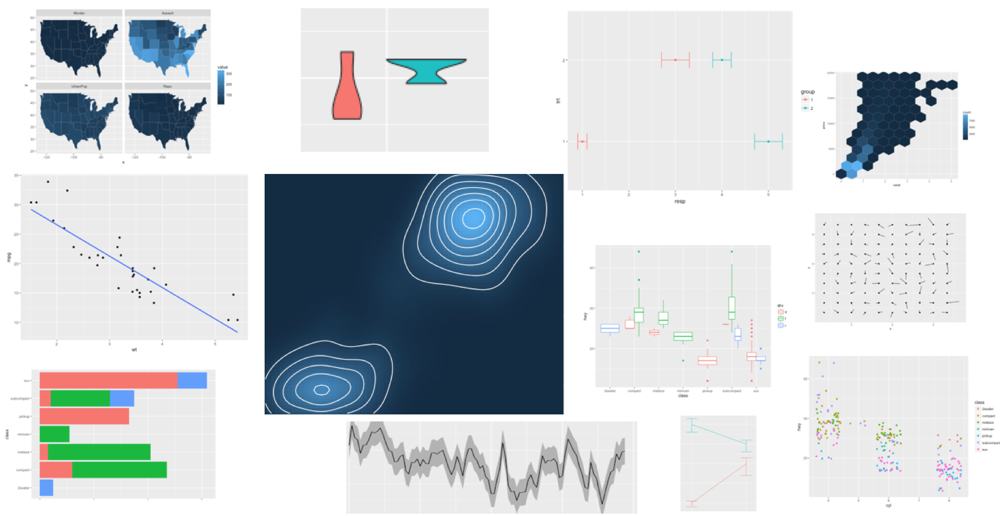
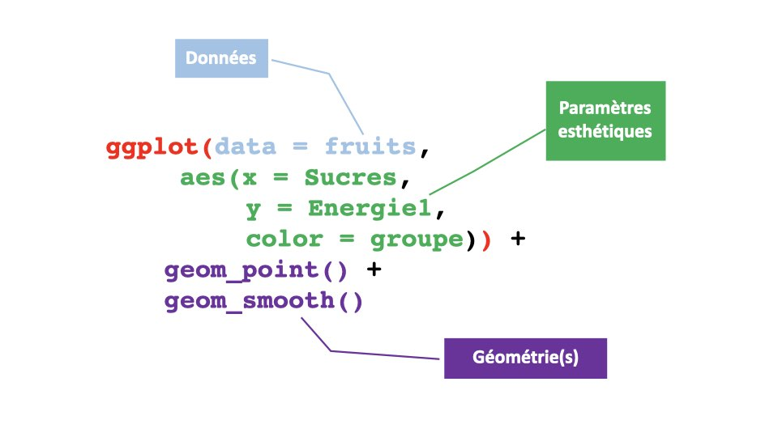
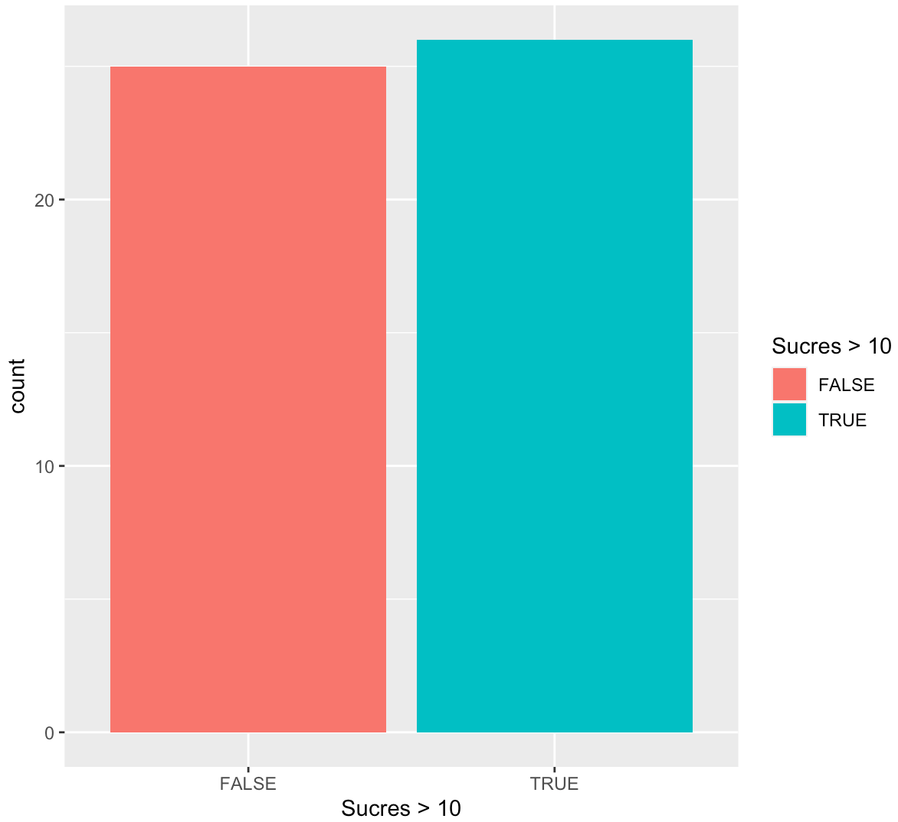

<style>
.forceBreak { -webkit-column-break-after: always; break-after: column; }
</style>


```{r setup, include = FALSE}
knitr::opts_chunk$set(
  collapse = TRUE,
  comment = "#>",
  echo = TRUE
)
library(dplyr)
library(magrittr)
```

## Avant toutes choses

Nous aurons besoin du package `ggplot2` :

 * Vérifier que le package `ggplot2` est bien installé
 * Si non, l'installer, puis le charger

```{r ggplot2}
library(ggplot2)
```

Nous allons également avoir besoin des données fruits : 

```{r data}
data("fruits", package = "tidyViz")
```

## Bien choisir sa représentation graphique {.centered}

{width=50%}

## Un échantillon de ce qu'il est possible de faire avec ggplot2 {.center}

{width=100%}

# Diagramme en bâtons

## Rappel : la fonction barplot

La fonction de base pour les diagrammes en bâtons est `barplot` : 

```{r barplot}
barplot(table(fruits$groupe))
```

Avec des couleurs :

```{r barplot_couleur}
barplot(table(fruits$groupe), col = 1:4)
```

## La fonction geom_bar

```{r geom_bar_stop, fig.width = 5, fig.height = 4}
ggplot(data = fruits, aes(x = groupe, fill = groupe)) +
  geom_bar()
```

<span style="color:red">STOP !</span>

## Décomposition de la commande

 * `ggplot` : création d'un canevas vide dans on va dessiner le(s) graphe(s)
 * `aes` : déclaration des paramètres esthétiques du graphes (position horizontale, verticale, couleur épaisseur, forme, transparence etc...)
 * `geom_bar` : utilisation d'une géométrie 


## Les données {.center}

{width=100%}

## Les paramètres esthétiques {.center}

{width=100%}

## Les géométries {.center}

{width=100%}

## L'image à retenir {.center}

{width=80%}

## [G]rammar of [G]raphics {.center}

{width=100%}

## Implémentation dans ggplot2

-----------  -------- -------------------
 Données     `data`    Les données à représenter. Chaque ligne représente un élément à représenter graphiquement.
Géométries   `geom_`   Les formes à créer pour représenter les données. Cela peut être des points, des lignes, des surfaces etc.
Esthétiques  `aes()`   Les paramètres esthétiques de ces formes. Par exemple la position, la couleur, la taille, la forme, la transparence etc.
 Échelles    `scale_`  Des fonctions permettant de paramétrer la transformation de données en formes ou en objets graphiques. Par exemple la fonction `scale_color_manual` permet de choisir soi-même les couleurs à utiliser dans un graphique. 
-----------  -------- --------------------

## A vous ! {.columns-2}

Comment corriger la commande suivante pour obtenir le graphe à droite ?

```{r acompleter, eval = FALSE}
 ggplot(***, 
     aes(***, 
     fill = Sucres > 10)) +
   geom_***()
```


{width=100%}

## Un peu d'histoire {.columns-2}

 * Il y a eu un `ggplot`"1" (voir [ici](https://github.com/hadley/ggplot1))
 * Développement commencé en 2005
 * Hadley Wickham (*Chief Scientist at RStudio* + *Adjunct Professor of Statistics*)
 * D'excellents cours, parfois avec sa soeur Charlotte
 
<p class="forceBreak"></p>


{width=50%}
 
## Quelques géométries

Nous allons voir ensemble quelques géométries particulières qui permettent de créer des graphes classiques.

---------------- --------------------------------
`geom_bar`       Diagramme en bâtons sur des données non-agrégées
`geom_col`       Diagramme en bâtons (encore) sur des comptages existants
`geom_histogram` Histogramme d'une variable quantitative
`geom_boxplot`   Diagramme de Tukey aka "boîte à moustache" aka *boxplot*
`geom_violin`    Diagramme en "violons"
`geom_point`     Nuage de points créé à partir de deux variables quantitatives
`geom_line`      Ligne tracée à partir de deux variables quantitatives
---------------- --------------------------------

# Diagrammes en bâtons

## Avec geom_bar

On a déjà vu comment faire : 

```{r geom_bar_ter}
ggplot(fruits, aes(cut(Eau, c(0, 84.2, 100)))) + 
  geom_bar(fill = "steelblue")
```

## Avec geom_col

On dispose déjà de comptages.

```{r geom_col, fig.height = 2}
dat.count <- fruits %>% 
  group_by(groupe) %>%
  summarize(Csup10 = sum(VitamineC >= 10))

ggplot(data = dat.count, aes(x = groupe, y = Csup10)) +
  geom_col()
```

## A vous !

Comment modifier les deux commandes précédentes pour faire un diagramme en bâtons montrant des pourcentages plutôt que des comptages bruts ?

(PS : il y a plus d'une solution possible)

# Histogrammes

## 


# [N'oubliez pas la feuille de triche !](https://www.rstudio.com/wp-content/uploads/2015/03/ggplot2-cheatsheet.pdf) {data-background=#ffffff}

{width=50%}
