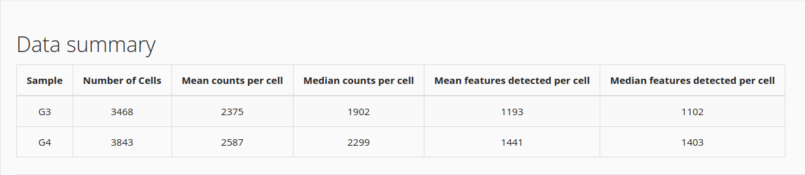

```{r setup, include=FALSE}
# options(width = 60);
knitr::opts_chunk$set(
  echo = TRUE,        # Print the code
  eval = FALSE,       # Do not run command lines
  message = FALSE,    # Print messages
  prompt = FALSE,     # Do not display prompt
  comment = NA,       # No comments on this section
  warning = TRUE#,    # Display warnings
  
  # width = 100       # Number of characters per line
  
);

base::library(package = "dplyr")
```

<style type="text/css">
details:hover { cursor: pointer }
</style>


# Forewords

In this presentation, there will be screen captures, for you to follow the lesson. There will also be R command lines (hidden by default). Do not take care of the command lines if you find them too challenging. Our goal here, is to understand the main mechanism of Differential Expression Analysis. R is just a tool.

```{r load_libraries, eval=TRUE}
library("singleCellTK")
library("Seurat")
```

## Load RDS dataset

```{r import_dataset, eval=TRUE, cache=TRUE}
integrated_sctk <- readRDS(file = "dataset/INTEGRATED_02d_ClustLab.rds")
```

In SingleCellTK, click "Data".

1. Import SingleCellExperiment or Seurat object stored in an RDS file
1. click "Browse" and select INTEGRATED_02d_ClustLab.rds
1. click "Add To Sample List"
1. click "Import"
1. wait ...
1. Set "Rownames (Default)" as "Feature for Display"

This may be a bit long, depending on the size of the input dataset.

## Insight

Have a look at your dataset. The Shiny interface returns the following description:



Aside, we might want to look at this dataset through R, using the function [`head`](https://www.rdocumentation.org/packages/utils/versions/3.6.2/topics/head).

```{r display_summary_of_integrated_counts, eval=TRUE}
head(integrated_sctk)
```

We can see the name of the normalized dataset and raw counts, we read the name of the dimension reduction steps, we can see the number of cells (7311) and the list of available metadata (8). This information is quite precious when you recieve an unknown dataset, but here, we know where these data come from.


# Raw counts, normalized counts
