

\pagebreak
# General Information
## Why use IGV?

* Visualization and interactive exploration of large genomic datasets
* Large range of accepted file formats
* http://software.broadinstitute.org/software/igv/home

Table: Main file formats allowed in IGV

|      Data.Type      |         Format         |
|:-------------------:|:----------------------:|
|   ChIPSeq, RNAseq   |    Bigwig, Bedgraph    |
|  Genome Annotation  |   GFF, GTF, BED, VCF   |
| Sequence Alignments | Indexed BAM[^bai_note] |

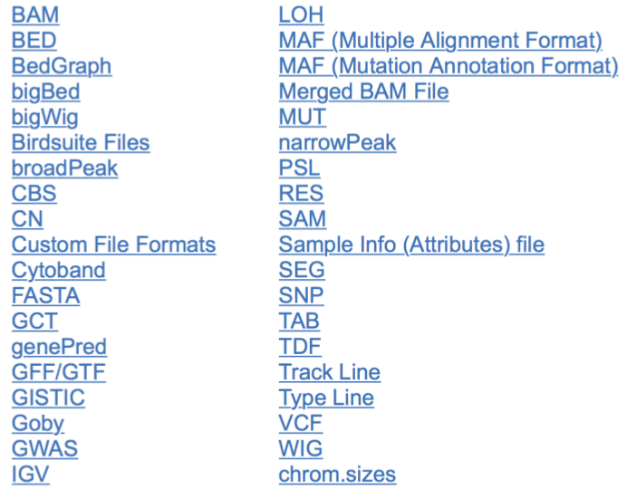

All available formats

* Possibility to load public data from an URL
* Open source: free to use
* Well-documented tutorials can be found at:
    + ftp://ftp.broadinstitute.org/distribution/igv/ASHG_2015/IGV_ASHGWorkshop_2015.pdf  
    + http://www.igv.org/workshops/BroadApril2017/IGV_SlideDeck.pdf

[^bai_note]: An indexed BAM is a BAM sorted by chromosome accompanied by its index file (a .bai file)

## How to download IGV?

* Open your web browser and go to the IGV : https://www.broadinstitute.org/software/igv/download  
* Follow the instructions (depends on your operating system).
* You don’t have to install IGV, only to execute it each time you want to use it (no admin/root rights)
* To launch IGV, double click on:
    * __Windows__ : **"igv.bat"**
    * __Mac__: **"igv.command"**
    * __Unix__: **"igv.sh"** then on **"Launch in Terminal"**
    
If it doesn’t work, try the **"igv.jar"**.

## IGV Main interface 

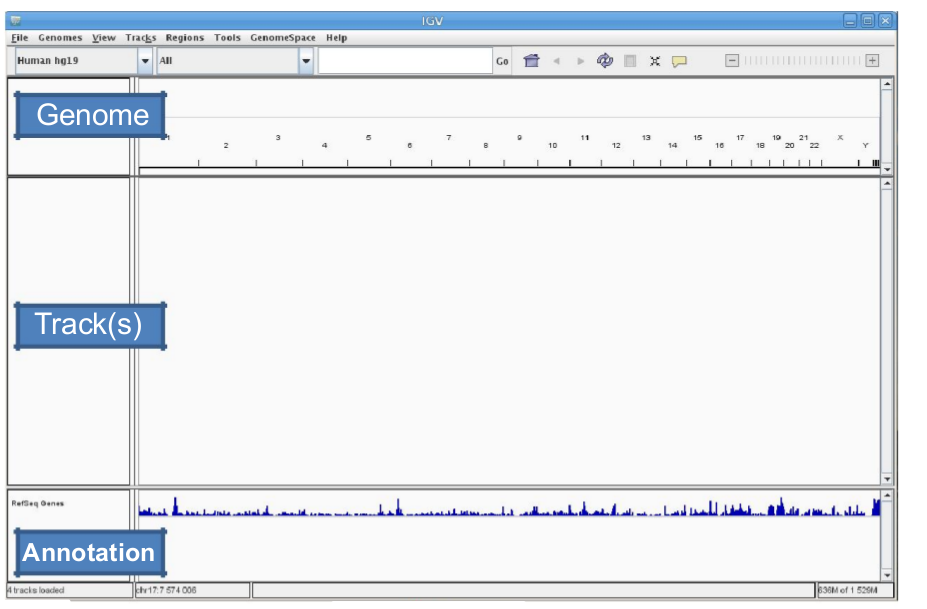

* You can add as many tracks as you want. They don’t need to be of the same type or format: you can combine a ChIP-seq enrichment track (bigwig) and the corresponding alignment track (bam) **IF** they were processed **on the same reference genome**.

You can access the Online help by clicking on **"Help"** in the bar menu then on **"User Guide"**. A basic tutorial is also accessible in **"Help"** then in **"Tutorial"**. Several training datasets are available in **"File"**> **"Load From Server"**.

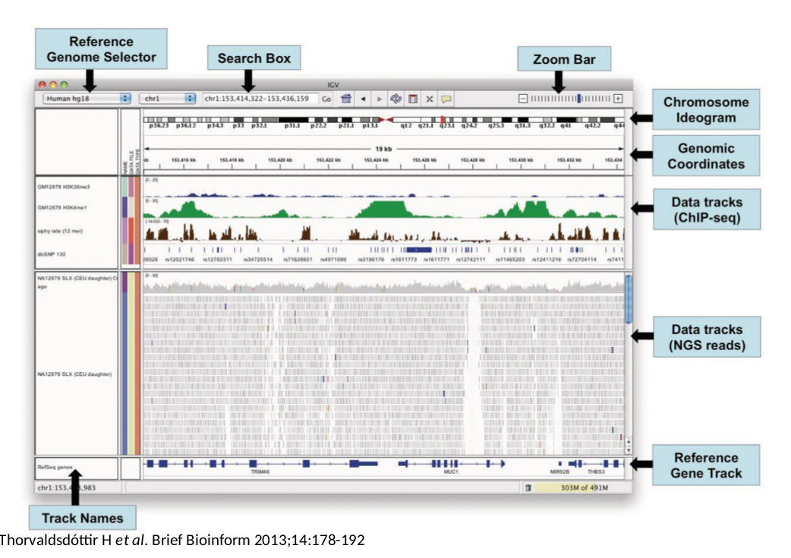

Interface with 2 datasets (Chipseq Peaks and BAM Alignments)

## Reference Genome

* Choose an already available genome in the Reference Genome Selector (Human, Mouse, Yeast...) 
    +  **/!\\ Be careful with the assembly (hg19 != hg18) /!\\**

    + IGV isn’t designed for unassembled references (thousands of contigs)
* Load your own genome: in the bar menu, click on **"Genomes"** then on **"Load genome from File"**. Your genome should be an indexed FASTA file (.fa or .fasta)

* You can also load a genome from an URL or a server.
    + **Ex**: human genome hg18 (showing all chromosomes by default)

# Navigation

## Per region
* You can **visualize 1 chromosome** (ex: chr10) on this selector:

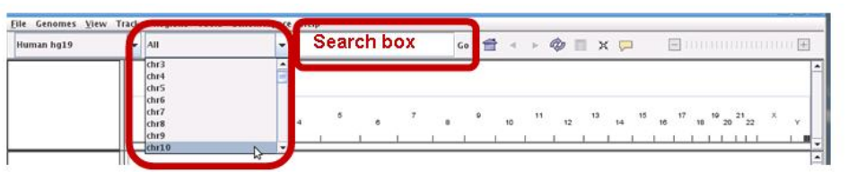

Chromosome selector and search box

* The whole chromosome is shown by default. You can specify a **genomic range (chr10: 18000000-18150000)** or a **term (BEND2)** in the search box. Then click on **"Go"** or press **"Enter"**.

/!\\ It can be any term present in the loaded annotation tracks: a gene (BRCA1) or transcript name (NM_007294) but also the interval names from a loaded BED file. /!\\ 

## Zoom in/out
* By clicking on the **"+"** (respectively **"-"** to zoom out) in the zoom bar

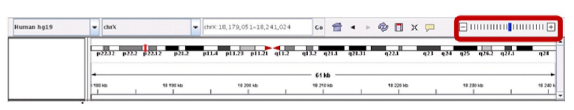

Plus and Minus buttons to zoom in/out

* By choosing a range on the ruler: **left-click at one point, hold it while moving your cursor to the right or by double-clicking on the track**

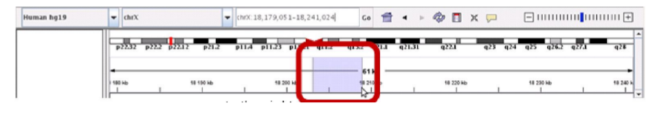

Click and drag to zoom in precisely

* Click on the genomic coordinates or on the chromosome ideogram
* Click & Drag on the tracks to move around the region you selected
* **To move on the chromosome**: click on the left & right arrows

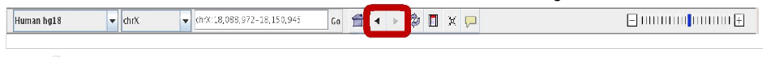

Move right and left on the chromosome

  

* Zoom out by clicking on the **"alt" key and with a double click** on the track
* Go back to whole genome view with the house icon :

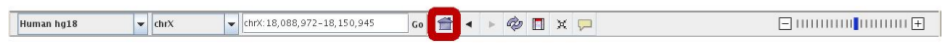

Whole genome view

  

## Save an image of your current view
* Click on **"File"** then on **"Save Image"**
* Choose the format of your picture
    + .png or .jpg
    + .svg: graphics that can be modified in Inkscape (open source, similar to Illustrator)
      
## Jump from one interval to the next one     
* In **"File>Load from File"**, select a Bed File. Once loaded, left click on the name of the bed track (it should appear gray) then simultaneously click on the **"ctrl" and "f"** keys to jump to the next interval (very useful to visualize variants or enriched regions)

## Region Navigator
* Import regions of interest in BED format (4 tabulated columns: chr start end name) by clicking on **"Region > Import Region"** in the top menu  
* Save the regions you found by clicking on this icon:

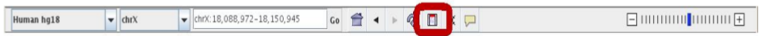

Region Navigator

  
* Then click on each side of the region of interest (one click **on the track** to open it on the left, one click **on the track** to close it on the right). A red bar appears just under the ruler to highlight the region you selected. Click on this red bar then on **"edit description"** to give it a name. To find this region again, go to **"Regions > Region navigator"**, select your interval then click on **"View"**.
* Export saved regions in BED format by clicking on **"Regions > Export regions"**  
* In **"Regions>Gene lists"**, you can import/export your own gene lists or use available ones.

## Multiple view option
* Enter several localization or terms in the search box (space separated). 
    + **Ex**: BRCA1 BRCA2 RB1 or chr17:15000 chr18:10990 chr1:4500-4600
* In **"Regions>Gene lists"**, select several genes from a list then click on **"View"**
    

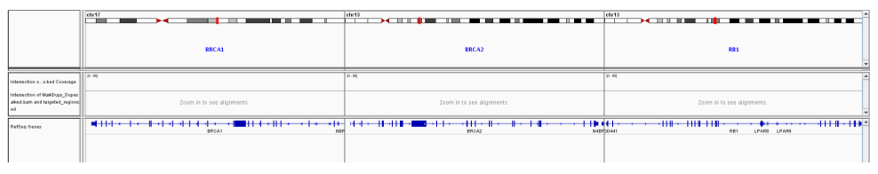

Multiple genes view

  
* In **"Regions>Region navigator"**, select several intervals by maintaining the control (command for mac) key then click on **"View"**
* Go back to single view mode by double clicking on the name of one panel or by right clicking on its name then on **"Switch to standard view"**
* Zoom in/out in one specific panel by right clicking on its name then on **"Zoom in/out"**.
* You can move on the genome independently inside the different panels.

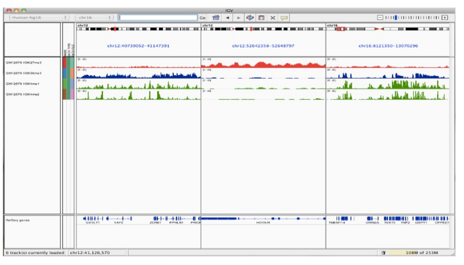

Multiple panels

  
# Loading and saving data

## Loading your data
* Possibility to load different types of data on the **same reference genome**
* Load data from different locations (local, URL or server):
    + From your computer : click on **"File"** > **"Load From File"** (previously saved from Galaxy using the floppy disk icon in a dataset)
    + From an Url: click on **"File"** > **"Load From URL"**
   

    
## Save alignments from visible locus
* Right-click on each alignment track then on **"Export Alignments"** to save
visible alignments from the selected track in **".SAM"** format

## Saving your session
* In the bar menu, click on **"File"** then on **"Save Session"**
* Give a name to your session and keep the **".xml"** extension  

Warning: Data files must stay at the same location

## Why save your session?
* Loading a lot of files can take a considerable amount of time
* Every graphical options will be saved as well as every regions of interest
* You can **share** this saved session with colleagues **IF**
    + the data files are located in a shared folder and stay at the same location or
    + you give them the data and the session without changing the files structure.    
    
# Graphical options
Depending on the file format, some graphical options will be available by right clicking on the track.  

* _For annotations tracks (bed, gtf, wig...)_ : you can change the **color** of the track and specify a **visualization mode** (collapsed, expanded and squished).  
**The collapsed mode might hide annotations that overlay on each other** so be sure to put the expanded mode on (i.e.: for the RefSeq Genes track, you need the expanded mode to see all available isoforms).

* _For alignment tracks (BAM)_: multiples options are available, depending on your type of data. Some may help you have a better understanding of your data. You can try all of the options but here are the most useful ones:
    + **Color alignment by**
        - **Strand**: to visually check if a variant has a strand bias
        - **First of pair strand**: to visually check if you have a directional RNA-seq (strand-specific)
        - **Insert-size / insert-size and pair orientation**: to identify structural variations like inversion, duplication or
        translocation
        - **Bisulfite mode**: to correctly see your bisulfite-seq/methyl-seq 
        data
    + **Sort alignment by base**: to reorder the alignments at a specific position by base can help visualize a variant
    + **Show mismatches bases**: to see variations from the reference in the alignments
    + **View as pairs**: link paired-end alignments together with a grey link
    + **View mate region in split screen**: useful to visualize translocation events (pairs mapped on different chromosomes)
    + **Visualization mode**: expanded is always a good choice to see more details but the collapsed mode can be useful to see Chip-seq peaks.
    + **Sashimi-plot** (RNA-seq only, see example below): a very useful visualization tool (no isoform prediction is done) to see junctions between exons for RNA-seq data and have an idea of the number of spanning reads at a specific junction.
    + Overlay tracks (bigwig only): with both **"ctrl"** key and left click, select > 1 bigwig tracks then right click on the name of one of them and click on **"Overlay"** (respectively Separate). Can be useful to compare visually both normalized IP and INPUT or several normalized IPs.    

Sashimi plot

* _For the (gray) coverage track_ : this track should always be available once a BAM file is loaded on IGV (if not, right click on the BAM track and select **"Show coverage track"**).  
It gives at every position the number of alignments covering the base and if you hover over a specific position you’ll have the numbers of A/C/G/T and insertions deletions on both strands.

## Classical visualization issue

/!\\ The coverage indicates that the position is covered by 352 reads but I see less than 50 reads in the alignment track. What’s going on? /!\\ 

IGV has default parameters that prevent your computer from crashing by using too much memory: it loads only a subsample of your alignments (which is supposed to represent the population of alignments at this position) for a given window.  

You can look those parameters by clicking on **"View"** in the top bar then **"Preferences"** and finally select **"Alignments"**. Depending on your parameter resources, you can change these parameters:

* Check out **"Downsample reads"** or put a higher number
* Check out **"Filter duplicates reads"** (only useful when PCR duplicates are marked) and **"Filter secondary alignments"**
* Mapping quality Threshold: reads with a MAPQ below this value will not be counted in the coverage.

## Bonus:
* **Coverage allele-freq threshold**: colors the coverage track on positions containing a variant present with an allele frequency higher than this value.
* **Show soft-clipped bases**: alignment tools such as BWA allow some extremities bases to be soft-clipped in order to improve the read alignment. Thoses bases are present in the BAM file but not taken into account in further analysis. Check this box to make them visible.
* **Labels indels > x bp**: show the number of bases for indels larger than x bp
* Check the **"Show center line"** option
* **Show soft-clipped bases**: see soft-clipped bases (bwa alignments)

View > Preferences Menu

# Support for PacBio long-reads
PacBio reads are long (up to 50kb) and have a high rate or indels random errors (more information in this video : https://www.youtube.com/watch?v=nLpmeD57ToA)  

* Create a consensus of all independent reads to ensure high quality alignments using the **"Quick Consensus mode"** by right-clicking on the alignment track
* Hide indels in **"Preferences"** then **"Alignments"** (recommended : <10bp)   

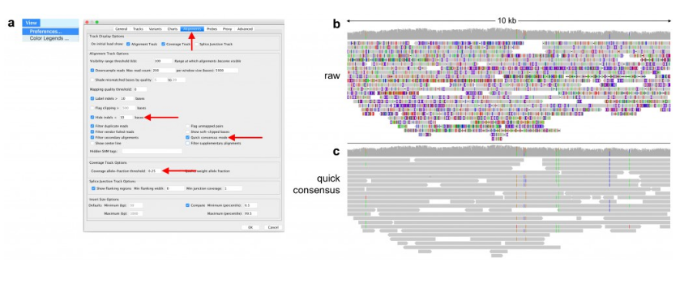

Consensus sequences for PacBio

#Support for 10x Genomics
Molecules are barcoded before they are sequenced with a Molecular Identifier (MI)  

* Use the **"View linked reads"** (just for UMI linked reads) in the right-click menu of the alignment tracks to group alignments per MI

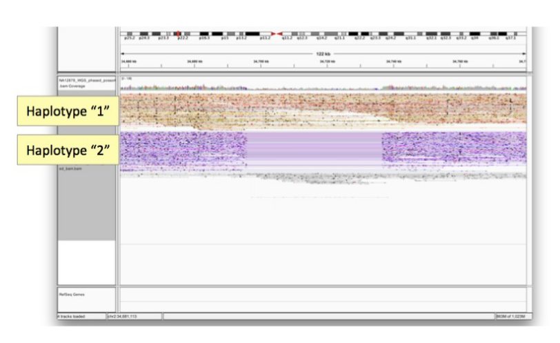

Group by haplotypes

