```{r setup, include = FALSE}
knitr::opts_chunk$set(echo = TRUE, 
                      eval.after='fig.cap',
                      include = TRUE, 
                      comment = NA,
                      highlight = TRUE,
                      fig.align = "center", 
                      out.width="600px",
                      cache = TRUE, autodep = FALSE)

require(tidyverse)
require(knitr)
require(DT)

```
<style>


body{
  font-family: Helvetica; 
  font-size: 12pt;
  <!-- 12pt -->
}
h1.title {
  # color: blue;
  # border-bottom: 1px solid;
  text-decoration: none !important; 
  font-weight: bold;
  font-size:30px;
}
h1 {
  font-size:26px;
  text-decoration: underline;
}
h2 {
  font-size:22px;
  text-decoration: underline;
}
div {
    text-align: justify;
    text-justify: inter-word;
}
pre.bash {
    background-color: #f4f1f1 !important;
    font-family: Helvetica; !important;
}
pre.r {
    background-color: #f0e4e4 !important;
}
</style>

\pagebreak

#Training data

<span style="background-color: #f4f1f1">
Training data is available on : https://zerkalo.curie.fr/partage/IGV/igv_data.zip 
</span>


#Visualization of variants in DNAseq data

* In the top menu, select **"New session"**
* In the top menu, select **"Load from File"** then select the **"dnaseq.bam"** and the **"dnaseq.bed"** file  
  
  
* Zoom in the **"variant239"** region and observe the heterozygous SNV at the position chr12:11,461,470, indicated by colored bases


```{r, echo = FALSE,fig.align="center",out.width="250px",fig.cap="Point mutation"}
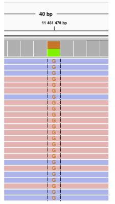
```

* Zoom in the **"variant230"** region and observe the 3bp-deletion at the position chr2:9,994,446, indicated by a blank space crossed by a black line


```{r, echo = FALSE,fig.align="center",out.width="250px",dpi=300,fig.cap="Deletion"}
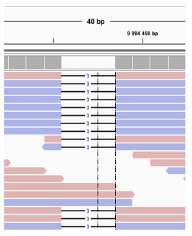
```

* Zoom in the **"variant240"** region and observe the insertion at the position chr12:11,461,554 , indicated by a purple bar


```{r, echo = FALSE,fig.align="center",out.width="250px",dpi=300,fig.cap="Insertion"}
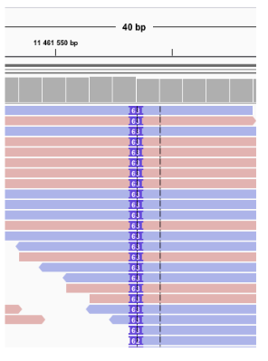
```

* Tips:
    + Always **sort reads by base** at a variant position and **color them by strand**
    + Control the visualization parameters set in **"View > Preferences"**
    + Base counts indicated by hovering on the coverage track at the variant position can help assess the variant allelic ratio.  
    The decomposition on the forward/reverse strands can help determine a **potential strand bias**: when a base is covered by the same amount of forward and reverse alignments (blue and pink) and the variant is supported by a high proportion of one type of strand (ie: 90%), it might be an artifact.

#Visualization of an alternative isoform in RNA-seq data

A variant impacting the splicing site of the exon 6 of the _*OAS1*_ gene (chr12:113,357,193 ; Pickrell et al, 2012) is producing an alternative isoform that contains the retention of a part of the following intron.

* In the top menu, select **"New session"**
* In the top menu, select **"Load from File"** then select the **"rnaseq.bam"** file
* Zoom in the _*OAS1*_ region. If you see the **"Zoom in to see alignments"** message, zoom in until you see alignments.


```{r, echo = FALSE,fig.align="center",out.width="800px",dpi=300}
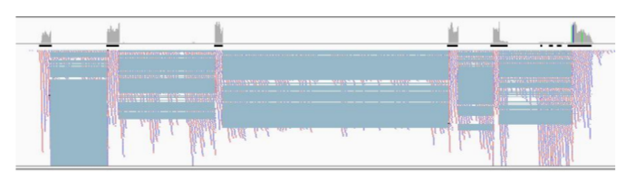
```


* Set the track in its **collapsed mode** by right clicking on the alignment track The blue lines link the different parts of a spanning read that, by definition, map on several exons. Zoom in on the two last exons of OAS1 then sort the alignments by
base just before the last exon. You can see alignments outside of the known exons of this gene.


```{r, echo = FALSE,fig.align="center",out.width="800px",dpi=300}
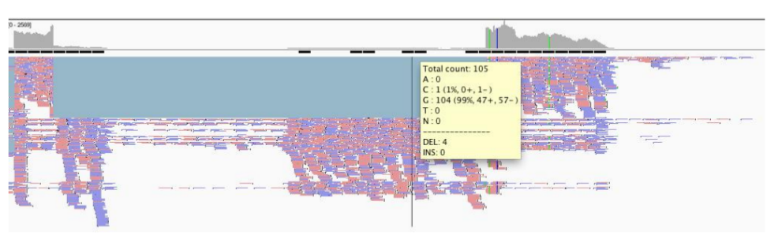
```

* **Right click** on the alignment track, select **"sashimi-plot"**. You'll see the exons coverage and junctions lines with a number specifying the number of spanning reads for this junction. Zoom in the last 2 exons, move the track and click on an exon to only see junctions involving this exon (click on an intron to see everything).


```{r, echo = FALSE,fig.align="center",out.width="800px",dpi=300}
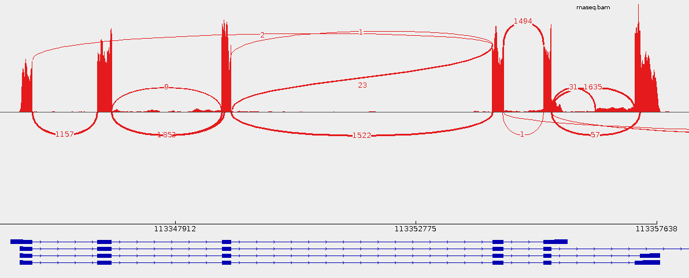
```


```{r, echo = FALSE,fig.align="center",out.width="800px",dpi=300}
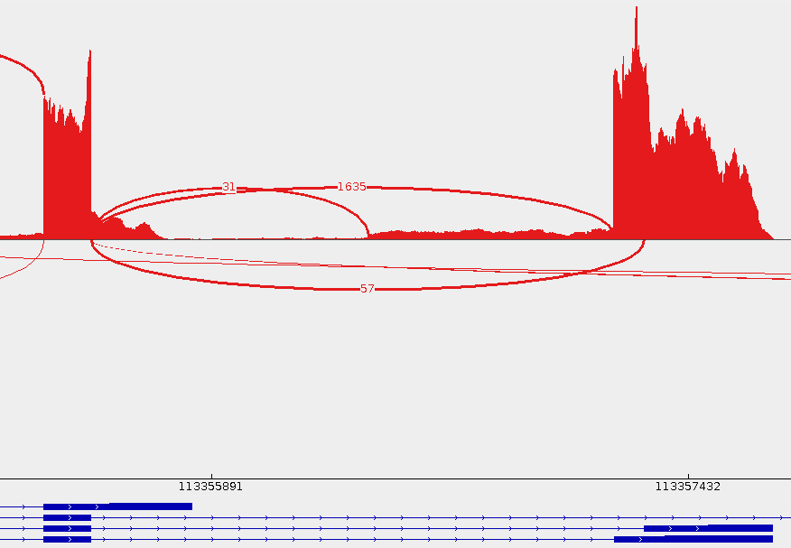
```


* 31 reads span the junction of exon 5 and the cryptic 3' splice site upstream of the mutation
* Some options are available by right clicking on the sashimi:
    + **Set color**: to distinguish between different tracks
    + **Save image**: to save your sashimi (svg format is recommended for high resolution picture and can be modified using illustrator or inkscape)
    + **Set min junction coverage**: alignment data are noisy and there are a lot of junctions with a low number of spanning reads. Put a higher number of minimal junction coverage to only see the higher represented junctions.
    
<span style="color:red; background-color: #f4f1f1">
/!\\ Sashimi plots are very useful to get a descriptive view of RNA-seq data but cannot replace a proper analysis : it's only a visualization tool. /!\\
</span>

#Visualization of the Transcription Factor GATA-3 Binding Sites by ChIP-seq from ENCODE

ChIP-seq data from the ENCODE project are used in this part in order to observe at the same time a BAM file containing the reads alignments, the normalized signal in a BIGWIG file and a BED file containing the enriched regions of high read density (peaks) identified by the bioinformatics analysis.   
These peaks correspond to the predicted binding sites of the studied transcription factor, GATA-3 in the Mcf7 cell line.  

These data can be access directly via IGV (or load the saved session **"chipseq.xml"**) :

* In the top menu, select **"New session"**
* In the top menu, select **"File"** then **"Load from ENCODE (2012)"**


```{r, echo = FALSE,fig.align="center",out.width="600px",dpi=300}
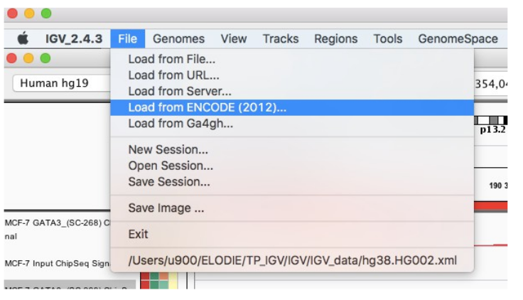
```

* Write the following keywords: **"mcf-7 gata3 usc SC-268"** and select the following tracks then click on **"Load"**

```{r, echo = FALSE,fig.align="center",out.width="800px",dpi=300}
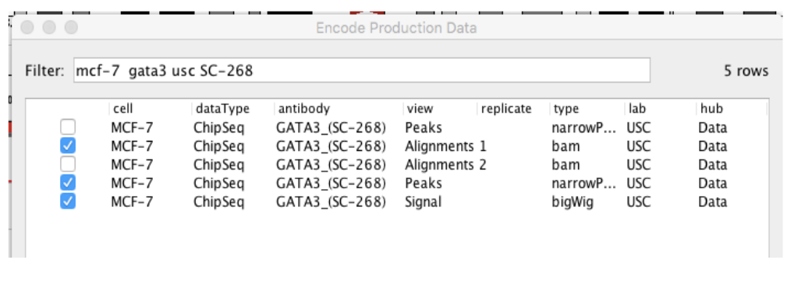
```

* Repeat the operation and write the following keywords to import the INPUT signal: **"mcf-7 input usc signal"** and select the following track then click on **"Load"**


```{r, echo = FALSE,fig.align="center",out.width="800px",dpi=300}
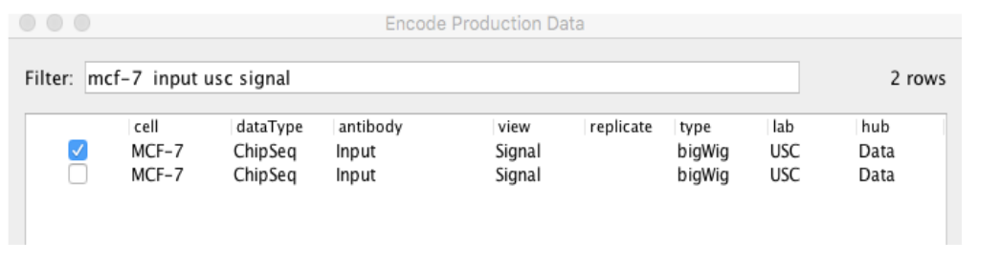
```


**Visualization of two peaks** :

* Zoom in this specific region : **chr2:190,349,562-190,354,046**
* Right click on the name of the **"MCF-7 GATA3"** IP Signal and click on **"Change track Color (positive values)"** then select the color red
* Repeat the operation for the **"MCF-7 Input"** Signal and select the color light blue
* Select both Signal tracks by maintaining the **"ctrl"** key and clicking on the names then right-click on one of them and click on **"Group autoscale"** to adapt the scale of both tracks


```{r, echo = FALSE,fig.align="center",out.width="800px",dpi=300}
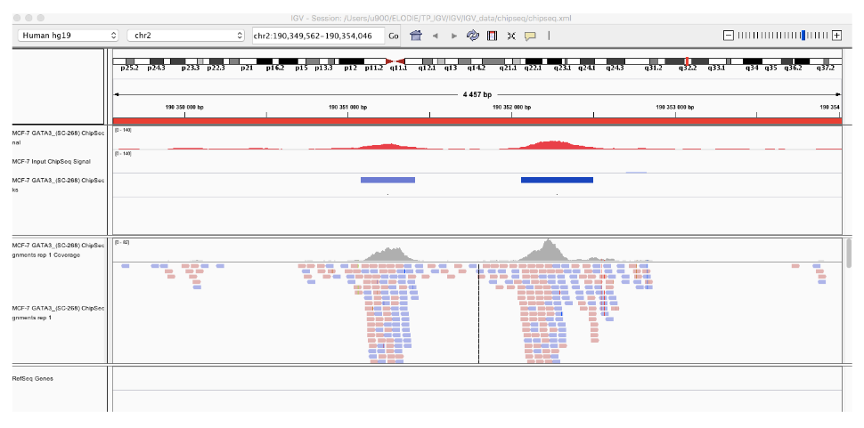
```


**Visualization of a region that is not enriched in the IP** :

* Remove the alignment track by right clicking on the name then select **"Remove track"**
* Zoom in this specific region : **chr20:55,741,582-55,790,445**
* Select both Signal tracks by maintaining the **"ctrl"** key and clicking on the names then right-click on one of them and click on **"Overlay"** to display both signals on the same track


```{r, echo = FALSE,fig.align="center",out.width="800px",dpi=300}
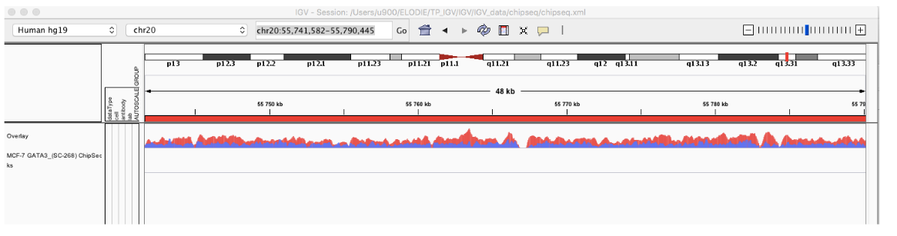
```

