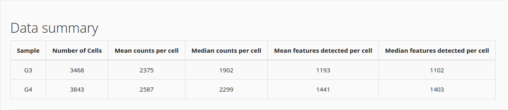
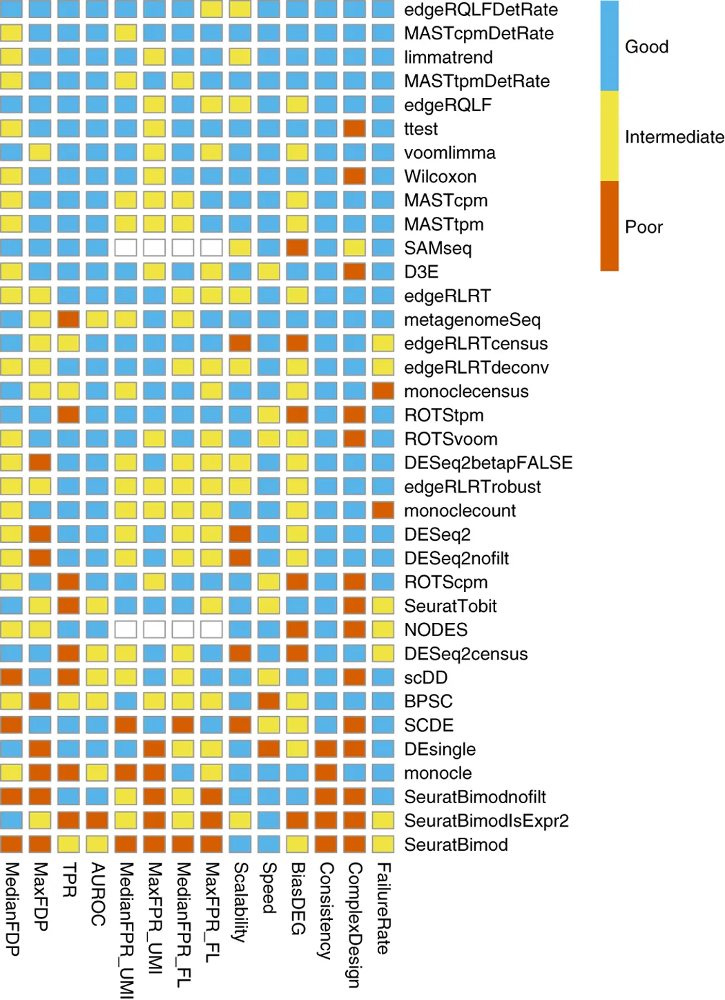
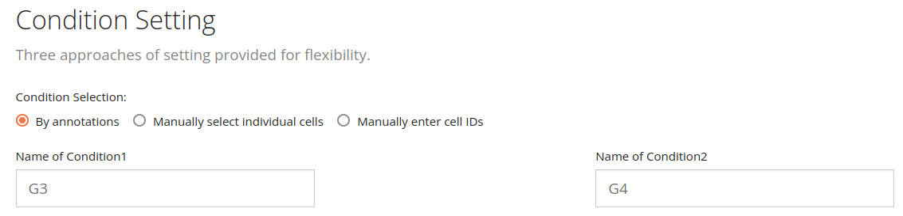
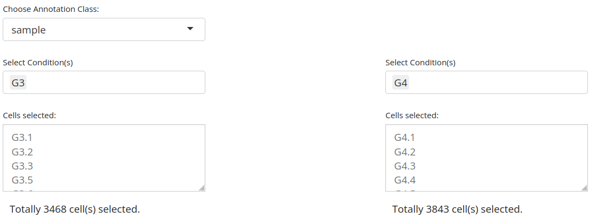
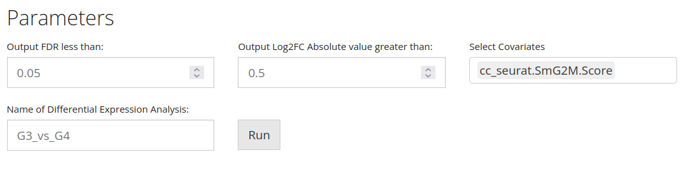
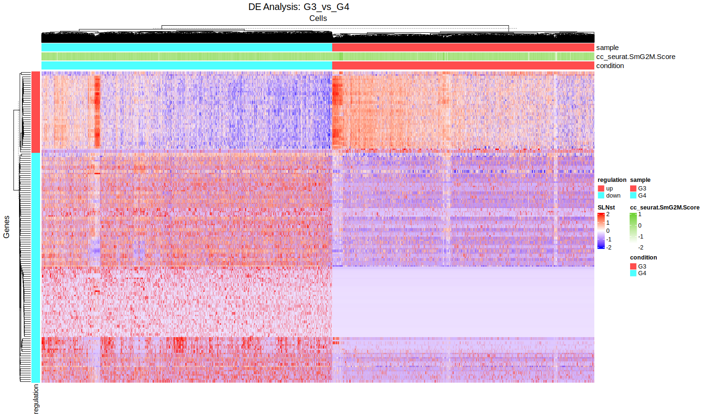
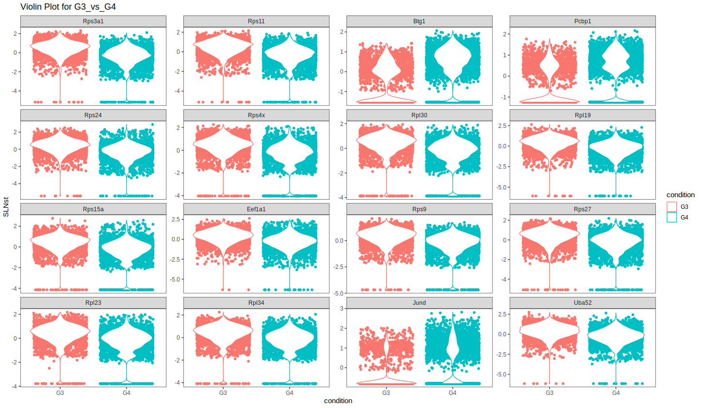

```{r setup, include=FALSE}
# options(width = 60);
knitr::opts_chunk$set(
  echo = TRUE,        # Print the code
  eval = FALSE,       # Do not run command lines
  message = FALSE,    # Print messages
  prompt = FALSE,     # Do not display prompt
  comment = NA,       # No comments on this section
  warning = FALSE#,    # Display warnings
  # width = 100       # Number of characters per line
  
);

```

<style type="text/css">
details:hover { cursor: pointer }
</style>

<style>
.column-left{
  float: left;
  width: 47%;
  text-align: left;
}
.column-right{
  float: right;
  width: 47%;
  text-align: left;
}
</style>


# Forewords

## R for advanced users

In this presentation, there will be screen captures, for you to follow the lesson. There will also be R command lines (hidden by default). Do not take care of the command lines if you find them too challenging. Our goal here, is to understand the main mechanism of Differential Expression Analysis. R is just a tool.

```{r load_libraries, eval=TRUE, echo=FALSE}
library(package = "BiocParallel")
library(package = "DT")
library(package = "ggplot2")
library(package = "ggpubr")
library(package = "rstatix")
library(package = "knitr")
library(package = "dplyr")
library(package = "singleCellTK")
library(package = "Seurat")

register(MulticoreParam(6))

integrated_sctk <- readRDS("wilcox_de.RDS")
res <- read.table("result.deseq2.tsv")
```

In fact, the whole TP can be done in two lines of code:

```{r sctk_wicox_tp, eval=FALSE, echo=TRUE}
integrated_sctk <- readRDS(file = "dataset/INTEGRATED_02d_ClustLab.rds")

integrated_sctk <- singleCellTK::runWilcox(
  inSCE=integrated_sctk, 
  groupName1="G3", 
  groupName2="G4", 
  analysisName="G3_vs_G4_Wilcox", 
  log2fcThreshold=0.01, 
  fdrThreshold=0.05, 
  class="sample", 
  useAssay="SLNst", 
  classGroup1="G3", 
  classGroup2="G4"
)

integrated_sctk <- singleCellTK::runDESeq(
  inSCE=integrated_sctk, 
  groupName1="G3", 
  groupName2="G4", 
  analysisName="G3_vs_G4_Wilcox", 
  log2fcThreshold=0.01, 
  fdrThreshold=0.05, 
  class="sample", 
  useAssay="counts", 
  classGroup1="G3", 
  classGroup2="G4"
)


```

Our goal is to understand these lines, not to be able to write them.

## Purpose of this session

Up to now, we have:

1. Identified to which cell each sequenced reads come from
1. Identified to which gene each read come from
1. Identified possible bias in gene expression for each cell
1. Annotated cell clusters

We would like to identify the list of genes that caracterize differences between G3 and G4 groups.

At the end of this session you will know:

1. how to select a differential analysis method
1. how to select the correct normalization (if any?) that must be provided to your differential analysis method
1. How to read differential expression results

## Load RDS dataset

You aleady have a dataset loaded ? Good. Keep on going with it ! You don't have one ? Use mine:

In SingleCellTK, click "Data".

1. Import SingleCellExperiment or Seurat object stored in an RDS file
1. click "Browse" and select INTEGRATED_02d_ClustLab.rds
1. click "Add To Sample List"
1. click "Import"
1. wait ...
1. Set "Rownames (Default)" as "Feature for Display"

This may be a bit long, depending on the size of the input dataset.

## Insight

Have a look at your dataset. The Shiny interface returns the following description:



Aside, we might want to look at this dataset through R, using the function [`head`](https://www.rdocumentation.org/packages/utils/versions/3.6.2/topics/head). A RDS (R Dataset) contains lots of information.

```{r display_summary_of_integrated_counts, eval=TRUE}
head(integrated_sctk)
```

We can see the name of the normalized dataset and raw counts, we read the name of the dimension reduction steps, we can see the number of cells (7311) and the list of available metadata (8). This information is quite precious when you recieve an unknown dataset, but here, we know where these data come from.


# Select a DE method

## Available methods


There are many DEA methods available in SingleCellTK:

1. [wilcox](https://www.rdocumentation.org/packages/rstatix/versions/0.7.1): The wilcoxon test tests the mean of expression and looks for a difference in these means.
1. [MAST](https://www.bioconductor.org/packages/release/bioc/vignettes/MAST/inst/doc/MAST-Intro.html): This tool has been built for Single Cell. It is based on a statistical model called ["Hurdle Model"](https://en.wikipedia.org/wiki/Hurdle_model), which excells with data that contains lots of zeros (which is our case in Single Cell RNA-Seq: most of the genes are *not* expressed.)
1. [DESeq2](https://bioconductor.org/packages/release/bioc/vignettes/DESeq2/inst/doc/DESeq2.html#recommendations-for-single-cell-analysis): This tool has originally been built for bulk RNA-Seq but now includes specific funcitons for Single Cell. It performs well when counts are highly variable or when you wand to compare a handful of cells.
1. [Limma](https://bioconductor.org/packages/release/bioc/html/limma.html): This tool is based on similar methods as DESeq2, and IMHO their results are quite alike.
1. [ANOVA](https://en.wikipedia.org/wiki/Analysis_of_variance): ANOVA stands for "Analysis of Variance" and is also called "Fisher analysis of Variance".

The main question now is **how to choose the right test**: spoilers, there are no option better than another in all ways.

From Soneson & Robinson (2018) Nature Methods:



Here, researchers have designed an artificial dataset where they knew in advance the list of differentially expressed genes. They have used all these algorithms and consigned the results.

1. DESeq2, Limma seems to have a higher number of false positives (genes called differentially expressed while they were not.)
1. Wilcoxon seems to be better in general
1. Mast performs well in absolute

ANOVA was not present in this study.

In conclusion, to select your method, use the following:

1. If you have already done a study with one of these methods, keep using the same. This is crutial if you ever want to compare your new result with the old ones.
1. If you want to compare your study with a published one, use the same method.
1. If you have no idea, use Wilcoxon.
1. If you have bulk data analyzed with DESeq2/Limma, use DESeq2/Limma. It will be easier to take both works in consideration.

Please, never use a simple Wilcoxon on bulk RNA-Seq data.

## Hands on a single gene: Jund

Question is now to guess wether this gene is differnetially expressed or not.

### Cell observations

Let's have a look at the gene named ['Jund'](https://www.genecards.org/cgi-bin/carddisp.pl?gene=jund), involved in senescence and apoptosis.

```{r expression_of_jund_violinplot, eval=TRUE}
singleCellTK::plotSCEViolin(
  inSCE=integrated_sctk, 
  feature="Jund", 
  slotName="assays", 
  itemName="SLNst", 
  groupBy="sample", 
  ylab="Expression", 
  xlab="Sample", 
  defaultTheme=FALSE,
  title="Expression of Jund in both conditions"
)
```

Using 'intuition', is that gene differentially expressed ?

I can give you expression density for that gene if it helps:

```{r expression_density_of_jund_violinplot, eval=TRUE}
singleCellTK::plotSCEDensity(
  inSCE=integrated_sctk, 
  feature="Jund", 
  slotName="assays", 
  itemName="SLNst", 
  groupBy="sample", 
  ylab="Expression", 
  xlab="Sample", 
  defaultTheme=FALSE, 
  title="Expression density of Jund in both conditions"
)
```

Okay, let's have some informations about these distributions.

<div class="column-left">
Within the G3 group:

```{r Jund_summaries_G3, eval=TRUE}
countsG3 <- as.data.frame(
  SummarizedExperiment::assay(x=integrated_sctk, i="SLNst")
) %>% select( matches("^G3."))

JundG3 <- as.data.frame(t(countsG3["Jund", ]))
JundG3$Group <- "G3"

summary(JundG3)
```
</div>
<div class="column-right">
Withing the G4 group:

```{r Jund_summaries_G4, eval=TRUE}
countsG4 <- as.data.frame(
  SummarizedExperiment::assay(x=integrated_sctk, i="SLNst")
) %>% select( matches("^G4."))

JundG4 <- as.data.frame(t(countsG4["Jund", ]))
JundG4$Group <- "G4"

summary(JundG4)
```
</div>

### From biology to statistics

Okay, let us resort on statistics to evaluate our chances to be guess correctly.

We have lots of observations: 3 468 cells in G3 group, and 3 843 cells in G4 groups. Statisticians really like to have a lot of observations! Ideally, statisticians always want to have more observation than tests. We have a total of `r 3468 + 3843` observations and we are testing 1 gene. For them, this is a dream come true!

Our cells are supposed to be interactig with each others ? Are they independent from each others ? This is very important, and usually, it requires a discussion.

Does the expression in our cells follow a normal distribution ? It's easy to check. Let's draw the expression like we did above:

```{r distribution_Jund, eval=TRUE}
Jund <- rbind(JundG3, JundG4)
gghistogram(Jund, x="Jund", y = '..density..', fill = "steelblue", bins=15, add_density=TRUE)
```

Our distribution seems to be binomial we will have to rely on non-parametric tests.

Let's run a non-parametric test base on the mean of distributions, since it's the clothest to our 'intuitive' approach. Let there be [Wilcoxon](https://en.wikipedia.org/wiki/Wilcoxon_signed-rank_test) test.

In R, it's quite straightforward: we have the function [`wilcoxon_test`](https://www.rdocumentation.org/packages/rstatix/versions/0.7.1) to perform the test, then we can plot the result.

```{r wilcoxon_jund, eval = TRUE}
stat.test <- Jund %>% wilcox_test(Jund ~ Group) %>% add_significance()
eff.size <- Jund %>% wilcox_effsize(Jund ~ Group)
```

```{r display_wilcoxon_jund_result, echo = FALSE, eval = TRUE, results = "asis"}
kable(stat.test, caption = "Wilcoxon test result")
```

Wilcoxon test says: the distributions are different, with a $9.31e-280$ % of risks of being wrong. The gene Jund can safely be said differentially expressed. We can compute a fold change and conclude.


The same thing with DESeq2 leads to the following results:


```{r display_deseq2_jund_result, echo = FALSE, eval = TRUE, results = "asis"}
kable(res["Jund", ], caption = "DESeq2 test result")
```

With an adjusted pvalue of $1.200032e-149$ (raw p-value = $2.118861e-152$) DEseq2 also says Jund is differentially expressed.

Here, two methods (Wilcoxon and DESeq2) lead to the same conclusion.

```{r clean_jund, eval=TRUE, echo=FALSE}
Jund <- NULL
JundG3 <- NULL
JundG4 <- NULL
```

## Hands on a second gene: Mindy1

### Cell observations

Let's have a look at the gene named ['Mindy1'](https://www.genecards.org/cgi-bin/carddisp.pl?gene=Mindy1), mutation in that gene are associated with Encephalitis.

```{r expression_of_mindy1_violinplot, eval=TRUE}
singleCellTK::plotSCEViolin(
  inSCE=integrated_sctk, 
  feature="Mindy1", 
  slotName="assays", 
  itemName="SLNst", 
  groupBy="sample", 
  ylab="Expression", 
  xlab="Sample", 
  defaultTheme=FALSE,
  title="Expression of Mindy1 in both conditions"
)
```

```{r expression_density_of_mindy1_violinplot, eval=TRUE}
singleCellTK::plotSCEDensity(
  inSCE=integrated_sctk, 
  feature="Mindy1", 
  slotName="assays", 
  itemName="SLNst", 
  groupBy="sample", 
  ylab="Expression", 
  xlab="Sample", 
  defaultTheme=FALSE, 
  title="Expression density of Mindy1 in both conditions"
)
```

Okay, let's have some informations about these distributions.

<div class="column-left">
Within the G3 group:

```{r mindy1_summaries_G3, eval=TRUE}
countsG3 <- as.data.frame(
  SummarizedExperiment::assay(x=integrated_sctk, i="SLNst")
) %>% select( matches("^G3."))

Mindy1G3 <- as.data.frame(t(countsG3["Mindy1", ]))
Mindy1G3$Group <- "G3"

summary(Mindy1G3)
```
</div>
<div class="column-right">
Withing the G4 group:

```{r mindy1_summaries_G4, eval=TRUE}
countsG4 <- as.data.frame(
  SummarizedExperiment::assay(x=integrated_sctk, i="SLNst")
) %>% select( matches("^G4."))

Mindy1G4 <- as.data.frame(t(countsG4["Mindy1", ]))
Mindy1G4$Group <- "G4"

summary(Mindy1G4)
Mindy1 <- rbind(Mindy1G3, Mindy1G4)
Mindy1$Cells <- rownames(Mindy1)
```
</div>

Not easy, isn't it ?

Outlayers exists, but only in one condition. Are these outlayers related to the G3 population or are they linked to another unknown effect ?

## Statistical results

Using the same parameters as for Jund, we can run Wilcoxon method, and have the following result:

```{r wilcoxon_mingy, eval = TRUE}
stat.test <- Mindy1 %>% wilcox_test(Mindy1 ~ Group) %>% add_significance()
eff.size <- Mindy1 %>% wilcox_effsize(Mindy1 ~ Group)
```

```{r display_wilcoxon_mindy_result, echo = FALSE, eval = TRUE, results = "asis"}
kable(stat.test, caption = "Wilcoxon test result")
```

Then with DESeq2:

```{r deseq2_results_on_mindy, eval=TRUE, results='asis'}
kable(res["Mindy1", ], caption = "DESeq2 test result")
```

Here the conclusion is not easy. Two tools, two answers with an adjusted P-Value under 5%. While DESeq2 rejects the hypothesis with a p-value = $0.1222553$, adjusted to $0.2427601$, Wilcoxon accepts it with an adjusted p-value of $0.0497590536460365$.

DESeq2 identified these points as outlayers while Wilcoxon, standing on mean expression, identified it as differentially expressed. It is not possible to state who's right and who's wrong.

```{r clean_mindy, eval=TRUE, echo=FALSE}
Mindy1 <- NULL
Mindy1G3 <- NULL
Mindu1G4 <- NULL
mu <- NULL
```

# Select a dataset

## Dataset depends on selected method

There it is quite easier:

```{r choose_counts, eval=TRUE, results='asis', echo=FALSE}
choose_counts <- as.data.frame(t(data.frame(
  wilcox = "Normalized counts",
  MAST = "Raw counts",
  DESeq2 = "Raw counts",
  Limma = "Raw counts",
  ANOVA = "Normalized counts"
)))
colnames(choose_counts) <- c("Counts")
kable(choose_counts, caption = "How to select your counts")
```

## Name your conditions



You may want to manually select your cells, here we have `r 3468 + 3843` cells, we won't click them one-by-one.

Name your conditions the way you want them to be named in your publication, or you'll have to re-run all this work.

## Choose your annotation



A missing annotation class here, means a missing parameter in your SingleCellExperiment object.

## Choose parameters



### FDR and Fold Change

About thresholds on FDR (False Discovery Rate) and Log2(FC) (Log of the Fold Change), there are many discussions.

Remember, here the threshold on Fold Change is Logged. A `log2(1) = ``r log2(1)`. And keep in mind the following:

1. If one selects a fold change threshold above 1.7, then their study concludes that smoking is not related to lung cancer.
1. If one selects a fold change threshold above 1, then their study concludes that a fast-food based diet does not lead to weight gain.
1. If one selects a fold change threshold above 1/25 000 000, then their study concludes: it is a complete hazard that mice have featal malformation when in presence of Bisphanol.

In conclusion, there one, and only one reason to filter on fold change: in my experience, a fold change below 0.7 will be hard to see/verify on wet-lab (qRT).

If you need to reduce a too large number of differentially expressed genes, then reduce the FDR to 0.01, or even better, to 0.001. With that, you reduce your number of false claims.

Now run the differential analysis.

# Results and interpretation

## Big table

```{r dea_result_table, eval=TRUE, echo=FALSE, result='asis'}
dea_results <- integrated_sctk@metadata$diffExp$G3_vs_G4$result
datatable(dea_results, caption = "Wilcoxon result for differential analysis")
```

There you have the results, make sure to download it.

Remember, a p-value can never be an absolute 0. Here, the numbers are so small, that R rounded them to 0.

Never consider raw P-Values, adjusted P-Values are better by far. So FDR column is the one that decides wether a gene is DE or not.

Note this table contains only `r dim(dea_results)` entries, so `r dim(dea_results)` genes. This means that a "missing" gene is a non-differentially-expressed gene.

Remember the FC a logged in your conclusions.

What about our genes: Jund and Mindy1 ?


## Heatmap



## Violin plot



## Linear model plot

