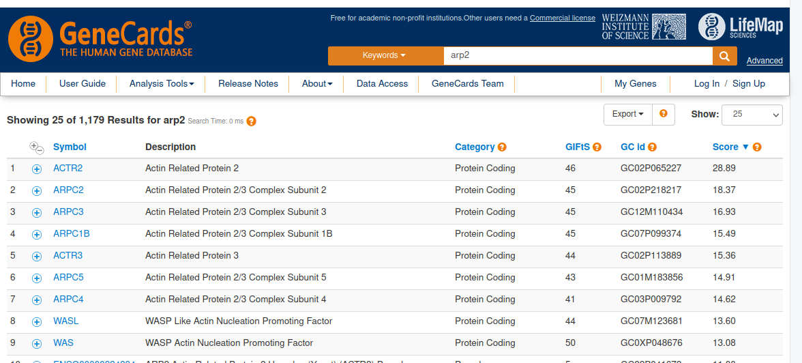
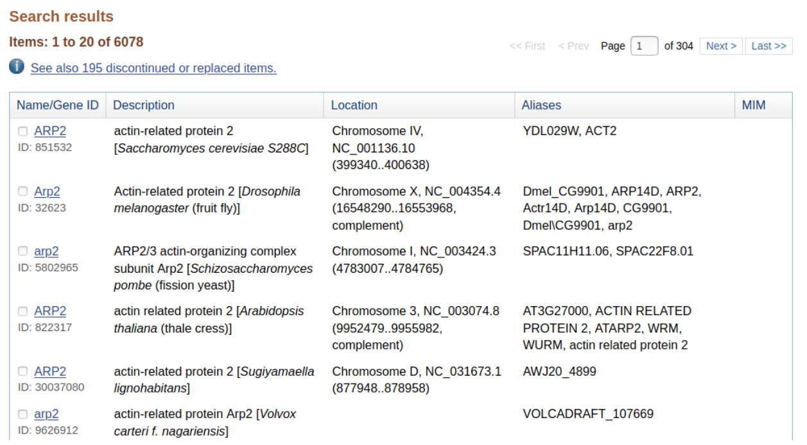
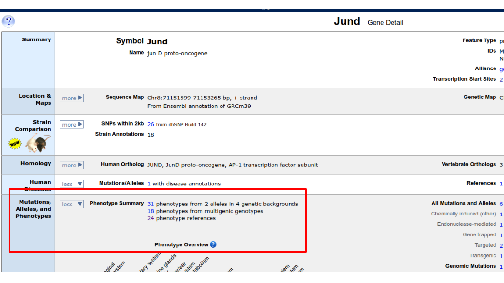
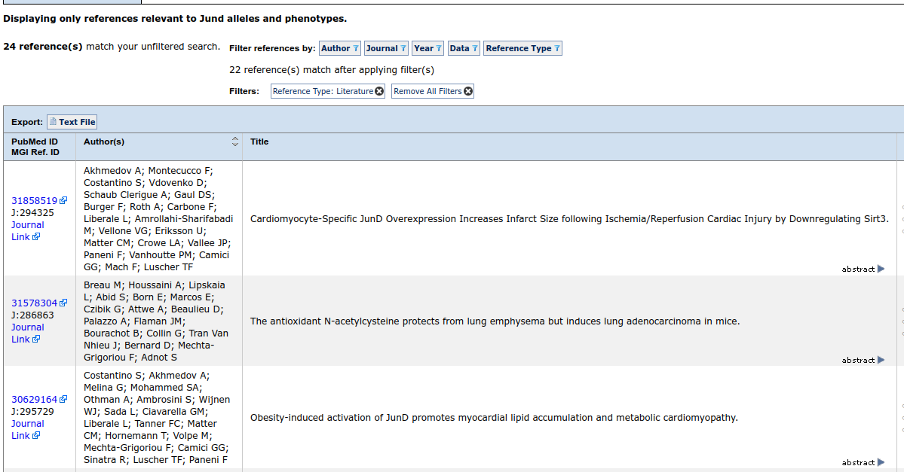
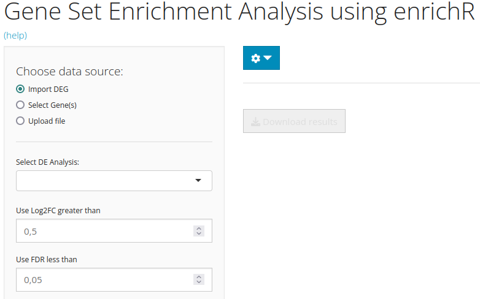

```{r setup, include=FALSE}
# options(width = 60);
knitr::opts_chunk$set(
  echo = TRUE,        # Print the code
  eval = FALSE,       # Do not run command lines
  message = FALSE,    # Print messages
  prompt = FALSE,     # Do not display prompt
  comment = NA,       # No comments on this section
  warning = FALSE#,    # Display warnings
  # width = 100       # Number of characters per line
  
);
```

# Forewords

## R code for advanced users

In this presentation, there will be screen captures, for you to follow the lesson. There will also be R command lines (hidden by default). Do not take care of the command lines if you find them too challenging. Our goal here, is to understand the main mechanism of Differential Expression Analysis. R is just a tool.

```{r load_libraries, eval=TRUE, echo=FALSE}
library(package = "BiocParallel")
library(package = "DT")
library(package = "ggplot2")
library(package = "ggpubr")
library(package = "rstatix")
library(package = "knitr")
library(package = "dplyr")
library(package = "singleCellTK")
library(package = "Seurat")

register(MulticoreParam(6))

enrich_result <- read.table("enrich_table.tsv", sep="\t")
vam_results <- readRDS("VAM.RDS")
```

In fact, the whole TP can be done in two lines of code:

```{r sctk_wicox_tp, eval=FALSE, echo=TRUE}
wilcox_de <- readRDS(file = "dataset/Wilcox_DE.rds")

# Enricher analysis
enrich <- singleCellTK::runEnrichR(
  inSCE=wilcox_de, 
  features=c("Jund", "Mindy1"), 
  analysisName="Cond_G3_vs_G4"
)

enrich <- singleCellTK::getEnrichRResult(
  inSCE=enrich, 
  analysisName="Cond_G3_vs_G4"
)
write.table(enrich$result, "entich_table.tsv")

# Pathway analysis
imported <- singleCellTK::importGeneSetsFromMSigDB(
  inSCE=wilcox_de, 
  categoryIDs="C5-BP"
)
vam_results <- singleCellTK::runVAM(
  inSCE=imported,
  geneSetCollectionName="C5-BP",
  useAssay="SLNst",
  resultNamePrefix="VAM_GO_BP",
  center=TRUE
)

```

Our goal is to understand these lines, not to be able to write them.

## Purpose of this session

Up to now, we have:

1. Identified to which cell each sequenced reads come from
1. Identified to which gene each read come from
1. Identified possible bias in gene expression for each cell
1. Annotated cell clusters
1. Identifier differnetially expressed genes among cluster of interest

We would like to identify the list of genes that caracterize differences between G3 and G4 groups.

At the end of this session you will know:

1. What is gene set analysis
1. How to choose a Gene Set database
1. How to perform an enrichment analysis
1. How to read Gene set analysis results

# Gene set enrichment analysis

## Why ?

The large table containing 7 000 differentially expressed genes is not usefull for humans. You won't be searching the list of pathways and metabolic chains each of these 7 000 genes are involved in.

Gene set analysis methods are used to run this kind of analysis.

Most of you know these methods under the umbrella term of "GSEA". Please, be aware that [GSEA](https://www.gsea-msigdb.org/gsea/index.jsp) is the name of a tool developped by the broad institure.

## Gene names and gene identifiers

We just did a whole analysis using names like ['Jund'](https://www.genecards.org/cgi-bin/carddisp.pl?gene=jund) or ['Mindy1'](https://www.genecards.org/cgi-bin/carddisp.pl?gene=Mindy1). These names are understandable by humans, and using them while presentif your work or publishing your paper is perfectly acceptable.

Let me tell you about the gene ACTR2. 



This gene name is a synonym for [NCOA3](https://www.genecards.org/cgi-bin/carddisp.pl?gene=NCOA3&keywords=ENSG00000124151), a nuclear receptor coactivator involved in transcription It is located in Chr20.p. It is also the name of the [Actin Receptor Protein 2](https://www.genecards.org/cgi-bin/carddisp.pl?gene=ACTR2&keywords=ENSG00000138071), located in Chr2.p. Now you guess the issue. Arp2 is a synonym of Arpc2. Arpc2 is a gene identified as differentially expressed. So ... We may have a problem here.

That's why, we, bioinformatician, have had the idea of writing very unique names for each genes. We, bioinformaticians, however did not have the idea to make them readable by humans. Sorry. We've been spending too much time with computers.

For us:

```{r synonyms, eval = TRUE, echo = FALSE}
synonyms <- as.data.frame(t(data.frame(
  ENSG00000163466 = "ACTR2 / ARPC2 / P34-Arc / PNAS-139 / ...",
  ENSG00000138071 = "ACTR2 / ARP2",
  ENSG00000124151 = "ACTR / NCOA / NCOA3 / TRAM-1 / ..."
)))
colnames(synonyms) <- "Synonyms"
kable(synonyms)
```

In fact, ARP2 is not even related to mice ! I just show you gene information about humans !



Ensembl-id, Uniprot-id, Entrez-id, each database has its own gene/protein/transcript identifiers. They are unique. They are not human readable. You should use them when you can.

Lots of tools are used to "translate" these identifiers to human readable ones. SingleCellTK graphic interface does not allow to make these translations. GSEA lesson in RNA-Seq bulk has the example R code required for surch translation.

# Enricher

## How to do enrichement analysis ?

We are interested in the genes Jund and Mindy1. Manually, as we are working with mice, we go to [MGI](http://www.informatics.jax.org/) (Mouse Genome Informatics), and look for ["Jund"](http://www.informatics.jax.org/marker/MGI:96648).



Multiple pathways are found, clicking gives us more information:



With lots of genes, and lots of databases, this will be tedious.

## Enricher with SingleCell TK

Enricher does the same as the above: look for the list of genes provided, to a list of databases provided.



You can either enter a small list of genes, or let SingleCellTK select the list of genes of interest.

```{r Jund_Mindy_Enrich, eval = TRUE, results="asis", echo = FALSE}
datatable(head(enrich_result, 100), caption = "EnrichR results")
```

Magnitude of the fold change, order of the genes entered, all these information does not count. The only important thing that matters is the name of the genes.

