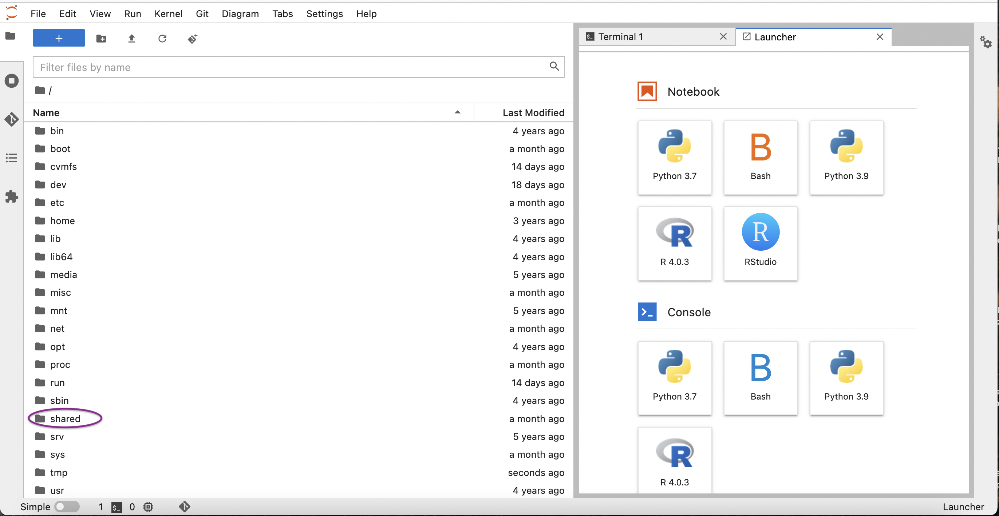

# IGV Single-cell Hands-on Roscoff 2022

*Sophie Lemoine and Morgane Thomas-Chollier*


## Introduction <a name="introduction"></a>
### Goal
The aim is to :

  * View the scRNA-seq signal in its genomic context
  * Better understand the 3' biais in 10X Genomics datasets

## Connect to the server and set up your environment <a name="setup"></a>
### Connect to JupytherHub
1. Sign in to [Jupyterhub](https://jupyterhub.cluster.france-bioinformatique.fr) and open a Terminal
2. select in the reservation field **form_2022_32**
4. In the launcher, click on "Terminal" in "Other" section. You should be in your home directory by default. Check it:
```bash
pwd
```

### 2 - Set up your working environment
1. Go to your project directory
```bash
cd /shared/projects/<your_project>
```
2. Create a directory that will contain all results of the upcoming analyses.
```bash
mkdir ebaii22_igv
```
3. Go to the newly created directory
```bash
cd ebaii22_igv
```
4. Copy the directory containing data

```bash
cp -r /shared/project/form_22_32/SingleCellRNASeq/Visualization .
```

7. Your directory structure should be like this
 ```
/shared/projects/<your_project>/ebaii22_igv
│
└───Visualization
```

You can check your directory structure:
 ```bash
 tree
```
You should see a BAM file (= mapped reads), a BAI file (for technical reasons this file must be present for IGV) and a BED file (contains a summary of the BAM with alignment position. This file is not mandatory, but it can be useful as less heavy than BAM)
 ```
 └── Visualization
    ├── pbmc1k_rdx.bam
    ├── pbmc1k_rdx.bam.bai
    └── pbmc1k_rdx.bed
```

## Visualizing the signal in a genome browser <a name="visualize"></a>

### 1 - Download the following files from the server onto your computer (laptop)
1. In JupytherHub, use the menu on the left to navigate to your project folder. 



2. Once you get to the **Visualization** folder, right-click on the following files and choose **Download** to save them on your laptop


  * pbmc1k_rdx.bam
  * pbmc1k_rdx.bam.bai
  * pbmc1k_rdx.bed

### 2 - Viewing the raw alignment data in IGV

1. Open IGV on your computer
2. Keep the default genome (GRCh38/hg38)
3. Load BAM file : 
  * File / Load from File...
  * Select the BAM file **pbmc1k_rdx.bam**
4. Load the BED file **pbmc1k_rdx.bed**

(the BAI file does not need to be loaded)

**Browse around in the genome. Do you see peaks?** 
**Where are located the peaks, in refence to the annotated genes ?**   


