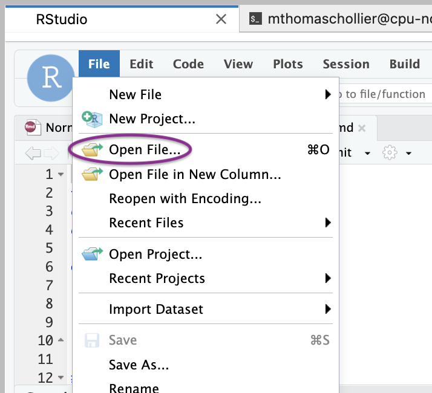
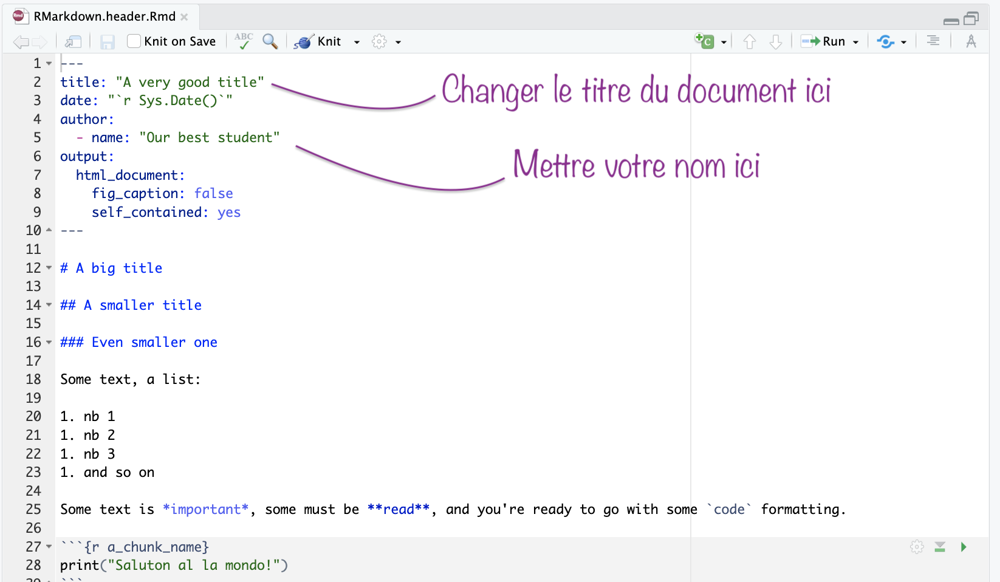
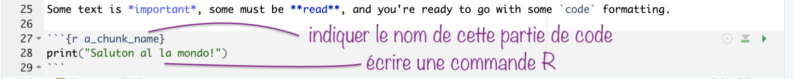
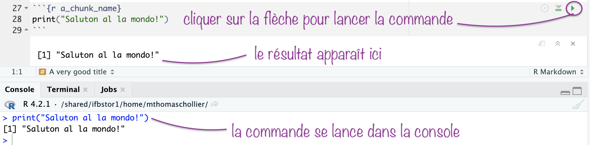
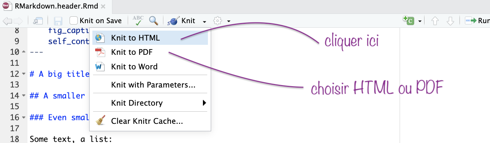
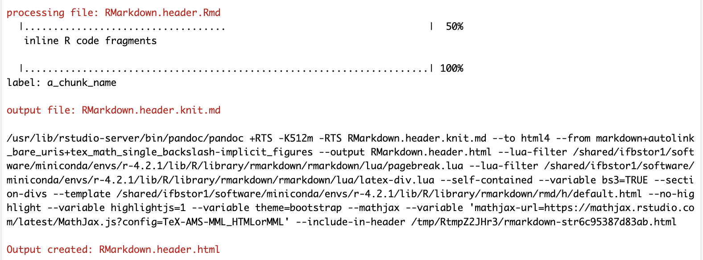
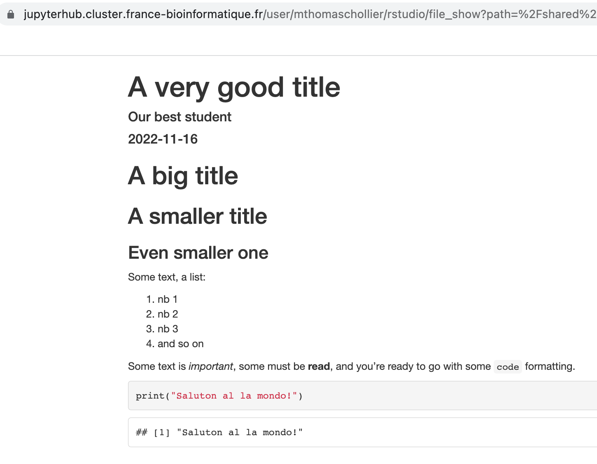
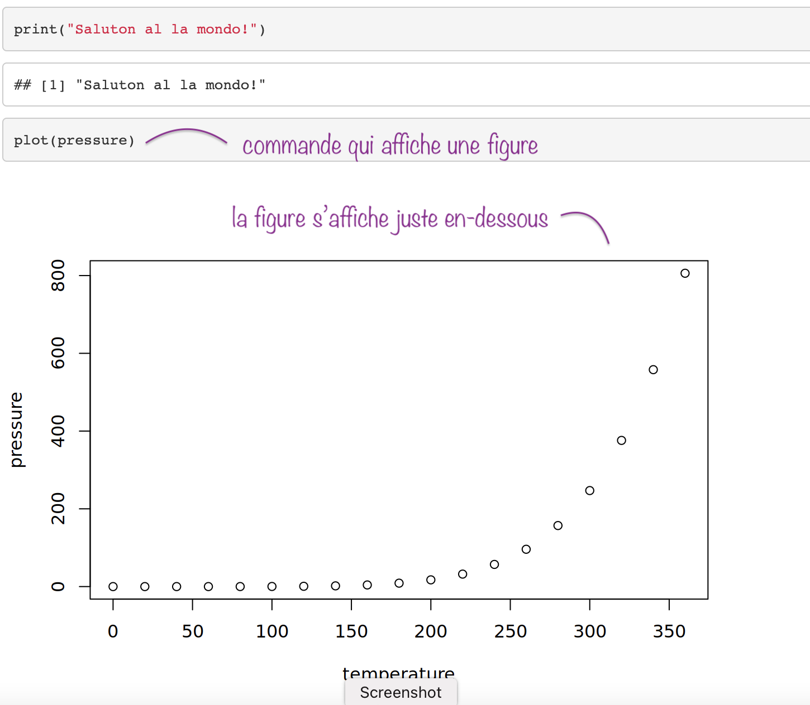

# 11ème école de bioinformatique AVIESAN - IFB - INSERM (EBAII 2022)

## Initiation à l'utilisation du R markdown et knitR

### Pourquoi utiliser ce type de fichier ?

Le fichier R markdown est un fichier dans lequel vous pouvez écrire du texte et des commandes R. Ce fichier permet ensuite de générer un rapport contenant à la fois les commandes et les résultats de ces commandes.


### Commencer à utiliser ce fichier

1. Copier le fichier de départ R markdown dans votre espace projet, dans un dossier nommé *Normalisation* avec le Terminal de JupyterHub.

	```
	cd /shared/projects/<your_project>/

	mkdir Normalisation

	cp -r /shared/projects/form_2022_32/SingleCellRNASeq/	RMarkdown.header.Rmd /shared/projects/<your_project>/	Normalisation/
	```

2. Dans Rstudio, ouvrir le fichier R markdown avec **File > open File**

	

3. Choisir dans le dossier *Normalisation* le fichier nommé *RMarkdown.header.Rmd*

	

4. Le contenu du fichier s'affiche, et vous pouvez alors l'éditer pour y indiquer un titre et votre nom.

	


### Ecrire du texte

Indiquer le texte de manière libre dans le fichier. Afin de rendre le texte plus lisible, vous pouvez le formatter :

* titres et sous-titres (avec des `#`)
* listes (avec des `*`)
* gras et italique (avec des `*` ou des `_`)

Si vous voulez plus d'informations sur la syntaxe en R markdown, vous pouvez vous référer à cet [aide mémoire](https://www.rstudio.com/wp-content/uploads/2015/02/rmarkdown-cheatsheet.pdf).

### Ecrire et lancer du code

Le code R s'écrit dans une section appelée "**chunk**" apparaissant sous forme grisée. Cette section commence et termine par 3 guillemets.

1. Nommer le chunk en remplacant *a\_chunk\_name* par un nom approprié pour cette étape. Ecrire une commande, ici `print()`.

	

2. Pour lancer la commande, cliquer sur la flèche verte du côté droit du chunk. Le résultat apparaît alors dessous et la commande tourne dans la console.

	

### Produire un rapport (PDF ou HTML)

1. Cliquer sur le bouton **knit** et choisir le format.

	

2. L'ensemble des commandes va être lancé. Attention, cela peut prendre du temps ! Les étapes apparaissent dans la console, le fichier de sortie (ici un rapport au format html) est indiqué. Il se trouve dans le même dossier que le fichier R markdown.

	

3. Vous pouvez ouvrir ce rapport dans votre navigateur web. Pour chaque chunk, la commande est indiquée ainsi que son résultat, y compris les figures. 

	


4. Par exemple, vous pouvez ajouter le chunk suivant pour afficher des données d'exemple déjà incluses dans R. Ici, nous avons choisi les données nommées *pressure*.

	```{r figure1}
	plot(pressure)
	```
	
5. Après avoir généré le rapport avec le bouton *knit*, le fichier html comporte la commande et la figure.

	

