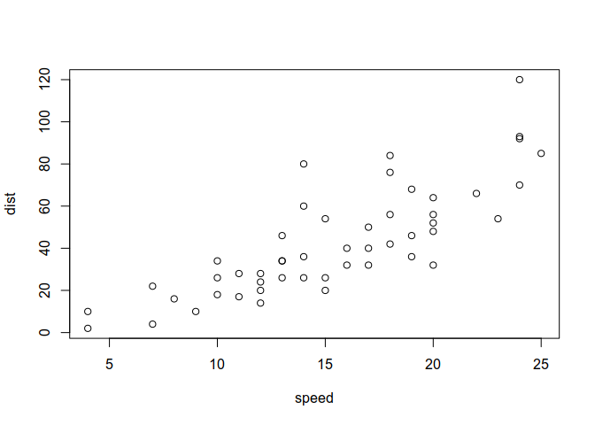

Including RMarkdown to Jupyter-notebook is easy: simply compile your
[R-markdown](https://rmarkdown.rstudio.com/) to
[markdown](https://www.markdownguide.org/) or [Restructured
Text](https://www.writethedocs.org/guide/writing/reStructuredText/)
before compiling the whole book.

Image inclusion is automatic from R code:

    plot(cars)

