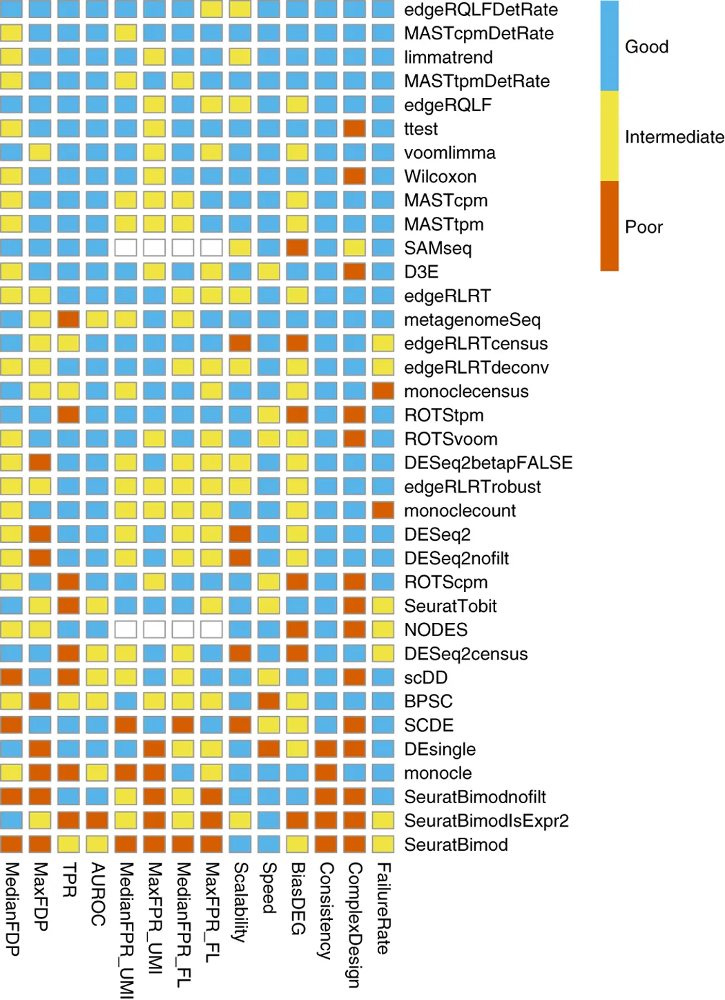

```{r setup, include=FALSE}
knitr::opts_chunk$set(
  echo = TRUE,        # Print the code
  eval = FALSE,       # Do not run command lines
  message = FALSE,    # Print messages
  prompt = FALSE,     # Do not display prompt
  comment = NA,       # No comments on this section
  warning = FALSE     # Display warnings
)
```

<style type="text/css">
details:hover { 
  cursor: pointer 
}
body {
  text-align: justify
}
.column-left{
  float: left;
  width: 47%;
  text-align: left;
}
.column-right{
  float: right;
  width: 47%;
  text-align: left;
}
</style>

# Forewords

I need three teams for this session: 
team [`Wilcoxon`](https://en.wikipedia.org/wiki/Wilcoxon_signed-rank_test), 
team [`Student`](https://en.wikipedia.org/wiki/Student%27s_t-test), 
and team [`ROC`](https://en.wikipedia.org/wiki/Receiver_operating_characteristic).

I will also need your help because I can't make [DESeq2](https://bioconductor.org/packages/release/bioc/html/DESeq2.html) 
work correctly. But I'm sure, that we will solve my issue: you're in the best 
session here at [EBAII](https://github.com/IFB-ElixirFr/EBAII).

## TLDR: R command lines

In this presentation, there will be screen captures for you to follow the 
lesson. There will also be every single R command lines. 
Do not take care of the command lines if you find them too challenging. 
Our goal here, is to understand the main mechanism of Differential 
Expression Analysis. R is just a tool.

Below are the libraries we need to perform this whole session:

```{r load_libraries, eval=TRUE, echo=TRUE}
base::library(package = "BiocParallel")    # Optionally multithread some steps
base::library(package = "DT")              # Display nice table in HTML
base::library(package = "ggplot2")         # Draw graphs and plots
base::library(package = "ggpubr")          # Draw nicer graphs
base::library(package = "rstatix")         # Base R statistics
base::library(package = "knitr")           # Build this presentation
base::library(package = "dplyr")           # Handle big tables
base::library(package = "Seurat")          # Handle SingleCell analyses
base::library(package = "SeuratObject")    # Handle SingleCell objects
base::library(package = "SingleCellExperiment") # Handle SingleCell file formats
base::library(package = "UpSetR")          # Nice venn-like graphs
base::library(package = "EnhancedVolcano") # Draw Volcano plot
```

First, we load Seurat object:

```{r load_rds, eval=FALSE, echo=TRUE}
sobj <- base::readRDS(
  # Path to the RDS file
  file = "Scaled_Normalized_Seurat_Object.RDS"
)
```

Then we perform differential expression analysis:

```{r run_dea, eval=FALSE, echo=TRUE}
sobj_de <- Seurat::FindMarkers(
  # Object on which to perform DEA
  object = sobj,
  # Name of factor in condition 1
  ident.1 = "TD3A",
  # Name of factor in condition 2
  ident.2 = "TDCT"
)
```

And that's all. Our goal is to understand these lines,
being able to write them is a bonus.

## Purpose of this session

Up to now, we have:

1. Identified to which cell each sequenced reads come from
1. Identified to which gene each read come from
1. Identified possible bias in gene expression for each cell
1. Filtered and corrected these bias as well as we can

We would like to identify the list of genes that characterize differences 
between cell cycle phases G1 and S groups.

At the end of this session you will know:

1. how to select a differential analysis method
1. how to select the correct normalization (if any?) that must be provided to your differential analysis method
1. How to read differential expression results


## Load RDS dataset

You already have a dataset loaded ? Good. Keep on going with it ! You don't have one ? Use mine:

```{r load_rds_exec, eval=TRUE, echo=TRUE}
# We store in the variable `sobj`, the result of
# the function `readRDS` from package `base`.
sobj <- base::readRDS(
  # Path to the RDS file
  file = "Scaled_Normalized_Seurat_Object.RDS"
)
```

The command above, uses the function [`readRDS`](https://www.rdocumentation.org/packages/base/versions/3.6.2/topics/readRDS) 
from `base` R package. and git it the path to the [RDS](https://riptutorial.com/r/example/3650/rds-and-rdata--rda--files) 
file we built in previous session.

## Insight

We are wondering what's in our dataset. Let's have a look, 
with the function [`print`](https://www.rdocumentation.org/packages/base/versions/3.6.2/topics/print) 
form the package `base`.

```{r print_seurat, eval=TRUE, echo=TRUE}
base::print(
  # Object to display
  x = sobj
)
```

We have `r base::length(base::t(sobj@assays[["RNA"]][["vst.mean"]]))` features (_aka_ genes), 
accross `r base::length(base::names(sobj$nCount_RNA))` samples (_aka_ cells).


Let us have a look at the RNA counts for 10 cells and their annotation,
with the function [`head`](https://www.rdocumentation.org/packages/utils/versions/3.6.2/topics/head) from the package `utils`.

```{r head_seurat_counts_phase, eval=FALSE, echo=TRUE}
utils::head(
  # Object to visualize
  x = sobj,
  # Number of lines to display
  n = 10
)
```


```{r head_seurat_counts_phase_dt, eval=TRUE, echo=FALSE}
tmp <- utils::head(x = sobj, n = 10)
DT::datatable(data = tmp)
```

There is no counts, normalized or not. Where are they ?

In order to explore the content of `sobj`, use the function `str` from the package `utils`:

```{r str_seurat_object, eval=FALSE, echo=TRUE}
utils::str(
  # Object to explore
  object = sobj
)
```

Alternatively, in RStudio, you can click on the object pane and explore manually 
the content of the object. If we explore the slot `assays`, then we find the counts.

You can access them with:

```{r head_seurat_count_table, eval=FALSE, echo=TRUE}
utils::head(
  # Object to visualize
  x = sobj@assays[["RNA"]]@counts,
  # Number of rows to display
  n = 10
)
```

```{r head_seurat_count_table_dt, eval=TRUE, echo=FALSE}
tmp <- utils::head(sobj@assays[["RNA"]]@counts, 10)
DT::datatable(data = base::as.data.frame(tmp)[, 1:5])
```

We have one gene per line, one cell per column, and RNA counts in each row.
Are these counts normalized ? Are they scaled ? Are they filtered ? Are 
they corrected ?

<details>

<summary>Answer</summary>

These counts are normalized, scaled, filtered. This information is 
available in the seurat object itself, within the slot `commands`. See an
example below:

```{r seurat_history, eval=TRUE, echo=TRUE}
names(sobj@commands)
```

**However**, please be aware that counts in the slot `count` are raw counts.
Normalized counts are in the slot `data` and scaled data are in the slot 
`scaled.data`. And it you do not find that clear, I totally agree with you.

</details>
<br />


Is it normal that we have so many zeros ? And what about surch low counts,
is it because we downsampled the sequenced reads for this session ?

<details>

<summary>Answer</summary>

The large number of null counts is completely normal. In maths/stats
we talk about _matrix sparcity_, _i.e_ a table with lots of zeros. If the
data were to be downsampled, we had had done this by cropping over a small
chromosome, and not reducing the general amount of reads.

<br />
</details>

# Select a DE method

## Available methods

[Seurat](https://satijalab.org/seurat/articles/de_vignette) let us use multiple 
differential analysis methods with its function [`FindMarkers`](https://satijalab.org/seurat/reference/findmarkers).

1. [wilcox](https://www.rdocumentation.org/packages/rstatix/versions/0.7.1): The wilcoxon test tests the mean of expression and looks for a difference in these means.
1. [MAST](https://www.bioconductor.org/packages/release/bioc/vignettes/MAST/inst/doc/MAST-Intro.html): This tool has been built for Single Cell. It is based on a statistical model called ["Hurdle Model"](https://en.wikipedia.org/wiki/Hurdle_model), which excells with data that contains lots of zeros (which is our case in Single Cell RNA-Seq: most of the genes are *not* expressed.)
1. [DESeq2](https://bioconductor.org/packages/release/bioc/vignettes/DESeq2/inst/doc/DESeq2.html#recommendations-for-single-cell-analysis): This tool has originally been built for bulk RNA-Seq but now includes specific funcitons for Single Cell. It performs well when counts are highly variable or when you wand to compare a handful of cells.
1. [t-test](https://www.rdocumentation.org/packages/stats/versions/3.6.2/topics/t.test): The t-test uses a comparison of means to assess differential expression probability.
1. [roc](https://en.wikipedia.org/wiki/Receiver_operating_characteristic): An AUC value of 1 means that expression values for this gene alone can perfectly classify the two groupings (i.e. Each of the cells in cells.1 exhibit a higher level than each of the cells in cells.2). An AUC value of 0 also means there is perfect classification, but in the other direction. A value of 0.5 implies that the gene has no predictive power to classify the two groups.

The main question now is **how to choose the right test**: spoilers, there are no option better than another in all ways.

From Soneson & Robinson (2018) Nature Methods:



Here, researchers have designed an artificial dataset where they knew in advance the list of differentially expressed genes. They have used all these algorithms and consigned the results.

1. DESeq2, Limma seems to have a higher number of false positives (genes called differentially expressed while they were not.)
1. Wilcoxon seems to be better in general
1. Mast performs well in absolute

ANOVA was not present in this study.

## Case: Jund

The question is now to guess wether this gene is differnetially expressed or not.

### Cell observations

Let's have a look at the gene named ['Jund'](https://www.genecards.org/cgi-bin/carddisp.pl?gene=jund), 
involved in senescence and apoptosis. In order to plot its expression accross
all cells, we are going to use the function [`VlnPlot`](https://satijalab.org/seurat/reference/vlnplot)
from `Seurat` package. The input object is obviously contained in the `sobj`
variable, since it is our only Seurat object. In addition, we are going to
select the feature `Jund`, and split the graph according to the cell phases
we annotated earlier.

```{r seurat_vlnplot_jund_demo, eval=FALSE, echo=TRUE}
Seurat::VlnPlot(
  # The Seurat object
  object = sobj,
  # The name of the gene of interest (feature = gene)
  features = "Jund",
  # The name of the Seurat cell-cycle annotation
  split.by = "cc_seurat.Phase"
)
```

```{r seurat_vlnplot_jund_exec, eval=TRUE, echo=FALSE}
Seurat::VlnPlot(
  object = sobj,
  features = "Jund",
  split.by = "cc_seurat.Phase",
  cols = c("darkslategray3", "olivedrab", "orangered3")
)
```

Using your _'intuition'_, is this gene differentially expressed between TD3A 
and TDCT ?

<details>

<summary>Answer</summary>

In TD3A, the violin plot highlights two peaks of expression levels, one 
at zero level, the other around 1.75. There are more null counts than
non-null, but we cannot deny that a large range of cells have the 
gene Jund expressed.

In TDCT, most of the expression is equal to zero. While some cells do have
an expression between 1 and 3, the density drawn by the violin plot confirms
that these are the exception rather than the majority.

IMHO, and you can disagree, the expression of the gene Jund differs between
TD3A and TDCT. This is purely intuitive.

</details>

Using your _'intuition'_, is this gene differentially expressed between G1 and S phases ?


<br />
<details>

<summary>Answer</summary>

```{r vlnplot_seurat_group_phase_code, echo=TRUE, eval=FALSE}
Seurat::VlnPlot(
  # The Seurat object
  object = sobj,
  # The name of the gene of interest (feature = gene)
  features = "Jund",
  # The name of the Seurat cell-cycle annotation
  group.by = "cc_seurat.Phase"
)
```

```{r vlnplot_seurat_group_phase_display, echo=FALSE, eval=TRUE}
Seurat::VlnPlot(
  object = sobj,
  features = "Jund",
  group.by = "cc_seurat.Phase",
  cols = c("darkslategray3", "olivedrab", "orangered3")
)
```

Again, most of the expression is null, but G1 phase seems to have a higher
count density around 2 than the other phases. It is harder to decide ...

<br />
</details>

Okay, let's have some informations about these distributions.

```{r general_count_table, eval=TRUE, echo=TRUE}
# Store counts in a variable
counts <- base::as.data.frame(
  # The matrix to reformat into a dataframe
  x = sobj@assays[["RNA"]]@data
)
# Rename cells with cell cycle phase
base::colnames(counts) <- paste(
  # The names of the cell cycle phases for each cell
  sobj@meta.data$cc_seurat.Phase,
  # The names of the cells themselves
  colnames(sobj@assays[["RNA"]]@data),
  sep = "_"
)
```

```{r general_count_table_display, eval=TRUE, echo=FALSE}
DT::datatable(head(counts))
```

<div class="column-left">
We have `r length(colnames(sobj[, sobj$cc_seurat.Phase == "G1"]))` cells within the G1 group:

```{r Jund_summaries_G1, eval=TRUE}
countsG1 <- select(counts, matches("^G1."))

JundG1 <- base::as.data.frame(base::t(countsG1["Jund", ]))

base::summary(JundG1)
```
</div>
<div class="column-right">
We have `r length(colnames(sobj[, sobj$cc_seurat.Phase == "S"]))` cells withing the S group:

```{r Jund_summaries_S, eval=TRUE}
countsS <- select(counts, matches("^S."))

JundS <- base::as.data.frame(base::t(countsS["Jund", ]))

base::summary(JundS)
```
</div>

### From biology to statistics

Okay, let us resort on statistics to evaluate our chances to be guess correctly, or our risks to guess wrong.

We have lots of observations: `r base::length(base::colnames(sobj[, sobj$cc_seurat.Phase == "G1"]))` 
cells within the G1 phase, and `r base::length(base::colnames(sobj[, sobj$cc_seurat.Phase == "S"]))` 
cells withing the S phase.Statisticians really like to have a lot of 
observations! Ideally, statisticians always want to have more observation 
than tests. We have a total of `r base::length(base::colnames(sobj[, sobj$cc_seurat.Phase == "G1"])) + base::length(base::colnames(sobj[, sobj$cc_seurat.Phase == "S"]))` 
observations and we are testing 1 gene. For them, this is a dream come true!

Are our cells supposed to be interactig with each others ? 
Are they independent from each others ? 
This is very important, and usually, it requires a discussion.

oes the expression in our cells follow a normal distribution ? 
It's easy to check. Let's draw the expression like we did above.

First, we use the function [`rbind`](https://www.rdocumentation.org/packages/base/versions/3.6.2/topics/cbind) 
from `base` package. Be careful, the function `rbind` also exists 
in `DelayedArray`, `data.table`, and `BiocGenerics` packages. 
We want to use the basic one. Here is an example of odd behaviours 
that occurs when not using the package name before a function call.

```{r distribution_Jund_table_build, eval=TRUE, echo=TRUE}
# Add column adientifiers in each count dataframes
JundG1$phase <- "G1"
JundS$phase <- "S"
# Paste the rows beneith each other
Jund <- base::rbind(
  #  variable pointing to G1 counts
  JundG1,
  #  variable pointing to S counts
  JundS,
  # A boolean, requesting that strings/characters
  # should not be casted as `logical`. It breaks graphs.
  stringsAsFactors = FALSE
)
```

Secondly, we use the function [`gghistogram`](https://www.rdocumentation.org/packages/ggpubr/versions/0.6.0/topics/gghistogram)
from package `ggpubr` in order to display relative abundance of gene expression:

```{r distribution_Jund_display, eval=TRUE, echo=TRUE}
ggpubr::gghistogram(
  Jund,
  x = "Jund",
  y = '..density..',
  fill = "steelblue",
  bins = 15,
  add_density = TRUE
)
```


Our distribution seems to be binomial we will have to rely on non-parametric tests.

Let's run a non-parametric test base on the mean of distributions, 
since it's the clothest to our 'intuitive' approach. Let there be 
[Wilcoxon](https://en.wikipedia.org/wiki/Wilcoxon_signed-rank_test) test.

In R, it's quite straightforward: we have the function 
[`wilcoxon_test`](https://www.rdocumentation.org/packages/rstatix/versions/0.7.1) 
to perform the test, then we can plot the result.

```{r wilcoxon_jund, eval = TRUE, echo=TRUE}
# On the expression table stored in the varialbe `Jund`,
# first apply the function `wilcox_test` from package `rstatix`,
# then we apply the function `add_significance` from package `rstatix`
stat.test <- Jund %>% rstatix::wilcox_test(Jund ~ phase) %>% rstatix::add_significance()
# While doing so, we usually also compute effect size
eff.size <- Jund %>% rstatix::wilcox_effsize(Jund ~ phase)
```

```{r display_wilcoxon_jund_result, echo = FALSE, eval = TRUE}
DT::datatable(stat.test, caption = "Wilcoxon test result")
stat.test <- Jund %>% rstatix::t_test(Jund ~ phase) %>% rstatix::add_significance()
```

Wilcoxon test says: the distributions are different, with a `r stat.test$p * 100` 
% of risks of being wrong. The gene Jund can safely be said differentially 
expressed. We can compute a fold change and conclude.

Just out of curiosity, be aware that [`t_test`](https://www.rdocumentation.org/packages/rstatix/versions/0.7.2/topics/t_test)
from `rstatix` package, and [`DESeq`](https://satijalab.org/seurat/reference/findmarkers) 
from `DESeq2` package also return good confidence intervals: respectively
`r stat.test$p` and `4.7e-4`.

Here, all methods lead to the same conclusion.

## Case: Atad2

### Cell observations

Let's have a look at the gene named ['Atad2'](https://www.genecards.org/cgi-bin/carddisp.pl?gene=Atad2), 
an ATPase protein associated with diverse cellular activities.


```{r seurat_vlnplot_atad2_demo, eval=FALSE, echo=TRUE}
Seurat::VlnPlot(
  # The Seurat object
  object = sobj,
  # The name of the gene of interest (feature = gene)
  features = "Atad2",
  # The name of the Seurat cell-cycle annotation
  split.by = "cc_seurat.Phase"
)
```

```{r seurat_vlnplot_atad2_exec, eval=TRUE, echo=FALSE}
Seurat::VlnPlot(
  object = sobj,
  features = "Atad2",
  split.by = "cc_seurat.Phase",
  cols = c("darkslategray3", "olivedrab", "orangered3")
)
```

Not very clear. Let's have some informations about these distributions.


<div class="column-left">
Within the G1 group:

```{r Atad2_summaries_G1, eval=TRUE}
Atad2G1 <- base::as.data.frame(
  # We transpose the table for future
  # display
  x = base::t(countsG1["Atad2", ])
)
base::summary(Atad2G1)
```
</div>
<div class="column-right">
Withing the S group:

```{r Atad2_summaries_S, eval=TRUE}
Atad2S <- base::as.data.frame(
  # We transpose the table for future
  # display
  x = base::t(countsS["Atad2", ])
)
base::summary(Atad2S)
```
</div>

Not differentially expressed, do we agree ?


## Statistical results

Using the same parameters as for Jund, we can run Wilcoxon method, and have the following result:

```{r wilcoxon_atad2, eval = TRUE}
# We add cell cycle annotation to the gene counts
Atad2G1$phase <- "G1"
Atad2S$phase <- "S"
# We concatenate tables from both phases
Atad2 <- base::rbind(Atad2G1, Atad2S)
# We perform wilcoxon test just like before:
# On the expression table stored in the varialbe `Atad2`,
# first apply the function `wilcox_test` from package `rstatix`,
# then we apply the function `add_significance` from package `rstatix`
stat.test <- Atad2 %>% rstatix::wilcox_test(Atad2 ~ phase) %>% rstatix::add_significance()
eff.size <- Atad2 %>% rstatix::wilcox_effsize(Atad2 ~ phase)
```

```{r display_wilcoxon_atad2_result, echo = FALSE, eval = TRUE}
DT::datatable(stat.test, caption = "Wilcoxon test result")
```

It's significative ! What do `t_test` and `DESeq2` think of it?

```{r t_test_atad2, eval=TRUE, echo=TRUE}
# On the expression table stored in the varialbe `Atad2`,
# first apply the function `t_test` from package `rstatix`,
# then we apply the function `add_significance` from package `rstatix`
stat.test <- Atad2 %>% rstatix::t_test(Atad2 ~ phase) %>% rstatix::add_significance()
```

```{r display_wilcoxon_mindy_result, echo = FALSE, eval = TRUE}
DT::datatable(stat.test, caption = "T-test result")
```

Still positive with `t_test`.

And DESeq2 ? Adjusted p-value is `0.06891707`. Not significative.

## Conclusion

In conclusion, to select your method, use the following:

1. If you have already done a study with one of these methods, keep using the same. This is crutial if you ever want to compare your new result with the old ones.
1. If you want to compare your study with a published one, use the same method.
1. If you have no idea, use Wilcoxon.
1. If you have bulk data analyzed with DESeq2/Limma, use DESeq2/Limma. It will be easier to take both works in consideration.

**Please, never use a simple Wilcoxon on bulk RNA-Seq data.**

# Select a dataset

## Dataset depends on selected method

There it is quite easier:

```{r choose_counts, eval=TRUE, results='asis', echo=FALSE}
choose_counts <- as.data.frame(t(data.frame(
  wilcox = c("Normalized counts", "sojb@assays[['RNA']]@data"),
  t_test = c("Normalized counts", "sojb@assays[['RNA']]@data"),
  ROC = c("Normalized counts", "sojb@assays[['RNA']]@data"),
  ANOVA = c("Normalized counts", "sojb@assays[['RNA']]@data"),
  MAST = c("Raw counts", "sojb@assays[['RNA']]@counts"),
  DESeq2 = c("Raw counts", "sojb@assays[['RNA']]@counts"),
  Limma = c("Raw counts", "sojb@assays[['RNA']]@counts")
)))
colnames(choose_counts) <- c("Counts", "slot name")
DT::datatable(choose_counts, caption = "How to select your counts")
```

## FindMarkers

With the function [`FindMarkers`](https://satijalab.org/seurat/reference/findmarkers) 
from package `Seurat`, we want to make three groups: 

1. One using `wilcoxon` to perform DEA between "G1" and "S" phases.
1. One using `t`-test to perform DEA between "G1" and "S" phases.
1. One using `ROC` to perform DEA between "G1" and "S" phases.

We will observe the results and compare our gene lists.

Hey, why are you looking at me? It's your turn to work! Use the all the
notions seen above to select the right counts (`slot`), the right input
object, and the right arguments.

10 minutes practice !

<details>

<summary>Answers</summary>

Here are the code for each team:

```{r findmarkers_all_de, echo=TRUE, eval=FALSE}
sobj_wilcox <- Seurat::FindMarkers(
  # The variable that contains Seurat Object
  object = sobj,
  # Name of condition 1
  ident.1 = "G1",
  # Name of condition 2
  ident.2 = "S",
  # Factor name in the Seurat Object
  group.by = "cc_seurat.Phase",
  # Differential analysis method
  test.use = "wilcox"
)

sobj_t <- Seurat::FindMarkers(
  # The variable that contains Seurat Object
  object = sobj,
  # Name of condition 1
  ident.1 = "G1",
  # Name of condition 2
  ident.2 = "S",
  # Factor name in the Seurat Object
  group.by = "cc_seurat.Phase",
  # Differential analysis method
  test.use = "t"
)

sobj_roc <- Seurat::FindMarkers(
  # The variable that contains Seurat Object
  object = sobj,
  # Name of condition 1
  ident.1 = "G1",
  # Name of condition 2
  ident.2 = "S",
  # Factor name in the Seurat Object
  group.by = "cc_seurat.Phase",
  # Differential analysis method
  test.use = "roc"
)
```

```{r load_dea, eval=TRUE, echo=FALSE}

sobj_deseq2 <- readRDS("sobj_deseq2.RDS")
sobj_t <- readRDS("sobj_t.RDS")
sobj_wilcox <- readRDS("sobj_wilcox.RDS")
sobj_roc <- readRDS("sobj_roc.RDS")
```

</details>
<br />

In the function argument, there is a FoldChange threshold. Should we
filter gene expression based on FoldChange? In case of positive answer,
how much should that threshold be?

<details>

<summary>Answer</summary>


About thresholds on FDR (False Discovery Rate) and Log2(FC) (Log of the Fold Change), there are many discussions.

Remember, here the threshold on Fold Change is Logged. A `log2(1) = ``r log2(1)`. And keep in mind the following:

1. If one selects a fold change threshold above 1.7, then their study concludes that smoking is not related to lung cancer.
1. If one selects a fold change threshold above 1, then their study concludes that a fast-food based diet does not lead to weight gain.
1. If one selects a fold change threshold above 1/25 000 000, then their study concludes: it is a complete hazard that mice have featal malformation when in presence of Bisphanol.

In conclusion, there one, and only one reason to filter on fold change: in my experience, a fold change below 0.7 will be hard to see/verify on wet-lab (qRT).

If you need to reduce a too large number of differentially expressed genes, then reduce the FDR to 0.01, or even better, to 0.001. With that, you reduce your number of false claims.

</details>
<br />

Can you help me with `DEseq2`?

When I run the following command line, I have an error :

```{r seurat_run_deseq_with_error, eval=FALSE, echo=TRUE}
sobj_deseq2 <- Seurat::FindMarkers(
  # The variable that contains Seurat Object
  object = sobj,
  # Name of condition 1
  ident.1 = "G1",
  # Name of condition 2
  ident.2 = "S",
  # Factor name in the Seurat Object
  group.by = "cc_seurat.Phase",
  # Differential analysis method
  test.use = "DESeq2",
  # Use non-normalized data with DESeq2
  slot = "counts"
)
```

> Error in estimateSizeFactorsForMatrix(counts(object), locfunc = locfunc,  :
> every gene contains at least one zero, cannot compute log geometric means


<details>

<summary>Answer</summary>

This is normal for a single-cell dataset to have a lot of zeros. Here,
all genes have at least one cell in the experiment, that do not express
this particular gene. Matrix sparcity is a problem for `DEseq2`.

One way to fix this error consists in the addition of a small integer to
the whole count matrix.

In order to do surch modification to the data, we use the function 
[`SetAssayData`](https://satijalab.org/seurat/reference/reexports) 
from package `Seurat`. It takes a new count matrix in input, se we 
have to build it first.

```{r build_count_p1_matrix, eval=FALSE, echo=TRUE}
count_matrix_plus_one <- base::as.matrix(
  # Take the count matrix and add one,
  # This results in a data.frame, which
  # has to be casted into a matrix.
  sobj@assays[["RNA"]]@counts + 1
)

sobjp1 <- SeuratObject::SetAssayData(
  # The  variable pointing to the Seurat object
  object = sobj,
  # The slot to modify, as we use DESeq2 we modify raw counts
  slot = "counts",
  # The new matrix with +1 counts
  new.data = count_matrix_plus_one
)

sobj_deseq2 <- Seurat::FindMarkers(
  # The variable that contains Seurat Object
  object = sobjp1,
  # Name of condition 1
  ident.1 = "G1",
  # Name of condition 2
  ident.2 = "S",
  # Factor name in the Seurat Object
  group.by = "cc_seurat.Phase",
  # Differential analysis method
  test.use = "DESeq2",
  # Use non-normalized data with DESeq2
  slot = "counts"
)
```

Remark: by doing surch modification, some fold changes have been modified:
remember the gene Atad2 with a mean expression of 0.08 in G1, and 0.2 in S 
phases? Mean expressions are now around 1.08 for G1, and 1.2 for S phases.
This may be the reason why it was not differentially expressed in DESeq2,
while Wilcoxon and T-test returned adjusted pvalues far below 0.05.

</details>


```{r save_de_results, eval=FALSE, echo=FALSE}
# saveRDS(sobj_wilcox, "sobj_wilcox.RDS")
# saveRDS(sobj_t, "sobj_t.RDS")
# saveRDS(sobj_roc, "sobj_roc.RDS")
# saveRDS(sobj_deseq2, "sobj_deseq2.RDS")
# saveRDS(sobjp1, "sobjp1.RDS")
```

# Explore results

## Big tables

Let us have a look at the results:

```{r sobj_w_res_display, eval=TRUE, echo=FALSE}
DT::datatable(
  head(sobj_wilcox, n = 2),
  caption = "Wilcoxon test results"
)
```

We have the following columns:

1. `p_val`: Ignore this column. Always ignore raw p-values. Look at corrected ones, and if they are missing, then compute them.
1. `avg_log2FC`: Average Log2(FoldChange). Illustrates how much a gene is differentially expessed between samples in each condition.
1. `pct.1`: Percent of cells with gene expression in condition one, here in "G1" phase.
1. `pct.2`: Percent of cells with gene expression in condition two, here in "S" phase.
1. `p_val_adj`: The confidence we have in the result. The closer to 0, the lesser is the risk of error.


```{r sobj_t_res_display, eval=TRUE, echo=FALSE}
DT::datatable(
  head(sobj_t, n = 2),
  caption = "T-test results"
)
```

We have the following columns:

1. `p_val`: Ignore this column. Always ignore raw p-values. Look at corrected ones, and if they are missing, then compute them.
1. `avg_log2FC`: Average Log2(FoldChange). Illustrates how much a gene is differentially expessed between samples in each condition.
1. `pct.1`: Percent of cells with gene expression in condition one, here in "G1" phase.
1. `pct.2`: Percent of cells with gene expression in condition two, here in "S" phase.
1. `p_val_adj`: The confidence we have in the result. The closer to 0, the lesser is the risk of error.

```{r sobj_roc_res_display, eval=TRUE, echo=FALSE}
DT::datatable(
  head(sobj_roc, n = 2),
  caption = "ROC test results"
)
```

We have the following columns:

1. `myAUC`: The area under the curve
1. `avg_diff`: Average difference in AUC
1. `power`: `abs(AUC-0.5) * 2`, usefull to sort genes based on AUC
1. `pct.1`: Percent of cells with gene expression in condition one, here in "G1" phase.
1. `pct.2`: Percent of cells with gene expression in condition two, here in "S" phase.


```{r sobj_deseq_res_display, eval=TRUE, echo=FALSE}
DT::datatable(
  head(sobj_t, n = 2),
  caption = "T-test results"
)
```

We have the following columns:

1. `p_val`: Ignore this column. Always ignore raw p-values. Look at corrected ones, and if they are missing, then compute them.
1. `avg_log2FC`: Average Log2(FoldChange). Illustrates how much a gene is differentially expessed between samples in each condition.
1. `pct.1`: Percent of cells with gene expression in condition one, here in "G1" phase.
1. `pct.2`: Percent of cells with gene expression in condition two, here in "S" phase.
1. `p_val_adj`: The confidence we have in the result. The closer to 0, the lesser is the risk of error.


## Filter DEA results

What kind of threshold should be used to filter each results?

```{r extract_de_genes, eval=TRUE, echo=FALSE}
# We store a `list` in a variable called `data`
# The function `list` comes from `base` and not `biocGenerics`.
data <- base::list(
  # We use a threshold of 5% on adjusted p-values
  wilcox = base::rownames(sobj_wilcox[sobj_wilcox$p_val_adj <= 0.05, ]),
  # We use a threshold of 5% on adjusted p-values
  t_test = base::rownames(sobj_t[sobj_t$p_val_adj <= 0.05, ]),
  # We use a threshold of 0.2 in AUC power
  roc    = base::rownames(sobj_roc[sobj_roc$power >= 0.2, ]),
  # We use a threshold of 5% on adjusted p-values
  deseq2 = base::rownames(sobj_deseq2[sobj_deseq2$p_val_adj <= 0.05, ])
)
```

> If we must label certain scores as good or bad, we can reference the 
following rule of thumb:
>
> 0.5 = No discrimination
> 0.5-0.7 = Poor discrimination
> 0.7-0.8 = Acceptable discrimination
> 0.8-0.9= Excellent discrimination
> 0.9 = Outstanding discrimination

Hosmer and Lemeshow in Applied Logistic Regression (p. 177)

## Add results to Seurat objects

We'd like to store the results of differential expression analysis in 
the `Seurat` object. For that purpose, we use the function [`AddMetaData`](https://www.rdocumentation.org/packages/Seurat/versions/3.1.4/topics/AddMetaData)
from `Seurat` package as follows:

```{r add_results_seurat, echo=TRUE, eval=TRUE}
sobj <- Seurat::AddMetaData(
  object = sobj,
  metadata = sobj_wilcox
)

# Check if the meta data are updated:
base::names(sobj@meta.data)
```

```{r save_sobjw, eval=TRUE, echo=FALSE}
base::saveRDS(sobj, "DEA_Scaled_Normalized_Filtered.RDS")
```

## Common results

Now we can plot intersections in an up-set graph. It is like a venn diagramm:

```{r upset_seurat_de_methods, eval=TRUE, echo=TRUE}
UpSetR::upset(
  data = UpSetR::fromList(data),
  order.by = "freq"
)
```


## Heatmap

We'd like to display the expression of genes identified by FindMarkers. 
Then we use the function [`DoHeatmap`](https://satijalab.org/seurat/reference/doheatmap) 
from the package `Seurat`.

In order to limit the graph to differentially expressed reads, we use the
function [`rownames`](https://rdocumentation.org/packages/base/versions/3.6.2/topics/row.names)
from R `base` package on the DEA result table. In this example, I use
the results of wilcoxon, but you shall use any of the results you previously
obtained.

```{r seurat_heatmap, eval=TRUE, echo=TRUE}
Seurat::DoHeatmap(
  # variable pointing to seurat object
  object = sobj,
  # name of DE genes
  features = base::rownames(sobj_wilcox),
  # Cell cycle annotation
  group.by = "cc_seurat.Phase",
)
```

## Volcano plot

A Volcano plot is usefull to identify differnetial expression
analysis bias.

The package `EnhancedVolcano` has an [eponym](https://bioconductor.org/packages/3.17/bioc/html/EnhancedVolcano.html)
function for that:

```{r enhanced_volcanoplot, eval=TRUE, echo=TRUE}
EnhancedVolcano::EnhancedVolcano(
  #  variable pointing to the DEA results
  toptable = sobj_wilcox,
  # Gene names
  lab = rownames(sobj_wilcox),
  # Column in which to find Fold Change
  x = "avg_log2FC",
  # Column in which to find confidence interval
  y = "p_val_adj",
  # Lower fold-change cut-off
  FCcutoff = 0.2
)
```

## Session Info

This list of all packages used while you work should be included
in each en every R presentation:

```{r session_info, eval=TRUE, echo=TRUE}
utils::sessionInfo()
```