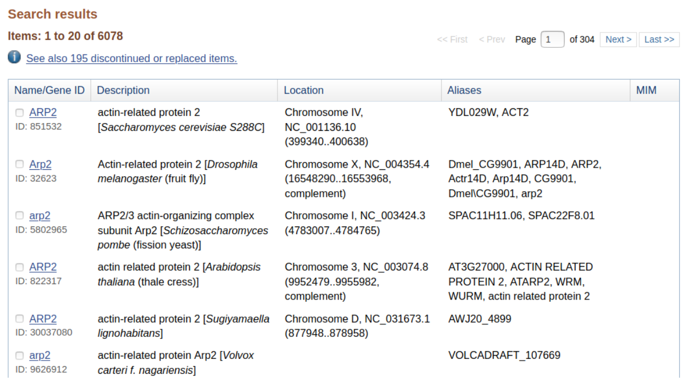

```{r setup, include=FALSE}
knitr::opts_chunk$set(
  echo = TRUE,        # Print the code
  eval = FALSE,       # Do not run command lines
  message = FALSE,    # Print messages
  prompt = FALSE,     # Do not display prompt
  comment = NA,       # No comments on this section
  warning = FALSE     # Display warnings
)
```

<style type="text/css">
details:hover { 
  cursor: pointer 
}
body {
  text-align: justify
}
.column-left{
  float: left;
  width: 47%;
  text-align: left;
}
.column-right{
  float: right;
  width: 47%;
  text-align: left;
}
</style>

# Forewords

## TLDR: R command lines

In this presentation, there will be screen captures for you to follow the 
lesson. There will also be every single R command lines. 
Do not take care of the command lines if you find them too challenging. 
Our goal here, is to understand the main mechanism of Differential 
Expression Analysis. R is just a tool.

Below are the libraries we need to perform this whole session:

```{r load_libraries, eval=TRUE, echo=TRUE}
base::library(package = "BiocParallel")    # Optionally multithread some steps
base::library(package = "DT")              # Display nice table in HTML
base::library(package = "ggplot2")         # Draw graphs and plots
base::library(package = "ggpubr")          # Draw nicer graphs
base::library(package = "rstatix")         # Base R statistics
base::library(package = "knitr")           # Build this presentation
base::library(package = "dplyr")           # Handle big tables
base::library(package = "Seurat")          # Handle SingleCell analyses
base::library(package = "SeuratObject")    # Handle SingleCell objects
base::library(package = "SingleCellExperiment") # Handle SingleCell file formats
base::library(package = "escape")          # Perform exploratory enrichment analysis
base::library(package = "clusterProfiler") # Perform GSEA analysis
base::library(package = "dittoSeq")        # Draw nice plots based on Seurat
base::library(package = "org.Mm.eg.db")    # Mouse genome annotation
base::library(package = "Cairo")           # Graphs library
base::library(package = "pathview")        # For the whole pathway graph
```

First, we load Seurat object:

```{r load_rds_tldr, eval=TRUE, echo=TRUE}
sobj <- base::readRDS(
  # Path to the RDS file
  file = "DEA_Scaled_Normalized_Filtered.RDS"
)
```

Then we launch enrichment exploration on all counts:

```{r escape_enrichment_tldr, eval=FALSE, echo=TRUE}
# Acquire gene sets
mh_hallmark <- escape::getGeneSets(
  species = "mus_musculus",
  library = "MH"
)

# Run enrichment
esobj <- escape::enrichIt(
  obj = sobj,
  gene.sets = mh_hallmark,
  cores = 3
)
```


## Purpose of this session

Up to now, we have:

1. Identified to which cell each sequenced reads come from
1. Identified to which gene each read come from
1. Identified possible bias in gene expression for each cell
1. Filtered and corrected these bias as well as we can
1. Found differentially expressed genes across multiple conditions
1. Annotated cell clusters

We would like to identify the functions of genes among several clusters,
or differentially expressed genes.

At the end of this session you will know:

1. What is gene set analysis
1. How to choose a Gene Set database
1. How to perform an enrichment analysis
1. How to read Gene set analysis results


# Select a database

## Gene: Jund

Let's search information about this gene on the web. For mice, one of the
best web-site for human is: [MGI](https://www.informatics.jax.org/).

If we search for the gene [Jund](https://www.informatics.jax.org/marker/MGI:96648),
we find the following:


As we click on "Phenotype reference", we can see that the MGI database can give
us [PubMeb IDs](https://pubmed.ncbi.nlm.nih.gov/) related to the gene Jund.
Below, on the same page, we can see regulation pathways, protein ontology,
gene interactions, etc.


We illustreate here, that GSEA does not only include gene-to-function, or
gene-to-pathway. They usually include many more information.

## Database types


There is a database for pretty much everything you might want. From
pharmacology, to regulatory objects, etc.

Our dataset contains gene expression. But the same methods can be applied to
other kind of datasets. _E.g._


Protein-protein interactions, drug interactions, SNP-interactions, etc.

Within R, you may find genome databases for a wide range of organisms:


## Some noticeable databases

```{r databases_example, eval=TRUE, echo=FALSE}
databases <- base::data.frame(
  MSigDB = c("https://www.gsea-msigdb.org/gsea/index.jsp"),
  KEGG = c("https://www.genome.jp/kegg/"),
  GO = c("https://www.geneontology.org/"),
  Ensembl = c("https://ftp.ensembl.org/pub/"),
  Panther = c("https://pantherdb.org/"),
  Jaspar = c("https://jaspar.genereg.net/"),
  GWAScat = c("https://www.ebi.ac.uk/gwas/"),
  BS_Genome = c("https://bioconductor.org/packages/release/BiocViews.html#___BSgenome"),
  MeSH = c("https://www.nlm.nih.gov/mesh/meshhome.html"),
  OrgDb = c("https://bioconductor.org/packages/release/BiocViews.html#___OrgDb"),
  NCG = c("http://www.network-cancer-genes.org/"),
  PharmGKB = c("https://www.pharmgkb.org/")
)

base::rownames(databases) <- c("Address")

DT::datatable(base::t(databases))
```

For this session, we are going to use MSigBD.

## How to perform GSEA

There are two main types of Gene Set Enrichment Analysis:
1. A blind search among all genes in order to identify pathways or mechanisms among cells.
1. A specific search through genes of interest

The first is called "Exploratory" analysis and starts on the `Seurat` object.

Many packages perform this kind of exploratory analysis, I chose to present 
[`escape`](https://bioconductor.org/packages/release/bioc/html/escape.html)
for its simple and intuitive usage.

What really matters is the GSEA method used in back-end. There are several
very well known methods: [`fgsea`](https://bioconductor.org/packages/release/bioc/html/fgsea.html),
[`gsva`](https://www.bioconductor.org/packages/release/bioc/html/GSVA.html),
[`DOSE`](https://www.bioconductor.org/packages/release/bioc/html/DOSE.html),
and the [`MSigDB`](https://www.gsea-msigdb.org/gsea/index.jsp)'s tool. While
choosing your favorite R package to perform GSEA, if that package uses one
of these methods, then you should not have odd questions through your 
publication process.

These methods are very alike, based on the same statistical resorts, and
suffer for the same limitations. Let's illustrate it with examples.

# Exploratory analysis

## Gene sets

Up to now, we already define what's a _gene set_: a group of genes of interest.
We also know these king of relationships are stored in [`GMT`](https://software.broadinstitute.org/cancer/software/gsea/wiki/index.php/Data_formats#GMT:_Gene_Matrix_Transposed_file_format_.28.2A.gmt.29)
files or [`TSV`](https://fr.wikipedia.org/wiki/Tabulation-separated_values) 
files.

Since the beginning of our week, we've been working with R, and the question 
naturally comes: how to make/use gene sets in R?

### Create your own gene set

Very easily. We need a "named [list](https://www.rdocumentation.org/packages/base/versions/3.6.2/topics/list)
of [vectors](https://www.rdocumentation.org/packages/base/versions/3.6.2/topics/c)",
all coming from `base` R package.

```{r named_list_vectors, eval=TRUE, echo=TRUE}
# We use the function list from base package
pathways <- base::list(
  # We use the function `c` from base package
  proliferation = base::c(
    "Ifng",	"Kras",	"Mgat5",	
    "Prf1",	"Trem1",	"Trp53"
  ),
  growth = base::c(
    "Cdkn2a", "Fos", "Ifnb1",
    "Rras", "Apc", "Sell"
  )
)
utils::head(pathways)
```

This method is very useful when you want to compare your cells toward
unpublished data, gene sets from an article not sourced in official databases,
etc.

### Load a gene set from disk

We can also load a GMT file from a file. This is very usefull when we
expect both known and new pathways to be tested, or known pathways that 
should be updated.

This is done  with the function [`read.gmt`](https://rdrr.io/bioc/clusterProfiler/man/read-gmt.html)
from the [`clusterProfiler`](https://bioconductor.org/packages/release/bioc/html/clusterProfiler.html)
package.

```{r get_gene_sets_file, eval=TRUE, echo=TRUE}
pathways <- clusterProfiler::read.gmt(
  gmtfile = "m5.mpt.v2023.1.Mm.symbols.gmt"
)
pathways <- BiocGenerics::lapply(
  S4Vectors::split(
    pathways[-1], pathways$term
  ),
  function(x) x[x != ""]
)
utils::head(pathways)
```

### Load a gene set from the web

We can also get pathways from the web using the function [`getGeneSets`](https://rdrr.io/bioc/escape/man/getGeneSets.html)
from package [`escape`](https://rdrr.io/bioc/escape/).

```{r get_gene_sets_msigdb, eval=TRUE, echo=TRUE}
# Pay attention to the genome name, it's case sensitive
# and follows MSigDB naming scheme
pathways <- escape::getGeneSets(
  species = "Mus musculus", 
  library = "H"
)
utils::head(pathways)
```

## Run exploratory analysis

Let's time to practice. Use the function [`enrichIt`](https://rdrr.io/github/ncborcherding/escape/man/enrichIt.html)
from the package [`escape`](https://rdrr.io/bioc/escape/) in order to perform
GSEA on your [`Seurat`]()
object. Perform the analysis on cell cycle phase if possible. 
Save the results in a  variable, for example `sobj_enrich`.

<details>

<summary>Answer</summary>

It is not possible to specify what group we are considering. GSEA/Enrichment 
analysis do not perform any differential analysis.

```{r escape_enrich, eval=TRUE, echo=TRUE}
# Save in a variable called `sobj_enrich`
# the result of the function `enrichIt` from package `escape`
sobj_enrich <- escape::enrichIt(
  obj = sobj, # variable pointing to the seurat object
  gene.sets = pathways # variable pointing to gene sets
)
```

If you have reserved more than one core, this function can be multi-threaded,
making it faster !

</details>
<br />

What happened ? Let's print results with the function [`head`](https://www.rdocumentation.org/packages/utils/versions/3.6.2/topics/head)
from [`utils`](https://www.rdocumentation.org/packages/utils/versions/3.6.2)
package. Here we select only two columns from the list of available ones,
since there is a lot of them. We choose naturally two cell-cycle related
pathways, since that's what we are interested into.

```{r display_enrich_esscape_results_cc, eval=TRUE, echo=TRUE}
# We display the first 5 rows using the function `head` from package `utils`
utils::head(
  # on two of the columns of the enrichment result.
  # these columns were selected with function `c` of `base` package.
  sobj_enrich[, base::c("HALLMARK_G2M_CHECKPOINT", "HALLMARK_E2F_TARGETS")]
)
```

Just like DEA results, let's add the enrichment analysis results into the
`Seurat` object, using the function [`AddMetaData`](https://www.rdocumentation.org/packages/Seurat/versions/3.1.4/topics/AddMetaData).

```{r add_escape_to_seurat, eval=TRUE, echo=TRUE}
# we reassign the variable `sobj` which contained the Seurat object
# with the result of the function `AddMetaData` of `Seurat` package
# i now contains the previous Seurat object + escape enrichment results
sobj <- Seurat::AddMetaData(
  # We provide the variable pointing to seurat object
  object=sobj,
  # We provide the variable pointing to the enrichment results
  metadata=sobj_enrich
)
```

## Visualize results

Now we'd like to display nice graphs. Here, we use the [`dittoSeq`](https://bioconductor.org/packages/release/bioc/vignettes/dittoSeq/inst/doc/dittoSeq.html)
package for these images, but there are many other packages designed
to perform nice graphs from Seurat objects.

Let's start with a general heatmaps to understand our results. We have
a function called [`dittoHeatmap`](https://rdrr.io/bioc/dittoSeq/man/dittoHeatmap.html)
designed for that.

```{r general_enrich_escape_heatmap, eval=TRUE, echo=TRUE, fig.height=10, fig.width=15}
# We use the function `dittoHeatmap` from `dittoSeq` package
dittoSeq::dittoHeatmap(
  # We provide the variable pointing to Seurat object
  object=sobj,
  # We tell the function, we do not want to plot genes
  gene = NULL,
  # We tell the function, we want to plot enrichment results.
  # This is done with the function `names` from `base` package
  # over the variable pointing to the escape enrichment results.
  metas = base::names(sobj_enrich),
  # Remember, we are interested in cell cycle phases
  annot.by = "cc_seurat.Phase",
  # This package can perform clusterization of cols
  cluster_cols = TRUE,
  # Use complet heatmap rather that pheatmap
  # for additional parameters and graph size
  complex = TRUE
)
```

There are some other cell-cycle related terms. We can focus on them with the
function [`multi_dittoPlot`](https://rdrr.io/bioc/dittoSeq/man/multi_dittoPlot.html)
from [`dittoSeq`](https://rdrr.io/bioc/dittoSeq/) package:

```{r violinplot_dittoseq_ccphase_eclipse, eval=TRUE, echo=TRUE, fig.width=15}
# We use the function `multi_dittoPlot` from package `dittoSeq`
dittoSeq::multi_dittoPlot(
  # We provide variable pointing to seurat object
  object = sobj,
  # We select the pathways of interest
  vars = base::c(
    "HALLMARK_G2M_CHECKPOINT", 
    "HALLMARK_E2F_TARGETS",
    "HALLMARK_MITOTIC_SPINDLE"
  ),
  # We color samples with cell cycle phase
  group.by = "cc_seurat.Phase",
  # We select the plot types
  plots = base::c("jutter", "vlnplot", "boxplot"),
  # We change y axis name
  ylab = "Enrichment score",
  # We make the graph nice-looking with GGplot2
  theme = theme_classic()
)
```

# On purpose analysis

In order to understand what happened, where do these results come from,
we need to go step by step and perform both enrichment and GSE analysis
manually.

In general, the exploratory method is never used on a raw Seurat object,
we usually filter this object in order to search pathways that are related to
our biological question.

With the previous method, what ever our biological question was, the cell
cycle phase was one of the top gene expression drivers.

## Gene Names and Gene identifiers

Let's search information about the gene `ARP2`.



So, this gene exists in multiple organisms. Thanks, we know we are working
on mice, and we told gene set retriever function to consider 'mouse' datasets.


So in the Human genome, ARP2 refers to multiple genes through the alias names.
When we searched for gene sets with [`escape`], we did not perform any 
disambiguation.

The same with _arabidopsis thaliana_, ARP2 can refer to actin related protein,
or a root development protein.

In _mus musculus_, ARP2 refers to an actin related protein on chromosome 11, or
a subunit adaptor protein on chromosome 5.

We now understand that `escape` analysis may be completely wrong since it used
human-intelligible gene names. These names include synonyms, homonyms, within
a single organism, or between multiple ones.

We need to use unique identifiers. These identifiers are called gene identifiers
and we usually consider [`EnsemblID`](https://ftp.ensembl.org/pub/release-60/gtf/mus_musculus/)
or [`EntrezID`](https://www.ncbi.nlm.nih.gov/Web/Search/entrezfs.html).

For example:

1. ARP2 from chromosome 11 equals [`ENSMUSG00000020152`](http://www.ensembl.org/Mus_musculus/Gene/Summary?g=ENSMUSG00000020152;r=11:20012304-20062913) at Ensembl.
1. ARP2 from chromosome 5 equals [`ENSMUSG00000019518`](http://www.ensembl.org/Mus_musculus/Gene/Summary?g=ENSMUSG00000019518;r=5:138170264-138178691) at Ensembl.

These identifiers are very unpleasant to use for human beings. On monday meeting,
please talk about `ARP2` and not `ENSMUSG00000020152`. However, when machines
are working, please given them `EnsemblID` or `EntrezID`.

Let's translate all gene identifiers and evaluate possible number of errors
in escape analysis.

First, let's load the DEA results based on Wilcoxon analysis:

```{r get_de_gene_names, eval=TRUE, echo=TRUE}
# We load our differential expression analysis result
# using the function `readRDS` from `base` package
sobj_wilcox <- base::readRDS(file = "sobj_wilcox.RDS")
# Copy gene names in a column it makes the future operation easier
sobj_wilcox$SYMBOL <- base::rownames(sobj_wilcox)
```

Then, we use the function [`bitr`](https://rdrr.io/bioc/clusterProfiler/man/bitr.html)
(standing for _biological translator_) from the package [`clusterProfiler`](https://bioconductor.org/packages/release/bioc/html/clusterProfiler.html).

```{r cp_bitr_wilcox, eval=TRUE, echo=TRUE}
# We store the result of `bitr` function
# from `clusterProfiler` package
# in a variable called `annotation`
annotation <- clusterProfiler::bitr(
  # We provide the variable pointing to gene names
  geneID = base::rownames(sobj_wilcox),
  # We tell the translator to which gene identifiers
  # translation must be done
  toType = base::c("ENTREZID", "ENSEMBL"),
  # We tell the translator which type of gene name we have
  fromType = "SYMBOL",
  # We provide mmu database
  OrgDb = org.Mm.eg.db
)
```

```{r disply_annotation, eval=TRUE, echo=FALSE}
DT::datatable(annotation)
```

Now we would like to have these annotation alongside with adjusted pvalues
and fold change information. In order to do so, we use the function [`merge`](https://rdrr.io/r/base/merge.html)
from [`base`](https://rdrr.io/r/) package. Not from [`Seurat`](https://rdrr.io/github/atakanekiz/Seurat3.0/man/merge.Seurat.html)
package ! This is used to merger Seurat objects, but we have dataframes here!

```{r merge_annotation_wilcox, eval=TRUE, echo=TRUE}
# We filter these results on **ADJUSTED** pvalue
sobj_wilcox <- sobj_wilcox[sobj_wilcox$p_val_adj <= 0.05, ]
# Use the function `merge` from package `base` in order
# to add annotation to wixocon DEA result.
sobj_wilcox <- base::merge(
  # Variable pointing to the wilcoxon results
  x = sobj_wilcox,
  # Variable pointing to the annotation results
  y = annotation,
  # We tell how to merge sobj_wilcox
  by.x = "SYMBOL",
  # We tell how to merge annotation
  by.y = "SYMBOL"
)
```

```{r display_sobj_wilcox, eval=TRUE, echo=FALSE}
DT::datatable(sobj_wilcox)
```

## Restricted sed of genes

As we perform the analysis, we are going to provide a numeric 
variable to the GSEA/Enrichment.

We have the following columns:

1. `p_val`: Ignore this column. Always ignore raw p-values. Look at corrected ones, and if they are missing, then compute them.
1. `avg_log2FC`: Average Log2(FoldChange). Illustrates how much a gene is differentially expessed between samples in each condition.
1. `pct.1`: Percent of cells with gene expression in condition one, here in "G1" phase.
1. `pct.2`: Percent of cells with gene expression in condition two, here in "S" phase.
1. `p_val_adj`: The confidence we have in the result. The closer to 0, the lesser is the risk of error.

Is it a good idea to use `p_val` ? What are the consequences ?

<details>

<summary>Answer</summary>

No. Never. Never ever use raw P-Value. It is never a good idea.

</details>
<br />

Is it a good idea to use `avg_log2FC` ? What are the consequences ?

<details>

<summary>Answer</summary>

It is a good idea, we could answer biological questions like : "Considering
differentially expressed genes, what are the pathways with highest expression
change ?"

</details>
<br />

Is it a good idea to use `pct.1` ? What are the consequences ?

<details>

<summary>Answer</summary>

It is a good idea, we could answer biological questions like : "Considering
differentially expressed genes, what are the expression of genes in pathway
XXX in the first condition ?"

</details>
<br />

Is it a good idea to use `pct.2` ? What are the consequences ?

<details>

<summary>Answer</summary>

It is a good idea, we could answer biological questions like : "Considering
differentially expressed genes, what are the expression of genes in pathway
XXX in the second condition ?"

</details>
<br />

Is it a good idea to use `p_val_adj` ? What are the consequences ?

<details>

<summary>Answer</summary>

It is a good idea, we could answer biological questions like : "Which pathways
are differentially expressed with highest confidence interval ?"

But in order to perform surch test, use `-log10(Adjusted P-Value)` instead of
the raw adjusted p-value. Remember, 0 is a good confidence interval, and 1 a
bad one. So we need the values close to 0 to be highly positive.

</details>
<br />

## Enrichment vs GSEA

Previously, we used a function called `enrichIt`. We talked about enrichment
analysis, yet this talk is called GSEA.

This is due to the fact that both techniques exists and are different.

Enrichment tests a list of genes. Their expression, confidence
interval, etc. Nothing else matters than their name.

For each cell, `enrichIt` removes zeros and tests the list of remaining genes.
Their expression does not matter. Their order in the gene list does not matter.
Their impact on the pathway does not matter. Their differential expression
status does not matter.

Behind the scenes, it's a very simple tests answering the following question: 
"Among expressed genes, what are the odds that it belongs to the pathway XXX?"

We can do enrichment tests on our wilxoc results, using the function [`enrichGO`](https://rdrr.io/bioc/clusterProfiler/man/enrichGO.html)
from the package [`clusterProfiler`](https://rdrr.io/bioc/clusterProfiler/):

```{r clusterprofiler_enrichment, eval=TRUE, echo=TRUE}
# We store the result of the function `enrichGO` from package `clusterProfiler`
# in the function `enrich_wilcox`
enrich_wilcox <- clusterProfiler::enrichGO(
  # We provide the list of gene identifiers to test
  gene = sobj_wilcox$ENTREZID,
  # We provide the complete list of genes we quantified
  universe = annotation$ENTREZID,
  # We provide mouse annotations
  OrgDb = org.Mm.eg.db,
  # We tell the function that we use entrez-identifiers
  keyType = "ENTREZID",
  # We search results on Biological Process"
  ont = "BP",
  # We want all the results
  pvalueCutoff = 1,
  # We are humans, we wan human-readable gene names
  readable = TRUE
)
```

```{r display_enrich_wilcox, eval=TRUE, echo=FALSE}
DT::datatable(enrich_wilcox@result)
```

We can have a look at pathways including the word `G2M`, using the functions
[`with`](https://rdrr.io/r/base/with.html) and [`grepl`](https://rdrr.io/r/base/grep.html)
from `base` package.

```{r grep_g2m_enrich_cp, eval=TRUE, echo=TRUE}
# Get the result table
results_enrich_wilcox <- enrich_wilcox@result

# We store the result of the line selection
# in a variable called `g2m_enrich`
g2m_enrich <- results_enrich_wilcox[
  # We select rows containing a given information
  # using the function `with` from `base` package
  base::with(
    # We provide the variable pointing to enrichment results
    data = results_enrich_wilcox,
    # We provide the term we are searching and the column in which
    # the term should be searched
    base::grepl("g2m", Description)
  ), # Do not forget his comma, since we are filtering a dataframe on rows
]
```

```{r display_enrich_G2M_wilcox, eval=TRUE, echo=FALSE}
DT::datatable(g2m_enrich)
```

GSEA tests the gene names, and uses the numeric value associated with
that gene in order to weight the results. It tests the name, the rank,
and the numeric value.

First, we need to create a named list of gene weights. For this example,
we use the average fold change as weights.

```{r gseago_wilcox_prepare_gene_list, eval=TRUE, echo=TRUE}
# We extract gene average fold change
gene_list <- sobj_wilcox$avg_log2FC
# We extract genes Entrez ID
base::names(gene_list) <- sobj_wilcox$ENTREZID
# We sort that list deacreasingly
gene_list <- base::sort(gene_list, decreasing=TRUE)

# Check the results with the function `head` from `utils` package
utils::head(gene_list)
```

And now, we can run the [`gseGO`](https://rdrr.io/bioc/clusterProfiler/man/gseGO.html)
from [`clusterProfiler`](https://rdrr.io/bioc/clusterProfiler/). You'll see,
the interfacce is almost the same as for the enrichment:

```{r gseago_wilcox_run, eval=TRUE, echo=TRUE}
# We use the function `gseGO` from the package `clusterProfiler`
# and store the result in a variable called `gsea_wilcox`
gsea_wilcox <- clusterProfiler::gseGO(
  # We provide the variable pointing to named gene list
  geneList = gene_list,
  # We provide mouse annotations
  OrgDb = org.Mm.eg.db,
  # We tell the function that we use entrez-identifiers
  keyType = "ENTREZID",
  # We search results on Biological Process"
  ont = "BP",
  # We want all the results
  pvalueCutoff = 1
)
```

```{r display_gsea_wilcox, eval=TRUE, echo=FALSE}
DT::datatable(gsea_wilcox@result)
```

Just like before, we can have a look at pathways including the word 
`G2M`, using the functions [`with`](https://rdrr.io/r/base/with.html) 
and [`grepl`](https://rdrr.io/r/base/grep.html) from `base` package.

```{r grep_g2m_gsego_cp, eval=TRUE, echo=TRUE}
# Get the result table
results_gse_wilcox <- enrich_wilcox@result

# We store the result of the line selection
# in a variable called `g2m_enrich`
g2m_gse <- results_gse_wilcox[
  # We select rows containing a given information
  # using the function `with` from `base` package
  base::with(
    # We provide the variable pointing to enrichment results
    data = results_gse_wilcox,
    # We provide the term we are searching and the column in which
    # the term should be searched
    base::grepl("g2m", Description)
  ), # Do not forget his comma, since we are filtering a dataframe on rows !
]

# Check the results with the function `head` from `utils` package
utils::head(g2m_gse)
```

```{r display_gse_G2M_wilcox, eval=TRUE, echo=FALSE}
DT::datatable(g2m_gse)
```

## Visualize results

This makes a lot of tables. Let's make a lot of graphs !

We can use the function [`barplot`](https://rdrr.io/bioc/enrichplot/man/barplot.enrichResult.html)
from package [`graphics`](https://rdrr.io/bioc/graphics/) ; and not the ones
from any other package, or it won't work !

```{r barplot_ego, eval=TRUE, echo=TRUE, fig.height=10}
# We use the function `barplot` from package `enrichplot`
graphics::barplot(
  # We provide the variable pointing to enrichment results
  height = enrich_wilcox,
  # We display the best 15 results
  howCategory=15
)
```

We can also use the function [`ditplot`](https://rdrr.io/bioc/enrichplot/man/barplot.enrichResult.html)
from package [`enrichplot`](https://rdrr.io/bioc/enrichplot/) ; and not the ones
from any other package, or it won't work ! Note the change in the input
parameter name:

```{r dotplot_ego, eval=TRUE, echo=TRUE, fig.height=10}
# We use the function `barplot` from package `enrichplot`
enrichplot::dotplot(
  # We provide the variable pointing to enrichment results
  object = enrich_wilcox,
  # We display the best 15 results
  showCategory=15
)
```

We can display traditional GSEA graph using [`gseaplot2`](https://rdrr.io/bioc/enrichplot/man/gseaplot2.html)
from package [`enrichplot`](https://rdrr.io/bioc/enrichplot/):

```{r gseaplot, eval=TRUE, echo=TRUE}
# We use the function `barplot` from package `enrichplot`
enrichplot::gseaplot2(
  # We provide the variable pointing to enrichment results
  x = gsea_wilcox,
  # We display the best result
  geneSetID = 1
)
```

With GSEA, you dot not test if a pathway is up or down regulated.
A pathway contains both enhancers and suppressors genes. An
up-regulation of enhancer genes and a down-regulation of suppressor genes
will lead to a “bad” enrichment score. However, this will lead to a strong
change in your pathway activity!

If your favorite pathway does not have a “good enrichment score”, it does
not mean that pathway is not affected.

The [`heatplot`](https://rdrr.io/bioc/enrichplot/man/heatplot.html) displays
both a heatmap of enriched pathways *and* their genes in commons:

```{r heatplot_gsea, echo=TRUE, eval=TRUE, fig.height=10}
# We use the function `heatplot` from `enrichplot` package
enrichplot::heatplot(
  # We probide the variable pointing to GSEA results
  x = gsea_wilcox,
  # We show the 15 best results
  showCategory = 15,
  # We color according to FoldChange
  foldChange = gene_list
)
```

The genes in common between multiple gene sets are also visible through an
uspet plot:

```{r upset_gsea, echo=TRUE, eval=TRUE, fig.height=10}
# We use the function `upsetplot` from `enrichplot` package
enrichplot::upsetplot(
  # We probide the variable pointing to GSEA results
  x = gsea_wilcox,
  # We show the 10 best results
  n = 10
)
```

Finally, we can display whole pathways using KEGG database:

```{r pathview_gene_list, eval=FALSE, echo=TRUE}
# We use the function pathview from pathview package
pathview::pathview(
  gene.data = gene_list, # Our gene list
  pathway.id = "mmu04110", # Our pathway
  species = "mmu", # Our organism
  # The color limits
  limit = list(gene=max(abs(gene_list))),
  gene.idtype = "ENTREZID" # The genes identifiers
)
```


## Session Info

This list of all packages used while you work should be included
in each en every R presentation:

```{r session_info, eval=TRUE, echo=TRUE}
utils::sessionInfo()
```