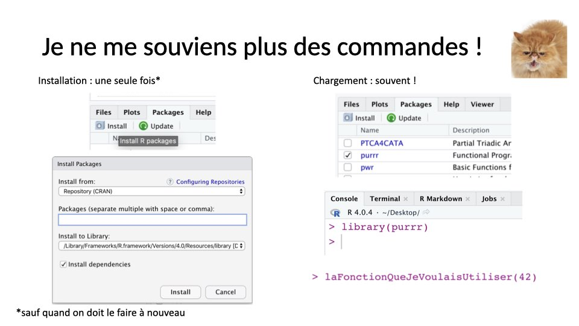

```{r setup, include = FALSE}
knitr::opts_chunk$set(
  collapse = TRUE,
  comment = "#>",
  echo = TRUE
)
```


## 

{width=100%}

## 

{width=100%}

## 

{width=100%}

## 

{width=100%}

## 

{width=100%}

## 

{width=100%}

## 

{width=100%}

## 

{width=100%}

## 

{width=100%}

## 

{width=100%}

## Comment installer des packages depuis... {.smaller}


  * Bioconductor ?
    1. Installer le package `BiocManager` depuis le CRAN
    2. Exécuter la commande `BiocManager::install("le_nom_du_package")`
  * GitHub ?
    1. Installer `remotes`
    2. Exécuter la commande `remotes::install_github("username/repository")`.
  * Du code source ?
    1. Mettre le `source.tar.gz` dans son dossier de travail...
    2. ou l'inverse.
    3. Exécuter la commande `install.package("source.tar.gz", repos = NULL, type = "source")`.

# Exercices

