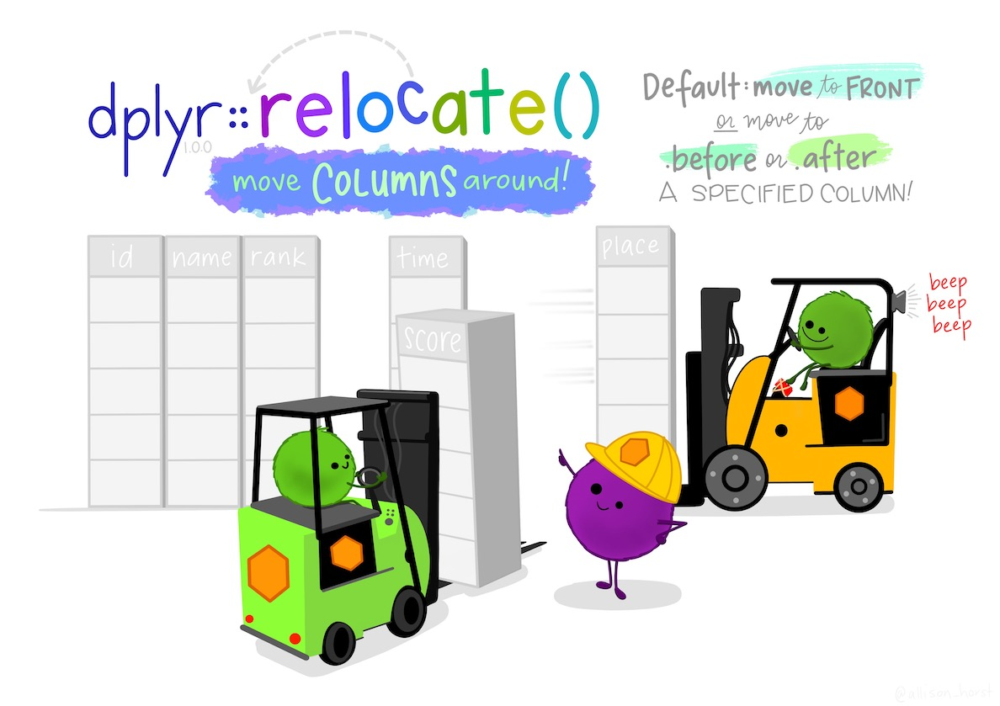
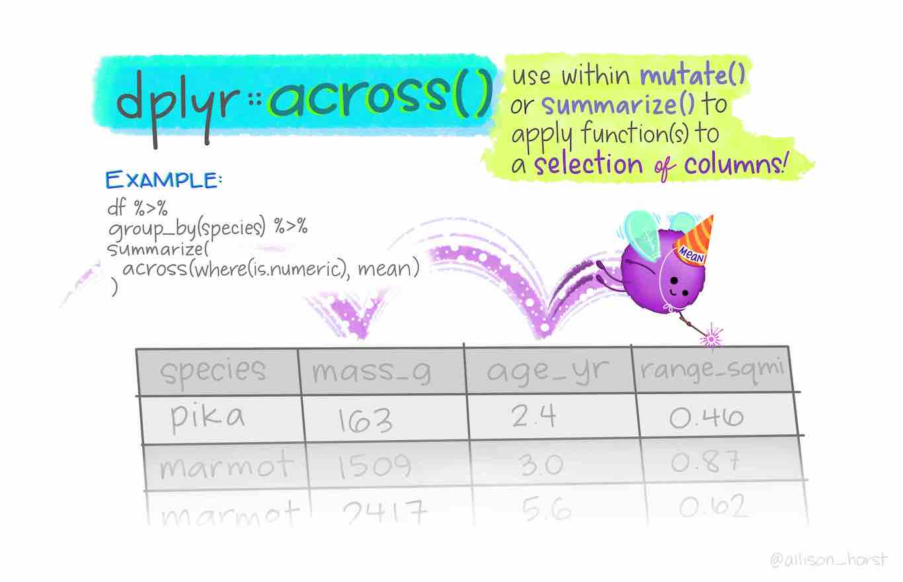
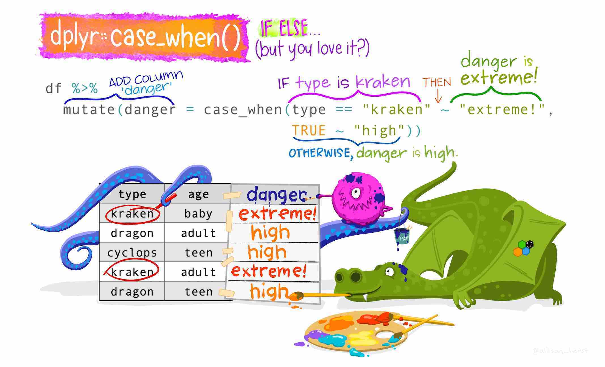

<style>
.forceBreak { -webkit-column-break-after: always; break-after: column; }
</style>

```{r setup, include = FALSE}
knitr::opts_chunk$set(
  collapse = TRUE,
  comment = "#>",
  echo = TRUE
)
```

## Avant toutes choses

  * On crée un projet
  * On crée un script
  * On charge les données `fruits`
  
```{r fruits}
library(dplyr)
fruits <- readxl::read_excel("fruits.xlsx")
```

## Comment créer une nouvelle colonne ?

Par sécurité : je crée une copie de mes données

```{r fruits2}
fruits2 <- fruits
```

On utilise le plus souvent l'opérateur `$` : 

```{r addSucresRatio}
fruits2$Sucres_ratio <- fruits2$Sucres / 100
```

## Le principe de l'ajout de colonne

Sur un tableau `tab`, je souhaite ajouter la colonne `A` : 

```
tab$A <- nouvelles_valeurs
```

Attention : 

  * Si la colonne `A` existe déjà, les valeurs sont écrasée
  * Si les nouvelles valeurs ne sont pas de la bonne longueur, elles sont recyclées
  * Sans rien dire pour les `data.frame`, avec une erreur pour les `tibble`
  
## Exemple d'erreur

```{r fruits2mod, eval = FALSE}
fruits2$recyclage <- c(0, 1)
```

```
Erreur : Assigned data `c(0, 1)` must be compatible with existing data.
x Existing data has 51 rows.
x Assigned data has 2 rows.
ℹ Only vectors of size 1 are recycled.
Run `rlang::last_error()` to see where the error occurred.
```

## Exemple d'horreur !

```{r mtcars recyclage}
mtcars2 <- mtcars
mtcars2$recyclage <- c(0, 1)
mtcars2$recyclage
```

# Le tydiverse

## Enchaîner les commandes avec magrittr {.columns-2}

 * On utilise un opérateur 
 
<div class="centered">
`%>%`
</div>
  
 * Avant : `f(g(x))` 
 * Après :  `g(x) %>% f()`

{width=30%}

## Exemple {.columns-2 .bigger}

```{r, out.width="70%", fig.align='center', fig.width=3, fig.height=4}
## Histogramme
hist(fruits$Energie)
```

<p class="forceBreak"></p>

```{r, out.width="70%", fig.align='center', message=FALSE, fig.width=3, fig.height=4}
library(magrittr)
fruits$Energie %>% hist()
```

## Le tidyverse {.bigger}

<div class="centered">
{width=70%}
</div>

## Charger les packages

Charger le package `dplyr`...

```{r charger dplyr, message = FALSE}
library(dplyr) # ou require(dplyr)
```

Ou bien charger `tidyverse`...

```{r charger tidyverse, eval = FALSE}
library(tidyverse)
```

... mais cela chargera d'autres packages en plus

## Le format "tibble" {.smaller}

Les données sont au format "tibble" : c'est comme des "data-frames" mais en mieux !

```{r fruitibble}
fruits
```

## Les fonctions de dplyr {.smaller}

Nous allons voir ensemble quelques fonctions très pratiques de la librairie `dplyr`.

 # | Fonction (US) | Fonction (UK) | Description
---|:-------------:|:-------------:|:----------
 1 |   `mutate`    |   `mutate`    | Créer ou modifier des colonnes
 2 |   `select`    |   `select`    | Sélectionner des colonnes
 3 |   `relocate`  |   `relocate`  | Ré-arranger des colonnes
 4 |   `arrange`   |   `arrange`   | Trier les lignes
 5 |   `filter`    |   `filter`    | Sélectionner des lignes
 6 |   `group_by`  |   `group_by`  | Grouper des lignes
 7 |   `summarize` |   `summarise` | Résumer des groupes
 8 |   `count`     |   `count`     | Compter

## 

{width=100%}

## Créer ou modifier des colonnes {.columns-2 .smaller}


Avec la fonction `mutate`.

```{r mutate1}
fruits2 <- fruits %>% 
  mutate(Sucres_ratio = Sucres / 100)

head(fruits2[, "Sucres_ratio"])
```


Avec les fonctions classiques.

```{r mutate_classic}
fruits2 <- fruits
fruits2$Sucres_ratio <- 
  fruits2$Sucres / 100
head(fruits2[, "Sucres_ratio"])
```

## Sélectionner des colonnes {.columns-2 }

Avec la fonction `select`.

```{r select, eval = FALSE}
fruits %>% 
  select(
    Energie,
    Sucres,
    Lipides,
    Proteines)
```

Avec les fonctions classiques.

```{r select_classic, eval = FALSE}
fruits[, 
  c(
    "Energie",
    "Sucres",
    "Lipides",
    "Proteines")]
```

## Sélectionner des colonnes - bis

la fonction `select` est très versatile !

```{r selectbis, eval = FALSE}
fruits %>% 
  select(Energie:Proteines, - Eau)
```

On peut sélectionner des plages entières de colonnes sur la base de leurs noms, en enlever avec le `-`, combiner tout cela avec la fonction `c()`... ou pas !

**Attention, la flexibilité a un coût !**

## Trier des lignes {.columns-2 .smaller}

Avec les fonctions `arrange` et `desc`.

```{r arrange}
fruits %>% 
  select(Energie, Sucres, Fibres) %>%
  arrange(desc(Fibres))
```

<p class="forceBreak"></p>

Avec les fonctions classiques 

```{r arrange_classic}
fruits[
  order(fruits$Fibres, decreasing = TRUE),
  c("Energie", "Sucres", "Fibres")]
```


## Sélectionner des lignes {.columns-2 .smaller}

Avec la fonction `filter`.

```{r filter}
fruits %>% 
  filter(Sucres > 60)
```

<p class="forceBreak"></p>

Avec les fonctions classiques.

```{r filter_classic}
fruits[fruits$Sucres > 60, ]
```

## Sélectionner des plages de lignes {.columns-2 .smaller}

Avec la fonction `slice`.

```{r slice}
fruits %>% 
  slice(3:10)
```

Avec les fonctions classiques.

```{r slice_classic}
fruits[3:10, ]
```


## Grouper des lignes {.smaller}

Avec la fonction `group_by` : 

```{r group}
fruits %>% group_by(groupe)
```

Les données sont prêtes à être "traitées" groupe par groupe.
PS : L'opération `ungroup()` permet d'enlever les groupes.

## Calculer une moyenne {.columns-2 .smaller}

Avec la fonction `summarize`.

```{r summarize}
fruits %>% 
  group_by(groupe) %>%
  summarize(SucreMoyen = mean(Sucres))
```

Avec les fonctions classiques.

```{r summarize_classic}
aggregate(fruits$Sucres, 
          by = list(fruits$groupe), 
          FUN = mean)
```

## Exercice(s)

Calculer l'énergie moyenne, la teneur en sucres médiane et le maximum de la teneur en Fibres par groupe de fruits et trier le tout par ordre décroissant du maximum de la teneur en Fibres !

## Deux autres fonctions pour sélectionner ou transformer des colonnes {.columns-2 .center}

----------------- -----------  -------------------
                  Sélectionne  Ne sélectionne pas
Ne transforme pas `select`     `rename`
Peut transformer  `transmute`  `mutate`
----------------- -----------  -------------------

<p class="forceBreak"></p>

{width=100%}

## Compter {.columns-2}

Avec le "verbe" `count` : 

```{r count}
fruits %>% count(groupe)
```

<p class="forceBreak"></p>

On peut ensuite ranger les résultats par ordre décroissant : 

```{r countArrange}
fruits %>%
  count(groupe) %>%
  arrange(desc(n))
```

## Compter deux choses à la fois

Par exemple, compter dans chaque groupe le nombre de fruits dont la teneur en Vitamine C est inférieure ou supérieure à 50 : 

```{r compte2choses}
fruits %>%
  mutate(VitCqual = cut(VitamineC, c(0, 50, 100))) %>%
  count(groupe, VitCqual, name = "N")
```

## Super bonus : la table de contingence

Ce n'est pas facile, il vaut mieux utiliser la fonction `table` :

```{r contingence, message=FALSE}
library(tidyr)
fruits %>%
  mutate(VitCqual = cut(VitamineC, c(0, 50, 100))) %>%
  count(groupe, VitCqual, name = "N") %>%
  pivot_wider(id_cols = groupe, 
              names_from = VitCqual, 
              values_from = N)
```

# D'autres fonctions utiles en bonus  {data-background=#ffffff}

Avec les illustrations de Allison Horst (https://www.allisonhorst.com/)

##

{width=100%}   

##

{width=100%}

##

{width=100%}   


# [Il y a tellement d'autres fonctions !](https://www.rstudio.com/wp-content/uploads/2015/02/data-wrangling-cheatsheet.pdf) {data-background=#ffffff}

{width=50%}
