<style>
.forceBreak { -webkit-column-break-after: always; break-after: column; }
</style>


```{r setup, include = FALSE}
knitr::opts_chunk$set(
  collapse = TRUE,
  comment = "#>",
  echo = TRUE
)
library(dplyr)
library(magrittr)
```

## Avant toutes choses

Nous aurons besoin du package `ggplot2` :

 * Vérifier que le package `ggplot2` est bien installé
 * Si non, l'installer, puis le charger

```{r ggplot2}
library(ggplot2)
```

Nous allons également avoir besoin des données fruits : 

```{r data}
fruits <- readxl::read_excel("fruits.xlsx")
```

## Bien choisir sa représentation graphique {.centered}

From Data to Viz : https://www.data-to-viz.com/

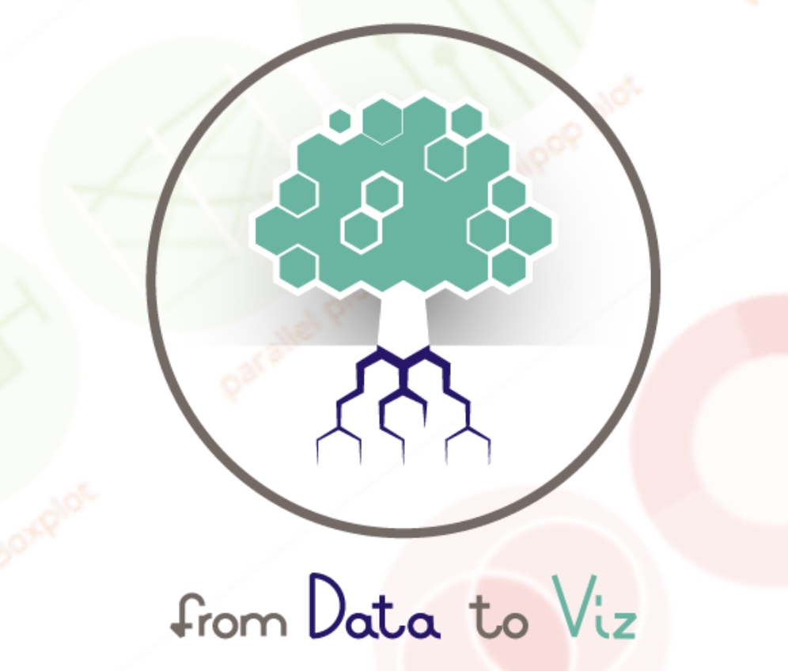{width=50%}

## Un échantillon de ce qu'il est possible de faire avec ggplot2 {.center}

{width=100%}

# Diagramme en bâtons

## Rappel : la fonction barplot

La fonction de base pour les diagrammes en bâtons est `barplot` : 

```{r barplot}
barplot(table(fruits$groupe))
```

Avec des couleurs :

```{r barplot_couleur}
barplot(table(fruits$groupe), col = 1:4)
```

## La fonction geom_bar

```{r geom_bar_stop, fig.width = 5, fig.height = 4}
ggplot(data = fruits, aes(x = groupe, fill = groupe)) +
  geom_bar()
```

<span style="color:red">STOP !</span>

## Décomposition de la commande

 * `ggplot` : création d'un canevas vide dans on va dessiner le(s) graphe(s)
 * `aes` : déclaration des paramètres esthétiques du graphes (position horizontale, verticale, couleur épaisseur, forme, transparence etc...)
 * `geom_bar` : utilisation d'une géométrie 

## Le canevas {.center}

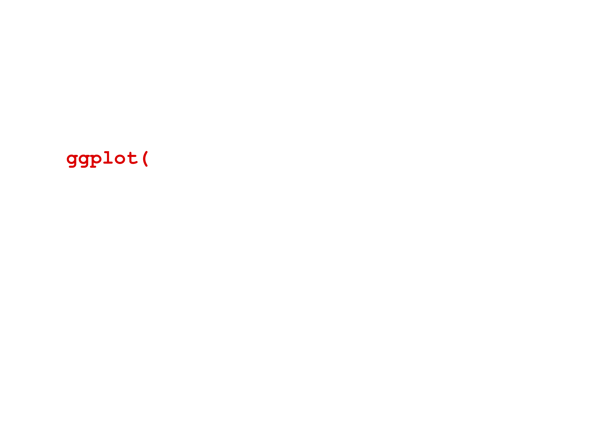{width=100%}


## Les données {.center}

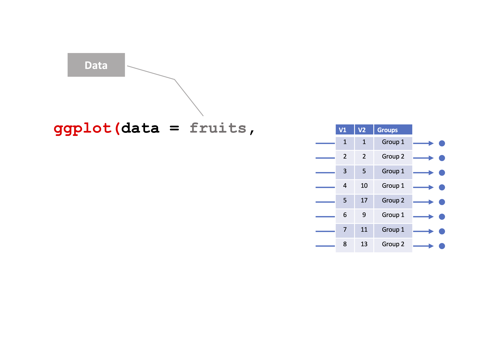{width=100%}

## Les paramètres esthétiques {.center}

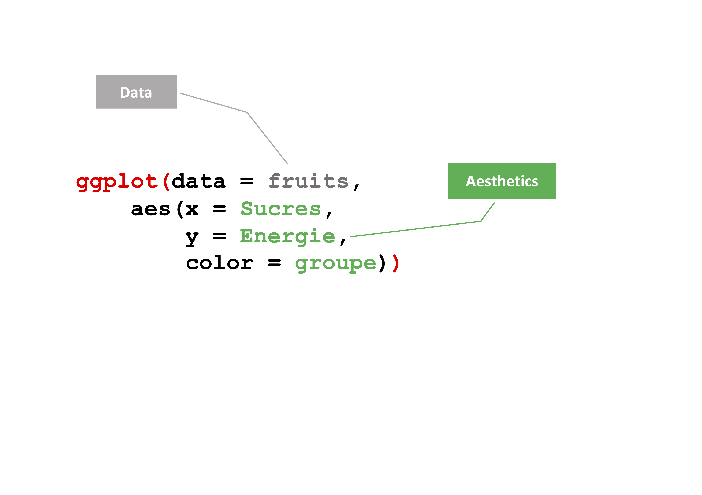{width=100%}

## Les géométries {.center}

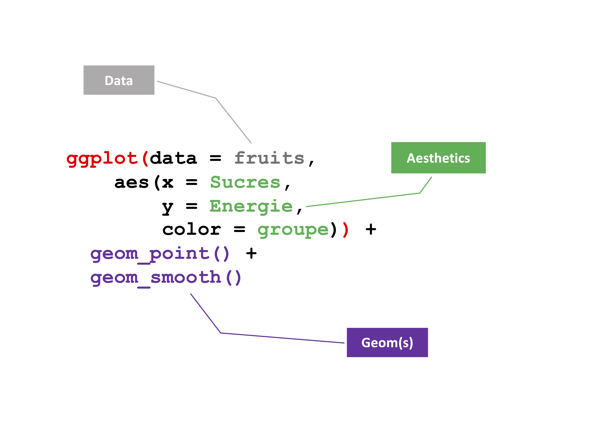{width=100%}

## L'image à retenir {.center}

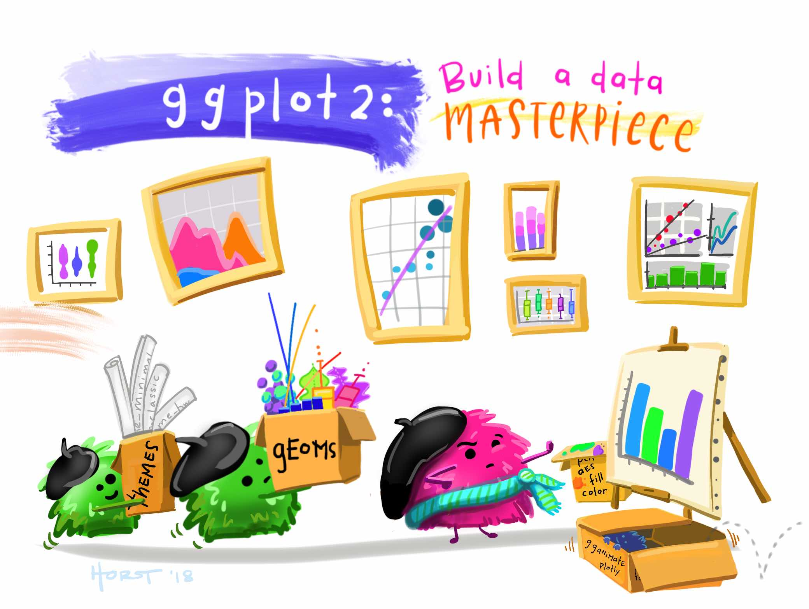{width=80%}

## [G]rammar of [G]raphics {.center}

{width=100%}

## Implémentation dans ggplot2

-----------  -------- -------------------
 Données     `data`    Les données à représenter. Chaque ligne représente un élément à représenter graphiquement.
Géométries   `geom_`   Les formes à créer pour représenter les données. Cela peut être des points, des lignes, des surfaces etc.
Esthétiques  `aes()`   Les paramètres esthétiques de ces formes. Par exemple la position, la couleur, la taille, la forme, la transparence etc.
 Échelles    `scale_`  Des fonctions permettant de paramétrer la transformation de données en formes ou en objets graphiques. Par exemple la fonction `scale_color_manual` permet de choisir soi-même les couleurs à utiliser dans un graphique. 
-----------  -------- --------------------

## A vous ! {.columns-2}

À quoi servent les deux premières lignes ?
Comment corriger la commande suivante pour obtenir le graphe à droite ?

```{r acompleter, eval = FALSE}
fruits$SucresSup10 <- 
  fruits$Sucres > 10

ggplot(***, 
     aes(***, 
     fill = SucresSup10)) +
   geom_***()
```


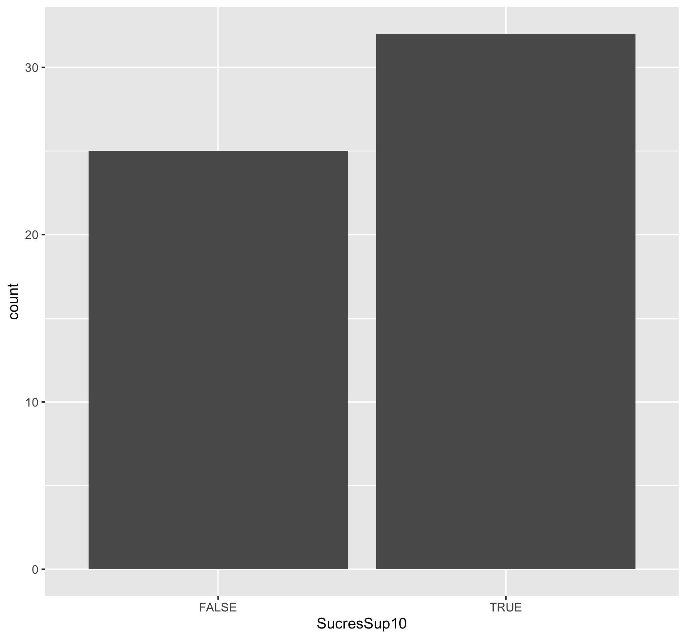{width=100%}

## Un peu d'histoire {.columns-2}

 * Il y a eu un `ggplot`"1" (voir [ici](https://github.com/hadley/ggplot1))
 * Développement commencé en 2005
 * Hadley Wickham (*Chief Scientist at RStudio* + *Adjunct Professor of Statistics*)
 * D'excellents cours, parfois avec sa soeur Charlotte
 
<p class="forceBreak"></p>


{width=50%}
 
## Quelques géométries

Nous allons voir ensemble quelques géométries particulières qui permettent de créer des graphes classiques.

---------------- --------------------------------
`geom_bar`       Diagramme en bâtons sur des données non-agrégées
`geom_col`       Diagramme en bâtons (encore) sur des comptages existants
`geom_histogram` Histogramme d'une variable quantitative
`geom_boxplot`   Diagramme de Tukey aka "boîte à moustache" aka *boxplot*
`geom_violin`    Diagramme en "violons"
`geom_point`     Nuage de points créé à partir de deux variables quantitatives
`geom_line`      Ligne tracée à partir de deux variables quantitatives
---------------- --------------------------------

# Diagrammes en bâtons

## Avec geom_bar

On a déjà vu comment faire : 

```{r geom_bar_ter, fig.height = 3}
ggplot(fruits, aes(groupe)) + 
  geom_bar(fill = "steelblue")
```

## Avec geom_col

S'utilise **quand on connaît déjà** la hauteur des barres.

```{r geom_col, fig.height = 2}
vitamine <- data.frame(
  groupe = c("compote", "crus", "exotique", "secs"), 
  VitamineC = c(14.2, 12.2, 32.1, 0.3))

ggplot(data = vitamine, aes(x = groupe, y = VitamineC)) +
  geom_col()
```

## A vous !

Comment modifier le code précédent pour faire un diagramme en bâtons montrant le nombre de fruits ayant une teneur en Eau supérieure à 80 g / 100 g par groupe ?

(PS : il y a plus d'une solution possible)

# Histogrammes

## Histogramme ou diagramme en bâtons ? {.columns-2 .smaller}

```{r sucrebatons, out.width = "100%"}
ggplot(fruits, aes(Sucres)) + 
  geom_bar()
```

```{r sucrehist, out.width = "100%", message = FALSE}
ggplot(fruits, aes(Sucres)) + 
  geom_histogram()
```

## Histogramme ou diagramme en bâtons ? {.columns-2}

### Diagramme en bâtons

Représente des comptages de :

 * variables nominales
 * variables ordinales
 * variables discrètes

<p class="forceBreak"></p>

### Histogramme

Représente des comptages ou des densités de :

 * variables continues
 * variables discrètes

Pour ce genre de graphe, il est important de choisir les intervalles sur lesquels les données seront énumérées.

## L'histogramme par défaut {.columns-2 .smaller}

 * Axe des $y$ : les comptages de l'intervalle donné
 * Axe des $x$ : 
   - des intervalles de même amplitude,
   - trente intervalles,
   - pas de séparation visuelle entre les intervalles (sauf ceux qui sont vides)
   - des *rectangles* gris foncé
   - un *message*

{width=80%}

<p class="forceBreak"></p>

```{r histodefo, fig.height = 3, fig.width = 3, message = FALSE}
ggplot(fruits, aes(Sucres)) + 
  geom_histogram()
```
   
   
## C'est quoi ce message ?

Pour faire un histogramme, on a besoin de répartir des valeurs numériques dans des classes.

 * La fonction `hist` le fait automatiquement avec l'algorithme de Sturges (ou Scott, ou Friedman-Diaconis si l'utilisateur le souhaite). Si on spécifie `n`, la fonction décidera un nombre de classes "approprié" proche de `n`. Pour forcer les classes, il faut utiliser `breaks`.
 * La fonction `geom_histogram` crée par défaut 30 classes, charge à l'utilisateur de changer cela.

## Modification des intervalles

```{r histo1, echo = FALSE, fig.height = 3}
ggplot(fruits, aes(Sucres)) + 
  geom_histogram(breaks = seq(0, 75, 5))
```

```{r histo1 code, eval = FALSE}
ggplot(fruits, aes(Sucres)) + 
  geom_histogram(breaks = seq(0, 75, 5))
```

## Modification de la couleur

```{r histo2, echo = FALSE, fig.height = 3}
ggplot(fruits, aes(Sucres)) + 
  geom_histogram(breaks = seq(0, 75, 5),
                 fill = "steelblue")
```

```{r histo2 code, eval = FALSE}
ggplot(fruits, aes(Sucres)) + 
  geom_histogram(breaks = seq(0, 75, 5),
                 fill = "steelblue")
```
## Modification de la couleur

```{r histo3, echo = FALSE, fig.height = 3}
ggplot(fruits, aes(Sucres)) + 
  geom_histogram(breaks = seq(0, 75, 5),
                 fill = "steelblue",
                 color = "white")
```

```{r histo3 code, eval = FALSE}
ggplot(fruits, aes(Sucres)) + 
  geom_histogram(breaks = seq(0, 75, 5),
                 fill = "steelblue",
                 color = "white")
```


## Boxplot

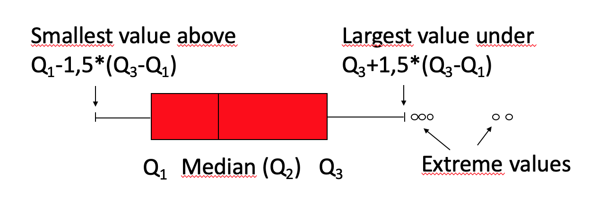{width=100%}

## Boxplot d'une variable

```{r boxplot, fig.height = 4}
ggplot(data=fruits, aes(x = Sucres)) + 
  geom_boxplot()
```

## Boxplot : lien entre une variable catégorielle et une variable continue

```{r boxplot2, fig.height = 4}
ggplot(data=fruits, aes(x=groupe, y=Sucres)) + 
  geom_boxplot()
```

## Avec des violons {.columns-2 .smaller}

```{r violinplot, fig.height = 3, fig.width = 3}
ggplot(data=fruits, 
       aes(x = Sucres, y = 1)) + 
  geom_violin()
```

<p class="forceBreak"></p>

```{r violinplot2, fig.height = 3, fig.width = 3}
ggplot(data=fruits, 
       aes(x = groupe, y = Sucres)) + 
  geom_violin()
```

## A vous ! {.columns-2}

Complétez le code suivant pour obtenir la figure de droite :

```{r codeacompleter, eval = FALSE}
ggplot(fruits, 
       aes(x = Fibres > 1.5, 
           y = Proteines, 
           fill = ***)) + 
  geom_***()
```

<p class="forceBreak"></p>

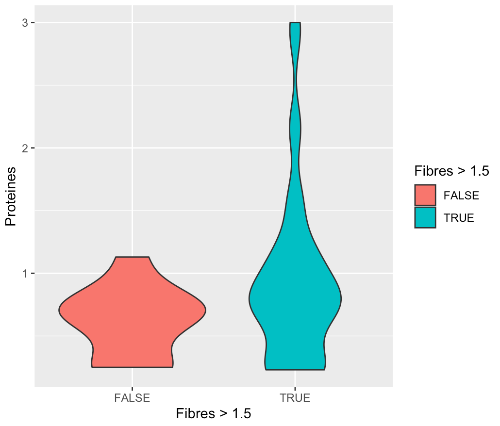{width=100%}

# Personnalisation

## Thèmes

Les *thèmes* sont des fonctions qui permettent de modifier certains paramètres graphiques comme : 
  
  * la couleur du fond,
  * la couleur des axes,
  * la couleur des grilles majeures et mineures,
  * etc.
  
Exemple de fonctions thèmes (`theme_***()`) : 
  
  * `theme_bw()` : pour un thème en noir et blanc,
  * `theme_minimal()` : pour un thème minimaliste,
  * `theme_void()` : pour un thème dépouillé

## Exemple sur un histogramme : `theme_bw()`

```{r histotheme1, message=FALSE, fig.height=3}
ggplot(fruits, aes(Fibres)) + 
  geom_histogram() + 
  theme_bw()
```

## Exemple sur un histogramme : `theme_minimal()`

```{r histotheme2, message=FALSE, fig.height=3}
ggplot(fruits, aes(Fibres)) + 
  geom_histogram() + 
  theme_minimal()
```

## Exemple sur un histogramme : `theme_void()`

```{r histotheme3, message = FALSE, fig.height=3}
ggplot(fruits, aes(Fibres)) + 
  geom_histogram() + 
  theme_void()
```

## A vous ! {.columns-2}

 1. Consultez la page d'aide de la fonction `theme_bw` avec la commande `?theme_bw`
 2. Choisissez la thème permettant de réaiser le graphe à droite en complétant la commande suivante.
 
```{r mysterytheme, eval = FALSE}
ggplot(fruits, aes(y = Fibres)) + 
  geom_boxplot() + 
  theme_***()
```

<p class="forceBreak"></p>

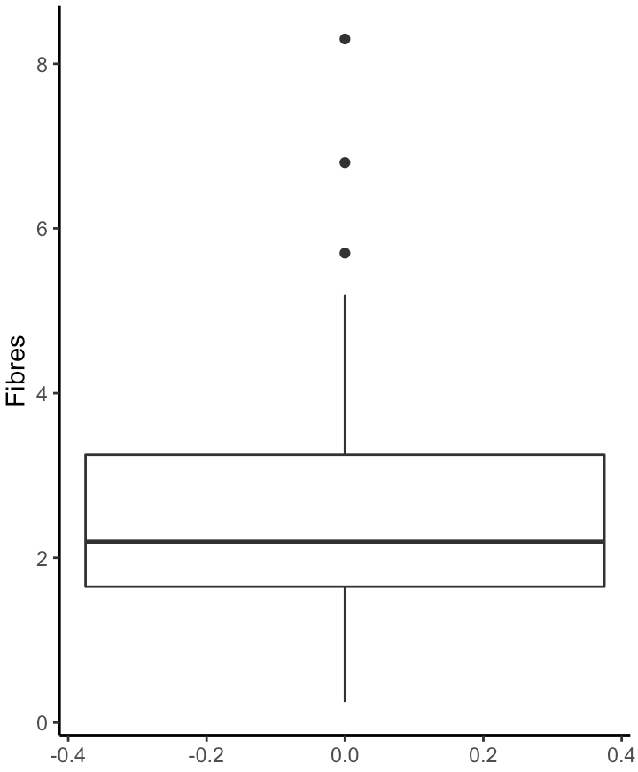{width=100%}

## Autres personnalisations "simples"

 * __Titre__ : avec la fonction `ggtitle`
 * __Titre de  l'axe des $x$__ : avec la fonction `xlab`
 * __Titre de  l'axe des $y$__ : avec la fonction `ylab`

Mais je vous conseille d'utiliser la fonction `labs` qui permet de faire tout cela, et plus !

```{r labs, eval = FALSE}
labs(
  title = "Titre du graphe",
  subtitle = "Sous-titre du graphe",
  x = "Titre de l'axe des x",
  y = "Titre de l'axe des y",
  color = "Titre de la légende des couleurs",
  shape = "Titre de la légende des formes"
)
```

## Personnalisations avancées

Avec la fonction `theme()`, qui a une syntaxe bien particulière : chaque élément doit être spécifié selon sa nature.

 * Pour changer la taille, la police, la couleur d'élément de type "texte", on utilise `element_text(size=, colour = "", family = "")`
 * Pour changer la couleur et la taille d'une ligne, on utilise `element_line(colour="", size=)`
 * Pour personnaliser la couleur du fond, on utilise `element_rect(fill = "")`

## Ce que l'on peut changer avec `theme()`

 * `axis.title`, `axis.title.x`, `axis.title.y` :  taille, police, couleur, ...
 * `axis.text`, `axis.text.x`, `axis.text.y` : taille, police, couleur, ...
 * `axis.ticks`, `axis.ticks.x`, `axis.ticks.y`
 * `axis.line`, `axis.line.x`, `axis.line.y`
 * `panel.background` : couleur 
 * `panel.grid.major`, `panel.grid.minor` : couleur, taille
 * `legend.text`: taille, police, couleur
 * `legend.position`
 * `plot.title` : taille, police, couleur


# Nuages de points

## Avec `geom_point`

Cette géométrie nécessite des paramètres esthétiques de position (en $x$ et $y$), et accepte optionnellement des paramètres esthétiques de taille, couleur et forme.

```{r geompoint, fig.height = 3}
ggplot(fruits, aes(x = Phosphore, y = Calcium, size = Magnesium)) + 
  geom_point()
```

## Paramètres esthétiques 

Lorsqu'ils sont spécifiés dans la fonction `aes()`, ces paramètres appliquent les valeurs d'une variable à une caractéristique des objets graphiques tracés par les géométries.

 * `color` ou `colour` : couleur du point
 * `fill` : couleur de remplissage
 * `size` : taille
 * `shape` : forme
 * `alpha` : transparence
 * `linetype` : type de ligne
 * `label` : étiquettes

Lorsqu'ils sont appliqués en dehors de la fonction `aes()`, leur comportement est plus général !

## Exemple {.columns-2 .smaller}

```{r dans aes, fig.height = 3, fig.width = 3}
ggplot(fruits, 
       aes(x = Phosphore, y = Calcium, 
           color = Magnesium)) + 
  geom_point() + 
  theme(legend.position = "bottom")
```

<p class="forceBreak"></p>

```{r pas dans aes, fig.height = 3, fig.width = 3}
ggplot(fruits, 
    aes(x = Phosphore, y = Calcium)) + 
  geom_point(color = "limegreen")
```

## A vous ! {.columns-2 .smaller}

Complétez la commande suivante pour obtenir le graphe ci-contre.

```{r last, eval = FALSE}
ggplot(fruits,
       aes(x = Sucres, 
           y = Proteines, 
           *** = Magnesium, 
           *** = ***)) + 
  geom_***() + 
  ***(title = "Fruits",
     x = "Sucres (g/100 g)", 
     y = "Protéines, N x 6.25 (g/100 g)",
     size = "Magnésium\n(mg/100 g)",
     ***= "Groupe") + 
  theme_***()
```

<p class="forceBreak"></p>

{width=100%}

## Au secours, mes points se superposent! {.columns-2}

Pas de panique, on peut utiliser la transparence (aka `alpha`) : 

```{r alpha, eval = FALSE, fig.height = 3}
ggplot(fruits, 
       aes(x = Phosphore, 
           y = Calcium, 
           color = groupe)) + 
  geom_point(alpha = 0.5, 
             size = 2) + 
  theme_bw() + 
  theme(legend.position = 
          "bottom")
```

<p class="forceBreak"></p>

```{r alpha2, echo = FALSE, fig.height = 4, fig.width = 4}
ggplot(fruits, 
       aes(x = Phosphore, 
           y = Calcium, 
           color = groupe)) + 
  geom_point(alpha = 0.5, 
             size = 2) + 
  theme_bw() + 
  theme(legend.position = 
          "bottom")
```

# Changer les échelles

## Avec les fonctions `scale_***` {.smaller}

Ces fonctions vont vous permettre de personnaliser l'échelle, en $x$, en $y$, mais pas seulement ! Ce concept est généraliser dans `ggplot2` à de nombreux paramètres esthétiques. Par exemple : 

  * `scale_x_log10()` permet de transformer l'échelle des $x$ en échelle logarithmique,
  * `scale_y_log10()` permet de transformer l'échelle des $y$ en échelle logarithmique,
  * `scale_color_manual()` permet de personnaliser les couleurs,
  * `scale_fill_manual()` permet de personnaliser les couleurs de remplissage,
  * `scale_x_continuous()` permet de personnaliser l'axe des $x$ lorsque $x$ est une variable "continue",
  * `scale_y_discrete()` permet de personnaliser l'axe des $y$ lorsque $y$ est une variable "discrète",
  * `scale_x_continuous()` permet de personnaliser l'axe des $x$ lorsque $x$ est une variable "discrète",
  * `scale_y_discrete()` permet de personnaliser l'axe des $y$ lorsque $y$ est une variable "discrète".
  
## A vous ! {.columns-2}

Complétez la commande suivante pour obtenir le graphe ci-contre.

```{r exoscale, eval = FALSE}
ggplot(fruits, 
       aes(Phosphore, 
           Calcium)) + 
  geom_point(*** = "white") + 
  scale_***() + 
  scale_***() + 
  labs(x = "log10(Phosphore)",
       y = "log10(Calcium)") + 
  theme_dark()
```

<p class="forceBreak"></p>

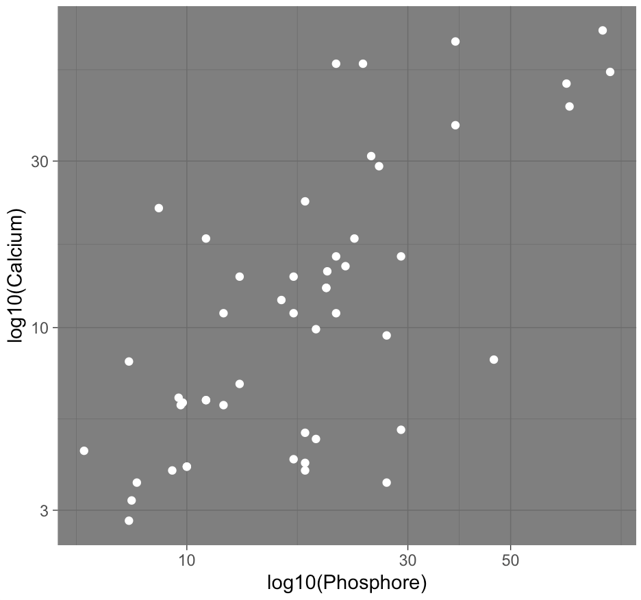{width=100%}

## Avec les fonctions `coord_***`

Pour modifier le système de coordonnées **après** avoir appliquer toutes les transformations spécifiées auparavant (par une fonction `scale_***` par exemple). Par exemple :

 * `coord_fixed` pour fixer le ratio des unités de l'axe des $y$ sur les unités de l'axe des $x$,
 * `coord_equal` quand ce ratio vaut 1,
 * `coord_flip` pour échanger les axes,
 * `coord_polar` pour passer d'un système de coordonnées cartésien à un système de coordonnées polaires

## Pour s'amuser !

Transformez les coordonnées du graphe suivant en coordonnées polaires (`coord_polar(theta = "y")`). Quel est le résultat ?

```{r almostfromage, eval = FALSE}
ggplot(fruits, aes(x = 1, fill = groupe)) + 
  geom_bar(width = 1) + 
  theme_void()
```

## Avec les fonctions `*lim*`

Change le minimum et le maximum d'un axe. Attention, toutes les valeurs en dehors des nouveaux axes sont **éliminées** !

 * `xlim`, `ylim` ou `lims` pour spécifier l'étendue,
 * `expand_limits` pour *étendre* l'étendue à certaines valeurs.
 
Pour faire un "zoom" sans perdre de points, il faut utiliser la fonction `coord_cartesian` ou une fonction du type `scale_***`
 
# Créer des "facettes"

## La fonction `facet_wrap`

S'uilise pour diviser le graphe en panneaux selon les modalités d'une variable catégorielle.

Attention à la syntaxe : elle est basée sur l'utilisation du terme `vars`, qui permet d'accéder aux variables du jeu de données spécifié.

Par exemple, pour diviser le graphe `g` en plusieurs panneaux selon les modalités d'un facteur `fac`, on écrira

```
g + facet_wrap(facets = vars(fac))
```

On peut également utiliser une "formule" : 

```
g + facet_wrap(~ fac)
```


## Exemple {.columns-2}


```{r facet1, eval = FALSE}
ggplot(fruits, 
       aes(x = Phosphore, 
           y = Calcium, 
           color = groupe)) + 
  geom_point() + 
  facet_wrap(vars(Sucres > 10)) + 
  theme_bw() + 
  theme(legend.position = 
          "bottom")
```

<p class="forceBreak"></p>

```{r facet2, echo = FALSE, fig.height = 4, fig.width = 4}
ggplot(fruits, 
       aes(x = Phosphore, 
           y = Calcium, 
           color = groupe)) + 
  geom_point() + 
  facet_wrap(vars(Sucres > 10)) + 
  theme_linedraw() + 
  theme(legend.position = 
          "bottom")
```

## Avec la fonction `facet_grid`

S'utilise de la même façon que `facet_wrap`.

Par exemple, pour diviser le graphe `g` en plusieurs panneaux selon les modalités d'un facteur `factorow` pour les lignes et `factocol` pour les colonnes, on écrira

```
g + facet_grid(rows = vars(factorow), cols = vars(factocol))
```

On peut aussi utiliser une formule : 

```
g + facet_grid(factorow ~ factocol)
```

CONSEIL : pour l'utilisation de facettes, faites attention à bien nommer les modalités de vos facteurs pour rendre le graphe plus clair.

# Sauvegarder un graphe

## Méthode conseillée : avec ggsave

Fonctionnement et exemple : 

```
g <- ggplot(fruits, aes(groupe)) + geom_bar()
ggsave(filename = "mongraphe.png", plot = g)
```

L'extension donnée dans `filename` sera magiquement détectée pour sauvegarder le fichier au bon format !


# Conclusion

## En quelques mots

Nous avons vu un package de représentations graphiques très puissant ! `ggplot2` fonctionne sur la base d'un canevas, de paramètres esthétiques comme la position en $x$, en $y$, les couleurs, la forme etc. A partir de ces paramètres, on va tracer les graphes à l'aides de *géométries*, qui peuvent se superposer !

## Quelques remarques

 1. `ggplot2` est  très complet... et très complexe
 2. Il faut prendre son temps, et savoir travailler avec ses petits jeux de données préférés bien connus et **très très très très propres** pour travailler sur son graphe,
 3. Personnaliser un graphe prend du temps, il faut s'armer de patience...


# [N'oubliez pas la feuille de triche !](https://posit.co/wp-content/uploads/2022/10/data-visualization-1.pdf) {data-background=#ffffff}

{width=50%}
