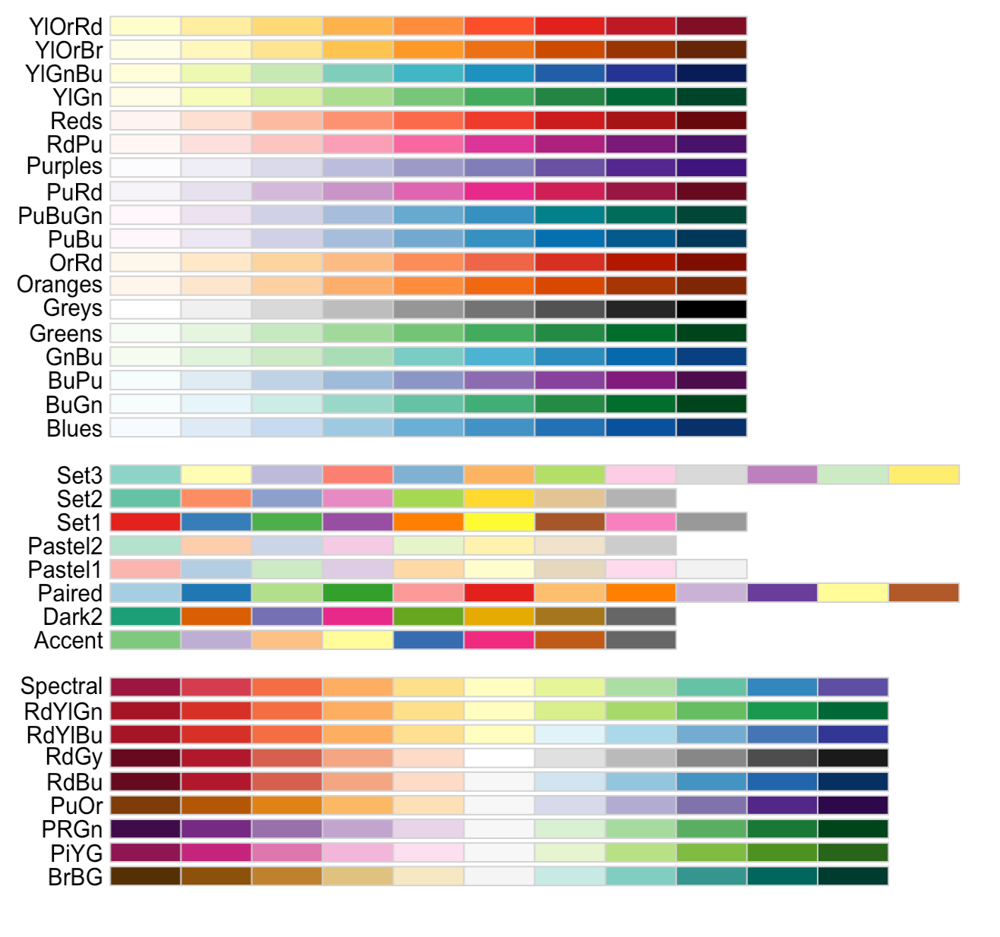
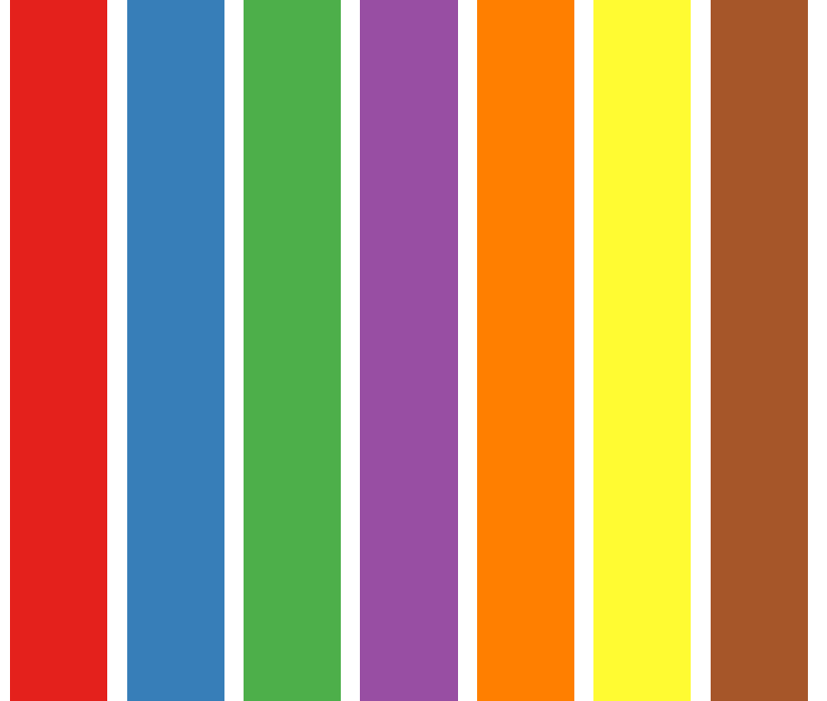

<style>
.forceBreak { -webkit-column-break-after: always; break-after: column; }
</style>


```{r setup, include = FALSE}
knitr::opts_chunk$set(
  collapse = TRUE,
  comment = "#>",
  echo = TRUE
)
library(ggplot2)
```

## Avant toutes choses

Nous aurons besoin du package `RColorBrewer` :

 * Vérifier que le package `RColorBrewer` est bien installé
 * Si non, l'installer, puis le charger

```{r RColorBrewer}
library(RColorBrewer)
```

Nous allons également avoir besoin des données fruits : 

```{r data}
fruits <- readxl::read_excel("fruits.xlsx")
```

# Trois façons de colorier des objets

## Trois façons de voir les couleurs

Voici trois manières de définir une couleur, qui permettent de colorier un graphe soit très rapidement (entiers), soit avec plus de possibilités (couleurs nommées) ou encore de manière très raffinée (HEX).

```{r, eval = FALSE, echo = FALSE}
------- ------- ---------- ---------- ----------- --------- -------- -------------- -------
Entier     1        2          3          4          5         6           7           8
HEX     #000000 #DF536B    #61D04F    #2297E6     #28E2E5   #CD0BBC  #F5C710        #9E9E9E
Couleur black   indianred2 palegreen3 dodgerblue2 turquoise magenta3 darkgoldenrod1 gray62
------- ------- ---------- ---------- ----------- --------- -------- -------------- -------
```

```{r kableextra, echo = FALSE, results='asis'}
library(kableExtra)

coltab <- read.table(text = 
"Entier 1 2 3 4 
Nom black indianred2 palegreen3 dodgerblue2
HEX #000000 #DF536B #61D04F #2297E6 
Entier 5 6 7 8
Nom turquoise magenta3 darkgoldenrod1 gray62
HEX #28E2E5 #CD0BBC #F5C710 #9E9E9E", comment.char = "")

coltab$V2 <- cell_spec(coltab$V2, color = rep(c("black", "turquoise"), each = 3))
coltab$V3 <- cell_spec(coltab$V3, color = rep(c("indianred", "magenta"), each = 3))
coltab$V4 <- cell_spec(coltab$V4, color = rep(c("palegreen", "darkgoldenrod"), each = 3))
coltab$V5 <- cell_spec(coltab$V5, color = rep(c("dodgerblue", "gray"), each = 3))

coltab %>%
   kable(escape = FALSE, col.names = c("", "", "", "", ""), table.attr = "style='width:100%;'", align = c("l", "c", "c", "c", "c")) %>%
   kable_styling(full_width = TRUE) %>%
   column_spec(1, bold = FALSE, border_right = TRUE, color = "white", background = "black")
```

## Les chiffres (rapide !)

La palette de 8 couleurs par défaut de R est codée par les entiers de 1 à 8.

```{r couleurs}
barplot(rep(1,8), col = 1:8)
```

## Les noms de couleurs (plus de couleurs)

On peut également colorier avec des "noms" de couleur (e.g. `"black"`, `"tomato"`, `"steelblue"`, `"darkorchid"` etc.)

On peut accéder à tous ces noms de couleur avec la commande `colors()` :

```{r colors}
sample(colors(), 7)
```

Ces couleurs "nommées" s'utilisent de la même façon que les couleurs "numériques".

## HEX (encore plus de couleurs !) {.smaller}

On peut aussi utiliser des codes hexadécimaux pour coder une couleur dans le système de référence "Rouge - Vert - Bleu" : 

  * deux symboles hexadécimaux par couleur ($16 \times 16 = 256$ valeurs possible)
  * 0, 1, 2, 3, 4, 5, 6, 7, 8, 9, A, B, C, D, E, F
  * Trois couleurs de base : rouge, vert et bleu
  * 00 = pas de cette couleur
  * FF = max de cette couleur

```{r hex, echo = FALSE, fig.height = 2.5, fig.width = 6}
hexdat <- data.frame(
  x = 1:6,
  col = rep(c("#FF0000", "#00FF00", "#0000FF"), each = 2)
)

zesize <- 20

ggplot(hexdat, aes(x = x)) + 
  geom_point(aes(color = I(col)), y = 1, size = zesize) + 
  annotate("text", x = 0, y = 1, label = "#", size = zesize) + 
  theme_minimal() + 
  xlim(c(-0.2, 6.2)) + 
  theme_void()
```

## Exemple 

Voici trois commandes équivalentes pour réaliser le même graphe ci-dessous : 

```{r barplot3façons, eval = FALSE}
barplot(rep(1, 3), col = 2:4)
barplot(rep(1, 3), col = c("indianred2", "palegreen3", "dodgerblue2"))
barplot(rep(1, 3), col = c("#DF536B", "#61D04F", "#2297E6"))
```

```{r legraphe3facons, echo = FALSE, fig.height = 2.5}
barplot(rep(1, 3), col = 2:4)
```

## A vous !

Reproduisez le graphe ci-dessous avec le système de couleurs de votre choix : 

{width=80%}

# ATTENTION !

## Attention au recyclage !

S'il y a plus d'objets à colorier que de couleurs, les couleurs sont recyclées !

```{r couleurs_repetees, fig.height = 2}
par(mar = c(0, 0, 0, 0))
barplot(rep(1,80), col = 1:8, border = NA, space = 0, axes = FALSE)
```

# Les palettes

## Utiliser des palettes {.columns-2 .smaller}

Il existe de nombreux packages en R permettant de générer des palettes de couleur. Nous allons en utiliser un seul pendant ce cours : `RColorBrewer`.

La commande suivante permet de visualiser toutes les palettes que ce package permet d'utiliser :

```{r displayAll, eval = FALSE}
display.brewer.all()
```

Pour extraire des couleurs de ces palettes : 

```{r brewer.pal}
brewer.pal(n = 3, name = "Set3")
```

<p class="forceBreak"></p>

{width=100%}

## En quelques mots

Il y a trois types de palettes : séquentielles, divergentes et qualitatives.

 1. Les palettes séquentielles permettent de distinguer des valeurs petites (en clair) de valeurs grande (en foncé)
 2. Les palettes divergentes permettent de distinguer les valeurs petites des valeurs grandes, mais ces deux extrêmes sont toutes les deux de ton foncé dans des couleurs très différentes. Les valeurs intermédiaires sont représentées en ton clair.
 3. Les palettes qualitatives sont faites pour distinguer toutes les couleurs les unes des autres. Elle sont adaptées à la représentation de données qualitatives.

## A vous {.columns-2}

Complétez le code suivant pour obtenir le graphe ci-contre : 

```{r couleurexo1, eval = FALSE}
pal <- brewer.pal(***, ***)
barplot(rep(1, 7), 
        col = pal, 
        axes = ***, 
        border = ***)
```

<p class="forceBreak"></p>

{width=100%}


# Extrapoler des couleurs

## Pour extrapoler des couleurs...

On utilise la fonction de base `grDevices::colorRampPalette` : 

```{r colorRamp}
colfun <- colorRampPalette(c("darkorchid", "black", "limegreen"))
barplot(rep(1, 30), col = colfun(30), axes = F, border = NA)
```

## Exercice {.columns-2}

Reproduisez le graphe ci-contre en modifiant la commande ci-dessous.

```{r couleurexo2, eval = FALSE}
colfun <- colorRampPalette(
  c(***, ***, ***))
barplot(rep(1, 100), 
        col = colfun(100), 
        axes = F, border = NA)

```

<p class="forceBreak"></p>

{width=100%}


