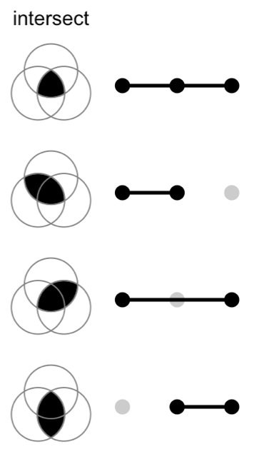
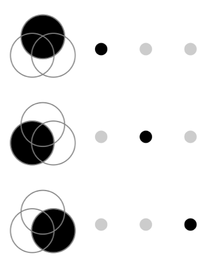

<style>
.forceBreak { -webkit-column-break-after: always; break-after: column; }
</style>


```{r setup, include = FALSE}
knitr::opts_chunk$set(
  collapse = TRUE,
  comment = "#>",
  echo = TRUE
)
```

## Avant toutes choses

Nous aurons besoin des packages `ggvenn` et `UpSetR` :

 * Vérifier que les packages `ggvenn` et `UpSetR` sont bien installés
 * Si non, les installer, puis les charger

```{r UpSetR, message = FALSE}
library(ggvenn)
library(UpSetR)
```

Nous allons également avoir besoin des données fruits : 

```{r data}
fruits <- readxl::read_excel("fruits.xlsx")
```

## Visualiser des relations entre listes {.columns-2 .smaller}

Créons une liste d'objets :

```{r flist}
flist <- with(fruits,
  list(
    Sucres = nom[Sucres > 20],
    Fibres = nom[Fibres > 2],
    Energie = nom[Energie > 50],
    Potassium = nom[Potassium > 100],
    Crus = nom[groupe == "crus"]
))
```

Et une matrice binaire

```{r fbin}
fbin <- with(fruits,
  data.frame(
    Sucres = Sucres > 20,
    Fibres = Fibres > 2,
    Energie = Energie > 50,
    Potassium = Potassium > 100,
    Crus = groupe == "crus"
)) + 0
```


## Diagramme de Venn {.smaller}

Compliqués à lire à partir de 4 ensembles : 

```{r venn, fig.height = 4, fig.width = 8}
ggvenn(flist, set_name_size = 5)
```


## UpSet plot {.smaller}

C'est une méthode de visualisation (récente !) alternative au diagramme de Venn.

Référence : Jake R Conway, Alexander Lex, Nils Gehlenborg, UpSetR: an R package for the visualization of intersecting sets and their properties, Bioinformatics, Volume 33, Issue 18, 15 September 2017, Pages 2938–2940, https://doi.org/10.1093/bioinformatics/btx364

## Correspondance {.columns-2}

{width=50%}

<p class="forceBreak"></p>

{width=50%}


## Exemple

```{r upset0, fig.height = 4}
upset(fbin)
```

## Mais c'est la même chose que...

```{r upset1, fig.height = 4}
upset(fromList(flist))
```

## On peut (beaucoup) personnaliser ce graphe

```{r persoupset, fig.height = 3}
upset(
  fbin, nintersects = NA, order.by = "freq", 
  main.bar.color = "steelblue", matrix.color = "limegreen",
  sets.bar.color = "tomato", point.size = 2)
```


## A vous !

Imaginez une situation dans laquelle vous pourriez avoir besoin de ce type de graphes.
