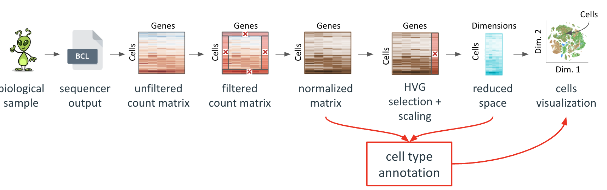
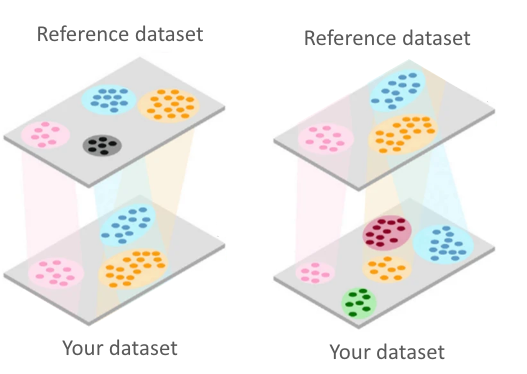

<!-- knit setup -->

```{r knit_setup, echo = FALSE}
knitr::opts_chunk$set(
  echo = TRUE,        # Print the code
  eval = TRUE,        # Run command lines
  message = FALSE,    # Print messages
  prompt = FALSE,     # Do not display prompt
  comment = NA,       # No comments on this section
  warning = FALSE,    # Display warnings
  tidy = FALSE,
  fig.align="center", 
  # results = 'hide',
  width = 100       # Number of characters per line
)
```

<!-- CSS to color chunks and outputs -->

```{css, echo=FALSE}
.notrun {
  background-color: lightgrey !important;
  border: 3px solid black !important;
}
.notruno {
  background-color: lightgrey !important;
  color : black !important;
}
.question {
  background-color: aquamarine !important;
  color : black !important;
  border: 3px solid limegreen !important;
}
.questiono {
  background-color: aquamarine !important;
  color : black !important;
}
.answer {
  background-color: navajowhite !important;
  border: 3px solid brown !important;
}
.answero {
  background-color: navajowhite !important;
  color : black !important;
}
.beyond {
  background-color: violet !important;
  border: 3px solid purple !important;
}
.beyondo {
  background-color: violet !important;
  color : black !important;
}
```

<!-- Hook to handle code blocks output folding -->

```{r knit_hook, echo = FALSE}
hooks = knitr::knit_hooks$get()
hook_foldable = function(type) {
  force(type)
  function(x, options) {
    res = hooks[[type]](x, options)
    
    if (isFALSE(options[[paste0("fold.", type)]])) return(res)
    
    paste0(
      "<details><summary>Show ", type, "</summary>\n\n",
      res,
      "\n\n</details>"
    )
  }
}
knitr::knit_hooks$set(
  output = hook_foldable("output"),
  plot = hook_foldable("plot")
)
```

------------------------------------------------------------------------

------------------------------------------------------------------------

<center></center>

------------------------------------------------------------------------

------------------------------------------------------------------------

# PREAMBLE

## Purpose of this session

We are reaching out a challenging task of the analysis (and a very exciting one !).

-   What **types of cells** did we capture in the analysis ? 
-   Do we identify the expected cell types and can we distinguish different 
    sub-populations ? 
-   Do we identify "novel" or "unexpected" cell types ?

The aim of this session is to understand the different methods that will help
you to explore the biological cell types captured by your dataset.


------------------------------------------------------------------------

------------------------------------------------------------------------

# Start Rstudio

-   Using the [OpenOnDemand/Rstudio cheat
    sheet](https://moodle.france-bioinformatique.fr/pluginfile.php/1475/mod_folder/content/0/OoD_R_Rstudio.html){target="_blank"},
    connect to the [OpenOnDemand
    portal](https://ondemand.cluster.france-bioinformatique.fr){target="_blank"} and
    **create a Rstudio session** with the right resource requirements.

------------------------------------------------------------------------

------------------------------------------------------------------------

# Warm-up

-   We set **common parameters** we will use throughout this session :

```{r setparam}
# setparam


## Set your project name
# WARNING : Do not just copy-paste this ! It's MY project name ! Put YOURS !!
project_name <- "ebaii_sc_teachers"

## Control if the project_name exists on the cluster
cat('PATH CHECK : ', dir.exists(paste0('/shared/projects/', project_name)))

## The current EB3I session ID
sessionid <- '2538_eb3i_n1_2025
'
```

------------------------------------------------------------------------

------------------------------------------------------------------------

# Prepare the data structure

We will do the same as for former steps, just changing the session name.

## Main directory

```{r maindir, fold.output = FALSE}
# maindir

## Preparing the path
TD_dir <- paste0("/shared/projects/", project_name, "/SC_TD")

## Creating the root directory (already exists at this step)
# dir.create(path = TD_dir, recursive = TRUE)

## Print the root directory on-screen
print(TD_dir)

```

## Current session

```{r sessiondir, fold.output = FALSE}
# sessiondir

## Creating the session (Preproc.3) directory
session_dir <- paste0(TD_dir, "/08_Cell.Annotation")
dir.create(path = session_dir, recursive = TRUE)

## Print the session directory on-screen
print(session_dir)

```

## Input directory

```{r indir, fold.output = FALSE}
# indir

## Creating the INPUT data directory
input_dir <- paste0(session_dir, "/DATA")
dir.create(path = input_dir, recursive = TRUE)

## Print the input directory on-screen
print(input_dir)

```

## Genelists directory

This is a directory where we will store additional information from 
knowledge bases about genes used to estimate the cell cycle phase of cells.

```{r resdir, fold.output = FALSE}
# resdir

res_dir <- paste0(TD_dir, "/Resources")
glist_dir <- paste0(res_dir, "/Genelists")

## Create the directory
dir.create(path = glist_dir, recursive = TRUE)

## Print the resources directory on-screen
print(glist_dir)

```

## Output directory

```{r outdir, fold.output = FALSE}
# outdir

## Creating the OUTPUT data directory
output_dir <- paste0(session_dir, "/RESULTS")
dir.create(path = output_dir, recursive = TRUE)

## Print the output directory on-screen
print(output_dir)

```

------------------------------------------------------------------------

------------------------------------------------------------------------

# Reload the Seurat Object

-   We can reload the object we saved at the former step

```{r dataload}
# dataload


## This is the path to the current EB3I backup
sessionid <- '2538_eb3i_n1_2025'


## The latest Seurat object saved as RDS (name)
sobj_file <- "12_TD3A.TDCT_S5_Integrated_12926.3886.RDS"

## The latest Seurat object saved as RDS (full path)
sobj_path <- paste0(TD_dir, 
                    "/06_Integration/RESULTS/",
                    sobj_file)

force <- FALSE  ## To force a re-download of a Zenodo-hosted backup
local <- FALSE  ## To force a loading from a local backup

## In case of error/lost data : force a reload from a Zenodo backup repository
if(force) {
  zen_id <- "14035293"
  zen_backup_file <- paste0("https://zenodo.org/records/",
                            zen_id,
                            "/files/",
                            sobj_file)
  ## Recreate the expected path if it does not exist
  dir.create(path = dirname(sobj_path), recursive = TRUE)
  ## Download the file
  download.file(url = zen_backup_file,
                destfile = sobj_path)
}

## In case of error/lost data : force a reload from a local backup repository
if(local) {
  sobj_path <- paste0(
    "/shared/projects/", sessionid, "/atelier_scrnaseq/TD/BACKUP/RDS/",
    sobj_file)
}

## Load the object
sobj <- readRDS(file = sobj_path)

```

------------------------------------------------------------------------

------------------------------------------------------------------------

# Overview of the scRNAseq pipeline



At this step of the analysis, we have :

-   **a gene expression matrix** : for each cell, gene expression is available

-   **a reduced space** : gene expression matrix is summarized in N dimensions

-   **a clustering** : each cell belongs to a specific cluster

-   **a 2D space** : cells can be visualized on a 2D representation (UMAP)

On the cell visualization, we also searched for clusters of cells. The clustering resolution shown multiple cell clusters that we can now associate to cell types.

For this you need :

-   **your biological knowledge** on your dataset

-   **an internet connection** :)

------------------------------------------------------------------------

------------------------------------------------------------------------


# Different methods to annotate cell types

The annotation methods aim at defining **marker genes** that help to identify the cell types in each cluster.

But the logic across methods is similar :

You identify genes or set of genes that have a pattern of expression **specific** and that **represents a large number of cells** for the cluster.

Different methods exist :

1.  **MANUAL :** You can either do it manually, use set of marker genes from bibliography, or use other datasets that have been annotated to transfert the annotation to your clustering if similar expression patterns are found.

2.  **AUTOMATIC** : You use a published database and collect sets of marker genes for cell types, or published reference single cell atlas already annotated, or you can also use published RNAseq on a specific cell type that you know is in your dataset...

For this practical session, we will try both approaches. We use the dataset previously filtered and pre-processed (the Seurat object contains the 3 dimension reductions previously performed - pca, umap and harmony).

## Manual annotation

We will perform manual annotation using differential expression.

### Overview of the analysis

For manual annotation of cell clusters using marker genes, you need :

-   A Seurat object with normalized counts.
-   To choose a clustering resolution that you want to use for the annotation.
-   A reduced space to visualize the results.

### Overview of the functions to be used

```{r funcs, eval=FALSE}
# funcs

## Seurat functions to be used in the TD for manual annotation
Seurat::FindClusters()
SeuratObject::JoinLayers()
Seurat::FindAllMarkers()

## Seurat functions to be used for visualization purpose 
### Function to color cell by a "dimension" of their metadata
### (ex : sample of origin ie the annotation called "orig.ident")
Seurat::DimPlot()
### Function to color cell by the expression of one feature
Seurat::FeaturePlot()
### Function to built a heatmap of expression of the marker genes identified
Seurat::DoHeatmap()
### Function to visualize how feature expression changes across different identity classes
Seurat::DotPlot()

```


### Current Seurat object

```{r descobj}
# descobj

## A quick overview of the object
sobj

```

You see that in the reductions calculated, there are novel reductions you didn't use before. Those reduction come from the Integration steps used to merge 2 samples into a 2D representation with less batch effect.

```{r dp1}
# dp1

## Look at the content of the Seurat object post integration 
Seurat::DimPlot(sobj, 
                ## use the reduction umap of the integrated object
                reduction = "umap",
                ## color the cells by their sample of origin
                group.by = c("orig.ident"))

```

**Clusters to annotate**

Manual annotation is based on the identification of marker genes that characterize a cell population. For this, we must define which groups of cells we want to annotate.

This choice is based on the clustering (Look back at `Proc.2`). After the integration step, we can re-perform the 2 steps to get a clustering as we now have an object with the integration of both `TD3A` and `TDCT` samples.

```{r reclusters}
# reclusters

## Find neighboors to prepare the data for clustering using the first 20 PCs
sobj <- Seurat::FindNeighbors(
  object = sobj, 
  dims = 1:20,
  reduction = "HarmonyIntegration")

## Louvain resolutions to test
resol <- c(0.1,0.2,0.3,0.8,1.5)

## Clustering
sobj <- Seurat::FindClusters(
  object = sobj,
  ## Vector of different resolutions defined above
  resolution = resol,
  ## Makes the function quiet
  verbose = FALSE,
  ## Algorithm for modularity optimization :
  ## . 1 : original Louvain algorithm
  ## . 2 : Louvain algorithm with multilevel refinement
  ## . 3 : SLM algorithm
  ## . 4 : Leiden algorithm. Requires the "leidenalg" python library
  algorithm = 1)
```

Multiplot with the different clustering results :

```{r diffresol, fig.height=8, fig.width=16}
# diffresol

## Plot the clustering results
Seurat::DimPlot(object = sobj, 
                reduction = "umap",
                group.by = paste0('RNA_snn_res.', resol),
                pt.size = 1,
                label = TRUE,
                repel = TRUE
) + ggplot2::theme(legend.position = "bottom")
```

Now we have all the data needed to find marker genes per clusters, but we must first choose the clustering resolution we want to annotate.

*Advice :* Always start by a low resolution to have a first idea of the broad cell types you are capturing.

Here I decided to choose the resolution 0.2 for the purpose of simpler classes, I could be wise to start by the resolution 0.1 to have an even more general idea of marker genes per cluster.

```{r setidents}
# setidents

Seurat::Idents(sobj) = sobj$RNA_snn_res.0.2

```

**Differential expression between clusters**

One way to annotate the clusters of cell is to look at the genes highly expressed in one cluster of cells compared to all the other cells: we can do a differential expression (DE) analysis.

DEA (differential expression analysis) is performed on the **normalized count matrix** ("data"), which is the case in our integrated Seurat object.

To perform the manual annotation, we will use the [`Seurat::FindAllMarkers`](https://satijalab.org/seurat/reference/findallmarkers) function.

This function compare each cluster against all others to identify genes differentially expressed that are potentially marker genes.

**WARNING** : In `Seurat` v5, the integrated object contains the 2 normalized datasets still separated in their gene/cell assays of origin. To identify marker genes, we must join the two assays together with the command `JoinLayers`.

```{r joinlayers}
# joinlayers

sobj = SeuratObject::JoinLayers(sobj)

```

Now, we can use the Function `FindAllMarkers` to perform differential gene expression of each cluster against all the others. The objective is to find genes ""specific"" of each cluster to try to annotate them.

```{r FindAllMarkers, message=FALSE}
# FindAllMarkers

## find markers for every cluster compared to all remaining cells,
## report only genes with positive DE 
all_markers = Seurat::FindAllMarkers(
  object = sobj,
  ## Only keep genes more expressed in the cluster of interest than the others
  only.pos = TRUE,
  ## Minimum % of cells expressing the marker in the cluster of interest
  min.pct = 0.25,
  ## Minimum absolute logFC between conditions
  logfc.threshold = 0.25) 

# This command can take up to 2 mins !
```

**WARNING** : the execution time for this command can take several minutes !

Once the markers per cluster have been identified, we can look at the number of markers identified by cluster.

```{r table_markers, echo=TRUE}
# table_markers

# Number of markers identified by cluster
table(all_markers$cluster)

```

In this table, the first line shows the cluster name, and the last line gives the amount of marker genes (ie DEG) identified for this cluster.

Here we see that many markers (ie deferentially expressed genes) have been identified. We cannot look at all of them, but we can choose to look at the top 3 markers per cluster and use our biological knowledge to identify cell populations.

```{r top10}
# top10

`%>%` <- magrittr::`%>%`
top10_markers = as.data.frame(all_markers %>% 
                               dplyr::group_by(cluster) %>% 
                               dplyr::top_n(n = 10, wt = avg_log2FC))

```

```{r top10h, fig.width=16, fig.height=10}
# top10h

## Visualize the top 10 marker gene expression per cluster using the default heatmap function of Seurat.
Seurat::DoHeatmap(sobj, features = top10_markers$gene) + Seurat::NoLegend()

```


```{r top10dt, fig.height=5, fig.width=12}
# top10dt

## A dotplot
Seurat::DotPlot(sobj, features = unique(top10_markers$gene)) +
  ## Just aesthetics
  ggplot2::theme(axis.text.x = ggplot2::element_text(angle = 90, 
                                                     vjust = 1,
                                                     size = 8, 
                                                     hjust = 1)) 

```

On this plot we can see that some markers display a very high and specific expression for a single cluster, while others are expressed in 2 or more cluster.


***Biology in this plot***

-   What is the function of each marker gene ? is it a known marker gene for a cell type ?

-   Is there litterature about its pattern of expression ?

Here we need biological knowledge and back-and-forth marker genes computing using different cluster resolutions to understand which cell populations are present in the data.

At this step, using known marker genes from your experiment/knowledge is also useful, and easy to perform

Let's focus on 2 genes :

-   `Rag1`, a key gene of T-cells maturation in the variable/diversity/joining (V[D]J) rearrangement

-   `Cd5`, a marker of self-reactivity of T-cells

```{r UMAP2markers, fig.width=16, fig.height=8}
# UMAP2markers

Seurat::FeaturePlot(
  object = sobj, 
  features = c("Cd5", "Rag1"), 
  reduction = "umap")

```

Here we can see that those markers may actually be very informative to distinguish cell Tcells maturation process.

... at this moment using your biological knowledge on your dataset is critical, you can also test manually any marker of your choice !


### Conclusion

-   Perform differential expression for each cluster VS all the others with a normalized matrix

-   Look at the gene expression of the markers identified in the 2D representation to **validate specificity and representation**

-   Find the cell population corresponding to these markers and annotate this cluster

+---------------------------------------------------------+----------------------------------------------------------------------------+
| Advantages                                              | Limits                                                                     |
+=========================================================+============================================================================+
| -   **Easy** to implement                               | -   **Clustering** : resolution, merged clusters, "bio-informatic" cluster |
|                                                         |                                                                            |
| -   Sometimes the **only** solution (ex : novel tissue) | -   Change clustering ? Change annotation...                               |
|                                                         |                                                                            |
| -   **Everything** is possible                          | -   **Knowledge** : time-consuming                                         |
+---------------------------------------------------------+----------------------------------------------------------------------------+


## Automatic annotation using reference markers

For some tissues, the different cell types have already been largely described and databases exist with referenced marker genes. 

Another way to annotate your dataset will be to find a database with relevant annotation for your dataset and use tools of automatic annotation to annotate your clusters.

**Let's see how it works in practice !**

We will use a database focused on immunological cell types called [`ImmGen`](https://www.immgen.org/), thanks to the [`celldex`](http://bioconductor.org/packages/release/data/experiment/html/celldex.html) R package that _"provides a collection of reference expression datasets with curated cell type labels, for use in procedures like automated annotation of single-cell data or deconvolution of bulk RNA-seq"_

***NOTE** : In the following chunk of code, you will load the annotation file from the IFB server where we downloaded it. In real life and with a version of dbdypr inf or equal to 2.3, you can also use this command :*

```         
annotation = ImmGenData(ensembl = FALSE) 
# ensembl set to TRUE if we want ENSEMBL ID gene names, FALSE will get the annotation with Gene Symbols
```

```{r refloading, echo=TRUE}
# refloading

## Loading the ImmGen database
annotation = readRDS(paste0(
  '/shared/projects/',
  sessionid,
  '/atelier_scrnaseq/TD/RESOURCES/ImmGenData.RDS'))

## A quick description of the db
annotation

```

This database contains 3 levels of granularity :

-   A "main" level (coarse grain)

-   A "fine" level (self-explanatory)

-   The "ONT" level (data are mapped to a defined ontology)

As we are in a context of sorted cells of the same lineage, we're going to use the **fine** label.

Let's see how many cell types are described in this ImmGen database :

```{r Immgen_ct, echo=TRUE}
# Immgen_ct

length(unique(annotation$label.fine))

```

The tool we will use to perform the automatic cell type annotation, [`SingleR`](https://bioconductor.org/packages/release/bioc/html/SingleR.html) works better with the normalized data. Thus, we will extract the normalized matrix from our Seurat object :

```{r norm_mat, warning=FALSE}
# norm_mat

## Extraction of the normalized data 
norm_exp_mat = Seurat::GetAssayData(
  object = sobj,
  assay = "RNA",
  slot = "data"
)

## Matrix dimensions
dim(norm_exp_mat)
```

We are ready to start the annotation.

The following `SingleR` command performs the prediction of cell types for each cell of the dataset.

```{r annpred, warning=FALSE}
# annpred

## Run in ~ 3-5 min depending on the number of CPU and memory defined
ann_predictions = SingleR::SingleR(
  ## our normalized matrix  
  test = norm_exp_mat, 
  ## The ImmGen DB
  ref = annotation, 
  ## The annotation grain level
  labels = annotation$label.fine, 
  ## Marker dectection scheme 
  de.method="classic",
  assay.type.test = "logcounts",
  assay.type.ref = "logcounts",
  BPPARAM = BiocParallel::SerialParam())

```

The resulting object is a special kind of `data.frame` . Each row contains the ID of a cell and the prediction score associated by SingleR. Cell labels associated to each cell are stored in the column `$labels`

How many different kinds of labels were identified ?

```{r nlabels}
# nlabels

length(unique(ann_predictions$labels))

```

Besides scoring, `SingleR` assesses the score quality, and prunes bad results.

How many cells got a poor quality annotation ?

```{r prunedcells}
# prunedcells

summary(is.na(ann_predictions$pruned.labels))

```

**Annotation diagnostic**

`SingleR` allows to visualize some control plots :

-   We can visualize the score of each cell, split by cell type label, as a heatmap :

```{r heatmap_predicition, fig.width=12, fig.height=8}
# heatmap_predicition

SingleR::plotScoreHeatmap(ann_predictions)

```

*How do you interpret this heatmap ?*

**Add the annotation to the Seurat object**

We add a new metadata containing the annotation of each cell to our Seurat object.

```{r predmeta}
# predmeta

sobj$singler_cells_labels = ann_predictions$labels

```

**Visualization of our annotation on UMAP**

We can visualize cells annotation the the UMAP.

```{r UMAPlabeled, fig.height=8, fig.width=12}
# UMAPlabeled

## Just for aesthetics (sets a color palette to use)
seeable_palette = setNames(
  c(RColorBrewer::brewer.pal(name = "Dark2", n = 8),
    c(1:(length(unique(ann_predictions$labels)) - 8))),
  nm = names(sort(table(ann_predictions$labels), decreasing = TRUE)))

## UMAP with the predicted annotation by cell
ann_plot = Seurat::DimPlot(
  object = sobj, 
  reduction = "umap", 
  group.by = "singler_cells_labels",  
  pt.size = 2,
  cols = seeable_palette
) + ggplot2::theme(legend.position = "bottom")

# UMAP with the cluster numbers (before annotation)
clust_plot = Seurat::DimPlot(
  object = sobj, 
  reduction = "umap", 
  group.by = "RNA_snn_res.0.2",
  pt.size = 2,
  label = TRUE,
  repel = TRUE
)

print(ann_plot + clust_plot)

```

A lookup at the contingency table of cells projected to the ImmGen reference

```{r projIG}
# projIG

table(sobj$singler_cells_labels)

```

From this rapid prediction, it seems that our dataset contains T-cells mostly, and particularly `T.DPsm`,  `T-DP69+` and `T-ISP` .

Maybe the annotation is not perfectly suited for our dataset. Some cell populations in the annotation are closely related, and this leads to annotation competition for our cells.

It is possible to run the annotation at the cluster level : it will be cleaner than the single cell level annotation. But, be sure that the clustering is not merging several different cell populations.

We can check the number of cells attributed to labels from each cluster :

```{r cellpercluster}
# cellpercluster

table(sobj$singler_cells_labels,
      sobj$RNA_snn_res.0.2)

```

We can eventually check if some clusters contain multiple cell types. We compute the proportion of each cell type in each cluster. If a cluster is composed of two cell types (or more), maybe this resolution for the clustering is too low ?

```{r propcell}
# propcell

## Compute the proportion of cell types per cluster
pop_by_cluster = prop.table(table(sobj$singler_cells_labels,
                                  sobj$RNA_snn_res.0.2),
                            margin = 2)

## Print number of cell types per cluster with >=30% from this cluster
colSums(pop_by_cluster > 0.3)

```

Beware :

-   **small weird clusters of cells** : they might be of interest BUT they can also be clustering artefacts

-   **very large clusters of cells** : if you notice that marker genes are representative of only a fraction of this large cluster, you might need to adjust the clustering parameters to be more discriminating.

### Conclusion

1.  Find a good marker gene reference (PanglaoDB, CellMarker, CancerSEA...)

2.  Select a tool / model : **classifier**, **scoring function** ...

3.  Annotate your dataset

+--------------------------------------------------+--------------------------------------------------------------------------------------------+
| Advantages                                       | Limitations                                                                                |
+==================================================+============================================================================================+
| -   Annotation for every single cell is possible | -   Find the good reference markers                                                        |
|                                                  |                                                                                            |
| -   Design your **own reference**                | -   Cell types **arborescence**                                                            |
|                                                  |                                                                                            |
|                                                  | -   **Limited** number of cell types : all cells are annotated, or "unknown" is possible ? |
+--------------------------------------------------+--------------------------------------------------------------------------------------------+

## Automatic annotation using a reference scRNAseq

Another possibility is to use a published single-cell dataset as a reference for the cluster annotation.

This is very useful when you work on a tissue that is close to one tissue already studied, or if you work on another species and you want to have a quick overview of what the predicted annotation would look like. Multiple tools exist to transfer the annotations on your own dataset (`SingleR`, `Azimuth`, `Symphony`, classifiers like `SVM`s ...). Many methods do exist, choose the one you know well first, or people of your lab / bioinfo use to have help if needed. (then you can try others...).



We are not going to use this method today but you might want to use it for your practicals.

Here are the main command from Single R.

```{r singlerpub, class.source="notrun", class.output="notruno", eval = FALSE}
# singlerpub

# Load the reference dataset in RDS format (it can also be loaded in another format, see the doc of SingleR to convert your reference to a suitable format for the prediction)

REF_SNRNASEQ = readRDS("reference_scRNAseq.RDS")

## This command removes from the object the cells with a metadata "Cell.type" that is a NA.
REF_SNRNASEQ = REF_SNRNASEQ[,!is.na(REF_SNRNASEQ$Cell.type)]

## Normalize the library (SingleR needs normalized data)
REF_SNRNASEQ <- scatter::logNormCounts(REF_SNRNASEQ)

## Create a SingleCellExperiment object for your reference dataset
REF_SCE = Seurat::as.SingleCellExperiment(sx)

## Create a SingleCellExperiment object for your dataset
sx_sce = Seurat::as.SingleCellExperiment(sx)

## RUN SINGLER
pred.grun = SingleR(test = sx_sce,
                    ref = REF_SCE,
                    labels = REF_SNRNASEQ$Cell.type.labels,
                    de.method = "wilcox")

```

### Conclusion

1.  Find a quality reference dataset : several bulk RNA-seq data, one scRNAseq...

2.  Select a tool to transfer annotation (SingleR, ...)

3.  Annotate your dataset

+-----------------------------------+-----------------------------------------------------------------------------------------------------------------------------------------------------------------------------------------+
| Advantages                        | Limitations                                                                                                                                                                             |
+===================================+=========================================================================================================================================================================================+
| -   **Single cell** level         | -   Find the good reference dataset                                                                                                                                                     |
|                                   |                                                                                                                                                                                         |
| -   Design your **own reference** | -   **Limited** number of cell types (you can only find cell types present in the reference dataset)                                                                                    |
|                                   |                                                                                                                                                                                         |
|                                   | -   Never trust 100% the prediction of this automatic annotation, some tools do not have the option to say "we don't find correspondance" and will force to find a label for all cells. |
+-----------------------------------+-----------------------------------------------------------------------------------------------------------------------------------------------------------------------------------------+


------------------------------------------------------------------------

------------------------------------------------------------------------


# General Conclusion

+-------------------------------------------------------------+---------------------------------------+--------------------------------------------------------------------------------+
| Method                                                      | Advantages                            | Limitations                                                                    |
+=============================================================+=======================================+================================================================================+
| **Manual cluster annotation** using differential expression | -   **Easy** to implement             | -   **Clustering** : resolution, merged clusters, "bio-informatic" cluster     |
|                                                             |                                       |                                                                                |
|                                                             | -   May be the **only** solution      | -   Change clustering ? Change annotation...                                   |
|                                                             |                                       |                                                                                |
|                                                             | -   **Everything** is possible        | -   **Knowledge** : time-consuming                                             |
+-------------------------------------------------------------+---------------------------------------+--------------------------------------------------------------------------------+
| Automatic annotation using **reference markers**            | -   **Single cell** level is possible | -   Find the good reference markers                                            |
|                                                             |                                       |                                                                                |
|                                                             | -   Design your **own reference**     | -   Cell types **arborescence**                                                |
|                                                             |                                       |                                                                                |
|                                                             |                                       | -   **Limited** number of cell types : all cells are annotated, or "unknown" ? |
+-------------------------------------------------------------+---------------------------------------+--------------------------------------------------------------------------------+
| Automatic annotation using **reference dataset**            | -   **Single cell** level             | -   Find the good reference dataset                                            |
|                                                             |                                       |                                                                                |
|                                                             | -   Design your **own reference**     | -   **Limited** number of cell types : all cells are annotated, or "unknown" ? |
+-------------------------------------------------------------+---------------------------------------+--------------------------------------------------------------------------------+

***A few advices :)***

-   It is recommended to combine multiple methods to annotate your data

    -   Use manual cluster annotation to identify quickly your cell populations

    -   Identify good markers for each cell populations → your reference markers

    -   Use automatic cell annotation using your set of marker → your reference dataset

    -   Use your references to annotate new dataset and go back to manual annotation to refine your analysis.

-   Sometimes, annotation reveals that the dataset would benefit from a re-clustering if you realize that some cluster could group 2 cell types or on the contrary, when two different cluster expressed very similar markers and should be merged.

-   During annotation, do not hesitate to look at the expression of Mitochondrial or Ribosomal genes (or any other set of genes) in your clusters. It might help you to identify a cluster of cells that are looks weird to you. Clusters of "artificial" cells - cells of low quality- could lead to the identification of weird (novel?!) cells that have no real biological significance. But **be careful** a cluster with a high expression of mitochondrial or ribosomal genes can have biological meaning sometimes.

[*Note about automatic annotation :*]{.underline}

*If you are working with **non-model species** or with **multiple species** : it is not trivial to transfert an annotation from one species to another. Genes markers are not always conserved across the evolution. In this case, **manual annotation** is a very important sanity check of any automatic annotation !!*


------------------------------------------------------------------------

------------------------------------------------------------------------


# Optional Part

## Annotation transfer

SingleR can transfer cell annotations from a reference query to your dataset, at the cluster level.

### Cluster level annotation

#### Explanation

It is possible to run the prediction of cell types with `SingleR` per cluster instead of per cell. The idea is similar, but instead of annotated every single cell to its best match in the reference dataset, it annotates every cluster from your query dataset to it's average best match in the reference dataset. (`SingleR` will summarize the expression profiles of all cells from the same cluster, and then assess the resulting aggregation) :

*Note : we run the same command as before (SingleR), we only add the parameter "cluster" to SingleR function to annotate by cluster and not by cell.*

**Advantage(s)**

-   **Much Faster** at the cluster level : SingleR can be time-consuming to run on every single cell or you dataset, particularly if the reference and the query dataset are big. Sometimes, you might want to perform a first quick prediction at the cluster level just to have a general idea on how the prediction works with your dataset, and which cell types you capture in your dataset.

-   **Check if the reference dataset will be of any help** : before running a long prediction of cell annotation with SingleR, (again if your dataset is big), you want to know if the reference you are using is helping at the cluster level. If it fails to identify cell types, even "general" cell types, forget it.

#### Code :

```{r repred}
# repred

# Rerun a prediction using clustering information 
# This command is much faster because the prediction is only performed for the 7 clusters and not for each cell.
clust_ann_predictions  =
    SingleR::SingleR(
    test = norm_exp_mat,
    clusters = sobj$RNA_snn_res.0.2,
    ref = annotation,
    labels = annotation$label.fine,
    assay.type.test = "logcounts",
    assay.type.ref = "logcounts",
    BPPARAM = BiocParallel::SerialParam()
  )

```

*Note : we run the same command as before (SingleR), we only add the parameter "cluster" to SingleR function to annotate by cluster and not by cell.*

How many clusters have been labelled for each annotation label ?

```{r cclab}
# cclab

## EXPLANATION OF THE COMMAND BELOW

head(sort(table(clust_ann_predictions$labels), decreasing = TRUE))

## This command take the table of annotation labels (clust_ann_predictions$labels)
## It uses the function table to create a contingency table saying "how many time the "labels" from the reference dataset were assigns across clusters"
## Then the function sort order in a "decreasing" order this table to have first the labels assigned the most
## Finally we show only the first 5 lines of the sorted table using the function head

```

For how many clusters was the annotation of poor quality ?

```{r pruned_clusters}
# pruned_clusters

## EXPLANATION OF THE COMMAND BELOW

summary(is.na(clust_ann_predictions$pruned.labels))

## This command takes the column "pruned.labels" from the table of prediction 
## then the command "is.na" looks for NA value in the column "pruned.labels"
## Finally, the function summary gives the mean / max/ etc metrics of the values in the column pruned labels.
```

**Annotation diagnostic**

We can visualize the scores for each cell type, to each cell, as a heatmap :

```{r heatbc, fig.width=12, fig.height=8}
# heatbc

## Heatmap using the annotation prediction by cluster
SingleR::plotScoreHeatmap(clust_ann_predictions)

```

*What do you observe here ? What is the difference with the annotation by cell ?*

**Add annotation to metadata**

We add the annotation to our Seurat object.

```{r add2}
# add2

## Save the name of future annotation
clust_labels_col = "singler_clust_labels"

## Create a column with this name in the metadata and fill it with the cluster levels of each cell
sobj@meta.data[[clust_labels_col]] = sobj@meta.data$RNA_snn_res.0.2

## Fill associate each cluster with its annotation 
levels(sobj@meta.data[[clust_labels_col]]) = clust_ann_predictions$labels

```

```{r displaypred}
# displaypred

clust_ann_predictions$labels
levels(sobj@meta.data[[clust_labels_col]])

```

**Visualization**

We can visualize cells annotation the the 2D projection :

```{r umapcomp, fig.width=12, fig.height=8}
# umapcomp

ann_cluster_plot = Seurat::DimPlot(
  object = sobj, 
  reduction = "umap", 
  group.by = clust_labels_col,
  pt.size = 2,
  label = FALSE, 
  cols = seeable_palette
) + ggplot2::theme(legend.position = "bottom")

ann_cell_plot = Seurat::DimPlot(
  object = sobj, 
  reduction = "umap", 
  group.by = "singler_cells_labels",
  pt.size = 2,
  label = FALSE,
  repel = TRUE, 
  cols = seeable_palette
) + ggplot2::theme(legend.position = "bottom")

ann_cluster_plot + ann_cell_plot

```

**Save your Seurat object annotated**

We save the annotated Seurat object :

```{r saverds}
# saverds3

## Save our Seurat object (rich naming)
out_name <- paste0(
          output_dir, "/", paste(
            c("13", Seurat::Project(sobj), "S5", 
              "Integrated_Annotated"
            ), collapse = "_"),
            ".RDS")

## Check
print(out_name)

## Write on disk
saveRDS(object = sobj, 
        file = out_name)

```


# References

Good practices for single cell analysis : <https://www.sc-best-practices.org/preamble.html>

Sanger Single cell course : <https://www.singlecellcourse.org/index.html>

SingleR : <https://bioconductor.org/books/3.12/SingleRBook/>

# Ressources

***For human :***

GeneCard : <https://www.genecards.org>

Human Protein Atlas : <https://www.proteinatlas.org/search/H2-K1>


------------------------------------------------------------------------

------------------------------------------------------------------------

<br><br><br>

# Rsession

```{r rsession, class.source="notrun", class.output="notruno"}
# rsession

utils::sessionInfo()

```
