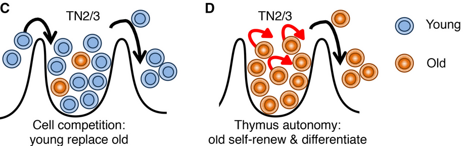
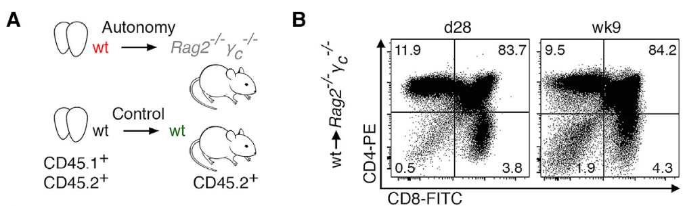

<!-- knit setup -->

```{r knit_setup, echo = FALSE}
knitr::opts_chunk$set(
  echo = TRUE,        # Print the code
  eval = TRUE,        # Run command lines
  message = FALSE,    # Print messages
  prompt = FALSE,     # Do not display prompt
  comment = NA,       # No comments on this section
  warning = FALSE,    # Display warnings
  tidy = FALSE,
  fig.align="center", 
  # results = 'hide',
  width = 100       # Number of characters per line
)
```


<!-- CSS to color chunks and outputs -->


```{css, echo=FALSE}
.notrun {
  background-color: lightgrey !important;
  border: 3px solid black !important;
}
.notruno {
  background-color: lightgrey !important;
  color : black !important;
}
.question {
  background-color: aquamarine !important;
  color : black !important;
  border: 3px solid limegreen !important;
}
.questiono {
  background-color: aquamarine !important;
  color : black !important;
}
.answer {
  background-color: navajowhite !important;
  border: 3px solid brown !important;
}
.answero {
  background-color: navajowhite !important;
  color : black !important;
}
.beyond {
  background-color: violet !important;
  border: 3px solid purple !important;
}
.beyondo {
  background-color: violet !important;
  color : black !important;
}
```


<!-- Hook to handle code blocks output folding -->

```{r knit_hook, echo = FALSE}
hooks = knitr::knit_hooks$get()
hook_foldable = function(type) {
  force(type)
  function(x, options) {
    res = hooks[[type]](x, options)
    
    if (isFALSE(options[[paste0("fold.", type)]])) return(res)
    
    paste0(
      "<details><summary>Show ", type, "</summary>\n\n",
      res,
      "\n\n</details>"
    )
  }
}
knitr::knit_hooks$set(
  output = hook_foldable("output"),
  plot = hook_foldable("plot")
)
```


------------------------------------------------------------------------

------------------------------------------------------------------------

<center></center>

------------------------------------------------------------------------

------------------------------------------------------------------------

# PREAMBLE

## Purpose of this session

This file describes the different steps to perform the quality control of
a single cell dataset, based on (per cell) :

*   the number of **UMI** (~transcripts) detected
*   the number of **expressed genes** detected
*   the proportion of UMI corresponding to **mitochondrial** genes
*   the proportion of UMI corresponding to **riboprotein-coding** genes
* the proportion of transcripts related to stress signature

**Input data**: A filtered, flat count matrix retrieved from GEO.

**Output data**: A Seurat object annotated for the "bad" cells to filter out for downstream analysis.


------------------------------------------------------------------------

------------------------------------------------------------------------

# Start Rstudio

-   Using the [OpenOnDemand cheat
    sheet](https://ifb-elixirfr.github.io/EBAII/2023/ebaiin1/SingleCell/2024_TD_OpenOnDemand.html){target="_blank"} **[LINK_TO_UPDATE]**,
    connect to the [OpenOnDemand
    portal](https://ondemand.cluster.france-bioinformatique.fr){target="_blank"} and
    **create a Rstudio session** with the right resource requirements, thanks to the cheat sheet.

------------------------------------------------------------------------

------------------------------------------------------------------------

# Warm-up

-   We now set **common parameters** as new variables, once and for all for this
session :

```{r setparam}
# setparam


## Set your project name
# WARNING : Do not just copy-paste this ! It's MY project name ! Put YOURS !!
project_name <- "ebaii_sc_teachers"


## Control if the project_name exists on the cluster
cat('PATH CHECK : ', dir.exists(paste0('/shared/projects/', project_name)))

## Seed for the RNG
my_seed <- 1337L

# ## Empty droplets max p-value
# max_p <- 1E-03

```

------------------------------------------------------------------------

------------------------------------------------------------------------

# Prepare the data structure 

## Main directory

```{r maindir}
# maindir

## Preparing the path
TD_dir <- paste0("/shared/projects/", project_name, "/SC_TD")

## Creating the root directory
# dir.create(path = TD_dir, recursive = TRUE)

## Print the root directory on-screen
print(TD_dir)

```

## Current session

```{r sessiondir}
# sessiondir

## Creating the session (Preproc.2) directory
session_dir <- paste0(TD_dir, "/02_Preproc.2")
dir.create(path = session_dir, recursive = TRUE)

## Print the session directory on-screen
print(session_dir)

```

## Input directory

```{r indir}
# indir

## Creating the INPUT data directory
input_dir <- paste0(session_dir, "/DATA")
dir.create(path = input_dir, recursive = TRUE)

## Print the input directory on-screen
print(input_dir)

```

## Genelists directory

This is a directory where we will store additional information from 
knowledge bases about genes used to estimate the cell cycle phase of cells.

```{r resdir}
# resdir

res_dir <- paste0(TD_dir, "/Resources")
glist_dir <- paste0(res_dir, "/Genelists")

## Create the directory
dir.create(path = glist_dir, recursive = TRUE)

## Print the resources directory on-screen
print(glist_dir)

```

## Output directory

```{r outdir}
# outdir

## Creating the OUTPUT data directory
output_dir <- paste0(session_dir, "/RESULTS")
dir.create(path = output_dir, recursive = TRUE)

## Print the output directory on-screen
print(output_dir)

```


------------------------------------------------------------------------

------------------------------------------------------------------------

# Prerequisites

We have to retrieve the input data file

```{r mat_dl}
# mat_dl

local <- FALSE

## The raw count matrix we will start from
scmat_source <- "GSM4861194_gex_2_raw_gene_expression.tsv.gz"

## Download the file from Zenodo
if (!local) {
  
  ### ZenID
  zen_id <- "14033941"
  ### Zen Path
  zen_backup_file <- paste0("https://zenodo.org/records/",
                            zen_id,
                            "/files/",
                            scmat_source)
  
  ## The path to the locally saved input file
  scmat_file <- paste0(input_dir,
                       '/',
                       scmat_source)
  ## Download the file
  download.file(url = zen_backup_file,
                destfile = scmat_file)
} else {
  ebaii_session <- '2538_eb3i_n1_2025'
  scmat_file <- paste0(
      '/shared/projects/',
      ebaii_session,
      '/atelier_scrnaseq/TD/BACKUP/TSV/',
      scmat_source)
}
```


------------------------------------------------------------------------

------------------------------------------------------------------------

# Load the genelists resources 

We retrieve the genelists

```{r gl_dl}
# gl_dl

local <- FALSE

## The genelist files
mito_source <- "mus_musculus_mito_symbols_20191015.rds"
ribo_source <- "mus_musculus_cribo_symbols_20191015.rds"
stress_source <- "mus_musculus_stress_symbols_20200224.rds"
gl_sources <- c(mito_source, ribo_source, stress_source)

## The (future) local files
mito_file <- paste0(input_dir, '/', mito_source)
ribo_file <- paste0(input_dir, '/', ribo_source)
stress_file <- paste0(input_dir, '/', stress_source)
gl_files <- c(mito_file, ribo_file, stress_file)

## Download the file from Zenodo
if (!local) {
  
  ### ZenID
  zen_id <- "14037355"
  ### Looping on files
  for (glf in seq_along(gl_sources)) {
    ### Zen Path
    zen_backup_file <- paste0("https://zenodo.org/records/",
                              zen_id,
                              "/files/",
                              gl_sources[glf])
    
    ## Download the file
    download.file(url = zen_backup_file,
                  destfile = gl_files[glf])
  }
  rm(gl_files)
} else {  ## Local mode
  ebaii_session <- '2538_eb3i_n1_2025'
  localbackup_dir <- paste0('/shared/projects/', ebaii_session, '/atelier_scrnaseq/TD/RESOURCES/GENELISTS/')
  mito_file <- paste0(localbackup_dir, '/mus_musculus_mito_symbols_20191015.rds')
  ribo_source <- paste0(input_dir, '/mus_musculus_cribo_symbols_20191015.rds')
  stress_source <- paste0(input_dir, '/mus_musculus_stress_symbols_20200224.rds')
}
```

------------------------------------------------------------------------

------------------------------------------------------------------------

# Biological context

For this series of training sessions, we will work on data from this [Paiva et al.](https://www.sciencedirect.com/science/article/pii/S2211124721002813) publication.

* The study concerns **thymus autonomy**:

  * The thymus is an "organ of passage", critical in its function to the adaptive immune system for the maturation of T cell lymphocytes.
  * This maturation involves two main steps, performed thanks to macrophages:
    * Positive selection : keeping cells that successfully develop react appropriately with MHC immune receptors of the body
    * Negative selection : keeping cells that do not react against natural proteins of the body.
  * Thymus _autonomy_ is a natural mechanism that allows to create T cells in the thymus by differentiation and cell competition, even when normal progenitors from the bone marrow are lacking, in critical conditions.
  * This mechanism is known in its effects, but the cells involved in are not.
  * This study is of importance in the health field, as this mechanism relies on a temporary loss of control of the cell normal functions.
  * The consequence is that if thymus is in autonomy for too long (few weeks), this is a prelude for leukemia !

<br>

<center></center>

<br>

* Organism is : **mus musculus**
* Individuals are : newborn **mice, grafted**
* The design corresponds to **two conditions** (Test / Control)
  * **Control** : thymus from **wild type** newborn mice transplanted into **wild type** juvenile mouse. In this control case, **donor** T-cells progenitors (DN3) were replaced by **host** cells **3 weeks** after transplantation.
  * **Test** : thymus from **wild type** newborn mice transplanted in **KO Rag-/-** type juvenile mouse (the KO partially impairs their ability to produce T-cell progenitors in normal amounts). In this test case, **donor** T-cells progenitors (DN3) were replaced by **host** cells **9 weeks** after transplantation, showing that the donor DN3 cells outlived their normal lifespan by ~6 weeks.
  
  <center></center>
  
You will mainly work on the **KO sample : `TD3A`**. 

The input data consists in a **count matrix**, as a gzipped tabular text file, that contains everything needed to create a basic Seurat object :

* The expressions **counts**
* The **feature names** (here, gene symbols)
* The **barcode names**

This matrix has already been **filtered for empty droplets**.

# Environment

We load the packages of interest:

```{r packages, message=FALSE, warning=FALSE}
# packages

library(dplyr)
library(ggplot2)
library(Seurat)

```

# Data

We load the count matrix:

```{r mat_load}
# mat_load

## Loading the matrix directly as a sparseMatrix
scmat <- scuttle::readSparseCounts(
    file = scmat_file, 
    sep = "\t")

## Displaying its size in-memory (this is a basic matrix)
format(utils::object.size(scmat), units = "auto")

```

```{r mat_desc}
# mat_desc

## A basic description of the matrix
dim(scmat)
scmat[c(1:5), c(1:5)]

```
We want to build a Seurat object from the count matrix.

But how do we do ??

<br>
<br>
<br>

```{r mat2seurat, class.source = c("fold-hide", "answer"), eval = FALSE}
# mat2seurat

?Seurat::CreateSeuratObject()

```

<br>
<br>
<br>

```{r make_sobj}
# make_sobj

sobj = Seurat::CreateSeuratObject(counts = scmat,
                                  assay = "RNA",
                                  project = "TD3A")
sobj

```

We do not need the count matrix anymore :

```{r rm_mat}
# rm_mat

rm(scmat)

```

We set the filtering thresholds based on quality control-related metrics.

Adjust them as necessary based on the figures.

```{r set_thresholds}
# set_thresholds

cut_nCount_RNA = 1000
cut_log10_nCount_RNA = log10(cut_nCount_RNA)
cut_nFeature_RNA = 750
cut_percent_mt = 5
cut_percent_rb = 20
cut_percent_st = 6

```

We define a nice palette to visualize the QC metrics:

```{r color_palette}
# color_palette

color_palette = c("lightgray", "#FDBB84", "#EF6548", "#7F0000", "black")

```


For the QC metrics related to the proportion of UMI belongs to a specific gene sets, we need to load the gene sets.

```{r load_lists}
# load_lists

## MITO
mito_symbols = readRDS(mito_file)
mito_symbols

## RIBO
ribo_symbols = readRDS(ribo_file)
ribo_symbols

## MECHANICAL STRESS
stress_symbols = readRDS(stress_file)
stress_symbols
```

We keep only the gene symbols available in our data :

```{r subset_symbols}
# subset_symbols

mito_symbols = intersect(mito_symbols, rownames(sobj))
mito_symbols

ribo_symbols = intersect(ribo_symbols, rownames(sobj))
ribo_symbols

stress_symbols = intersect(stress_symbols, rownames(sobj))
stress_symbols
```

**Note**: A more robust analysis may use the gene _identifiers_ (like EntrezID) rather than gene _symbols_.

# Quality controls

## Compute metrics

What is already available in the Seurat object ?

```{r see_metadata}
# see_metadata

head(sobj@meta.data)

```

How do the two first QC metrics vary ?

```{r summary_metadata}
# summary_metadata

summary(sobj@meta.data)

```

In the column `nCount_RNA`, the maximum is far from the third quartile. For visualization purpose, we transform this column to log10 scale.

```{r log10_ncount_RNA}
# log10_ncount_RNA

sobj$log10_nCount_RNA = log10(sobj$nCount_RNA)

summary(sobj@meta.data)

```

We compute the percentage of UMI related to each of the three list of genes.

First, we compute the proportion of transcripts related to mitochondrial genes, per cell.

```{r percent_mt}
# percent_mt

sobj = Seurat::PercentageFeatureSet(
  object = sobj,
  assay = "RNA",
  features = mito_symbols,
  col.name = "percent_mt")

summary(sobj$percent_mt)

```

Then, we compute the proportion of transcripts related to riboprotein-coding genes, per cell:

```{r percent_rb}
# percent_rb

sobj = Seurat::PercentageFeatureSet(
  object = sobj,
  assay = "RNA",
  features = ribo_symbols,
  col.name = "percent_rb")

summary(sobj$percent_rb)

```


Finally, we compute the proportion of transcripts related to mechanical stress signature, per cell :

```{r percent_st}
# percent_st

sobj = Seurat::PercentageFeatureSet(
  sobj,
  assay = "RNA",
  features = stress_symbols,
  col.name = "percent_st")

summary(sobj$percent_st)

```


We now have all the QC-related metrics:

```{r final_summary}
# final_summary

summary(sobj@meta.data)

```

## Failing cells

We identify the cells that do not pass the quality controls. This will be used for the visualization and later for cells filtering.

If the filtering thresholds are modified, do not forget to run again this chunk.

```{r fail_cells}
# fail_cells

fail_percent_mt = sobj@meta.data %>%
  dplyr::filter(percent_mt > cut_percent_mt) %>%
  rownames()

fail_percent_rb = sobj@meta.data %>%
  dplyr::filter(percent_rb > cut_percent_rb) %>%
  rownames()

fail_percent_st = sobj@meta.data %>%
  dplyr::filter(percent_st > cut_percent_st) %>%
  rownames()

fail_nCount_RNA = sobj@meta.data %>%
  dplyr::filter(nCount_RNA < cut_nCount_RNA) %>%
  rownames()

fail_nFeature_RNA = sobj@meta.data %>%
  dplyr::filter(nFeature_RNA < cut_nFeature_RNA) %>%
  rownames()

```

## Visualization

This is difficult to handle the distribution of these metrics across cells. We opt for various visualization ways:

* **histogram**, showing the distribution of the metric
* **violin plot**, showing the distribution of the metric, useful if several datasets are considered
* **UMAP** (or alternatively, tSNE), showing the distribution of the metric over a 2D projection of cells

You may choose one of these visualization ways.

To generate the UMAP 2D projection, we need to run multiple `Seurat` commands in a row. Understanding these commands is not the purpose of the current course, but will be detailed in the next few ones. So just run :

```{r quick_processing, message=FALSE, warning=FALSE}
# quick_processing

sobj_tmp = Seurat::NormalizeData(sobj, verbose = FALSE)
sobj_tmp = Seurat::ScaleData(sobj_tmp, verbose = FALSE)
sobj_tmp = Seurat::FindVariableFeatures(sobj_tmp, verbose = FALSE)
sobj_tmp = Seurat::RunPCA(sobj_tmp, npcs = 21, verbose = FALSE)
sobj_tmp = Seurat::RunUMAP(sobj_tmp, dims = c(1:20), verbose = FALSE)

```

We can now visualize the cells on a 2D projection:

```{r visualize_cells, fig.width = 8, fig.height = 8}
# visualize_cells

Seurat::DimPlot(object = sobj_tmp,
                reduction = "umap") + Seurat::DarkTheme()

```

### Define a R function

We want to visualize our different metrics, but using the same kind of plots. Instead of copying-pasting and editing the same code multiple times (this is time-consuming and error-prone), we design a **function** using the template below:

```{r my_function_name, eval = FALSE}
# my_function_name

my_function_name = function(param1, param2) {
  # do something with the parameter values
  output = "something"
  
  return(output)
}

```

Here is the function we will use :

```{r qc_print_function}
# qc_print_function

print_1_qc_metric = function(object = sobj,
                             qc = "log10_nCount_RNA",
                             cut_qc = cut_log10_nCount_RNA,
                             failing_cells = fail_nCount_RNA) {
  # Description of the parameters:
  # - sobj : the Seurat object, with default value to the one
  # - qc : CHARACTER : the QC metric, must be a column in sobj@meta.data
  # - cut_qc : NUMERIC : the filtering threshold for the QC metric
  # - failing_cells : CHARACTER VECTOR : the cells that fail the QC
  
  # Histogram
  p_hist = ggplot(object@meta.data, aes(x = .data[[qc]])) +
    geom_histogram(aes(y = after_stat(density)),
                            colour = "black", fill = "#F8766D", bins = 100) +
    geom_density(alpha = 0, col = "blue", lwd = 0.75) +
    geom_vline(xintercept = cut_qc, col = "red") +
    labs(title = paste0("Threshold for ", qc, " is: ", cut_qc)) +
    theme_classic() +
    theme(plot.title = element_text(hjust = 0.5))
  
  # Violin plot
  p_violin = Seurat::VlnPlot(object, features = qc) +
    geom_hline(yintercept = cut_qc, col = "red") +
    theme(axis.title.x = element_blank(),
                   legend.position = "none")
  
  # Feature plot
  p_umap = Seurat::FeaturePlot(object,
                               reduction = "umap",
                               features = qc) +
    scale_color_gradientn(colors = color_palette) +
    theme(aspect.ratio = 1)
  
  # Dim plot
  object$failorpass = ifelse(colnames(object) %in% failing_cells,
                             yes = "fail", no = "pass") %>%
    as.factor()
  
  p_fail = Seurat::DimPlot(object,
                           group.by = "failorpass",
                           order = "fail") +
    scale_color_manual(values = c("#F8766D", "gray80"),
                                breaks = levels(object$failorpass)) +
    labs(title = qc,
                  subtitle = paste0(length(failing_cells), " cells fail (",
                                    round(100*length(failing_cells)/ncol(sobj), 2), " %)")) +
    theme(aspect.ratio = 1,
                   plot.title = element_text(hjust = 0.5),
                   plot.subtitle = element_text(hjust = 0.5))
  
  
  ## If we applied the filter
  objectf = subset(object, cells = colnames(object)[object$failorpass == 'pass'])
  objectf = Seurat::ScaleData(objectf, verbose = FALSE)
  objectf = Seurat::FindVariableFeatures(objectf, verbose = FALSE)
  objectf = Seurat::RunPCA(objectf, npcs = 21, verbose = FALSE)
  objectf = Seurat::RunUMAP(objectf, dims = c(1:20), verbose = FALSE)

  p_umapf = Seurat::FeaturePlot(object = objectf,
                               reduction = "umap",
                               features = qc) +
    scale_color_gradientn(colors = color_palette) +
    theme(aspect.ratio = 1)
  
  # Patchwork
  p = patchwork::wrap_plots(p_umap, p_fail, p_hist, p_violin, p_umapf) +
    patchwork::plot_layout(nrow = 1, widths = c(1, 1, 2, 1, 1))
  
  return(p)
}

```

### Number of UMI

#### Check the function

This function should directly work for `log10_nCount_RNA`, as it is set for this metric by default (`qc = "log10_nCount_RNA"`) :

```{r check1_log10_nCount_RNA, fig.width = 18, fig.height = 4}
# check1_log10_nCount_RNA

print_1_qc_metric(object = sobj_tmp)

```

Of course, it will work the same by expliciting all of the parameters value:

```{r check2_log10_nCount_RNA, fig.width = 18, fig.height = 4}
# check2_log10_nCount_RNA

print_1_qc_metric(object = sobj_tmp,
                  qc = "log10_nCount_RNA",
                  cut_qc = cut_log10_nCount_RNA,
                  failing_cells = fail_nCount_RNA)

```

So we can copy-paste only this chunk for the next QC metrics !

### Number of expressed genes

```{r see_nFeature_RNA, fig.width = 18, fig.height = 4}
# see_nFeature_RNA

print_1_qc_metric(object = sobj_tmp,
                  qc = "nFeature_RNA",
                  cut_qc = cut_nFeature_RNA,
                  failing_cells = fail_nFeature_RNA)

```

### Mitochondrial genes expression

```{r see_percent_mt, fig.width = 18, fig.height = 4}
# see_percent_mt

print_1_qc_metric(object = sobj_tmp,
                  qc = "percent_mt",
                  cut_qc = cut_percent_mt,
                  failing_cells = fail_percent_mt)

```

### Riboprotein-coding genes expression

```{r see_percent_rb, fig.width = 18, fig.height = 4}
# see_percent_rb

print_1_qc_metric(object = sobj_tmp,
                  qc = "percent_rb",
                  cut_qc = cut_percent_rb,
                  failing_cells = fail_percent_rb)

```

Actually, **we won't filter out** cells expressing high levels of riboprotein-coding genes for this dataset :

```{r fail_cells_rb}
# fail_cells_rb

cut_percent_rb <- 100

fail_percent_rb = sobj@meta.data %>%
  dplyr::filter(percent_rb > cut_percent_rb) %>%
  rownames()

```

### Mechanical stress genes expression

```{r see_percent_st, fig.width = 18, fig.height = 4}
# see_percent_st

print_1_qc_metric(object = sobj_tmp,
                  qc = "percent_st",
                  cut_qc = cut_percent_st,
                  failing_cells = fail_percent_st)

```

As we have finished with the visualization, we can discard our temporary object :

```{r rm_sobj_tmp}
# rm_sobj_tmp

rm(sobj_tmp)

```

### All metrics effect


We can visualize metrics filtering effect as an **upset-plot**

```{r bcupset, class.source="notrun", class.output="notruno"}
# bcupset

## Create a list of all cells filtered OUT for each criterion
up_list <-list(
  "nFeature" = fail_nFeature_RNA,
  "nCount" = fail_nCount_RNA,
  "%MITO" = fail_percent_mt,
  "%RIBO" = fail_percent_rb,
  "%STRESS" = fail_percent_st)

## Create an upset-plot
UpSetR::upset(data = UpSetR::fromList(up_list), 
              nintersects = NA, 
              sets = rev(names(up_list)),
              keep.order = TRUE,
              order.by = "freq")

```

# Filtering ?

We could filter out cells based on these 5 QC metrics now. It is also possible to wait, perform various annotations such as cell type annotation or cell cycle phase scoring, to better characterize the low quality cells.

To filter a Seurat object, we use the `Seurat::subset()` function:

```{r filter_sobj}
# filter_sobj

sobj_filtered = subset(sobj, invert = TRUE,
                       cells = unique(c(fail_nCount_RNA, fail_nFeature_RNA,
                                        fail_percent_mt, fail_percent_rb,
                                        fail_percent_st)))

sobj_filtered

```

We are **not going to save** this filtered Seurat object, but we want to store in our `sobj` Seurat object the cells that failed the QC as a new cell metadata :

```{r add_fail_qc}
# add_fail_qc

sobj$fail_qc = ifelse(test = colnames(sobj) %in% colnames(sobj_filtered),
                      yes = "pass",
                      no = "fail")

table(sobj$fail_qc)

```


# Save

We save the **unfiltered** Seurat object:

```{r saverds1, fold.output = FALSE}
# saverds1

## Save our Seurat object (rich naming)
out_name <- paste0(
          output_dir, "/", paste(
            c("02", Seurat::Project(sobj), "S5", 
              "Metrics", paste(
                dim(sobj), 
                collapse = '.'
              )
            ), collapse = "_"),
            ".RDS")

## Check
print(out_name)

## Write on disk
saveRDS(object = sobj, 
        file = out_name)

```

This Seurat object would then be loaded as the input for further analyses.


# R session

This is a good practice to show the version of the packages used in this notebook.

```{r rsession, class.source = "fold-hide"}
# rsession

sessionInfo()

```

