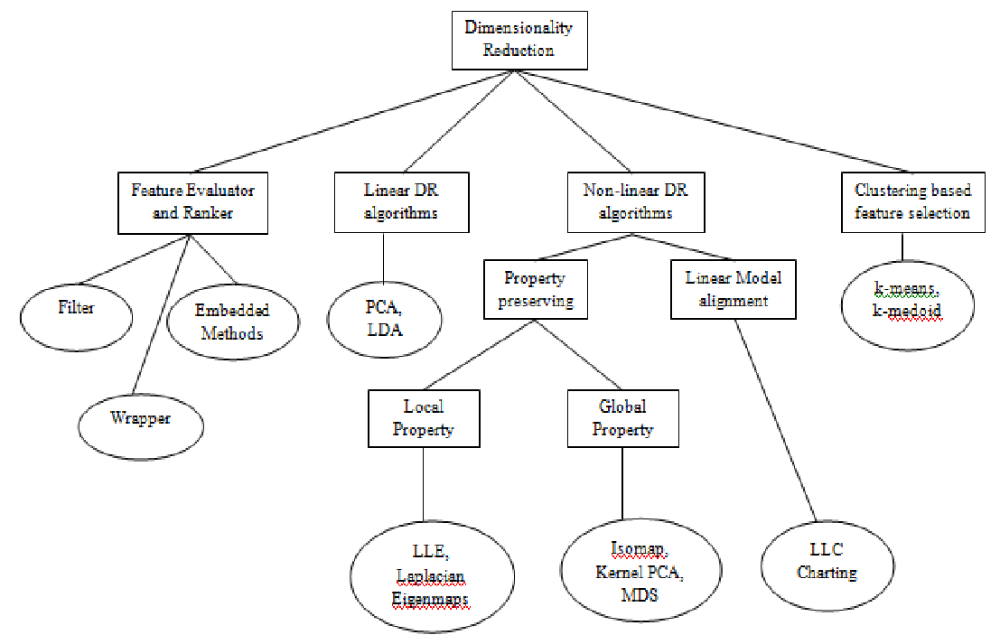
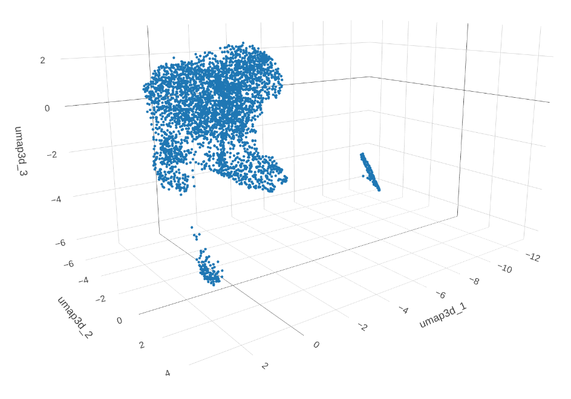

<!-- knit setup -->

```{r knit_setup, echo = FALSE}
knitr::opts_chunk$set(
  echo = TRUE,        # Print the code
  eval = TRUE,        # Run command lines
  message = FALSE,    # Print messages
  prompt = FALSE,     # Do not display prompt
  comment = NA,       # No comments on this section
  warning = FALSE,    # Display warnings
  tidy = FALSE,
  fig.align="center", 
  # results = 'hide',
  width = 100       # Number of characters per line
)
```

<!-- CSS to color chunks and outputs -->

```{css, echo=FALSE}
.notrun {
  background-color: lightgrey !important;
  border: 3px solid black !important;
}
.notruno {
  background-color: lightgrey !important;
  color : black !important;
}
.question {
  background-color: aquamarine !important;
  color : black !important;
  border: 3px solid limegreen !important;
}
.questiono {
  background-color: aquamarine !important;
  color : black !important;
}
.answer {
  background-color: navajowhite !important;
  border: 3px solid brown !important;
}
.answero {
  background-color: navajowhite !important;
  color : black !important;
}
.beyond {
  background-color: violet !important;
  border: 3px solid purple !important;
}
.beyondo {
  background-color: violet !important;
  color : black !important;
}
```

<!-- Hook to handle code blocks output folding -->

```{r knit_hook, echo = FALSE}
hooks = knitr::knit_hooks$get()
hook_foldable = function(type) {
  force(type)
  function(x, options) {
    res = hooks[[type]](x, options)
    
    if (isFALSE(options[[paste0("fold.", type)]])) return(res)
    
    paste0(
      "<details><summary>Show ", type, "</summary>\n\n",
      res,
      "\n\n</details>"
    )
  }
}
knitr::knit_hooks$set(
  output = hook_foldable("output"),
  plot = hook_foldable("plot")
)
```

------------------------------------------------------------------------

------------------------------------------------------------------------

<center></center>

------------------------------------------------------------------------

------------------------------------------------------------------------

# PREAMBLE

## Purpose of this session

This file describes the different steps to perform **fifth** part of the data processing for the single cell RNAseq data analysis training course for the **EBAII n1 2025**, covering these steps :

-   **Dimension reduction** of the expression data

-   **Visualization** of cells expression in a 2-D space

-   Unsupervised **clustering** of cells

-   **Description** of the defined clusters

------------------------------------------------------------------------

------------------------------------------------------------------------

# Start Rstudio

-   Using the [OpenOnDemand cheat
    sheet](https://ifb-elixirfr.github.io/EBAII/2023/ebaiin1/SingleCell/2024_TD_OpenOnDemand.html),
    connect to the [OpenOnDemand
    portal](https://ondemand.cluster.france-bioinformatique.fr) and
    **create a Rstudio session** with the right resource requirements.

# Warm-up

-   We set **common parameters** we will use throughout this session :

```{r setparam}
# setparam


## Set your project name
# WARNING : Do not just copy-paste this ! It's MY project name ! Put YOURS !!
project_name <- "ebaii_sc_teachers"


## Control if the project_name exists on the cluster
cat('PATH CHECK : ', dir.exists(paste0('/shared/projects/', project_name)))

## Seed for the RNG
my_seed <- 1337L

## Known marker genes for TD3A
td3a_markers <- c("Apoe", "Birc5", "Plac8", "Itm2a", "Ptcra", "Trbv29", "Isg15", "Cldn10")

```

------------------------------------------------------------------------

------------------------------------------------------------------------

# Prepare the data structure

We will do the same as for former steps, just changing the session name
:

## Main directory

```{r maindir, fold.output = FALSE}
#maindir

## Preparing the path
TD_dir <- paste0("/shared/projects/", project_name, "/SC_TD")

## Creating the root directory
dir.create(path = TD_dir, recursive = TRUE)

## Print the root directory on-screen
print(TD_dir)

```

## Current session

```{r sessiondir, fold.output = FALSE}
# sessiondir

## Creating the session (Preproc.2) directory
session_dir <- paste0(TD_dir, "/05_Proc.2")
dir.create(path = session_dir, recursive = TRUE)

## Print the session directory on-screen
print(session_dir)

```

## Input directory

```{r indir, fold.output = FALSE}
#indir

## Creating the INPUT data directory
input_dir <- paste0(session_dir, "/DATA")
dir.create(path = input_dir, recursive = TRUE)

## Print the input directory on-screen
print(input_dir)

```

## Output directory

```{r outdir, fold.output = FALSE}
#outdir

## Creating the OUTPUT data directory
output_dir <- paste0(session_dir, "/RESULTS")
dir.create(path = output_dir, recursive = TRUE)

## Print the output directory on-screen
print(output_dir)

```

------------------------------------------------------------------------

------------------------------------------------------------------------

# Reload the Seurat Object

-   We can reload the object we saved at the former step

```{r dataload}
##  dataload

## The latest Seurat object saved as RDS (name)
sobj_file <- "08_TD3A_S5_Scaled.2k_Reg.PCrb_12508.4035.RDS"

## The latest Seurat object saved as RDS (full path)
sobj_path <- paste0(TD_dir, 
                    "/04_Proc.1/RESULTS/",
                    sobj_file)

force <- FALSE  ## To force a re-download of a Zenodo-hosted backup
local <- FALSE  ## To force a loading from a local backup

## In case of error/lost data : force a reload from a Zenodo backup repository
if(force) {
  zen_id <- "14035293"
  zen_backup_file <- paste0("https://zenodo.org/records/",
                            zen_id,
                            "/files/",
                            sobj_file)
  ## Recreate the expected path if it does not exist
  dir.create(path = dirname(sobj_path), recursive = TRUE)
  ## Download the file
  download.file(url = zen_backup_file,
                destfile = sobj_path)
}

## In case of error/lost data : force a reload from a local backup repository
if(local) {
  sobj_path <- paste0(
    "/shared/projects/2422_ebaii_n1/atelier_scrnaseq/TD/BACKUP/RDS/",
    sobj_file)
}

## Load the object
sobj <- readRDS(file = sobj_path)

```

------------------------------------------------------------------------

------------------------------------------------------------------------

# Dimension reduction

This step originates from the observation that we do not want nor need to characterize **each** of our **thousends of cells**, but **groups** of them (clusters ? cell types ? other ?). Thus, we do no need all data, and even may benefit from such a reduction :

-   Reduce the data complexity

    -   For **interpretation**

    -   For **computations**
    
-   Increase the quality of information contained in the data

    -   **Enriching** "good" biological **signals**
    
    -   **Discarding noise** / cell-specific signals

There is a **multitude of methods** for dimension reduction
<center></center>


## Principal Component Analysis (PCA)

Here, we will use the grand-mother of all : the PCA (Principal Component Analysis)

```{r h_RunPCA, eval = FALSE}
# h_runPCA

?Seurat::RunPCA()

```

**Questions : ⭍⭍ Lightning quizz ⭍⭍ ** : 

```{r q_pca1, class.source="question", eval = FALSE}
# q_pca1

How many principal components (PC) will be generated by default ?

```

<br>

```{r a_pca1, class.source = c("fold-hide", "answer"), eval = FALSE}
# a_pca1

## . The answer is 50 (npcs parameter)
##
## . We will use this default value.
##
## . Warning : in some (rare) contexts, this
##   may not be enough !

```

<br>

```{r q_pca2, class.source="question", eval = FALSE}
# q_pca2

Which data type (ie, which Seurat object layer) will be used 
to generate the components ?

```

<br>

```{r a_pca2, class.source = c("fold-hide", "answer"), eval = FALSE}
# a_pca2

## . Data from the scale.data layer will be used
##
## . This is unfortunately not really explicit
##   from the Seurat::RunPCA help page ! (see the "features"
##   part)
##
## . Web search : "which slot is used by RunPCA"
##"
## . When run on a Seurat object without @scale.data layer :
##   "Error in GetAssayData(object, assay.type = assay.type, slot = "scale.data") : 
##   Object@scale.data has not been set. Run ScaleData() and then retry."

```

<br>

Perform PCA on our data

```{r pca}
# pca

## Note : a seed is used here !
sobj <- Seurat::RunPCA(
  object = sobj, 
  assay = 'RNA', 
  seed.use = my_seed, 
  verbose = FALSE)

```

<br>

Description :

```{r PCAdesc, class.source="notrun", class.output="notruno", eval = FALSE}
# PCAdesc

## Please, focus on the "reductions" slot
View(sobj)

```

<br>

Visualization of the very first **two components**, with cells coloring according to the estimated **cell cycle phase** :

```{r PCAplot}
# PCAplot

## Scatter plot along dimensions
Seurat::DimPlot(
  object = sobj, 
  ## First two components
  dims = c(1,2), 
  ## Color dots per cell phase groups
  group.by = 'CC_Seurat_Phase', 
  ## Data to use
  reduction = 'pca')

```

<br>

## Questions

```{r q_pca3, class.source="question", eval = FALSE}
# q_pca3

Give us your interpretation / feelings from this plot !

```

<br>

```{r q_pca4, class.source="question", eval = FALSE}
# q_pca4

Should we limit ourselves to using 2 dimensions to interpret our data ?

```

<br><br><br>

-   Maybe we shoud **reduce** information a tad **more**, just for the sake of ... 

    -   ... understanding our data ...

    -   ...with our **poor human brains** ...

    -   ... born and raised in a 3D **euclidean world** !

<!-- ASCII ART GENERATOR I'M WITH STOOPID -->

```{r stoopid, class.source = c("fold-hide", "notrun")}
##
##     __              .___/\                .__  __  .__                __               .__    .___ ._.
##    / /   ______     |   )/_____   __  _  _|__|/  |_|  |__     _______/  |_ __ ________ |__| __| _/ | |
##   / /   /_____/     |   |/     \  \ \/ \/ /  \   __\  |  \   /  ___/\   __\  |  \____ \|  |/ __ |  | |
##   \ \   /_____/     |   |  Y Y  \  \     /|  ||  | |   Y  \  \___  \ |  | |  |  /  |_> >  / /_/ |   \|
##    \_\              |___|__|_|  /   \/\_/ |__||__| |___|  / /____  / |__| |____/|   __/|__\____ |   __
##                               \/                        \/       \/             |__|           \/   \/
##
```


------------------------------------------------------------------------

------------------------------------------------------------------------

# Visualization

This final processing step need to finally **observe** our data requires a novel dimension reduction method with a very high challenge to overcome : reduce a space of dozens of dimensions to **just a few** !

We will use the [**UMAP**](https://en.wikipedia.org/wiki/UMAP){target="_blank"} method.

## Uniform Manifold Approximation and Projection (UMAP)

How ?

```{r humap, class.source="notrun", class.output="notruno", eval = FALSE}
# humap

?Seurat::RunUMAP()

```

### Select dimensions

We generated **50 PCA components** from our ~12 K features

-   These 50 dimensions may **not all** contain **valuable** information

-   We should try do **select the most useful** ones and **discard** the remaining **noise**

-   But **how many** should we keep ?

-   **Question** : 

    ```{r q_ndim1, class.source="question", eval = FALSE}
    # q_ndim1
    
    Do you have an idea about this number ?
    
    ```
    
    <br>

    ```{r r_ndim1, class.source = c("fold-hide", "answer"), eval = FALSE}
    # r_ndim1
    
    ## . Impossible to guess with our current knowledge.
    ##
    ## . But we can get some help from the PCA data itself
    ##
    ## . If you said a value above the 50 components we
    ##   generated for our PCA, you should wear the
    ##   cone of shame !
    
    ```
    
    <br>

There are **several** methods to help us choose.

Several, but **none perfect**.

We will use a very **simple, graphical** method : the observation of the amount of global variance explained by each component, through the `elbow-plot`.

<br>
<center></center>
<br>

```{r h_elbow, class.source="notrun", class.output="notruno", eval = FALSE}
# h_elbow

?Seurat::ElbowPlot()

```

<br>

Apply on our data :

```{r elbow}
# elbow

## Perform the "elbow plot"
Seurat::ElbowPlot(
  object = sobj, 
  reduction = 'pca',
  ndims = 50)

```

<br>

**Question** : 

```{r q_ndim2, class.source="question", eval = FALSE}
# q_ndim2

Any more precise idea, now ?

```

<br>

```{r r_ndim2, class.source = c("fold-hide", "answer"), eval = FALSE}
# r_ndim2

## . The contribution to the variance (sd²) seems
##   greatly reduced after 30 PCs.
##
## . Maybe something between ~15 and ~30 should do
##   the trick ?
```

<br>

### Assess dimensions

To demonstrate the **effect** of the number of PC dimensions used as input to the UMAP generation, we will perform a comparison using `6` different amounts of retained PCs :

<br>
<CENTER>**TeAmWoRk TiMe !**
<br>

</CENTER>
<br>

We will dispatch the assessment of each amount of dimensions to groups 
of trainees.

```{r dim_sel, fig.width = 24, fig.height = 12}
# dim_sel

## PCA max dimensions to evaluate
pca_dims <- c(3, 7, 17, 25, 30, 40)

## Define a function to compute the UMAP
pca_dim_eval <- function(object = NULL, dim.max = 2, my_seed = 1337L) {
  
  message('\nRunning UMAP with ', dim.max, ' dimensions ...\n')
  
  ## RunUMAP
  object <- Seurat::RunUMAP(
    object = object, assay = "RNA", 
    reduction = "pca", dims = 1:dim.max, 
    seed.use = my_seed)
  
  ## Plot
  dpN <- Seurat::DimPlot(
    object = object, 
    reduction = 'umap',
    combine = TRUE) + ggplot2::ggtitle(
      label = paste0("Dim : ", dim.max)) + Seurat::DarkTheme()
  
  ## Clean
  rm(object)
  
  ## Return the plot object
  return(dpN)
}

## Run the function on multiple dimensions, get a list of ggplots
pca_eval_res <- lapply(X = pca_dims,
                       FUN = function(p) {
                         pca_dim_eval(object = sobj, 
                                      dim.max = p,
                                      my_seed = my_seed)
                       })

## Plot the list alltogether
patchwork::wrap_plots(pca_eval_res, nrow = 2)

```

<br>

**Question**

```{r q_ndim3, class.source="question", eval = FALSE}
# q_ndim3

Any more precise idea, now, FOR REAL ?

```

<br>

```{r r_ndim3, class.source = c("fold-hide", "answer"), eval = FALSE}
# r_ndim3

## . A limited amount of PCs is not able to capture
##   enough information (variation) to build a sufficiently 
##   defined topology.
##
## . The differences in the global topology is
##   is quite limited between the higher PCs versions.
##
## . This may imply that the additional
##   components above 20~25 do not add more 
##   information (neither more noise, in this case).

```

<br>

We can now perform the final UMAP with the PC dimensions of your choice.

<br>

### Create the UMAP

For the next steps of the training, we will use **`20`** PCA dimensions.

```{r umap20}
# umap20

## Fixing n_dim
n_dim <- 20

## Using 20 PCs
## A seed is needed here !
sobj <- Seurat::RunUMAP(
    object = sobj, assay = "RNA", 
    reduction = "pca", 
    dims = 1:n_dim, 
    seed.use = my_seed)

## DimPlot
umap2d <- Seurat::DimPlot(
  object = sobj, 
  reduction = 'umap') + Seurat::DarkTheme()
print(umap2d)

```

<br>

## Bonus : 3D UMAP (DEMO)

While by default Seurat::RunUMAP will produce 2-dimension reductions, the method can generate further components.

Despite our limited brain, this is sometimes interesting and useful to attempt a reduction to 3 dimensions instead of 2. This can be very effective when looking for trajectories.

We can generate a UMAP with 3 components, from the 20 PCs :

```{r umap3D20, class.source="notrun", class.output="notruno"}
# umap3D20

## UMAP from 20 PCs, 3 components requested
sobj_U3D <- Seurat::RunUMAP(
  object = sobj, assay = 'RNA', 
  graph.name = 'RNA_snn', 
  reduction = 'pca', 
  reduction.name = 'umap3d',
  dims = 1:n_dim, 
  seed.use = my_seed,
  n.components = 3)

```

We can plot the two first UMAP components from this 3D space :

```{r, class.source="notrun", class.output="notruno", fig.width = 8, fig.height = 8}
# plot_umap3D20

## DimPlot of the first 2 UMAP components
umap3d <- Seurat::DimPlot(
  object = sobj_U3D, 
  dims = c(1,2),
  reduction = 'umap3d') + Seurat::DarkTheme()
print(umap3d)

```

<br>

**Question** : 

```{r q_umap3D, class.source="question", eval = FALSE}
# q_umap3D

Isn't there something striking ?

```

<br>

```{r a_umap3D, class.source = c("fold-hide", "answer"), eval = FALSE}
# a_umap3D

## . The plot is not the same as when
##   using 25 PCs when requesting 3 UMAP
##   components instead of 2 !
##
## . The 2 components of a 2D UMAP are not
##   the same as the two first components
##   of a dim>2 UMAP.

```

<br>

```{r umapXd, class.source="notrun", class.output="notruno", fig.width = 16, fig.height = 8 }
# umapXd

patchwork::wrap_plots(
  list(
    umap2d & ggplot2::ggtitle(label = "UMAP (2D)"),
    umap3d & ggplot2::ggtitle(label = "UMAP (3D)")), 
  nrow = 1)

```

<br>

Let's perform a 3D representation of our UMAP (PRE-RENDERED)

```{r umap3D20rgl, class.source="notrun", class.output="notruno", eval = FALSE}
# umap3D20rgl

## 3D plot (not run as failing in interactive mode)
plotly::plot_ly(
  data = as.data.frame(Seurat::Reductions(
    object = sobj_U3D, 
    slot = "umap3d")@cell.embeddings),
  x = ~umap3d_1, 
  y = ~umap3d_2, 
  z = ~umap3d_3, 
  type = 'scatter3d', 
  marker = list(size = 2, width=2))

## Clean
rm(sobj_U3D)

```

<br>

<center></center>

<br>

------------------------------------------------------------------------

------------------------------------------------------------------------

<br>

# Save the Seurat object

We will save our Seurat object that now contains PCA and UMAP reductions  :

```{r saverds1, fold.output = FALSE}
# saverds1

## Save our Seurat object (rich naming)
out_name <- paste0(
          output_dir, "/", paste(
            c("09", Seurat::Project(sobj), "S5", 
              "DimRed.PCA", paste(
                dim(sobj), 
                collapse = '.'
              )
            ), collapse = "_"),
            ".RDS")

## Check
print(out_name)

## Write on disk
saveRDS(object = sobj, 
        file = out_name)

```

------------------------------------------------------------------------

------------------------------------------------------------------------

# Clustering

We can now attempt to determine how cells **are organized** in an **unsupervised** manner in this space

We will use the graph-based clustering method [Louvain](https://en.wikipedia.org/wiki/Louvain_method){target="_blank"}

Clustering will be performed on the **`PCA`** dimension reduction, 
**NOT** on the `UMAP` one !

```{r q_clust_on_PCA, class.source="question", eval = FALSE}
# q_clust_on_PCA

Any idea why ?

```

```{r a_clust_on_PCA, class.source=c("fold-hide", "answer"), class.output="answero"}
# a_clust_on_PCA

## . UMAP is a strong APPROXIMATION of the multidimensional space
##   which single purpose is to HELP us understand more easily the
##   hidden structure of our dataset.
##
## . The PCA component (or any reduction method used directly from our
##   normalized/scaled data, like MDS or ICA, ...) contains the "real" 
##   information, just distributed differently.
##
## . If one uses the "second reduced space" used for visualization (UMAP,
##   tSNE, DM, ...) as the basis for clustering, one may obtain pretty plots
##   with well-defined clusters. The latter being based on wrong data, thus
##   leading to wrong interpretation :(

```

<br>

## Find neighbors

Before running the Louvain method, a first pass method is used to generate a "K-Nearest Neighbour" graph (see more details [here](https://satijalab.org/seurat/articles/pbmc3k_tutorial.html){target="_blank"}).

```{r fnn20}
# fnn20

## Compute a SNN using the first 20 PCs
sobj <- Seurat::FindNeighbors(
  object = sobj, 
  dims = 1:20, 
  reduction = "pca")

```

## Louvain clustering

-   We will test multiple different resolutions

-   The Seurat function to perform clustering can be called with 
    multiple resolutions at once (less to code, lucky us !).
    
<br>
<CENTER>**TeAmWoRk TiMe !**
<br>

</CENTER>
<br>

We wil dispatch the different clustering resolution values to groups of trainees.

```{r clustL20}
# clustL20

## Louvain resolutions to test
resol <- c(.3, .6, .9, 1.2, 1.5, 1.8)

## Clustering
sobj <- Seurat::FindClusters(
  object = sobj, 
  resolution = resol,
  verbose = FALSE)

```

<br>

**Question**

```{r q_clustdesc, class.source="question", eval = FALSE}
# q_clustdesc

Could you tell us what changed in our object ?

```

<br>

```{r a_clustdesc, class.source=c("fold-hide", "answer"), class.output="answero", eval = FALSE}
# a_clustdesc

## Please, focus on the [meta.data] slot
View(sobj)

## . New entries in the barcodes metadata :
##   . The results of our clusterings
##   . 'seurat_clusters' which corresponds to the 
##     last version we ran
##
## . This 'seurat_clusters' annotation will be the
##   one used by default by Seurat for any further
##   analysis

```

<br>

## Assess resolutions

### On UMAPs

#### Clusters

Plotting UMAPs harboring the clustering results for our tested resolutions

```{r clust_dimplot, fig.width=18, fig.height=9}
# clust_dimplot

## Metadata name of clustering results (defined by default by Seurat)
resol_names <- paste0("RNA_snn_res.", resol)

## DimPlot
Seurat::DimPlot(
  object = sobj, 
  reduction = "umap", 
  group.by = resol_names,
  label = TRUE, 
  repel = TRUE)

```

<br>

```{r q_compres, class.source="question", eval = FALSE}
# q_compres

. Could you briefly compare the different versions ?

. Would you consider that some results are under/over-clustered ?

. Are all clusters well-defined ?

```

<br>
<br>

-   Something that might help (a bit) : `splitting` the clustering results :
    
    ```{r clust_dimplot_split, fig.width=18, fig.height=4}
    # clust_dimplot_split
    
    ## Looping on resolutions
    for (my_grp in resol_names) {
      ## DimPlot
      p <- Seurat::DimPlot(
        object = sobj, 
        reduction = "umap", 
        group.by = my_grp,
        split.by = my_grp,
        label = TRUE, 
        repel = TRUE)
      print(p)
    }
    ```
    
<br>

-   Something other : assessing clusters **stability** across resolutions,
    thanks to `clustree` (DEMO) :
    
    ```{r clustree_demo, class.source = "notrun", class.output = "notruno", fig.width = 6, fig.height = 8}
    # clustree_demo
    
    ## Full loading of clustree is needed here...
    library(clustree)
    
    ## Running clustree
    clustree::clustree(x = sobj, prefix = 'RNA_snn_res.')
    
    ## Unloading the clustree package
    detach('package:clustree', unload = TRUE)
    
    ```

#### Cell-type markers

We can plot the cell markers we already know

```{r u_markers, fig.width=12, fig.height=12}
# u_markers

## Multiple FeaturePlots with markers
Seurat::FeaturePlot(object = sobj, 
                    features = td3a_markers) + 
  patchwork::plot_layout(nrow = 3, 
                         ncol = 3)

```

<br>

Just for "fun" : what would have been seen on a PCA ? (DEMO)

```{r u_markers_pca, fig.width=12, fig.height=12, class.source="notrun", class.output="notruno"}
# u_markers_pca

## Multiple FeaturePlots with markers
Seurat::FeaturePlot(object = sobj, 
                    features = td3a_markers, 
                    reduction = "pca") + 
  patchwork::plot_layout(nrow = 3, 
                         ncol = 3)

```

<br>

### Cluster-specific markers

A practical way to characterize our clustering results is to get back to a level of knowledge you are confident in : marker genes.

Seurat has a handy function to :

-   Identify differential expressed genes specific to each and every provided category of cells (here, clustering results)

-   Draw a clusterized, annotated heatmap of these genes

```{r h_fam, class.source="notrun", class.output="notruno", eval = FALSE}
# h_fam

?Seurat::FindAllMarkers

```

```{r dhm_prep, fig.width=24, fig.height=8}
# dhm_prep

## Looping on clustering results
fam_all <- lapply(resol_names, function(r) {
  
  ## Find markers for all clusters
  ## A seed is needed here !
  Seurat::Idents(object = sobj) <- sobj[[r]][[1]]
  fam <- Seurat::FindAllMarkers(
    object = sobj, 
    logfc.threshold = .5, 
    only.pos = TRUE, 
    min.pct = .5, 
    verbose = FALSE,
    random.seed = my_seed)
  
  ## Get top gene per cluster
  famtop <- fam$gene[!duplicated(fam$cluster)]
  vln_pl <- Seurat::VlnPlot(object = sobj, features = famtop)
  print(vln_pl)
  
  ## Select top10 genes when available
  fam_rdx <- dplyr::group_by(.data = fam, cluster)
  fam_rdx <- dplyr::filter(.data = fam_rdx, avg_log2FC > 1)
  fam_rdx <- dplyr::slice_head(.data = fam_rdx, n = 10)
  dh <- Seurat::DoHeatmap(
    object = sobj, features = fam_rdx$gene, size = 3,
    combine = TRUE) + ggplot2::ggtitle(label = r)
  return(dh)
})


```

```{r dhm_plot, fig.width=24, fig.height=12}
# dhm_plot

## Plot all heatmaps at once
patchwork::wrap_plots(fam_all) + patchwork::plot_layout(nrow = 2)

```

<br>

**Questions** : Comparing the heatmaps :

```{r q_hm1, class.source="question", eval = FALSE}
# q_hm1

Which resolution would you choose, and why ?

```

<br>

```{r q_hm2, class.source="question", eval = FALSE}
# q_hm2

Is there a single one and only answer to the former question ?

```

<br>

### Clusters contingencies and proportions

One can observe how many cells are in each cluster, and what proportion of all cells these represent (DEMO)

```{r clust_pop, class.source="notrun", class.output="notruno"}
# clustpop

## Looping on resolutions
for (x in resol_names) {
  ## Contingencies
  print(table(sobj[[x]]))
  ## Proportions
  print(format(table(sobj[[x]]) / ncol(sobj), digits = 2))
  cat('\n\n')
}

```

<br>


## Selection

For the downstream analyses, we will use the resolution **`0.8`**.

We will fix the clustering results for this resolution as the default one
Seurat will use for any further analyses / plots, using the `Seurat::Idents()`
function.

```{r sel_res, fig.height=6, fig.width=6}
# sel_res

## Fixing l_res
l_res <- .8

## Performing Louvain clustering at the selected resolution
sobj <- Seurat::FindClusters(
  object = sobj, 
  resolution = l_res,
  verbose = FALSE)

## Check on default "Idents"
identical(
  x = SeuratObject::FetchData(
    object = sobj, 
    vars = paste0("RNA_snn_res.", l_res))[[1]],
  y = unname(Seurat::Idents(object = sobj))
)

## DimPlot without specifying the resolution
Seurat::DimPlot(
  object = sobj, 
  reduction = "umap", 
  label = TRUE, 
  repel = TRUE)

```

<br>

------------------------------------------------------------------------

------------------------------------------------------------------------

<br>

# Save the Seurat object

We will save our Seurat object that now contains our clustering results  :

```{r saverds2, fold.output = FALSE}
# saverds2

## Save our Seurat object (rich naming)
out_name <- paste0(
          output_dir, "/", paste(
            c("10", Seurat::Project(sobj), "S5", 
              paste0(
                "Clustered.",
                l_res), 
              paste(
                dim(sobj), 
                collapse = '.'
              )
            ), collapse = "_"),
            ".RDS")

## Check
print(out_name)

## Write on disk
saveRDS(object = sobj, 
        file = out_name)
```

<br>

------------------------------------------------------------------------

------------------------------------------------------------------------

<br><br><br>

# Rsession

```{r rsession, class.source="notrun", class.output="notruno"}
# rsession

utils::sessionInfo()

```
