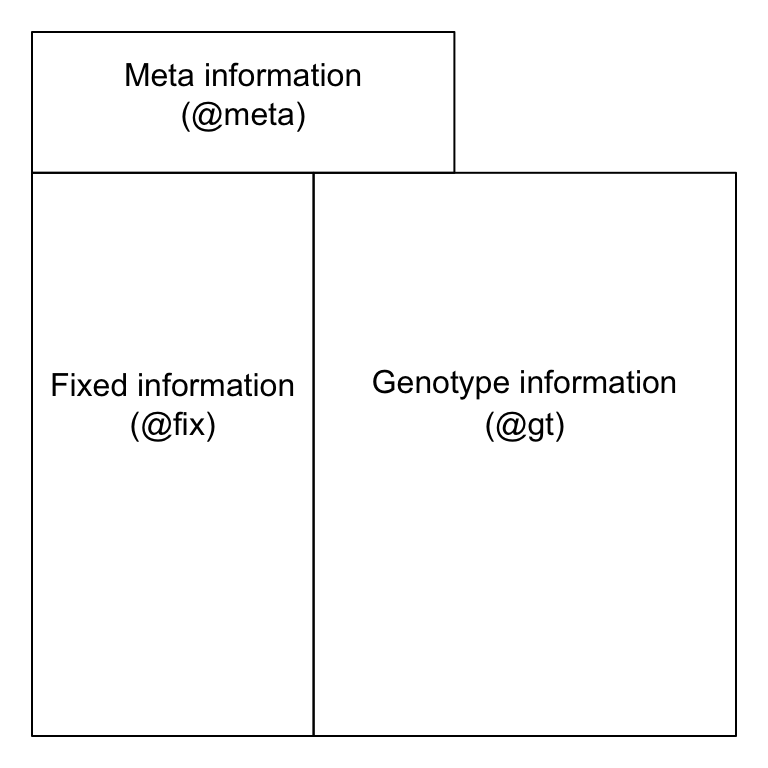
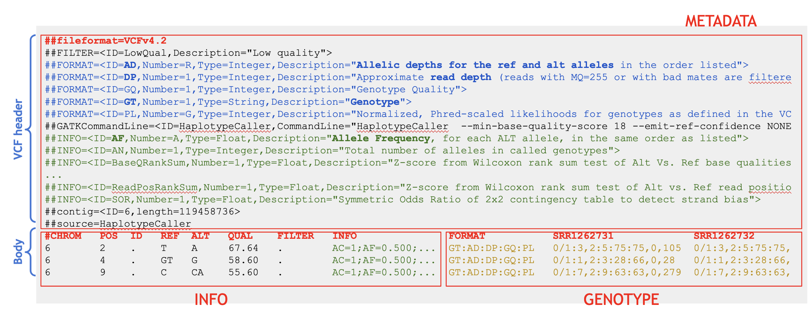

```{r setup, include=FALSE}
knitr::opts_chunk$set(echo = TRUE, warning = FALSE, message = FALSE, 
                      class.source="bg-success", 
                      out.width="70%", fig.align="center") 
```

# Objectif 
L'objectif de ce TP est de vous familiariser avec les packages R utilisés pour 
la manipulation et la visualisation de variations génomiques à partir de fichiers VCF.

# Jeux de données
Chez le bovin, il existe un locus de caractères quantitatifs (QTL) lié à 
la production de lait, situé sur le chromosome 6, et  plus exactement sur 
une région de 700 kb, composée de  7 gènes.

Les échantillons QTL+ sont caractérisés par une diminution de la production 
en lait et une augmentation des concentrations en protéine et lipide. 

| Nom d'échantillon    | Phénotype |
|------------|------|
| SRR1262731 | QTL- |
| SRR1205992 | QTL+ |
| SRR1205973 | QTL+ |

Quelle mutation est responsable du phénotype QTL+?

Le point d’entrée de ce TP sera le fichier multi-VCF généré par le workflow 
décrit dans les cours/TP ["Atelier Variants, niveau 1"](https://moodle.france-bioinformatique.fr/course/view.php?id=37).

# Extraire les variations génomiques du VCF (vcf -> tabelau)

L’objectif est d’extraire les variations génomiques à partir d’un fichier VCF, 
puis de parser et de normaliser les informations du champ INFO ainsi que 
les annotations qui y sont associées, afin de les représenter sous forme de 
table structurée : chaque ligne correspondant à un variant, et chaque colonne 
à une annotation ou une métrique spécifique liée à ce variant.

Définir le nom (+ chemin) du fichier VCF (one-sample, multi-samples)
```{r}
# le chemain vers le vcf
vcf_file <- "data/pool_GATK_annot.vcf"
```

On va utiliser le package R **vcfR**, qui est un ensemble d'outils conçu pour 
lire, écrire, manipuler et analyser les données au format VCF.
[vcfR documentation](https://knausb.github.io/vcfR_documentation/index.html)

Installer le package
```{r}
#install.packages("vcfR")
```

Charger le package
```{r}
library(vcfR)       
```


## Lire le fichier VCF

La fonction **read.vcfR()** du package **vcfR** permet de lire un fichier 
VCF/multi-VCF et de retourner un objet de la classe vcfR.

```{r}
# pour chercher l'aide : help(read.vcfR) / ?read.vcfR()
?read.vcfR()
```


```{r}
# Lire le fichier VCF
vcf <- vcfR::read.vcfR(file = vcf_file, verbose = FALSE)
```

L'objet vcf appartient à quelle classe :
```{r}
is(vcf) # ou class(vcf)
```

Cet objet est composé de :
```{r}
# Les slots correspondent aux éléments composant un objet de classe S4.
slotNames(vcf) 
```

* meta (meta-information) : entête du vcf
* fix (fixed information) : information par variant mais commune à tous les 
échantillons (position, allèles, qualité…)
* gt (genotype information) : information de génotypage par échantillon




Ces slots corresponds aux différents parties d'un fichier vcf.



## Convertir l'objet vcfR en objet tibble

La fonction **vcfR2tidy()** du package vcfR permet de convertir un objet vcfR 
en un data frame de type tibble, un format compatible avec les fonctions 
du tidyverse et plus facile à manipuler.

```{r vcfR2tidy}
vcf.tidy.list <- vcfR::vcfR2tidy(x = vcf)
```

On peut spécifier les champs que l'on souhaite conserver (voir l'exemple ci-dessous).
```{r}
#vcf.tidy.list <- vcfR2tidy(x = vcf.snv, 
#                           format_fields = c("GT", "AD", "DP"), 
#                           info_fields = c("AC", "AN", "MQ")) 
```

Cette fonction retourne une : 
```{r}
class(vcf.tidy.list)
```

Pour accéder aux noms des éléments de cette liste :
```{r}
names(vcf.tidy.list)
```

Pour accéder à un des éléments (tibbles) de cette liste :
```{r}
# vcf.tidy.list[["meta"]]
head(vcf.tidy.list[["meta"]])
head(vcf.tidy.list$meta)

```

La fonction **head()** permet d’afficher uniquement les 6 premières lignes d’un tableau.

Le tibble **meta** contient les informations présentes dans l’en-tête du fichier VCF.

!!! Attention : Les outils de variant calling n’utilisent pas toujours les mêmes 
noms de champs dans la colonne ID.

Le tibble **fix** contient les informations liées à chaque variation génomique.
```{r}
head(vcf.tidy.list[["fix"]])
```

Le nombre de ligne de ce tableau correspond au nombre de variations génomiques.
```{r}
dim(vcf.tidy.list[["fix"]]) # nrow() permet d'afficher que le nombre de lignes
```


Le tibble **gt** contient les inforamtions liées au génotype de chaque 
échantillon et pour chaque variation génomique.
```{r}
head(vcf.tidy.list[["gt"]])
```

Le nombre de ligne de ce tableau correspond au nombre de variations génomiques multiplier par le nombre d'échantillons.
```{r}
nrow(vcf.tidy.list[["gt"]]) # dim() permet d'afficher le nombre de lignes et le nombre de colonnes.
```

## Fusionner les deux tibbles $fix et $gt :
Pour cela on va utiliser la fonction full_join() du package **dplyr** pour 
fusionner les deux tableaux. Il faut commencer par definir les colonnes communes 
entre les deux tibbles. Dans notre cas c'est la colonne **ChromKey** et la colonne **POS**.

```{r}
library(dplyr) # manipulation des data
```


```{r}
# appliquer le merge
vcf.tidy <- dplyr::full_join(x = vcf.tidy.list[["fix"]], 
                             y = vcf.tidy.list[["gt"]],  
                             by = c("ChromKey", "POS"))
```

Afficher les 6 premières lignes du tibble fusionné.
```{r}
head(vcf.tidy)
```

La taille de ce tibble
```{r}
dim(vcf.tidy)
```

# Processer le tableau des variants
Cette étape permet de rendre le tableau des variants plus simple à manipuler.

## Retirer les variations multi-alleliques : (Qu’est ce que c’est ?)
Dans ce TP on va s’intéresser uniquement aux variations avec un allele alternatif. 
Dans le cas des variants multi-alléliques les valeurs de la colonne ALT 
contiennent une “,” pour séparer les différents allèles alternatifs.

Pour detecter ces cas on va utiliser la fonction **str_detect()** du package **stringr** 
qui permet de detecter un pattern dans un vecteur de chaines de caractères.

```{r}
library(stringr)
```

Example :
```{r}
fruits <- c("banane", "pomme", "mangue", "raisin", "kiwi")
index <- stringr::str_detect(string = fruits , pattern = "a")
index
```
La fonction **str_detect()** renvoie un vecteur de bouléens.

Pour récupérer la liste des fruits dont le nom contient la lettre 'a' :
```{r}
fruits[index]
```

Pour récuperer les noms de fruits qui ne contiennent pas la lettre 'a', 
on utilise le signe **!** pour inverser la condition.
```{r}
fruits[!index]
```

On va appliquer le même principe pour récupérer les variations génomiques avec 
un allèle unique. On va d'abord repérer les variations multi-alleliques grâce à 
la présence de **","** dans la colonne ALT.
```{r}
index <- stringr::str_detect(string = vcf.tidy[["ALT"]] , pattern = ",")
```

On va ensuite les retirer du tableau des variants. La fonction **filter()** du 
package **dplyr** permet de filtrer les lignes selon une ou plusieurs conditions.

```{r}
vcf.u.tidy <- dplyr::filter(vcf.tidy, !index)
```

```{r}
head(vcf.u.tidy)
```

## Définir un identifiant unique par variation :

Le champs ID renseigne un identifiant unique pour chaque variant. 
S’il n’est pas renseigné il est recommandé d’en créer un pour faciliter 
la manipulation des tableaux. 

Une variation est définie par sa position et par son allèle.

On va utiliser la fonction **unite()** du package **tidyr**, pour créer 
un identifiant qui est le résultat de la concaténation des colonnes : 
*CHROM*, *POS*, *REF* et *ALT*.

```{r}
# on commence par charger le package
library(tidyr) 
```

```{r}
?unite()
# unite(data, col, ..., sep = "_", remove = TRUE, na.rm = FALSE)
```


```{r}
vcf.u.tidy <- 
  tidyr::unite(data = vcf.u.tidy, col="ID", CHROM, POS, REF, ALT, sep="_", remove = FALSE)
```


```{r}
head(vcf.u.tidy)  
```

## Ajouter une colonne avec le type des variation (SNV/InDel)

Certains outils de variant-calling donnent l’info du type de variants dans le VCF. 
Ce n’est pas le cas de tous les outils!

Pour différencier les SNV des INDEL on teste le nombre de bases dans les colonnes 
REF et ALT. Si le nombre de bases est supéreur à 1 cela signifie que le variant 
est de type INDEL, sinon c'est un SNV. Pour effectuer ce test on va utiliser la 
fonction **if_else()** du package **dplyr** combiner à la fonction **mutate()** 
de **dplyr** afin de rajouter une colonne avec le type de variations.

Pour calculer le nombre de bases (caractères) de l’allèle alternatif ou de 
l’allèle de référence, on utilise la fonction **str_length()** du package **stringr**.

Exemple d'utilisation de **if_else()** et de **str_length()**
```{r}
?if_else()
#if_else(condition, true, false, ...)

alt <- c("AA", "C", "AT", "G")
if_else(str_length(alt) == 1, "?", "INDEL")
```

On va appliquer ce principe sur nos données. On va rajouter une colonne nommée
*var_type* avec le type de variations.
```{r}
vcf.u.tidy <- 
  dplyr::mutate(
    vcf.u.tidy, 
    var_type = if_else(str_length(REF) == 1 & str_length(ALT) == 1, "SNV", "INDEL"))
```

La fonction **select()** du package **dplyr** permet de selectionner 
les colonnes que on souhaite garder ou visualiser dans ce cas.
```{r}
dplyr::select(vcf.u.tidy, ID, var_type, Indiv) |> head()
```

# Contrôle qualité

Le champs INFO contient plusieurs métriques qui vont nous permettre d’évaluer la qualité de nos variants, comme par exemple QUAL, MQ, DP...etc

Le meilleur moyen d’accèder à ces metriques est d'afficher leur distribution sous forme de graphe. Pour cela on va utiliser les fonctions du package **ggplot2**. La visualisation des différents métriques nous permet de voir la qualité de nos données mais aussi de définir les filtres et les seuils à appliquer.

## Score qualité (colonne QUAL)

```{r}
dplyr::select(vcf.u.tidy, ID, QUAL, Indiv)
```

Pour visualiser la distribution de la qualité on va utiliser les fonctions du package **ggplot2**.

```{r}
library(ggplot2)
```

La fonction **geom_density()** permet de représenté la densité de nos scores de qualité.
Il est possible de superposer des graphes sur le même fond. La fonction **geom_vline()** nous permet de tracer une ligne verticale pour représenter le cut-off qui sera utilisé pour filtrer.

```{r}
p <- ggplot(data = vcf.u.tidy, aes(x = QUAL))
p <- p + geom_histogram()
p <- p + xlim(0,500) +  xlab("score de qualité") 
p <- p + geom_vline(xintercept = 40, color = "red", linetype = "longdash") 
p
```

## Couverture

* Distribution de la profondeur de couverture de toutes les positions variantes.

On utilise les même fonction que ci-dessus.
```{r }
p <- ggplot(data=vcf.u.tidy, aes(x = gt_DP, color=Indiv)) + 
  geom_density() + 
  xlab("Variant position coverage") + xlim(c(0,100)) + 
  geom_vline(xintercept = 4, color = "red", linetype = "longdash")
p
```

Ches les organismes diploide hétérozygote on observe un pic à 0.5 (qui correspond au variants hétérozygotes) et 2 pics à 1 et 0 (qui corresponent au variants homozygotes). 

## Filtrer les variations génomiques de moins bonnes qualité

Il y a plusieurs filtre qui pourrraient être appliqué pour réduire la présence de faux positifs et de variations de mauvaises qualités. Ci-dessous on vous donne quelques exemples.

* Filtrer les variations avec un score qualité inférieur à 40

On va utiliser la fonction filtre() pour filtrer que les variations sur la base de la colonne QUAL.
```{r}
# filtrer les variations avec un score qualité inférieur à 30
dplyr::filter(vcf.u.tidy, QUAL >= 40) |> head()
```

* Filtrer les variation avec une profondeur de couverture supérieur ou égale à 4

L'information de la couverture est stockée dans la colonne gt_DP.
```{r}
dplyr::filter(vcf.u.tidy, gt_DP >= 4) |> head()
```

Il est possible de regrouper plusieurs conditions avec la fonction filter().
```{r}
vcf.q.tidy <- dplyr::filter(vcf.u.tidy, 
                            QUAL      >= 30, 
                            gt_DP     >= 4, !is.na(gt_DP),
                            !is.na(gt_GT))

```

# Statistiques discriptives

## Nombre de variants

Compter le nombre de variations génomiques par échantillon.

```{r}
vcf.stat.tidy <- dplyr::filter(vcf.u.tidy, !gt_GT %in% c("0/0", "0|0"))
```


La fonction **group_by()** du package **dplyr** permet de grouper un tibble afin d'appliquer une opération sur chacun des groupe. La fonction **count()** du même package permet de compter le nombre de ligne par groupe (par individu dans notre cas).
```{r}
# |> permet d'enchainer les commandes
tb.nbr.var <- dplyr::group_by(vcf.stat.tidy, Indiv) |> dplyr::count(name = "nb_var")
tb.nbr.var
```

Pour représenter ces comptages sous forme de barres on va utiliser la fonction **geom_bar()** du package **ggplot**.
```{r }
ggplot(tb.nbr.var, aes(x = Indiv, y = nb_var)) + 
  geom_bar(stat = "identity") + 
  labs(y="nombre de variants par individu", x="")
```

Dans l'échantillon 'SRR1262731', il y a moins de variations que dans les autres. Dans notre cas, cela est dû à la profondeur de couverture qui est plus faible pour cet échantillon. Dans d'autres cas, cela peut être dû à la distance entre les variants de l'espèce et le génome de référence.

**BONUS**

Il est possible de compter le nombre de variations par type de variants et par échantillon. Cette fois on groupe le tableau sur deux niveaux (par undividu et par type de variant).
```{r}
tb.nbr.var <- 
  dplyr::group_by(vcf.stat.tidy, Indiv, var_type) |> 
  dplyr::count(name = "nb_var")

tb.nbr.var
```

Le paramêtre *fill* de **ggplot** permet de distinguer les deux types de variants
```{r }
ggplot(tb.nbr.var, aes(x = Indiv, y = nb_var, fill = var_type)) + 
  geom_bar(stat="identity") + 
  labs(y="nombre de variants par individu", x="", fill = "Type de variants") 
```


**BONUS** Une autre façon de faire :)
```{r}
# position=position_dodge() permet de mettre les barres côte à côte
# http://www.sthda.com/french/wiki/ggplot2-barplots-guide-de-demarrage-rapide-logiciel-r-et-visualisation-de-donnees
ggplot(tb.nbr.var, aes(x = Indiv, y = nb_var, fill = var_type)) + 
  geom_bar(stat = "identity", position=position_dodge()) + 
  labs(y="nombre de variants par individu", x="", fill = "Type de variants") 
```


## Intersection des variations génomiques entre les 3 échantillons
On peut comparer les variants des 3 échantiilons avec un diagramme de venn.

Pour porduire un diagramme de **venn**, on a besoin d'extraire une matrice binaire de presence absence des variants dans chaque échantillon. Avec les variants en lignes et les échantillons en colonnes. La fonction **dcast()** du package **reshape2** permet de construire ce type de matrice.

```{r}
library(reshape2)
?dcast()
```

Transformer la matrice de données en format "wide" -> ID en lignes et Indiv en colonne
```{r}
vcf.mat.bin <-
  select(vcf.stat.tidy, ID, Indiv) |> 
  mutate(gt_bin = 1) |>
  reshape2::dcast(ID~Indiv, value.var="gt_bin", fun.aggregate = sum) 
# (fun.aggregate = sum) permet de remplacer NA par 0.
```


```{r}
head(vcf.mat.bin)
```

La fonction venn() du package **venn** permet de représenter les intersections entre les échantillons.
```{r}
library(venn)
```


```{r, out.width="70%", fig.align="center"}
# mat[,-1] : retire la première colonne.
venn::venn(vcf.mat.bin[,-1], zcolor = "style", ilabels = "counts")
```

# Identification de la mutation associée au QLT-

La mutation recherchée :

* se situe dans un gène codant pour une protéine, 
* c'est une variation missence (changement de l'acide aminé),
* présente seulement sur le locus QTL- (SRR1262731)

On va commencer par appliquer les filtres nécessaires pour cerner la mutation d'interêt.

La colonne **ANN**, rajouter par l'outil d'annotation ["snpEff"](https://pcingola.github.io/SnpEff/snpeff/inputoutput/#ann-field-vcf-output-files). contient les informations d'annotation associées aux variants.
```{r}
vcf.q.tidy[1,"ANN"] # afficher la 1ere ligne de la colonne "ANN"
```

Pour filtrer les variants qui se trouve sur un gène codant pour une protéine, 
on va utiliser la fonction **str_detect()** ou (la fonction de base *grepl*) 
pour rechercher le motif *protein_coding*.
```{r}
dplyr::filter(vcf.q.tidy, stringr::str_detect(string = ANN, pattern = "protein_coding")) |> head()
```

Pour filtrer les variants qui ont un effet "missense", on va utiliser la même fonction **grepl()** pour rechercher le motif *missense_variant* dans la colonne **ANN**.
```{r}
dplyr::filter(vcf.q.tidy, grepl("missense_variant", ANN)) |> head()
```

Il est possible de combiner plusieurs condition dans la même commande.
```{r}
vcf.filt.tidy <- 
  dplyr::filter(vcf.q.tidy, grepl("protein_coding" ,ANN),  grepl("missense_variant" ,ANN))
```

Pour sélectionner que les variants qui portent l'allèle référent sur les échantillons QTL+ et l'allèle alternatif sur l'echantillons QTL-. On va utiliser de nouveau la fonction **dcast()** pour obtenir un tabeau au format large (matrice ID~Indiv).
```{r}
vcf.filt.AR <- reshape2::dcast(vcf.filt.tidy, ID~Indiv, value.var="gt_GT") 
vcf.filt.AR
```

Grace à ce format large et à l'aide de la fonction **filter()**, on va pouvoir identifier les mutations absentes (qui ont un AR égale à 0) chez les échantillons QTL+ et présentes (AR différent de 0) chez l'échantillons QTL-.
```{r}
mutations <- 
  dplyr::filter(vcf.filt.AR, 
                !SRR1262731 %in% c("0|0", "0/0"), # non homozygote referent
                 SRR1205973 %in% c("0|0", "0/0"), # homozygote referent
                 SRR1205992 %in% c("0|0", "0/0"))
mutations
```

L'identifiant de la mutation recherchée :
```{r}
mutations$ID # ou mutations[["ID"]]
```


Il est possible d'extraire l'information complète de cette mutation du tableau d'origine :
```{r}
resultats <- dplyr::filter(vcf.u.tidy, ID == mutations$ID)
resultats
```

**BONUS**

Extraire le nom du gène impacté et l'effet de la mutation.
```{r}
resultats <- 
  tidyr::separate(resultats, col = ANN, into = c("allele", "effect", "impact", "gene"), sep = "\\|") 

dplyr::select(resultats, ID, Indiv, gene)
```

Ecrire les résultats dans un fichier txt tabulé "tsv" visualisable facilement sous excel.
```{r}
dplyr::select(resultats, ID, CHROM, POS, REF, ALT, var_type, QUAL, effect, impact, gt_DP, gt_AD ,gt_GT) |>
  write.table(file = "QTLminus_mutation.tsv", quote = FALSE, sep = "\t", row.names = FALSE, col.names = TRUE)
```

