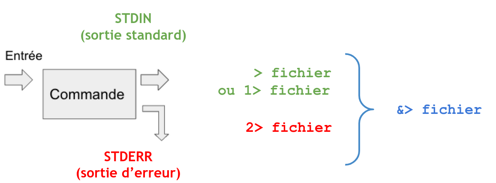

# Outline

**Objectif :** 

Lancer le même outil (fastqc) sur 3 échantillons différents

**Concepts :**

- Écriture d’un script bash

- Déclaration de variables pour généraliser les échantillons et les répertoires de travail

- Réalisation d’une boucle pour lancer l’outil sur chaque échantillon

- Premier script SLURM


## Démarrage d’une instance sur Jupyter

**Objectif :** lancer le même outil (FastQC) sur 3 échantillons Fastq différents 

<div style="text-align: center;">
  
</div>

<div style="text-align: center;">
  2538_eb3i_n1_2025, 4 CPUs, 2 Go RAM
</div>


# Les variables

**Définition:** ce sont des éléments qui associent un nom (l'identifiant) à une valeur, qui sera sauvegardée dans la mémoire du système programmé. 

- Il existe un certain nombre de variables systèmes pré-définies


```{bash, eval=FALSE}
echo $USER
echo $PWD
echo $SHELL
env | head # Liste les variables système
```


-   On peut créer ses propres variables
-   Il faudra préfixer les variables avec le caractère ‘\$’ pour y faire
    référence

```{bash, eval=FALSE}
PROJECT=project_rlegendre # Attention, pas d’espace autour de l’opérateur "="
echo ${PROJECT} # ou echo $PROJECT 
echo /shared/projects/${PROJECT}
WORKDIR=/shared/projects/${PROJECT}
echo ${WORKDIR}
```

## Préparation de l’environnement de travail

```{bash, eval=FALSE}
mkdir -p ${WORKDIR}/tp_workflow/
cd ${WORKDIR}/tp_workflow/
mkdir data
cd data
wget https://zenodo.org/records/10081865/files/FILE1.fastq.gz
wget https://zenodo.org/records/10081865/files/FILE2.fastq.gz
wget https://zenodo.org/records/10081865/files/FILE3.fastq.gz
cd .. 
touch script_01.sh 
```

## Script simple

Dans un script_01.sh :

```{bash, eval=FALSE}
#!/bin/bash
mkdir -p fastqc
module load fastqc/0.11.9

fastqc --outdir fastqc data/FILE1.fastq.gz
fastqc --outdir fastqc data/FILE2.fastq.gz
fastqc --outdir fastqc data/FILE3.fastq.gz
```


### Lancement du workflow

Lancez votre workflow dans le terminal

```{bash, eval=FALSE}
bash script_01.sh
```

Si besoin: wget https://github.com/IFB-ElixirFr/EBAII/tree/master/2024/ebaiin1/workflow/scripts/script_01.sh

## Avec définition de la variable SAMPLE

Dans un script_02.sh :

```{bash, eval=FALSE}
#!/bin/bash

mkdir -p fastqc
module load fastqc/0.11.9

SAMPLE=FILE1
echo ">>> Processing $SAMPLE"
fastqc --outdir fastqc data/${SAMPLE}.fastq.gz

SAMPLE=FILE2
echo ">>> Processing $SAMPLE"
fastqc --outdir fastqc data/${SAMPLE}.fastq.gz

SAMPLE=FILE3
echo ">>> Processing $SAMPLE"
fastqc --outdir fastqc data/${SAMPLE}.fastq.gz
```

### Lancement du workflow

Lancez votre workflow dans le terminal

```{bash, eval=FALSE}
bash script_02.sh
```


Si besoin: wget https://github.com/IFB-ElixirFr/EBAII/tree/master/2024/ebaiin1/workflow/scripts/script_02.sh


## On redirige les sorties 

Dans un script_03.sh :

```{bash, eval=FALSE}
#!/bin/bash

mkdir -p fastqc
module load fastqc/0.11.9

SAMPLE=FILE1
echo ">>> Processing $SAMPLE"
fastqc --outdir fastqc data/${SAMPLE}.fastq.gz 2> fastqc/${SAMPLE}.log

SAMPLE=FILE2
echo ">>> Processing $SAMPLE"
fastqc --outdir fastqc data/${SAMPLE}.fastq.gz 2> fastqc/${SAMPLE}.log

SAMPLE=FILE3
echo ">>> Processing $SAMPLE"
fastqc --outdir fastqc data/${SAMPLE}.fastq.gz 2> fastqc/${SAMPLE}.log
```


## Question bonus 

Comment rediriger le message  “Analysis complete for FILE1.fastq.gz” ?


<details>
<summary>Cliquez ici pour voir tricher ! </summary>

Utiliser l’opérateur &> qui permet de rediriger STDIN (la sortie standard) et STDERR (la sortie d’erreur) dans un même fichier



</details>

### Lancement du workflow

Lancez votre workflow dans le terminal

```{bash, eval=FALSE}
bash script_03.sh
```


Si besoin: wget https://github.com/IFB-ElixirFr/EBAII/tree/master/2024/ebaiin1/workflow/scripts/script_03.sh


# Utilisation des boucles For

Une boucle permet de réaliser des tâches itératives. 

```{bash, eval=FALSE}
for PRENOM in Pauline Stephanie Emilie Pierre Mathieu
  do
    echo ${PRENOM}
  done
#On peut itérer sur une liste de fichiers
for FILE in data/*
  do
    echo ${FILE}
  done
#On peut itérer sur le résultat d’une commande
for READ in $(ls data/* | grep -v FILE1)
  do
    echo ${READ}
  done
```


## Itérer sur les fichiers Fastq

Dans un script_04.sh :

```{bash, eval=FALSE}
#!/bin/bash

mkdir -p fastqc
module load fastqc/0.11.9

for SAMPLE in FILE1 FILE2 FILE3
do
echo ">>> Processing $SAMPLE"
fastqc --outdir fastqc data/${SAMPLE}.fastq.gz &> fastqc/${SAMPLE}.log
done
```


### Lancement du workflow

Lancez votre workflow dans le terminal

```{bash, eval=FALSE}
bash script_04.sh
```

Si besoin: wget https://github.com/IFB-ElixirFr/EBAII/tree/master/2024/ebaiin1/workflow/scripts/script_04.sh


## Itérer sur le résultat d’une commande

Dans un script_05.sh :

```{bash, eval=FALSE}
#!/bin/bash

mkdir -p fastqc

module load fastqc/0.11.9

for SAMPLE in $(ls data/ | sed 's/.fastq.gz//')
do
echo ">>> Processing $SAMPLE"
fastqc --outdir fastqc data/${SAMPLE}.fastq.gz &> fastqc/${SAMPLE}.log
done
```

### Lancement du workflow

Lancez votre workflow dans le terminal

```{bash, eval=FALSE}
bash script_05.sh
```


Si besoin: wget https://github.com/IFB-ElixirFr/EBAII/tree/master/2024/ebaiin1/workflow/scripts/script_05.sh

##  Ajouter des options pour SLURM


On commence à décrire un peu plus précisément les ressources nécessaires à notre étape

```{bash, eval=FALSE}
#!/bin/bash

#SBATCH --account=$USER
#SBATCH --job-name=fastqc_test
#SBATCH --account=2538_eb3i_n1_2025  # Modifier en fonction du projet
#SBATCH --cpus-per-task=1        # Modifier en fonction des besoins
#SBATCH --mem=4GB                # Idem

module load …
…
```

Plein d’autres options utiles: voir intro SLURM et https://ifb-elixirfr.gitlab.io/cluster/doc/quick-start/

Dans un script_06.sh : 

```{bash, eval=FALSE}
#!/bin/bash

#SBATCH --partition=fast
#SBATCH --job-name=my_fastqc
#SBATCH --account=2538_eb3i_n1_2025  # Modifier en fonction du projet
#SBATCH --cpus-per-task=1        # Modifier en fonction des besoins
#SBATCH --mem=4GB                # Idem
  
mkdir -p fastqc
module load fastqc/0.11.9

for SAMPLE in $(ls data/ | sed 's/.fastq.gz//')
do
echo ">>> Processing $SAMPLE"
srun --job-name $SAMPLE fastqc --outdir fastqc data/${SAMPLE}.fastq.gz
done
```


### Lancement du workflow

Lancez votre workflow dans le terminal

```{bash, eval=FALSE}
sbatch script_06.sh

```

Si besoin: wget https://github.com/IFB-ElixirFr/EBAII/tree/master/2024/ebaiin1/workflow/scripts/script_06.sh
Cette fois ci, on lance le script avec la commande sbatch et on monitore avec squeue


Vérifier que le job tourne

```{bash, eval=FALSE}
squeue
squeue -u $USER
sacct -u $USER
sacct -u $USER | tail -n 1
```


# Parallelisation des taches 

Au lieu de lancer chaque job l’un après l’autre, de manière séquentielle, on va les lancer en parallèle. On utilise un “job array”.


Dans un script_07.sh : 

```{bash, eval=FALSE}
#!/bin/bash
#SBATCH --partition=fast
#SBATCH --job-name=my_fastqc
#SBATCH --account=2538_eb3i_n1_2025  # Modifier en fonction du projet
#SBATCH --cpus-per-task=1        # Modifier en fonction des besoins
#SBATCH --mem=4GB                # Idem
#SBATCH --array=1-3              # Modifier en fonction du nb de tâches à lancer en parallèle

mkdir -p fastqc
module load fastqc/0.11.9

# le Nième fichier de ma liste
SAMPLE=$(ls data/ | sed 's/.fastq.gz//' | \
head -n ${SLURM_ARRAY_TASK_ID} | tail -n 1)

srun --job-name $SAMPLE fastqc --outdir fastqc data/${SAMPLE}.fastq.gz
```


## Lancement du workflow

Lancez votre workflow dans le terminal

```{bash, eval=FALSE}
sbatch script_07.sh
sacct -u $USER | grep RUNNING | grep FILE

```

Si besoin: wget https://github.com/IFB-ElixirFr/EBAII/tree/master/2024/ebaiin1/workflow/scripts/script_07.sh


# Ajouter une etape

Dans un script_08.sh :

```{bash, eval=FALSE}
#!/bin/bash
#SBATCH --partition=fast
#SBATCH --job-name=my_fastqc
#SBATCH --account=2538_eb3i_n1_2025 # Modifier en fonction du projet
#SBATCH --cpus-per-task=1       # Modifier en fonction des besoins
#SBATCH --mem=4GB               # Idem
#SBATCH --array=1-3             # Modifier en fonction du nb de tâches à lancer en parallèle

mkdir -p fastqc
module load fastqc/0.11.9
mkdir -p trimmomatic
module load trimmomatic/0.39

# le Nième fichier de ma liste
SAMPLE=$(ls data/ | sed 's/.fastq.gz//' | \
head -n ${SLURM_ARRAY_TASK_ID} | tail -n 1)

srun --job-name FASTQC-$SAMPLE fastqc --outdir fastqc data/${SAMPLE}.fastq.gz
srun --job-name TRIM-$SAMPLE trimmomatic SE -threads 4 -phred33 \
                            data/${SAMPLE}.fastq.gz  trimmomatic/${SAMPLE}.fastq.gz \
                            SLIDINGWINDOW:4:20 MINLEN:20
```


## Lancement du workflow

Lancez votre workflow dans le terminal

```{bash, eval=FALSE}
sbatch script_08.sh
sacct -u $USER | grep RUNNING | grep FILE
```


Si besoin: wget https://github.com/IFB-ElixirFr/EBAII/tree/master/2024/ebaiin1/workflow/scripts/script_08.sh


# Rappel du workflow

## ChIP-seq


## RNA-seq

## Variants

