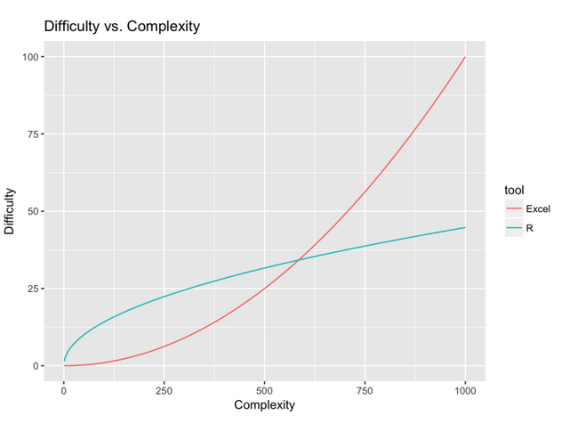
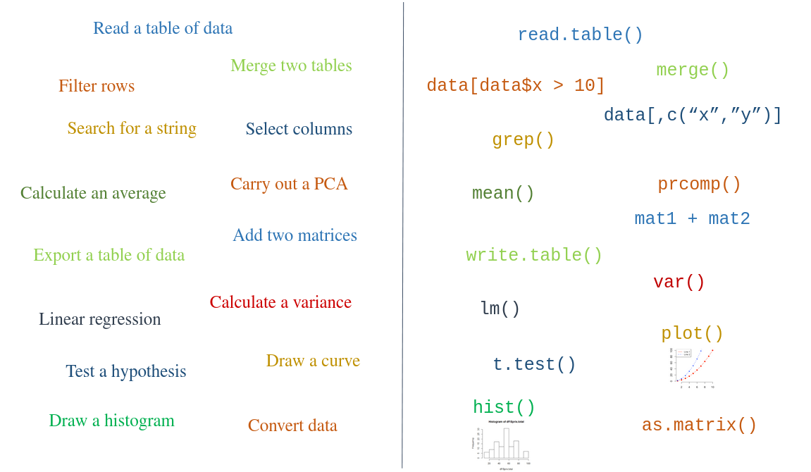
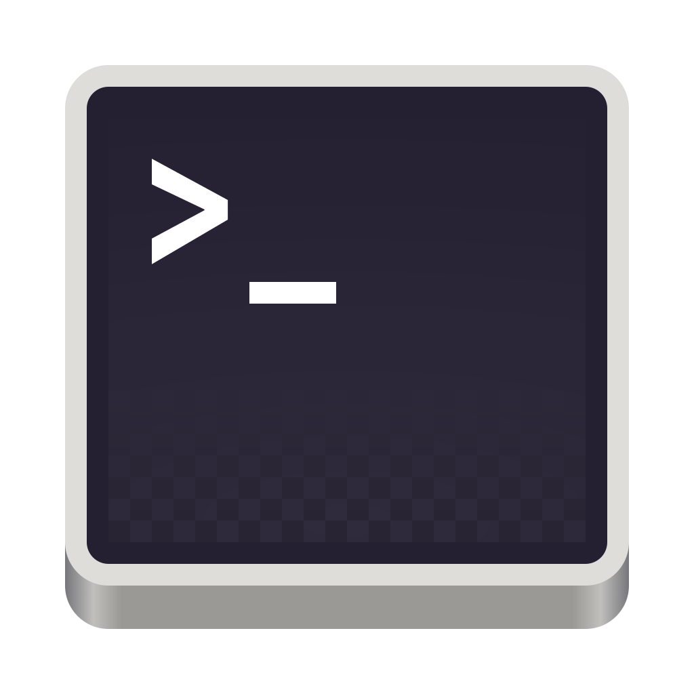
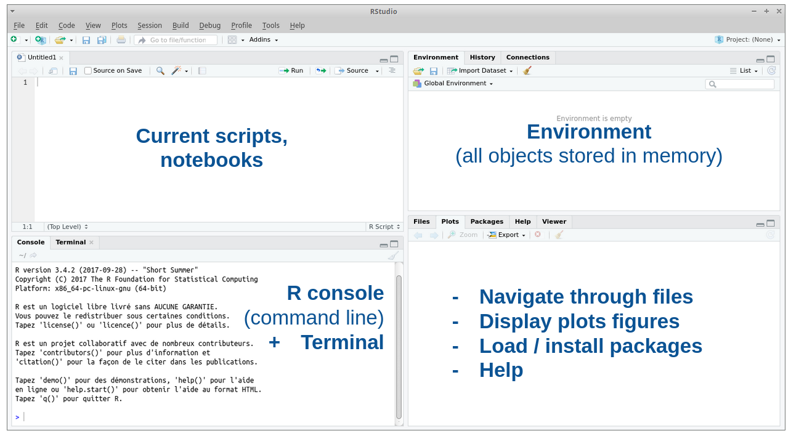
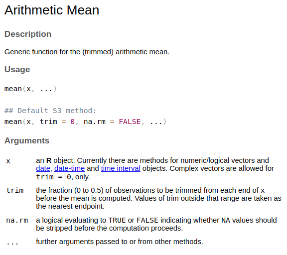

```{r setup, echo=FALSE, include=FALSE}
knitr::opts_chunk$set(eval = TRUE, include = TRUE, echo=TRUE,
      message = FALSE, warning = FALSE,	collapse = TRUE, comment = "#>",
      out.width = "100%", fig.align = "center", fig.height = 7,	
      fig.width = 12, dev = c("svg"), dpi=500)

# Colors :
success = "#74C476"
light_green = "#E5F5E080"

warning = "#E39E4F"
light_orange = "#FED8B180"

error = "#E34234"

tips = "#1155cc"
```

# What is {width="70"} ?

R is a **programming language** developed to :

-   Manage data : import, transform, clean, process, export ...\
-   Compute **statistical analyses**, from basic to complex ones : descriptive, exploration, modelling, machine learning ...\
-   Create nice **visualisations**, reports ...

[[R is free, cross-platform, open-source & collaborative !]{.smallcaps}]{style="color: #74C476"}

## R [Pros]{style="color: #74C476"} & [Cons]{style="color: #E34234"}

::::: columns
::: {.column .fragment .fade-in width="50%" style="background-color: #E5F5E080; font-size: 80%;"}
-   Advanced tool with infinite options
-   Open-source & free
-   Reproducibility : notebooks, scripts
-   Big active community
-   Numerous well-documented packages, even for very niche fields
:::

::: {.column .fragment .fade-in width="50%" style="background-color: #FED8B180; font-size: 80%;"}
-   Hard learning curve
-   Express correctly your needs to find correct & useful info
-   Have knowledge in the methods you use to interpret results correctly and detect pitfalls or missues
:::
:::::

## R vs Excel / Prism

::::: columns
::: column
{fig-align="center"}
:::

::: column
](img/covid.png){fig-align="center"}
:::
:::::

## Automate repetitive task

A way to gain free time ?

 website](img/xkcd.png){fig-align="center"}

## What can't R do ?

{fig-align="left"}

## How to run R ?

-   Using command line from a terminal {width="50px"}
    -   locally
    -   via `ssh`
-   Using an interface : {width="120px"}
    -   locally (Rstudio installed)
    -   via a server {width="200px"}

# Let's try !

Go to [https://ondemand.cluster.france-bioinformatique.fr](https://ondemand.cluster.france-bioinformatique.fr){.external target="_blank"} and open `R_practice.qmd` script

[{fig-align="center"}](https://ondemand.cluster.france-bioinformatique.fr){.external target="_blank"}

## Rstudio interface



## Get the materials

In the **terminal**, go to your project space and copy `intro_R` folder from the common project space using `cp`

```{bash, eval=F}
cp -r /shared/projects/ebaii_n1_2026/common_core/intro_R/ .
```

## Working directory

To know where you currently are:

```{r, eval=F}
getwd()
```

Set your working directory to the `intro_R` folder in your project space
```{r, eval=F}
setwd('/shared/projects/your_project_name/intro_R')
```

## Files

Refresh your files in Rstudio : your should see the following :


# Basic operations

R can be used as a giant calculator, to compute mathematical operations

```{r, eval=F}
2 + 3

4 * 5

6 / 4

1,2

1.2
```

::: {.callout-tip}
Execute line by line with `ctrl` + `enter`
::: 

## Basic operations

R can be used as a giant calculator, to compute mathematical operations

```{r}
#| code-line-numbers: false
#| eval: true

2 + 3
```

::: {.fragment}
```{r}
#| code-line-numbers: false
#| eval: true

4 * 5
```
:::

::: {.fragment}
```{r}
#| code-line-numbers: false
#| eval: true

6 / 4
```
:::


::: {.fragment}
```{r}
#| code-line-numbers: false
#| eval: false

1,2
``` 

[Error : Unexpected ',' in "1,"]{style="color: #E34234;"}

:::

::: {.fragment}
```{r}
#| code-line-numbers: false
#| eval: true

1.2
```
:::

# Objects & variables

R manipulates several kind of **objects**, that can be stored in **variables** with given names, so that they can be used later


::: {.callout-warning}
Be careful to **never** use those as variable names : TRUE, FALSE, T, F, c, t, pi, data, LETTERS, letters, ...
::: 


# Numerical values

## Numerical values

```{r}
a <- 2    # create a variable named "a" and assign its value to 2
print(a)  # display a
a == 2    # Test if a is equal to 2  
```

You can use either `<-` or `=` to assign values to variables ...

::: {.fragment .fade-in}
... but we usually prefer `<-` to avoid confusion with `==`, used to test if two variables are equal
:::

## Numerical values

Now, create a second variable named `b` with a value of 3. Test if it is equal to a.

::: {.fragment .fade-in}
```{r}
b <- 3		# create a second variable named b, equals to 3
b == a  	# a is still in R's memory, so we can compare it to b
```

Several tests are available to compare variables : `==` ; `!=` ; `>` ; `<`\
They all return a *boolean* value, either **TRUE** or **FALSE**
:::

## Numerical values

Store the result of a + b in a new variable. What happens if we change a's value to 7 ?

::: {.fragment .fade-in}
```{r}
a_plus_b <- a + b		# always use explicit names !
a_plus_b

a <- 7 # change a's value
a_plus_b

a_plus_b <- a + b 	# compute the sum to take into account a's changes
print(a_plus_b)	
```

Variables are not updated automatically : you have to re-run operations if one variable changes
:::

# Vectors

## Vectors

Several values can be stored in a vector :

```{r}
measures <-  c(1,10,a,b)    # One vector containing 1, 10 and the values contained in a and b
integers <-  1:10		   # One vector with all integer values from 1 to 10
ducks <-  c("riri", "fifi", "loulou")    # A vector containing character strings
```

::: {.fragment .fade-in}
But it can only contain **one type** of object :

```{r}
test <-  c("riri", 1, 4:6)
class(test)
```

all numerical values where converted to text !
:::

## Vectors

We can compute mathematical operations on vectors :

```{r, eval=F}
measures + a 		# sum of a vector and a numerical value
measures
integers / 2		# dividing a whole vector
integers
```

But does this work ?

```{r, eval=F}
ducks / 2		
```

::: {.fragment .fade-in}
[Error in ducks/2 : non-numerical argument given for a binary operator]{style="color: #E34234;"}

Be careful with the class of objects stored in vectors
:::

## Vectors

`[ ]` can be used to access elements of a vector, using *indexes* :

```{r}
integers[8]		
```

::: {.fragment .fade-in}
Can you change the first value of `measures` to *12* ?
:::

::: {.fragment .fade-in}
```{r}
measures[1] <- 12		
measures
```
:::

## Vectors

Using `c()`, we can add new values to a vector :

```{r}
measures <- c(measures, 9, 8)
```

`c` means `concatenate`

## Vectors

Some values can be empty : R will use `NA` as their value

```{r}
measures[4] <- NA
measures
```

:::{.callout-warning}
Objects with missing values might raise unexpected behaviors
:::

# Lists

## Lists

Lists are another way to store values : they can be created using `list()` function :

```{r}
empty <- list()  # Create an empty list
groceries <- list("banana"=2,"apple"=5,"kiwi"=8) # a list of fruits
unnamed <- list(2,5,8) # a list of unnamed numbers
vrac <- list("A"=1:4,"B"=c(0,1),"C"="hey") # a list with multiple class of objects !
```

:::{.fragment}
-   They contain several objects called `elements`
:::
:::{.fragment}
-   Those elements can have different classes of objects : numerical values, vectors, characters, other lists ...
:::
:::{.fragment}
-   Elements are a combination of a `name`, called a key, and a `value`
:::
:::{.fragment}
-   Names can be empty
:::

## Lists

To access an `element` of a list, this time use `[[ ]]` and either its index (position of the element in the list) or its name :

```{r}
groceries[["banana"]] # Access the value stored under banana name  
groceries[[1]]  # Access the value of the first groceries element (banana)
```

::: {.fragment .fade-in}
If an element is already named, you can use `$` to access it directly :

```{r}
groceries$banana          # Access the value stored under banana name 
```
:::

## Lists

Try to access an element of the list `unnamed` with `$` : what happens ?

::: {.fragment .fade-in}
```{r, eval=F}
unnamed$
```

::::{.callout-tip} 
R auto completion will help you select the right element
::::
:::

## Lists

Use `[[ ]]` to add a named element to the list `empty`

::: {.fragment .fade-in fragment-index="1"}
```{r}
empty[["key"]] <- "value" 	# add a named element to the empty list
```
:::

Use `[[ ]]` to add an unnamed element in the 4th position of the list `empty`

::: {.fragment .fade-in fragment-index="1"}
```{r}
empty[[4]] <- 10 	# add an unnamed element to the 4th position
```

Notice that the list now contains a 2nd and a 3rd element as well : they are unnamed and hold the value `NULL`
:::

# Functions

We already saw that R uses functions to do ... almost anything!   
But how to use them ?

## Functions

A function has :  

::: {.fragment .fade-in}  
-   A `name`, to execute the function or look for help  
::: 
::: {.fragment .fade-in}  
-   One or more `arguments` : some are necessary for the function to run, others have default values
:::
::: {.fragment .fade-in}  
-   An `output` : the result of the computations on the given arguments. With complex functions, this will often be a list
:::

## Functions

For example, look at the help for function `mean`
```{r}
?mean
```

::: {.fragment .fade-in}   
  
:::

## Functions

We use `( )` to give the function its `arguments` before running : for mean, a vector of numerical values

::: {.fragment .fade-in}   
```{r}
mean(measures) # compute the mean of measures
mean(x = measures) # same
```
:::

If any of the values is missing, `mean` will return a missing value `NA`. We can use the argument `na.rm` to ignore them :

::: {.fragment .fade-in}   
```{r}
mean(x = measures, na.rm = TRUE) 
```
::: 
## Functions

Arguments can be  :  
- named =\> they can be written in any order   
- unnamed =\> R will expect them in their appearing order  

```{r, eval=F}
mean(x=measures, trim=0, na.rm=TRUE) # OK
mean(na.rm=TRUE, x=measures, trim=0) # OK
mean(measures, 0, TRUE)  # OK
mean(TRUE, measures)  # NOT OK !
mean(measures, TRUE)  # NOT OK !
```

## Functions

We can store the output of a function in a variable as well :

```{r}
mean_measures <- mean(x=measures, na.rm=TRUE)
```

::: {.callout-warning}   
**Variable != Arguments**    
`mean_measures` is now stored in the environment, but `x` and `na.rm` are not : they where only given to the mean function  
:::

## Functions

Finally, you can create your own functions by defining its name, arguments, output and the list of operations needed to compute the results you want

```{r}
square <- function(x) {
  # as many lines as you want here !
  output = x * x
  return(output)
}
```

::: {.callout-tip}   
This can be useful if you need to repeat the same computations several times, or if you need to modify some existing functions
:::

# Data frames

Now it's time to manipulate some real data !

## Read the `annotation.csv` file

We'll use `read.table` function. What are its arguments ?

:::{.fragment}
```{r, eval=F}
annotation_data <- read.table(file = "annotation.csv", header = TRUE, 
                              sep = ",", dec = ".")
```
:::

:::{.callout-tip}
Look at the annotation file first to know what to give to the `read.table` function
:::

## Ways to import files

A **lot** of different functions to import data from files : read.table, read.csv, read.csv2, read.tsv, read.delim ...

and even specific packages :   
- `vroom` to import big data faster    
- `readxl`, `openxlsx` to read excel files  
- `readRDS` to read R-files  
- `load` to import a whole R environment   

:::{.callout-tip}
Do not hesitate to search "How to open ... file in R ?" 
:::

## Explore `annotation_data` 

All the content from the `annotation` file is now in a data-frame. Try the following functions :

```{r, eval=F}
print(annotation_data)
head(annotation_data)
tail(annotation_data, n=20)
View(annotation_data)
```

## Explore `annotation_data`

We can also check the summarized info contained in `annotation_data`  

```{r, eval=F}
str(annotation_data)
summary(annotation_data)
```

# Memos for later

## Manipulate basic objects 

| Symbol    | Goal                  | Examples       |
|-----------|-----------------------|----------------|
| `=` or `<-` or `->` | assign a `value` to a `variable` or an `argument` | a `<-` 10 or read.table(file `=` "file.txt") |
| `( )`     | to give `arguments` to a function | mean`(`x = c`(`10,6,8,2`))` |
| `[ ]`     | get a value from a vector | measures`[`1`]` or measures`[`2:8`]` or measures`[`c(3,6,4)`]` |
| `[[ ]]` or `$` |  get an element from a list | groceries`$`banana or groceries`[[`"banana"`]]` or groceries`[[`1`]]` | 
| `[ , ]` ou `$` | extract elements from a data-frame | annotation`$`geneID or annotation`[`1:5`,`geneID`]` |

## Good practices

| To                      | Do this              | Avoid this         |
|-------------------------|----------------------|--------------------|
| Clean your environment  | `rm(list = ls())`    | mixing-up variables| 
| Use explicit names      | expression_data, annotation, groceries_list | dat, var1, dfslkgj  |
| Use comments            | with `#`, using lines, stars ...       | obscure functions, 100+ lines without comment |
|                         | use spaces, skip lines, add blocks ... | all commands in one block  |

[Tidyverse guidelines](https://style.tidyverse.org/syntax.html){.external target="_blank"}

## Logical operators

| Operator | Description           | Example        | Result    |
|----------|-----------------------|----------------|-----------|
| `==`     | Equal to              | `5 == 3`       | `FALSE`   |
| `!=`     | Not equal to          | `5 != 3`       | `TRUE`    |
| `>`      | Greater than          | `5 > 3`        | `TRUE`    |  
| `<`      | Less than             | `5 < 3`        | `FALSE`   |
| `>=`     | Greater or equal      | `5 >= 5`       | `TRUE`    |
| `<=`     | Less or equal         | `5 <= 3`       | `FALSE`   |
| `&`      | Element-wise AND      | `TRUE & FALSE` | `FALSE`   |
| `|`      | Element-wise OR       | `TRUE | FALSE` | `TRUE`    |
| `!`      | NOT                   | `!TRUE`        | `FALSE`   |


## Aritmetic operators

| Operator | Description     | Example   | Result |
|----------|-----------------|-----------|--------|
| `+`      | Addition         | `5 + 3`   | `8`    |
| `-`      | Subtraction      | `5 - 3`   | `2`    |
| `*`      | Multiplication   | `5 * 3`   | `15`   |
| `/`      | Division         | `5 / 2`   | `2.5`  |
| `^`      | Exponentiation   | `2 ^ 3`   | `8`    |
| `%%`     | Modulus          | `5 %% 2`  | `1`    |
| `%/%`    | Integer Division | `5 %/% 2` | `2`    |

