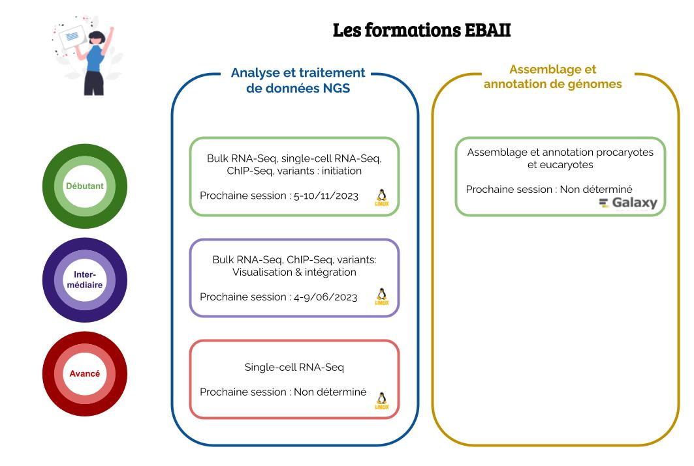

# Initiation au traitement des données de génomique obtenues par séquençage à haut débit

**Ecole de Bioinformatique Aviesan - IFB - Inserm (EBAII)**

---

*Les demandes d'inscriptions pour la formation de niveau débutant (du 5 au 10 novembre 2023) sont ouvertes sur [le site d'inscription](https://sondages.inrae.fr/index.php/42796?lang=fr).*

---

## Description

EBAII propose plusieurs formations différentes.

Elles sont basées sur une alternance de courtes sessions théoriques et d'ateliers pratiques.

Les participants bénéficieront d’un tutorat personnalisé pour élaborer leur plan d’analyse, et effectuer les premières étapes de traitement de leurs propres données ou de celles de leur équipe.

*Le tutorat n'a pas pour vocation de réaliser l’analyse complète des données des participants.*

*Langue*:
Les cours seront prodigués uniquement en Français.

*Lieux*:
Les cours sont données à Roscoff (Hôtel de France).

*Public visé*: 
Cette formation est destinée aux biologistes (ingénieurs, doctorants, chercheurs, enseignants-chercheurs, praticiens…) confrontés à l’analyse de données NGS, et qui ne disposent pas des compétences bioinformatiques suffisantes, ou cherchent à les consolider (en fonction du niveau de la formation).

*Frais d’inscription*:
1000€ HT pour les académiques et EPIC; 2500€ HT pour les industriels.
L'hébergement et la restauration sont inclus.
Les frais de transport demeurent à la charge des participants. 

### Formation "traitement des données de variants, ChIP-Seq, bulk RNA-Seq, et single-cell RNA-Seq"

Cette formation propose pour l'instant deux niveaux (débutant, et initié).

#### Niveau débutant

*Objectifs*:
L'école s'articulera autour de quatre ateliers thématiques en session parallèle (single-cell RNA-Seq, bulk RNA-seq, ChIP-seq/ATAC-seq, variants DNA-seq).
L'école inclura également une introduction aux technologies "long reads".

L'école vise à introduire les concepts et à manipuler les outils informatiques et à en interpréter les résultats.

*Durée*:
Du dimanche, 18h, au vendredi, 14h.

*Environnement de travail*:
L’ensemble de la formation reposera sur l’utilisation de commandes en ligne (terminal Linux) et du langage R.

*Prérequis*:
Aucune connaissance préalable des environnements Linux ou R n'est requise, mais il sera demandé aux participants de suivre une autoformation en ligne en amont, pour faciliter la prise en main de ces langages.
La formation approfondira progressivement l’usage de ces environnements au fil des sessions thématiques.

*Prochaines dates*:
5 au 10 novembre 2023.

*Site de demande d'inscription*:
https://sondages.inrae.fr/index.php/42796?lang=fr 

#### Niveau intermédiaire

*Objectifs*:
L'école s'articulera autour de trois ateliers thématiques en session parallèle (RNA-seq, ChIP-seq, variants DNA-seq), et abordera la visualisation et l'intégration des données. 

*Environnement de travail*:
L'ensemble de la formation reposera sur l’utilisation de commandes en ligne (terminal Linux) et du langage R. 

*Prérequis*:
Les candidats doivent avoir acquis les compétences enseignées durant l'école de niveau débutant: un niveau de base en ligne de commande, R, et (au choix) RNA-seq, ChIP-seq ou variants DNA-seq.

*Prochaines dates*:
5 au 9 juin 2023.

*Site de demande d'inscription*:
Clos.

### Formation "assemblage et annotation de génomes procaryotes et eucaryotes"

Il n'y a pour l'instant qu'un seul niveau.

*Objectifs*:
L'école s'articulera autour des différentes étapes qui mèneront à l'obtention d’un génome annoté à partir de données "long reads" et "hybride": contrôle qualité des données, assemblage, scaffolding, polishing, annotation structurale et fonctionnelle (en session parallèle pour les procaryotes et les eucaryotes). 

L'école vise à introduire les concepts, à manipuler les outils informatiques et à en interpréter les résultats.

*Durée*:
Du lundi, 9h, au vendredi, 14h.

*Environnement de travail*:
L'ensemble de la formation reposera sur l'utilisation de Galaxy. 

*Prérequis*:
Aucune connaissance préalable n'est requise.

*Prochaines dates*:
Non déterminé.

*Site de demande d'inscription*:
Pas encore ouvert.

## Contacts

 - [Renseignements](mailto:ecole-bioinfo@aviesan.fr)
 - [Compte twitter](https://twitter.com/EBAI_Roscoff)

## Matériel pédagogique

### 2022

- [Analyse et traitement de données NGS, niveau débutant](2022/ebaiin1/README.md)
- [Assemblage et annotation](2022/Assemblage/README.md)

### 2021

- [Analyse et traitement de données NGS, niveau débutant](2021/ebaiin1/README.md)
- [Analyse et traitement de données NGS, niveau intermédiare](2021/ebaiin2/README.md)

### 2020

- [Analyse et traitement de données NGS, niveau débutant](2020/README.md)

### Sessions précédentes

[Voir le site de l'IFB](http://france-bioinformatique.fr/)

## Liens

- Github repo: <https://github.com/IFB-ElixirFr/EBAII/>
- Web pages: <https://ifb-elixirfr.github.io/EBAII/>
